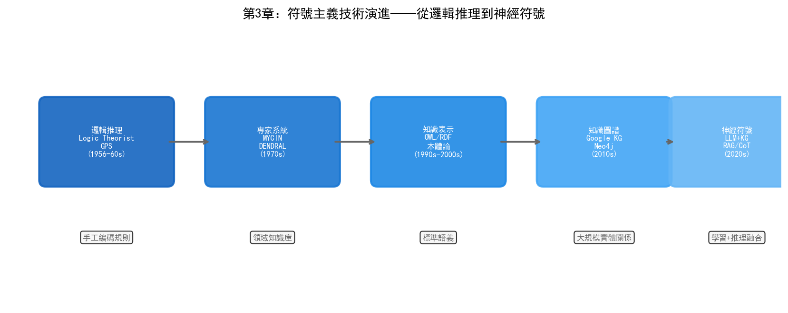

# 第3章 符號主義——從規則到知識

## 3.1 哲學根源：理性主義傳統

符號主義的思想根源可以追溯到十七世紀。萊布尼茨在1666年的著作《論組合術》中提出了一個宏大的設想：如果人類思維可以被還原為符號的組合與運算，那麼所有的理性爭論都可以透過計算來解決——"讓我們計算吧"（Calculemus）。他設想了一種普遍的形式語言（characteristica universalis）和對應的推理演算（calculus ratiocinator），使得兩個哲學家之間的分歧不再需要爭吵，只需坐下來做計算。

萊布尼茨的夢想在當時的技術條件下完全無法實現，但這個思路影響了之後三百年的邏輯學發展。十九世紀末，戈特洛布·弗雷格（Gottlob Frege）建立了現代形式邏輯的基礎——謂詞邏輯。弗雷格的目標是用數學化的符號語言精確表達自然語言中的邏輯關係，消除自然語言的歧義。他的《概念文字》（Begriffsschrift, 1879）被後來的AI研究者視為符號主義的技術起點。

符號主義的核心命題可以概括為一句話：**思維即符號操作**。知識以符號的形式表示，推理以符號變換的形式進行，智慧不過是按照規則對符號串進行操作的過程。這個命題的哲學基礎是理性主義——認為真正的知識來源於理性推理而非感官經驗，這與連接主義的經驗主義傳統形成了根本對立。

## 3.2 物理符號系統假設

1976年，艾倫·紐厄爾和赫伯特·西蒙（此時二人已因AI研究獲得1975年圖靈獎）發表了"物理符號系統假設"（Physical Symbol System Hypothesis, PSSH），為符號主義提供了理論宣言：

> "一個物理符號系統具備產生智慧行為的充分必要條件。"

這個假設有兩層含義。充分性：任何能夠運算子號的系統都可以表現出智慧。必要性：任何表現出智慧的系統——無論是人腦還是計算機——其底層必定是一個符號作業系統。如果PSSH成立，那麼在計算機上模擬智慧在理論上沒有障礙，剩下的只是工程問題。

物理符號系統包含六個基本要素：

- **符號**（Symbol）：表示實體、概念或關係的模式
- **符號串**（Expression）：符號的組合
- **儲存**（Memory）：儲存符號串的介質
- **操作**（Operators）：對符號串進行建立、修改、複製、銷燬的處理
- **解釋**（Interpretation）：將符號串對映到現實世界的含義
- **搜尋**（Search）：在可能的符號操作序列中尋找達到目標的路徑

這個框架幾乎覆蓋了所有符號主義AI系統的結構：專家系統的知識庫就是儲存的符號串，推理引擎就是操作和搜尋，MYCIN的確定性因子就是符號串上的附加屬性。

PSSH是否成立至今仍有爭議。哲學家約翰·塞爾（John Searle）在1980年提出了著名的"中文房間"思想實驗來反駁PSSH的充分性：一個不懂中文的人坐在密閉房間裡，根據規則手冊將輸入的中文符號變換為輸出的中文符號——對外部觀察者來說他似乎懂中文，但他實際上只是在運算子號而不理解含義。塞爾的論證指向一個根本問題：符號操作本身是否足以產生真正的理解，還是僅僅在模擬理解？

這場哲學爭論對工程實踐的影響有限。無論符號操作是否等同於"真正的智慧"，專家系統、知識圖譜和本體論在特定領域的實用性已經被證明。符號主義不需要解決"什麼是真正的智慧"這個問題，它只需要回答"如何讓機器在特定領域表現出專業水平的推理能力"。

## 3.3 技術演進脈絡

### 早期：邏輯推理（1955–1965）

符號主義最早的實踐是紐厄爾和西蒙的邏輯理論家（Logic Theorist, 1955）。這個程式的目標是證明阿爾弗雷德·諾斯·懷特海德和伯特蘭·羅素在《數學原理》中的邏輯定理。邏輯理論家用啟發式搜尋在可能的證明路徑中探索，成功證明了前38條定理中的33條。它在技術史上創造了多個第一：第一個使用啟發式搜尋的程式、第一個將問題分解為子問題的程式、第一個"AI程式"。

隨後的通用問題求解器（GPS, 1957）將邏輯理論家的思路泛化。GPS不侷限於數學證明，而是用統一的"手段-目的分析"框架處理各類問題：比較當前狀態與目標狀態的差異，搜尋能縮小差異的運算子，遞迴應用直到目標達成。GPS的侷限在於它只能在形式化的狀態空間中運作——你需要在執行前把問題精確地定義為狀態集合和運算子集合，這本身就限制了它的通用性。

### 中期：專家系統（1965–1990）

專家系統代表了符號主義最成功的商業化階段。第二章已經介紹了DENDRAL和MYCIN，這裡關注它們的技術架構。

一個經典的專家系統由三個核心元件構成：

**知識庫**（Knowledge Base）：儲存領域知識，通常以"產生式規則"（Production Rules）的形式表示——"如果條件A且條件B，那麼結論C（確定性因子0.8）"。MYCIN的600條規則就是一個典型的產生式知識庫。規則的好處是可讀性——領域專家可以直接審閱和修改規則，而不需要理解底層的推理引擎。

**推理引擎**（Inference Engine）：在知識庫上進行推理的軟體。推理策略分為前向鏈（Forward Chaining，從已知事實出發，透過規則推導新事實）和後向鏈（Backward Chaining，從目標出發，反推需要滿足的條件）。MYCIN使用後向鏈：從"患者是否感染了某種細菌"這個目標出發，逐層追問需要的資訊。

**知識獲取模組**（Knowledge Acquisition）：輔助將領域專家的知識轉化為知識庫中的規則。這通常是一個互動式的過程——知識工程師透過訪談專家、分析案例來提取規則。

專家系統的技術遺產影響深遠。CLIPS（C Language Integrated Production System）是NASA在1985年開發的通用專家系統殼，至今仍在維護和使用。Jess（Java Expert System Shell）是CLIPS的Java移植版。這些工具讓開發者不需要從頭實現推理引擎，只需聚焦於知識庫的構建。

### 成熟期：知識圖譜與本體論（1990–至今）

專家系統暴露的核心問題是知識表示——規則過於簡單，無法表達實體之間的複雜關係和層次結構。1990年代，研究者們探索了多種更豐富的知識表示形式：

**框架**（Frames）：馬文·明斯基在1974年提出的知識表示方法。一個框架描述一個概念及其屬性——例如"機臺"框架包含"型別"、"位置"、"狀態"、"上次維護時間"等槽位。框架之間可以繼承（"EUV掃描器"框架繼承"機臺"框架的所有屬性並新增自己的特有屬性）。

**語義網路**（Semantic Networks）：用節點表示概念、用邊表示關係的圖結構。例如"刻蝕"→(屬於)→"幹法製程"→(屬於)→"半導體製造"。語義網路直覺上易於理解，但缺乏形式化的語義定義，導致不同系統的語義網路難以互操作。

**描述邏輯**（Description Logics）：為解決語義網路缺乏形式語義的問題，研究者們將一階邏輯的一個子集提取出來，形成了描述邏輯。描述邏輯在表達能力和推理可判定性之間取得平衡——足夠豐富以表達複雜概念關係，同時保證推理可以在有限時間內完成。

這些知識表示形式在2000年代匯聚為兩個工業級的技術方向：知識圖譜和本體論。

**知識圖譜**：2012年，Google發布了Knowledge Graph，標誌著知識圖譜從學術研究走向工業應用。知識圖譜用RDF（Resource Description Framework）三元組（主語-謂詞-賓語）表示世界知識——例如（三星晶圓廠, 使用, Palantir Foundry）。知識圖譜的優勢在於其圖結構天然支援多跳推理——從"三星"出發，透過"使用Palantir"、"Palantir基於Ontology"、"Ontology支援資料融合"三條邊，可以推理出"三星晶圓廠透過Ontology實現了資料融合"這樣的隱含知識。

**本體論**（Ontology）：本體論在描述邏輯的基礎上發展而來，用OWL（Web Ontology Language）定義領域中的概念層次、屬性約束和推理規則。與知識圖譜側重於儲存例項資料不同，本體論側重於定義領域的概念模型——"什麼是晶圓"、"什麼是製程步驟"、"缺陷和製程步驟之間是什麼關係"。第六章將詳細討論Ontology在晶圓廠中的應用，這裡只需理解它是符號主義在工業場景中最成熟的技術形態。

### 當代：神經符號融合（2020–）

符號主義和連接主義在歷史上長期對立，但近年的趨勢是融合。神經符號AI（Neuro-Symbolic AI）試圖結合兩者優勢：神經網路負責感知和模式識別（從資料中學習），符號系統負責推理和解釋（基於規則做決策）。

幾種典型的融合正規化包括：

- **神經-符號管道**：神經網路先對感知資料做分類（如識別晶圓缺陷型別），分類結果輸入符號推理引擎做後續推理（如根據缺陷型別和製程參數推斷根因）
- **知識圖譜嵌入**：將知識圖譜中的實體和關係對映到低維向量空間，使得符號化的知識可以被神經網路處理。TransE、RotatE等模型將三元組（頭實體, 關係, 尾實體）對映為向量運算
- **可微邏輯推理**：將邏輯推理過程"軟化"為可微分的張量運算，使得推理引擎可以透過梯度下降端到端訓練
- **LLM + 知識圖譜**：大語言模型負責自然語言理解和生成，知識圖譜負責事實校驗和推理約束——LLM提出假設，知識圖譜驗證其正確性

神經符號融合對半導體晶圓廠的意義在於：單純的深度學習模型可以識別缺陷模式但無法解釋"為什麼這個缺陷會導致良率下降"，單純的專家系統可以推理根因但無法從原始影象中識別缺陷。融合兩者後，系統可以做到"識別缺陷→推斷根因→給出修正建議"的端到端閉環。



## 3.4 當前技術框架

### 知識表示

| 技術 | 描述 | 典型應用 |
| --- | --- | --- |
| RDF | 三元組（主-謂-賓）格式的資源描述框架 | 知識圖譜資料儲存 |
| OWL | 基於描述邏輯的本體描述語言 | 領域本體建模 |
| SHACL | RDF資料的約束驗證語言 | 資料質量校驗 |
| Property Graph | 帶屬性標籤的圖資料模型 | Neo4j中的知識圖譜 |

RDF是最基本的知識表示格式——每條知識表示為一個三元組，如`<wafer:W001, hasDefect, defect:D123>`。RDF資料可以被SPARQL查詢語言檢索，類似於SQL之於關聯式資料庫。

OWL在RDF之上增加了豐富的表達能力——可以定義類的層次關係（"蝕刻機是機臺的子類"）、屬性約束（"每片晶圓必須屬於且僅屬於一個批次"）和推理規則（"如果A是B的子類，且B屬於C，那麼A也屬於C"）。OWL的推理能力是自動的——給定本體定義和例項資料，推理引擎可以自動推匯出隱含的知識。

Property Graph是另一種圖資料模型，每個節點和邊都可以攜帶屬性。Neo4j是最知名的Property Graph資料庫。與RDF相比，Property Graph的查詢語言Cypher更接近自然語言，開發效率更高，但犧牲了一些形式化推理能力。

### 推理引擎

| 工具 | 型別 | 特點 |
| --- | --- | --- |
| Prolog | 邏輯程式語言 | 宣告式程式設計，內建後向鏈推理 |
| Datalog | 查詢語言 | Prolog的受限子集，保證查詢終止 |
| SPARQL | RDF查詢語言 | 標準化的圖查詢語言 |
| Pellet / HermiT | OWL推理機 | 支援描述邏輯推理 |

Prolog可能是最廣為人知的符號推理工具。用Prolog表達知識非常直觀：

```prolog
% 知识库
defect_type(crack, physical).
defect_type(particle, contamination).
causes(crack, high_stress).
causes(particle, dirty_chamber).

% 规则
root_cause(Defect, Cause) :- defect_type(Defect, Type), causes(Defect, Cause).
requires_action(Defect, clean_chamber) :- defect_type(Defect, contamination).
requires_action(Defect, adjust_recipe) :- defect_type(Defect, physical).
```

這段Prolog程式碼定義了缺陷型別和根因的關聯規則。查詢`?- root_cause(particle, C).`會返回`C = dirty_chamber`，查詢`?- requires_action(crack, A).`會返回`A = adjust_recipe`。

### 知識圖譜平臺

| 平臺 | 特點 | 適用場景 |
| --- | --- | --- |
| Neo4j | 最成熟的圖資料庫，Cypher查詢語言 | 中小規模知識圖譜，快速原型 |
| Amazon Neptune | 雲原生圖資料庫，支援RDF和Property Graph | 雲端部署，與AWS生態整合 |
| Stardog | 支援OWL推理和虛擬圖 | 需要形式化推理的企業場景 |
| Palantir Foundry | Ontology為核心的資料平臺 | 跨系統資料融合（見第六部分） |

Neo4j是最常用的知識圖譜平臺。它的查詢語言Cypher用模式匹配的方式表達圖查詢：

```cypher
// 查找与某缺陷相关的所有工艺步骤和设备
MATCH (d:Defect {id: 'D123'})-[:OCCURS_AT]->(s:ProcessStep)
      (s)-[:USES_TOOL]->(t:Tool)
RETURN d, s, t
```

這段查詢找到缺陷D123發生在哪個製程步驟、該步驟使用了哪臺設備——這種多跳關聯查詢在關係型資料庫中需要多表JOIN，在圖資料庫中只需要一次模式匹配。

## 3.5 優勢與侷限

### 優勢

**可解釋性**是符號主義最大的優勢。每一步推理都可以追溯到具體的規則——"因為缺陷型別是particle（規則R1），且particle屬於contamination類（規則R2），而contamination類缺陷需要清洗腔體（規則R3），所以建議執行腔體清洗"。這種透明的推理鏈在工業場景中至關重要——工程師需要理解AI給出建議的理由才能信任並執行它。

**知識複用**。一個領域本體或知識圖譜一旦構建完成，可以被多個應用共享。晶圓廠的製程知識圖譜可以被缺陷分析系統、設備維護系統和良率管理系統同時使用，避免了每個應用獨立維護知識庫的冗餘。

**確定性推理**。給定相同的知識庫和輸入，符號推理引擎總是給出相同的輸出。這與神經網路的機率性輸出形成對比——在製程參數調整等需要確定性的場景中，可預測的行為更容易被工程師接受。

**領域知識的顯式編碼**。符號主義不依賴大量資料來"發現"知識——它直接編碼人類專家已有的知識。在新產品匯入（NPI）階段，歷史資料可能不足，但工程師的製程經驗可以透過規則和本體編碼到系統中。

### 侷限

**知識獲取瓶頸**是符號主義最根本的困境。將領域專家的知識轉化為機器可處理的形式需要大量的人力投入——MYCIN的600條規則耗費了知識工程師和醫學專家數年時間。在半導體晶圓廠中，一個資深工程師的製程經驗可能涉及數千個參數和它們之間複雜的互動關係，完全透過人工編碼來構建知識庫幾乎不可行。

**脆弱性**。符號系統只"知道"知識庫中明確編碼的內容。遇到未覆蓋的情況，系統不會說"我不確定"，而是要麼沉默，要麼給出基於不完整資訊的錯誤答案。這在晶圓廠中是危險的——一個基於不完整規則給出的製程參數建議可能導致整批晶圓報廢。

**無法處理感知**。符號主義天然不擅長處理影象、聲音、時序訊號等連續的感知資料。晶圓缺陷的視覺特徵、設備感測器的振動波形——這些資料需要先被人類專家或機器學習模型轉化為符號，才能進入符號推理流程。

**規模擴充套件性**。隨著知識庫規模增長，推理的搜尋空間指數級膨脹。一個包含數萬條規則的專家系統，其推理可能需要指數級時間。雖然描述邏輯透過限制表達力來保證推理的可判定性，但實際應用中仍然面臨效能瓶頸。

### 突破侷限的路徑

這些侷限並非不可克服。神經符號融合提供了一條路徑：神經網路負責從感知資料中提取符號（如從晶圓影象中識別缺陷型別），符號系統負責基於這些符號進行推理和解釋。知識圖譜嵌入技術讓符號知識可以被納入神經網路的訓練過程。而LLM的出現為知識獲取提供了新工具——大語言模型可以從非結構化文件中自動提取實體和關係，輔助知識圖譜的構建。

在半導體晶圓廠中，符號主義的價值定位很清晰：它不是用來做缺陷檢測或參數預測的（這些是連接主義擅長的），而是用來做知識組織、根因推理和跨系統資料融合的。當幾百個異構系統中的資料需要被統一理解、當製程規範需要被機器可讀地編碼、當缺陷根因分析需要跨多個製程步驟做關聯推理時——符號主義提供的知識表示和推理框架是不可或缺的基礎設施。

這正是Palantir的Ontology在三星晶圓廠中發揮作用的技術底層，我們將在第六部分詳細展開。
