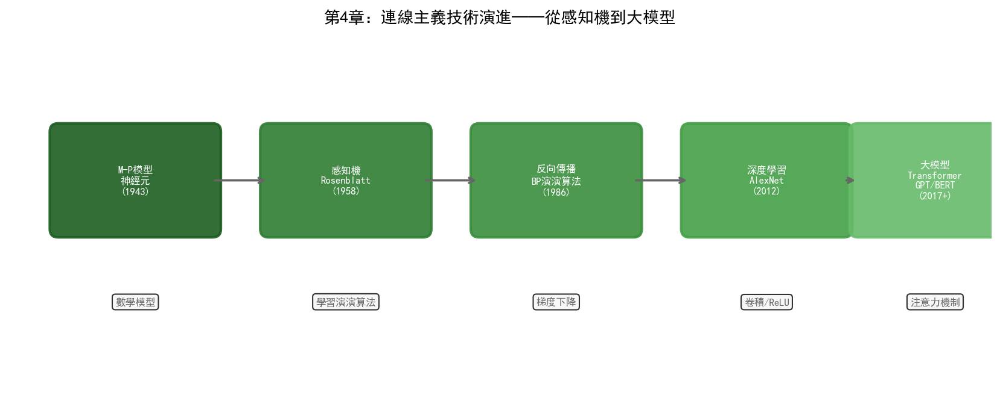

# 第4章 連接主義——從感知機到深度學習

## 4.1 哲學根源：經驗主義與腦科學

1943年，神經生理學家沃倫·麥卡洛克（Warren McCulloch）和數學家沃爾特·皮茨（Walter Pitts）發表了一篇題為《神經活動中內在思想的邏輯演算》的論文。他們證明了一個看似簡單的命題：如果將神經元建模為一個二值開關——當輸入的加權和超過閾值時"發放"（輸出1），否則"靜默"（輸出0）——那麼由足夠多這樣的神經元組成的網路可以表達任何邏輯函式。

這篇論文同時連接了兩個世界。在生物學層面，它提供了大腦資訊處理的一種簡化模型。在數學層面，它證明了神經網路具有通用計算能力。麥卡洛克-皮茨神經元模型雖然極其簡化——真實的生物神經元要複雜得多——但它確立了連接主義的基本正規化：**智慧源於大量簡單單元之間的連接**。

1949年，加拿大心理學家唐納德·赫布（Donald Hebb）出版了《行為的組織》一書，提出了一個後來被稱為"Hebb學習律"的原理：

> "當兩個神經元同時發放時，它們之間的連接會增強。"

這句話被概括為"cells that fire together, wire together"（一起發放的細胞會連接在一起）。赫布學習律是所有無監督學習演算法的祖先——它描述了神經網路如何在沒有外部標籤的情況下，僅透過內部神經元的協同活動來學習結構。

連接主義的哲學基礎是經驗主義：知識不是先天存在於規則中的（如符號主義所主張），而是從經驗資料中學習得來的。大腦不是一個預裝了規則的推理引擎，而是一個透過調整突觸連接權重來適應環境的自適應系統。這個立場直接對立於符號主義的理性主義傳統。

## 4.2 核心思想

連接主義的核心思想可以分解為三個層次。

### 分散式表示

在符號主義中，一個概念對應一個符號——"缺陷型別A"是一個離散的標籤。在連接主義中，一個概念由多個神經元的活動模式共同表示——"缺陷型別A"可能是神經網路某一層中100個神經元的啟用值向量 `[0.8, 0.1, 0.6, ..., 0.3]`。

分散式表示的優勢在於泛化能力。兩個相似的概念在向量空間中距離相近，因此學會識別"裂紋缺陷"的網路可以部分遷移到識別"劃痕缺陷"上——因為兩者的表示向量在高維空間中有大量重疊的維度。而符號系統中的"裂紋"和"劃痕"是完全不同的符號，不存在天然的相似性度量。

### 從資料中學習

連接主義不要求人類預先編碼知識。神經網路透過最佳化連接權重來最小化預測誤差——這個過程就是"學習"。給定輸入-輸出對（訓練資料），網路透過反向傳播演算法自動調整內部參數，使得預測輸出逐漸逼近真實輸出。

這意味著連接主義系統可以從海量歷史資料中自動提取模式，而不需要人工逐條編寫規則。在晶圓廠的場景中，這一點至關重要：一個深度學習模型可以從數百萬張缺陷影象中自動學習區分數百種缺陷型別的視覺特徵，而用符號主義的規則來描述"什麼是裂紋"的視覺特徵幾乎不可能。

### 湧現能力

當神經網路規模足夠大、訓練資料足夠豐富時，會出現訓練過程中未曾顯式教授的能力。GPT-3在訓練時只看了"給定前文預測下一個詞"的任務，但它學會了幾十種語言的翻譯、多種程式語言的程式碼生成、簡單數學推理——這些能力從未在訓練目標中被顯式定義。

湧現能力是連接主義最令人興奮也最令人不安的特性。令人興奮是因為它暗示著規模本身可能是一種突破——更大的模型可能解鎖我們尚未預見的能力。令人不安是因為我們無法精確預測某個規模的模型會湧現什麼能力，也無法完全解釋這些能力是如何產生的。

## 4.3 技術演進脈絡

### 感知機時代（1958–1969）

1958年，弗蘭克·羅森布拉特（Frank Rosenblatt）在康奈爾航空實驗室發明了感知機（Perceptron）。感知機是一個單層神經網路，用閾值啟用函式對輸入的加權求和做二分類。羅森布拉特在IBM 704計算機上模擬了一個有400個光感受器的感知機，讓它學習區分標有"左移"和"右移"的影象。

《紐約時報》在1958年的報道中寫道："[感知機]是海軍未來能夠行走、說話、看視、寫字、自我複製並意識到自身存在的計算機的胚胎。"這種樂觀情緒與達特茅斯會議後的AI熱潮如出一轍。

1960年，伯納德·維德羅（Bernard Widrow）和特德·霍夫（Ted Hoff）發明了ADALINE（Adaptive Linear Neuron），使用線性啟用函式和LMS（最小均方）學習演算法。ADALINE的一個關鍵改進是引入了連續可微的損失函式——這使得梯度下降可以直接應用。維德羅和霍夫的LMS演算法至今仍是訊號處理和自適應濾波的基礎。

1969年，馬文·明斯基和西摩·帕珀特（Seymour Papert）出版了《感知機》一書，對單層感知機的能力做了嚴格的數學分析。書中證明了一個致命的侷限：單層感知機無法學習異或（XOR）函式——即無法對線性不可分的資料做分類。XOR問題看似簡單（只有四種輸入組合），但它證明了單層網路的根本侷限。

明斯基和帕珀特的批判是否導致了連接主義的"寒冬"，在AI史學界有爭議。但事實是：從1969年到1986年，神經網路研究幾乎停滯。儘管多層網路理論上可以解決XOR問題（只要加一個隱藏層），但當時沒有有效的訓練多層網路的方法。

### 反向傳播與多層網路（1986–2006）

1986年，魯梅爾哈特、辛頓和威廉姆斯在《自然》雜誌上發表了反向傳播演算法的系統闡述。反向傳播透過鏈式法則將輸出端的誤差逐層傳播回輸入端，計算每個權重對誤差的貢獻（梯度），然後用梯度下降調整權重。這個演算法使得訓練多層神經網路成為可能——多層網路可以學習任意複雜的非線性對映，包括XOR。

反向傳播的重新發現引發了連接主義的短暫復興。1989年，楊立昆（Yann LeCun）在貝爾實驗室開發了LeNet——一個用於手寫郵政編碼識別的卷積神經網路。LeNet在美國郵政系統中達到了實用的識別準確率，成為第一個在工業場景中成功部署的深度學習系統。

LeNet的核心創新是卷積層——透過區域性感受野和權重共享，大幅減少了參數數量，使得網路可以高效處理影象資料。卷積操作的本質是"在影象上滑動一個小型特徵檢測器"——這在生物學上對應視覺皮層簡單細胞的工作方式。

1997年，塞普·霍赫賴特（Sepp Hochreiter）和于爾根·施密德胡伯（Jürgen Schmidhuber）發表了長短期記憶網路（LSTM）。LSTM解決了普通RNN在處理長序列時的梯度消失問題——透過引入門控機制（輸入門、遺忘門、輸出門），LSTM可以選擇性地保留或遺忘資訊，從而在數百個時間步長之後仍能保持有效梯度。LSTM後來在語音識別、機器翻譯等序列任務中取得了突破性成果。

但這個時期，連接主義仍然是AI的邊緣流派。SVM、隨機森林等統計學習方法在大多數任務上表現更好且更容易訓練。神經網路需要大量的標註資料和強大的算力——兩者在當時都極為稀缺。辛頓在多倫多大學的研究組幾乎是堅持深度學習研究的最後陣地。

### 深度學習革命（2006–2017）

2006年，辛頓發表了關於深度信念網路（Deep Belief Networks, DBN）的論文。DBN透過逐層無監督預訓練來初始化網路權重，然後進行有監督的微調。這種"預訓練-微調"策略解決了深層網路難以從隨機初始化開始訓練的問題。更重要的是，這篇論文重新定義了"深度學習"這個術語——之前人們說"神經網路"或"多層感知機"，辛頓讓"深度"成為了一個有技術含義的詞：層數足夠多的網路。

2012年是連接主義歷史上最具轉折意義的一年。AlexNet在ImageNet競賽中以15.3%的錯誤率碾壓了第二名的26.2%——領先超過10個百分點。AlexNet的成功因素在第二章已經討論過（資料、算力、ReLU啟用函式），這裡關注它對行業的影響。

AlexNet之後，深度學習的研究和應用進入了爆發期。每年都有新的架構和方法出現：

2014年，伊恩·古德費洛（Ian Goodfellow）提出了生成對抗網路（GAN）。GAN由生成器和判別器兩個網路組成——生成器試圖生成逼真的假資料，判別器試圖區分真假。兩個網路在對抗中共同進化，最終生成器可以產生以假亂真的影象。GAN後來被用於資料增強——在半導體製造中，當某種缺陷型別的樣本不足時，GAN可以生成合成缺陷影象來補充訓練集。

2015年，何愷明等人提出了殘差網路（ResNet）。ResNet引入了"跳躍連接"（skip connection）——將輸入直接加到若干層之後的輸出上，使得梯度可以透過跳躍路徑直接傳播到淺層。這個看似簡單的改動解決了超深網路（上百層）的梯度消失問題。ResNet可以訓練到152層甚至更深，在ImageNet上達到了3.57%的錯誤率——首次超越人類水平（約5%）。

### Transformer 時代（2017 至今）

2017年，Google的Ashish Vaswani等人在論文《Attention is All You Need》中提出了Transformer架構。Transformer完全拋棄了RNN的迴圈結構和CNN的卷積操作，僅依賴自注意力機制來建模序列中元素之間的關係。

自注意力的核心思想可以用一句話概括：序列中的每個位置都"看"一遍所有其他位置，根據相關性分配注意力權重，然後對所有位置的加權和做聚合。這種全域性視野使得Transformer不受序列長度的限制——RNN需要逐步處理序列，距離越遠的元素之間的資訊傳遞越困難；Transformer中任何兩個位置之間的"距離"都是1。

Transformer的影響遠超自然語言處理的範疇。它的變體被應用於幾乎所有序列建模任務：

- **Vision Transformer (ViT)**：將影象切分為小塊（patch），像處理文字序列一樣處理影象塊，在影象分類任務上達到了與CNN相當甚至更好的效能
- **Time-Series Transformer**：在時間序列預測中應用注意力機制，適用於設備感測器資料分析
- **Graph Transformer**：將注意力機制擴充套件到圖結構資料，可用於知識圖譜上的推理

2018年，Google發布了BERT（Bidirectional Encoder Representations from Transformers），透過掩碼語言建模任務進行預訓練——隨機遮擋輸入中的一些詞，讓模型根據上下文預測被遮擋的詞。BERT在11項自然語言理解任務上重新整理了記錄。

OpenAI選擇了另一個方向——Decoder-only架構。GPT系列透過"給定前文預測下一個詞"的自迴歸任務進行預訓練。當模型規模和資料量足夠大時（GPT-3的1750億參數），這種簡單的預測任務催生了前文所述的湧現能力。

## 4.4 當前技術框架

### CNN（卷積神經網路）

CNN的核心元件包括卷積層（用可學習的卷積核提取區域性特徵）、池化層（降低空間解析度並提供平移不變性）和全連接層（將特徵對映到輸出空間）。

經典CNN架構演進：

| 架構 | 年份 | 關鍵創新 | 參數量 |
| --- | --- | --- | --- |
| LeNet-5 | 1998 | 第一個實用的CNN | 60K |
| AlexNet | 2012 | ReLU + Dropout + GPU訓練 | 60M |
| VGG-16 | 2014 | 統一3x3卷積核，極深堆疊 | 138M |
| ResNet-152 | 2015 | 殘差連接，突破深度限制 | 60M |
| EfficientNet | 2019 | 複合縮放，效率最最佳化 | 5M-66M |

在半導體製造中，CNN最直接的應用是缺陷檢測——晶圓缺陷的視覺特徵（裂紋、顆粒、劃痕、腐蝕）天然適合卷積操作提取。傳統的自動缺陷分類（ADC）系統依賴手工設計的特徵（如缺陷的面積、圓度、對比度），而CNN可以從原始影象中端到端學習特徵表示，在複雜缺陷模式上的準確率顯著優於傳統方法。

### RNN/LSTM/GRU

迴圈神經網路（RNN）透過在時間步之間共享參數和傳遞隱狀態來處理變長序列。但標準RNN在長序列上存在梯度消失/爆炸問題。

LSTM透過三個門控機制解決了這個問題：

- **遺忘門**：決定從記憶中丟棄什麼資訊
- **輸入門**：決定將什麼新資訊寫入記憶
- **輸出門**：決定基於當前記憶輸出什麼

GRU（Gated Recurrent Unit）是LSTM的簡化版本，將遺忘門和輸入門合併為更新門，參數更少、訓練更快，在許多工上效能與LSTM相當。

在半導體製造中，LSTM/GRU最自然的應用是設備感測器的時序資料分析。一臺刻蝕機在執行過程中持續產生溫度、壓力、RF功率、氣體流量等時序資料。LSTM可以學習這些參數的正常波動模式，當某個參數序列偏離正常模式時觸發異常預警。這種基於時序模式的預測性維護比傳統的閾值告警更加靈敏——閾值告警只能在參數越限時報警，而LSTM可以在參數趨勢出現異常但尚未越限時就發出預警。

### Transformer 與 Attention

Transformer架構根據任務不同有三種變體：

- **Encoder-only（BERT系列）**：適合理解類任務——分類、序列標註、相似度計算
- **Decoder-only（GPT系列）**：適合生成類任務——文字生成、對話、程式碼補全
- **Encoder-Decoder（T5、BART系列）**：適合序列到序列任務——翻譯、摘要

自注意力機制的計算複雜度是 $O(n^2)$（n為序列長度），這限制了Transformer處理超長序列的能力。後續的改進如Linformer、Longformer、FlashAttention等從不同角度降低了注意力計算的開銷。

在半導體場景中，Transformer的潛力主要體現在兩個方向。第一，多模態融合——將晶圓影象（視覺）、感測器時序資料（時序）、製程參數（表格）和文字報告（語言）統一為序列輸入Transformer，實現多模態聯合分析。第二，作為LLM的基礎架構，支撐晶圓廠中的智慧問答和報告生成應用（第十二章詳述）。

### 預訓練-微調正規化

當代連接主義的工程正規化可以概括為"預訓練-微調"（Pre-training + Fine-tuning）：

1. **預訓練**：在海量無標註資料上訓練大規模模型，學習通用的特徵表示或語言能力
2. **微調**：在特定任務的小量標註資料上調整模型參數，使模型適應具體應用

這個正規化在半導體製造中面臨獨特的挑戰。預訓練通常使用公開資料集（ImageNet、Common Crawl等），這些資料與晶圓廠的製程資料分佈差異巨大。一個在ImageNet上預訓練的CNN可以直接微呼叫於晶圓缺陷檢測——因為底層視覺特徵（邊緣、紋理、形狀）是通用的。但一個在通用文字上預訓練的LLM需要大量領域適應才能理解製程規範和缺陷分析報告。

解決這個問題的技術路徑包括：

- **領域預訓練**：在半導體相關文獻和製程文件上繼續預訓練，注入領域知識
- **RAG（檢索增強生成）**：不修改模型參數，而是將晶圓廠文件作為外部知識庫，LLM在生成回答時檢索相關文件作為上下文
- **參數高效微調（PEFT）**：如LoRA，只訓練少量適配參數，避免在少量標註資料上全量微調導致的過擬合

## 4.5 優勢與侷限

### 優勢

**模式識別能力**。連接主義在從高維資料中提取模式方面無可匹敵。無論是影象中的缺陷特徵、時序訊號中的異常模式、還是文字中的語義關係，深度學習模型都能自動學習特徵表示，而無需人工設計。

**端到端學習**。傳統機器學習需要將問題分解為特徵工程、模型訓練、後處理等多個階段，每個階段需要獨立的專家知識。深度學習可以將從原始輸入到最終輸出的整個對映用單一網路建模——輸入晶圓影象，直接輸出缺陷型別和位置，不需要中間的人工特徵提取步驟。

**泛化與遷移**。預訓練模型學到的通用特徵可以遷移到不同但相關的任務上。一個在晶圓圖A上訓練的缺陷分類模型，經過少量樣本的微調就能適應晶圓圖B的缺陷模式——這在需要快速適配新製程節點的NPI階段極為寶貴。

**持續改進**。神經網路隨著資料積累而持續提升效能——訓練資料越多，模型越準。這種資料飛輪效應使得先部署AI的晶圓廠能持續積累資料優勢。

### 侷限

**黑箱性**。深度學習模型的決策過程不透明——它給出"這個缺陷是裂紋"的判斷，但不解釋"依據影象的哪些特徵做出的判斷"。可解釋AI（XAI）技術如Grad-CAM、SHAP可以部分揭示模型關注的區域和特徵，但遠未達到符號推理那樣的透明度。在晶圓廠中，工程師需要理解AI的判斷邏輯才能信任並執行其建議——"系統說這批晶圓有問題"不夠，工程師需要知道"為什麼有問題、問題出在哪裡"。

**資料依賴**。深度學習模型需要大量標註資料才能訓練。在晶圓廠中，標註資料極其昂貴——每張缺陷影象需要經驗豐富的工程師人工分類，而罕見缺陷型別的樣本數量可能不足以訓練可靠的模型。少樣本學習和資料增強技術可以緩解這個問題，但無法完全消除資料依賴。

**分佈偏移**。當訓練資料和實際部署資料的分佈不一致時，模型效能會急劇下降。一座晶圓廠從5nm升級到3nm後，原本訓練好的缺陷檢測模型可能不再適用——因為3nm的缺陷模式與5nm存在顯著差異。模型需要在新節點的資料上重新訓練或微調，這個過程需要時間和資料積累。

**對抗脆弱性**。深度學習模型對輸入的微小擾動極為敏感——在晶圓影象上新增人眼不可見的噪聲可能導致模型將正常晶圓誤判為有缺陷。在安全關鍵的製造場景中，這種脆弱性需要透過對抗訓練等手段加以緩解。

**計算成本**。訓練大型深度學習模型需要大量GPU算力。三星的AI Megafactory據報道使用了約5萬塊GPU——這個規模的算力投入對大多數晶圓廠來說是不可承受的。即使是推理階段，實時缺陷檢測也需要在產線上部署GPU伺服器，增加了基礎設施成本。

### 與符號主義的互補

連接主義的侷限恰好是符號主義的優勢所在，反之亦然。連接主義擅長感知和模式識別但缺乏可解釋性；符號主義擅長推理和解釋但無法處理感知資料。在半導體晶圓廠的實際應用中，兩者往往需要配合使用——連接主義模型從原始資料中提取資訊（識別缺陷型別），符號系統基於這些資訊進行推理（根據缺陷型別推斷根因和修正措施）。第四章和第三章的交叉，將在第四部分的具體應用中展開。
