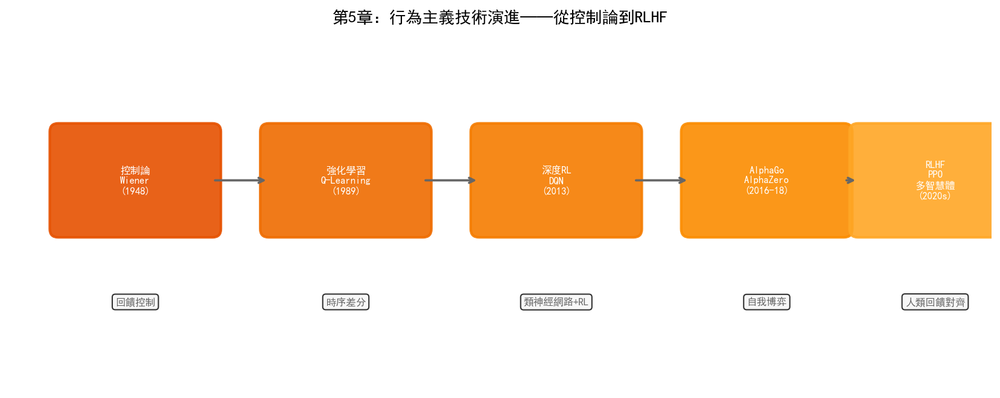

# 第5章 行為主義——從控制論到強化學習

## 5.1 哲學根源：控制論與進化論

1948年，麻省理工學院數學家諾伯特·維納（Norbert Wiener）出版了《控制論：或關於在動物和機器中控制和通訊的科學》。控制論（Cybernetics）這個詞來源於希臘語kybernetes——"舵手"。維納用這個詞來概括一個普遍原理：**透過反饋來實現目標導向的行為**。

維納的控制論受到二戰期間防空火炮自動瞄準問題的啟發。火炮需要預測飛機的未來位置來提前瞄準，維納設計了基於統計預測的濾波器來實現這一目標。在這個過程中他意識到，預測-行動-反饋的閉環不僅在工程系統中存在，也是生物體適應環境的基本機制——生物體透過感知環境、做出行動、接收反饋來調整未來的行為。

與控制論平行發展的是心理學中的行為主義流派。B.F.斯金納（B.F. Skinner）在1930年代提出了操作性條件反射理論：行為的頻率由其後果決定——帶來獎勵的行為會增加，帶來懲罰的行為會減少。斯金納的"斯金納箱"實驗展示了這一原理：老鼠在箱中偶然按下槓桿獲得食物後，會越來越頻繁地按壓槓桿。

控制論和行為主義共同構成了行為主義AI的哲學基礎：**智慧不是內嵌的規則（反對符號主義），也不是預先訓練的連接權重（補充連接主義），而是在與環境的持續互動中透過反饋不斷演化的行為策略**。

這個視角與進化論高度一致——生物智慧不是被設計的，而是透過變異、選擇和遺傳在環境中演化出來的。行為主義AI繼承了這一思路：不試圖從內部定義"什麼是好的決策"，而是讓智慧體在環境中試錯，透過環境反饋來發現有效的行為策略。

## 5.2 核心思想

行為主義AI可以用一個迴圈來概括：**感知環境 → 選擇行動 → 獲得反饋 → 更新策略**。

### 感知-行動迴圈

與符號主義的"推理"和連接主義的"前向傳播"不同，行為主義的智慧體始終處於一個閉環中。它不是一次性地處理輸入然後輸出結果，而是在時間維度上持續地感知、決策、行動和適應。一個在晶圓廠中執行的排程智慧體不是在某個時刻"算出"最優排程，而是在生產過程中持續監控狀態變化、做出排程決策、觀察結果、並據此調整未來的排程策略。

### 獎勵驅動學習

行為主義用"獎勵"（Reward）作為學習的唯一訊號。智慧體不需要被告知"什麼是對的"——它只需要知道"當前狀態好不好"。透過不斷試錯，智慧體學習到在不同狀態下應該採取什麼行動才能最大化長期累積獎勵。

獎勵驅動的學習正規化有一個深遠的優勢：它不需要標註資料。符號主義需要人類編碼規則，連接主義需要輸入-輸出對來訓練，而行為主義只需要一個獎勵函式來評估行為的好壞。在半導體製造中，"良率"本身就是一個天然的獎勵訊號——智慧體不需要被告知"調高RF功率到300W"，它只需要知道"當前製程參數下晶圓良率是多少"，然後自己探索能提高良率的參數組合。

### 試錯與探索

行為主義的核心機制是試錯。智慧體在環境中嘗試不同的行動，有些行動帶來高回報（被強化），有些帶來低迴報（被抑制）。透過大量的試錯，智慧體逐漸收斂到最優策略。

試錯學習面臨一個基本矛盾——"探索與利用"（Exploration vs. Exploitation）的困境。智慧體應該利用已知的高回報行動（利用），還是嘗試未知行動以發現可能的更好策略（探索）？在晶圓廠的場景中，這個困境是真實的：用已知最優的製程參數生產（利用）還是嘗試新參數以發現更好的製程視窗（探索）？前者安全但可能錯失改進機會，後者可能帶來突破但也可能導致良率下降。

## 5.3 技術演進脈絡

### 控制論時代（1948–1980s）

維納的控制論直接影響了一個技術領域：自動控制。PID控制器（比例-積分-微分控制器）是工業控制的基礎工具——它透過反饋將系統輸出維持在目標值附近。半導體製造中的R2R（Run-to-Run）控制本質上就是一種反饋控制：根據前一批次的測量結果調整下一批次的製程參數，以補償製程漂移。

1954年，W.羅斯·阿什比（W. Ross Ashby）出版了《大腦設計》一書，提出了"超穩定系統"（ultrastable system）的概念——一個能夠透過試錯自發適應環境的系統。阿什比建造了一個"穩態器"（homeostat）設備來演示這一原理：當外部擾動改變了系統的平衡狀態時，系統會自動調整內部參數直到重新達到穩定。這被一些學者視為第一個"學習機器"的例項。

### 強化學習的誕生（1980s–1990s）

1989年，劍橋大學的克里斯托弗·沃特金斯（Christopher Watkins）在博士論文中提出了Q-Learning演算法。Q-Learning是強化學習中最基礎也最重要的演算法之一。

Q-Learning的核心思想是學習一個"Q函式" $Q(s, a)$，表示在狀態 $s$ 下採取行動 $a$ 後預期能獲得的長期累積獎勵。Q函式透過貝爾曼方程迭代更新：

$$Q(s, a) \leftarrow Q(s, a) + \alpha [r + \gamma \max_{a'} Q(s', a') - Q(s, a)]$$

其中 $r$ 是即時獎勵，$s'$ 是行動後的新狀態，$\gamma$ 是折扣因子（控制對未來獎勵的重視程度），$\alpha$ 是學習率。

一旦Q函式學習充分，最優策略就是簡單地選擇 $Q$ 值最大的行動：$\pi(s) = \arg\max_a Q(s, a)$。

1992年，傑拉德·特索羅（Gerald Tesauro）在IBM開發了TD-Gammon——一個透過自我對弈學習西洋雙陸棋的程式。TD-Gammon使用時序差分學習（Temporal Difference Learning，TD-Learning，Q-Learning的一種變體），經過150萬局自我對弈後達到了世界冠軍水平。TD-Gammon是強化學習第一個在大規模複雜任務上達到專家水平的成功案例。

### 深度強化學習（2013–至今）

Q-Learning在狀態空間較小時有效，但當狀態空間巨大（如棋盤狀態、影象輸入）時，維護一個表格形式的Q函式不可行。深度學習的突破為強化學習提供了新的工具：用神經網路來近似Q函式。

2013年，DeepMind的Volodymyr Mnih等人發表了DQN（Deep Q-Network）論文，將CNN與Q-Learning結合。DQN用卷積神經網路從原始遊戲畫面中提取特徵，輸出每個可能行動的Q值。在49款Atari遊戲中，DQN有29款達到了人類專業玩家水平或更高。

DQN的關鍵創新包括：

- **經驗回放**（Experience Replay）：將互動資料儲存在回放緩衝區中，隨機取樣小批次進行訓練，打破了連續樣本之間的時間相關性
- **目標網路**（Target Network）：使用一個延遲更新的網路來計算目標Q值，提高了訓練穩定性

2016年，DeepMind的AlphaGo在首爾以4:1擊敗李世石。AlphaGo的技術架構是連接主義和行為主義的深度融合：深度神經網路用於策略評估（策略網路判斷當前局面應該在哪裡落子）和局面評估（價值網路判斷當前局面的勝率），蒙特卡洛樹搜尋用於在搜尋空間中探索。AlphaGo首先透過監督學習模仿人類專家棋譜，然後透過自我對弈強化學習不斷提升。

2017年的AlphaZero更進了一步——完全拋棄人類棋譜，從零開始（"Zero"的含義）透過自我對弈學習。AlphaZero同時掌握了國際象棋、將棋和圍棋，在所有棋類上都超越了此前的最強AI。AlphaZero的成功證明了一個深刻的觀點：當環境有明確的勝負規則時，強化學習可以在沒有任何人類先驗知識的情況下發現超越人類的策略。

2019年的MuZero進一步擺脫了對環境規則模型的依賴。AlphaZero需要知道遊戲的規則（如圍棋的合法落子位置），MuZero不需要——它透過學習環境的內部模型來預測狀態轉移，使得同一個演算法可以應用於沒有已知規則模型的任務。

### 走向實用（2020 至今）

純線上強化學習（智慧體在真實環境中試錯）在工業場景中難以直接應用——在晶圓廠中用試錯來探索製程參數意味著可能報廢整批晶圓。因此，近年來的研究重心轉向了更實用的方向：

**離線強化學習**（Offline RL）：只從歷史資料中學習，不需要在環境中實際互動。智慧體從已經收集的互動記錄（如製程日誌、參數調整記錄和對應的良率結果）中學習最優策略，而不是在真實環境中試錯。這使得強化學習可以在不干擾生產的情況下利用現有資料。

**決策Transformer**（Decision Transformer）：將強化學習重新表述為序列建模問題。將狀態-行動-獎勵三元組作為序列輸入Transformer，讓模型學習在給定目標回報的情況下生成行動序列。這種方法可以直接利用LLM的預訓練能力。

**模型預測控制**（Model-Based RL）：先學習環境的動力學模型（給定當前狀態和行動，預測下一狀態和獎勵），然後在學到的模型上進行規劃和最佳化。在晶圓廠中，可以先構建製程的數字孿生模型，在數字孿生中進行強化學習的探索和訓練，然後將學到的策略部署到真實產線。

## 5.4 當前技術框架

強化學習演算法可以根據學習物件的不同分為三大類。

### 基於價值的方法（Value-Based）

基於價值的方法學習狀態-行動價值函式 $Q(s,a)$，然後從中推導策略。DQN及其改進是這一類方法的代表：

| 演算法 | 關鍵改進 |
| --- | --- |
| DQN | CNN + Q-Learning + 經驗回放 + 目標網路 |
| Double DQN | 解決Q值過估計問題 |
| Dueling DQN | 分離狀態價值和動作優勢的建模 |
| Rainbow | 綜合多種DQN改進 |
| Conservative Q-Learning (CQL) | 離線RL，防止對分佈外動作的過估計 |

### 基於策略的方法（Policy-Based）

基於策略的方法直接參數化策略 $\pi_\theta(a|s)$，透過梯度上升最大化期望回報。REINFORCE是最基礎的策略梯度演算法，但其方差大、訓練不穩定。後續改進包括：

| 演算法 | 關鍵改進 |
| --- | --- |
| TRPO | 信賴域約束，保證策略更新幅度可控 |
| PPO | 裁剪目標函式，TRPO的簡化版，工業界最常用 |
| SAC | 最大熵強化學習，鼓勵探索 |

PPO（Proximal Policy Optimization）是目前工業界應用最廣泛的強化學習演算法。OpenAI在訓練機器手解魔方、訓練人形機器人行走等任務中都使用了PPO。PPO的吸引力在於它平衡了訓練穩定性和樣本效率——透過限制策略更新的幅度，避免了"學太快導致崩潰"的問題。

### Actor-Critic 方法

Actor-Critic結合了價值方法和策略方法的優點：Actor（策略網路）負責選擇行動，Critic（價值網路）負責評估Actor的選擇好不好。Critic的評估訊號指導Actor的改進方向，Actor的行動資料為Critic提供訓練樣本。

| 演算法 | 特點 |
| --- | --- |
| A2C / A3C | 同步/非同步的Actor-Critic，A3C透過多個並行環境加速訓練 |
| DDPG | 用於連續動作空間的Actor-Critic |
| TD3 | DDPG的改進，解決Q值過估計和方差問題 |
| SAC | 最大熵框架，在利用和探索之間自適應平衡 |

### 多智慧體強化學習（MARL）

當多個智慧體在同一環境中互動時，問題變得複雜——每個智慧體的最優策略取決於其他智慧體的策略，形成博弈關係。多智慧體強化學習（Multi-Agent RL, MARL）研究多智慧體場景下的學習和協調。

MARL在半導體晶圓廠中有天然的應用場景。一座晶圓廠有數百臺設備、多個製程步驟在並行執行，每個設備或製程段可以視為一個智慧體。PID、MFG、PE/EE三個部門的目標有時衝突（如製造部要產能最大化，但製程部要質量最最佳化），多智慧體系統需要學會在這些相互競爭的目標之間找到平衡。

主要MARL框架包括：

- **獨立Q學習**（IQL）：每個智慧體獨立學習，忽略其他智慧體的存在。簡單但可能不穩定
- **MAPPO**：PPO的多智慧體擴充套件，集中式訓練、分散式執行
- **QMIX**：用混合網路建模聯合Q值，假設智慧體之間的貢獻是單調的

## 5.5 優勢與侷限

### 優勢

**序貫決策最佳化**。強化學習天然適合需要多步決策才能達到目標的任務。製程參數最佳化不是一次性調整——調整一個參數會影響後續幾十步的製程結果，需要在時間維度上規劃最優的調整序列。強化學習的折扣累積獎勵機制使得它可以在"當前步驟的獎勵"和"未來步驟的獎勵"之間做權衡。

**無需標註資料**。強化學習只需要環境反饋（獎勵訊號），不需要輸入-輸出對。在晶圓廠中，良率資料是天然存在的——不需要人工標註"這個參數組合好還是不好"，只需要看這批晶圓的良率結果。

**自適應能力**。強化學習智慧體可以在環境變化時持續適應。當機臺老化導致製程參數漂移時，基於RL的R2R控制器可以自動調整補償策略，而不需要人工重新調參。

**超越人類策略的可能**。AlphaZero在棋類中發現的策略被人類棋手評價為"超越了此前所有人類的理解"。在製程最佳化中，RL可能在參數空間中發現人類工程師從未嘗試過的組合——這些組合可能在傳統經驗中被認為"不合理"，但實際上可能帶來更好的製程結果。

### 侷限

**樣本效率極低**。這是強化學習最致命的弱點。AlphaGo透過三千萬局自我對弈才達到世界冠軍水平——這在真實晶圓廠中完全不可行（不能讓產線執行三千萬批晶圓來學習）。離線RL和模型預測控制是緩解這個問題的方向，但樣本效率仍然是RL在工業落地的最大障礙。

**獎勵函式設計困難**。在棋類遊戲中，獎勵是明確的——贏為+1，輸為-1。但在晶圓廠中，獎勵函式的設計極其複雜。"良率"不是一個簡單的標量——短期良率和長期良率可能衝突（某參數調整短期內提升良率但加速設備老化導致長期良率下降）；不同產品的良率權重不同（高價值產品應賦予更高權重）；時間維度上需要平衡即時獎勵和長期獎勵。一個設計不當的獎勵函式會導致智慧體學到"投機取巧"的策略——比如為了降低報廢率而降低產量標準。

**模擬到現實的鴻溝**（Sim-to-Real Gap）。由於樣本效率問題，大多數RL在工業場景中的應用需要在模擬環境中訓練，然後部署到現實。但模擬模型永遠不可能完全精確——如果模擬器遺漏了某些物理效應，在模擬中訓練的最優策略可能在現實中失效甚至有害。數字孿生技術可以在一定程度上縮小這個鴻溝，但無法完全消除。

**安全性與約束**。強化學習的探索本質決定了它需要"犯錯"才能學習。在晶圓廠中，探索意味著嘗試未知的製程參數組合——這可能導致報廢、設備損壞甚至安全事故。安全強化學習（Safe RL）試圖在探索過程中保證安全約束，如在狀態空間中定義"安全區域"並限制智慧體只能在該區域內行動，但這又限制了探索的範圍。

**多目標平衡困難**。晶圓廠的最佳化目標通常是多重的——良率、產能、成本、交付時間——且這些目標之間存在複雜的權衡。標準RL框架假設一個標量獎勵函式，將多目標簡化為加權和。但這種簡化可能丟失重要的權衡資訊——不同的利益相關者（製程工程師、製造經理、設備工程師）對各個目標的優先順序有不同看法。

### 三大流派的定位

到此，AI三大流派的技術框架已經展開。在進入晶圓廠的具體應用之前，讓我們做一個簡單的定位總結：

| 維度 | 符號主義 | 連接主義 | 行為主義 |
| --- | --- | --- | --- |
| 核心能力 | 知識組織與推理 | 模式識別與預測 | 序貫決策與最佳化 |
| 資料需求 | 低（需要專家知識） | 高（需要大量標註資料） | 中（需要環境互動） |
| 可解釋性 | 強 | 弱 | 中 |
| 晶圓廠典型應用 | 根因推理、資料融合 | 缺陷檢測、良率預測 | 製程最佳化、智慧排程 |
| 代表工具 | 知識圖譜、Ontology | CNN、Transformer | PPO、SAC、MARL |

從下一部分開始，我們將進入晶圓廠的三大核心部門，看看這些技術如何在真實的工廠場景中落地。
