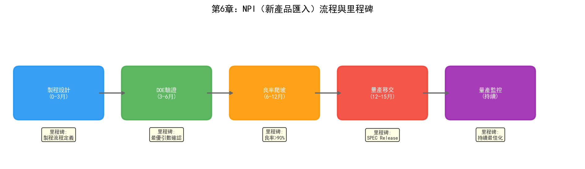
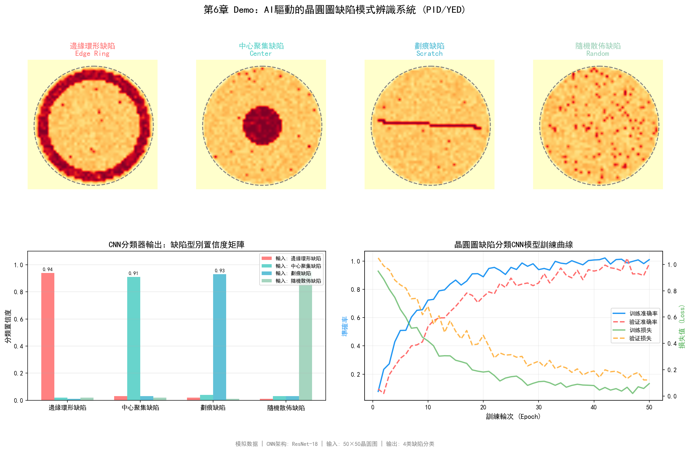

# 第6章 製程整合（PID）與良率工程（YED）

## 6.1 部門定位與職責

在半導體晶圓廠的組織架構中，製程整合（Process Integration Division, PID）和良率工程（Yield Engineering Division, YED）構成了質量保障體系的核心。兩者分工不同但緊密耦合——PID負責"把製程做對"，YED負責"確認做得對不對、為什麼不對"。

### 製程整合（PID）

PID的職責可以用一句話概括：確保從晶圓投入到產出的全流程製程一致性。一片晶圓在3nm製程中要經過1200多道製程步驟，涉及微影、刻蝕、薄膜沉積、離子注入、化學機械拋光（CMP）、量測等數十種製程模組。每個模組由不同的PE（製程工程師）負責最佳化，但模組之間的銜接——前一層的輸出是否匹配後一層的輸入要求——就是PID的職責。

PID工程師的工作類似於建築結構工程師：不需要親自澆築每一根柱子（那是PE的工作），但需要確保所有柱子、梁、樓板之間的受力關係正確，整棟樓不會因為某個區域性設計而坍塌。具體而言，PID負責：

- **製程流程定義**：確定每個產品的製程步驟序列、每步的目標參數和允差範圍
- **製程視窗設定**：為每個關鍵製程步驟定義可接受的操作區間——參數在這個區間內，產品良率可以達標
- **跨模組協調**：當某個模組的製程變更可能影響其他模組時，PID負責評估影響範圍並協調解決方案
- **新產品匯入（NPI）**：主導新製程節點的開發流程，從試產到量產的全過程管理
- **製程規格書（SPEC）維護**：定義和維護每道工序的規格標準，作為生產執行的依據

### 良率工程（YED）

如果說PID是"設計者"，YED就是"裁判和偵探"。YED的職責是監控、分析並提升良率——一片晶圓上能產出多少顆合格的晶片。

良率在半導體製造中有多個層級：

| 良率型別 | 定義 | 測試階段 |
| --- | --- | --- |
| 晶圓良率（Wafer Yield / Line Yield） | 完整走完全流程的晶圓數 / 投入晶圓數 | 產線追蹤 |
| 探針良率（Probing Yield / CP Yield） | CP測試中透過的晶片數 / 晶圓上總晶片數 | CP（晶圓級測試） |
| 終測良率（Final Yield / FT Yield） | FT測試中透過的晶片數 / CP透過晶片數 | FT（成品級測試） |
| 綜合良率 | 上述各良率的乘積 | — |

YED工程師的日常工作包括：

- **良率監控**：每日/每批次跟蹤良率資料，識別異常波動
- **缺陷分析**：透過缺陷檢測設備（KLA等）收集缺陷資料，分析缺陷的型別、密度、空間分佈
- **根因分析（RCA）**：當良率下降或缺陷率上升時，追溯問題到具體的製程步驟和設備
- **晶圓圖分析（Wafer Map Analysis）**：透過CP測試結果的空間分佈模式（邊緣缺陷、中心缺陷、簇狀缺陷等）推斷缺陷來源
- **良率提升專案**：系統性最佳化製程參數以提升良率

## 6.2 核心業務流程

### 新產品匯入（NPI）與製程開發

NPI是晶圓廠中最複雜、最耗資源的流程。一個先進製程的NPI通常遵循以下階段：

**第一階段：製程流程定義。** PID工程師根據產品設計規格（由設計公司提供的GDS檔案），定義完整的製程步驟序列。這個階段需要確定每層用什麼製程模組（如這層金屬層用銅互連還是鋁互連）、關鍵參數的目標值、以及步驟之間的依賴關係。

**第二階段：製程視窗開發。** PE工程師在每個製程模組內進行DOE（實驗設計），尋找最優的製程參數組合。PID工程師負責整合各模組的DOE結果，驗證跨模組的相容性——某個模組的最優參數可能在另一個模組中引發問題。

**第三階段：試產。** 在製程流程和參數初步確定後，進行小批次試產。試產晶圓經過全流程後進行CP和FT測試，評估良率。試產通常需要多輪迭代——每輪發現的問題都可能導致製程參數調整甚至流程變更。

**第四階段：良率爬坡（Yield Ramp）。** 試產驗證透過後，逐步提升產量。良率爬坡是一個持續最佳化的過程——從試產良率（可能30%-50%）爬升到量產良率（通常要求90%以上）。爬坡速度直接決定了產品上市時間和投資回報週期。

**第五階段：量產轉移。** 良率達標後，製程規格凍結，進入量產階段。此後任何製程變更都需要經過嚴格的工程變更控制（ECN/ECO）流程。

### 良率管理與缺陷分析

量產階段的良率管理是一個持續的過程，核心是"監控-檢測-分析-改進"的閉環。

**監控：** 每批次晶圓在關鍵製程步驟後都會經過量測設備（如KLA的量測系統），記錄CD（關鍵尺寸）、膜厚、套刻精度等參數。這些資料實時上傳到SPC（統計過程控制）系統，當參數超出控制限（UCL/LCL）時觸發告警。

**檢測：** 在微影後（ADI, After Develop Inspection）和刻蝕後（AEI, After Etch Inspection），晶圓經過缺陷檢測設備掃描，記錄缺陷的位置、大小和形態。在CP測試後，每片晶圓生成一張晶圓圖——顯示哪些位置的晶片透過了測試、哪些失敗了。

**分析：** 當良率下降或缺陷率上升時，YED工程師需要進行根因分析。這個過程通常涉及：

- 缺陷分類：將檢測到的缺陷按型別分類（顆粒、劃痕、裂紋、腐蝕等）
- 空間模式分析：晶圓圖上缺陷的分佈模式暗示了不同的根因——邊緣缺陷通常是設備邊緣效應或裝卸問題；中心缺陷可能是製程均勻性問題；隨機分佈的顆粒缺陷可能來自潔淨室環境
- 製程參數關聯：將缺陷資料與對應製程步驟的設備參數做關聯分析，找出異常參數
- 物理失效分析（PFA）：對失效的晶片進行切片、SEM/TEM觀察，確定物理層面的失效機制

**改進：** 根據根因分析的結論，PE工程師調整製程參數或進行設備維護，PID工程師更新製程規格。改進效果透過後續批次的良率資料驗證。

## 6.3 關鍵技術與方法

### 電性測試

電性測試是良率評估的最終判據，分為三個層級：

**WAT（Wafer Acceptance Test，晶圓接收測試）：** 在晶圓完成所有前道製程後進行，測量測試鍵（Test Key，位於晶片之間的劃片道上）的電性參數——如電晶體的閾值電壓、飽和電流、漏電流、電容等。WAT不測試晶片功能，只測試製程質量。WAT資料是評估製程一致性的核心指標。

**CP（Circuit Probing，晶圓級測試）：** 用探針卡直接接觸晶圓上每顆晶片的焊盤，進行功能測試。CP區分"良品"和"不良品"，不良品在後續封裝前被淘汰。CP測試的時間成本很高——一片晶圓上有數千顆晶片，每顆晶片的完整功能測試可能需要數秒到數十秒，整片晶圓的CP測試可能需要數小時。

**FT（Final Test，成品測試）：** 在晶片封裝後進行，測試封裝後的成品在各種溫度和電壓條件下的功能和效能。FT是晶片出廠前的最後一道質量關。

三個層級的測試資料共同構成了良率的完整畫像——WAT良率反映製程基礎質量，CP良率反映晶圓級功能合格率，FT良率反映封裝後的最終合格率。

### 缺陷檢測

缺陷檢測是YED最重要的資料來源。現代晶圓廠的缺陷檢測主要依賴兩類設備：

**光學檢測設備：** 如KLA的Surfscan系列，利用高解析度光學成像掃描晶圓表面，透過比較相鄰區域或與參考影象的差異來檢測缺陷。光學檢測速度快，適合全晶圓掃描，但解析度有限（通常在0.1微米量級）。

**電子束檢測設備：** 如KLA的eDR系列，利用電子束掃描晶圓表面，解析度可達奈米級。電子束檢測速度慢，通常用於光學檢測發現可疑區域後的詳細複查，或者關鍵製程步驟後的高精度檢測。

檢測設備輸出的是缺陷列表——每個缺陷的位置座標、大小、形態參數。這些原始資料需要經過自動缺陷分類（ADC）系統分類為具體的缺陷型別，才能用於後續的根因分析。

### FDC（Fault Detection & Classification）

FDC系統是連接YED和EE/PE的關鍵資料橋樑。FDC實時採集設備在執行過程中的感測器資料（溫度、壓力、氣體流量、RF功率、時間序列等），透過兩種方式工作：

**故障檢測（FD）：** 監控設備參數是否在正常範圍內。傳統的FD使用SPC控制圖——當參數超出控制限時觸發告警。更先進的FD使用多元統計方法（如PCA、T2控制圖）來監控多個參數的聯合狀態。

**故障分類（FC）：** 當檢測到異常時，將異常分類為具體的故障型別。傳統FC依賴規則匹配——"如果溫度先升後降且壓力波動，則分類為氣體洩漏"。深度學習模型在FC中的應用正在增長——CNN可以從時序訊號圖中識別異常模式，準確率優於規則方法。

### 製程視窗分析

製程視窗是PID工程師最關心的概念之一。簡單來說，製程視窗是製程參數的"安全操作區間"——在這個區間內，製程結果滿足規格要求。製程視窗越大，製程越健壯、對設備波動和參數漂移的容忍度越高。

製程視窗分析通常透過DOE（實驗設計）來確定：

1. 選擇關鍵製程參數（如刻蝕的RF功率、腔體壓力、氣體比例）
2. 設計實驗矩陣（如中心複合設計CCD），在各參數的高低水平組合下執行實驗
3. 測量各實驗條件下的製程結果（如刻蝕速率、均勻性、選擇比）
4. 建立製程響應面模型（Response Surface Model），擬合參數與結果的關係
5. 在響應面上找到滿足所有規格要求的參數空間——這就是製程視窗

在先進製程中，製程視窗極窄——3nm的CD控制要求在1-2奈米量級，而製程參數的自然波動可能就在這個量級。這意味著即使參數在"正常"範圍內，產品也可能不合格。製程視窗的微小收窄都會顯著增加控制難度和報廢風險。

## 6.4 面臨的挑戰

### 製程參數互動效應複雜

3nm製程的1200多道工序中，前後步驟的參數互動效應呈指數級增長。某一層CMP的拋光壓力偏大0.5psi，可能導致兩層後微影的套刻精度超標，進而影響五層後的金屬互連電阻——這種跨步驟的因果鏈路在傳統單步製程監控中完全不可見。

PID工程師面臨的困境是：他們需要管理的不是一個步驟的參數，而是上千個步驟的參數之間的互動網路。傳統的DOE方法只能在少數幾個參數之間做區域性最佳化——當參數維度超過10個時，DOE的實驗次數就會爆炸。而實際製程的參數維度往往在數十到數百個。

### 良率root cause定位困難

當良率下降時，YED工程師需要從海量資料中找到根因。一片晶圓的製造過程涉及數百臺設備、上千道步驟、每步數十個參數——可能的根因組合是天文數字。

傳統的RCA方法依賴工程師的經驗和直覺：先看晶圓圖的空間模式縮小範圍，再看對應步驟的SPC資料找異常參數，必要時做PFA確認物理機制。這個過程通常需要數天甚至數週。在這段時間裡，產線可能還在繼續生產——如果根因是設備問題且未被發現，更多批次可能受影響。

英特爾在其白皮書中描述了這一挑戰：RCA需要整合數十億條異構生產資料，傳統人工排查耗時數天。他們的ML系統將根因定位時長壓縮到分鐘級——這背後是連接主義（模式識別）和符號主義（知識推理）的結合。

### NPI週期壓縮壓力

先進製程的競爭本質上是時間競爭——誰先量產誰就能佔據市場。但NPI週期的壓縮受到物理規律的限制：每輪試產需要3-4個月的晶圓製造週期，而一輪試產通常只能驗證一部分製程假設。如果NPI需要10輪試產迭代，那就是3年以上的開發週期。

PID工程師需要在更少的試產輪次內收斂製程——這意味著每一輪試產都必須獲得儘可能多的資訊。傳統的OFAT（One Factor At A Time）實驗方法效率極低，DOE雖然更高效但在高維參數空間中仍然不夠。AI輔助的實驗設計——如貝葉斯最佳化和強化學習——可以在已有資料的基礎上預測最優的下一組實驗參數，用更少的實驗次數覆蓋更大的參數空間。

## 6.5 實踐研究：AI在PID/YED中的真實落地案例

### 英特爾：AI驅動的GFA自動檢測系統

英特爾IT部門部署了一套基於機器學習、深度學習和影象處理的良率分析系統，用於自動檢測晶圓圖上的GFA（Gross Failure Area，大面積失效區域）。

傳統流程中，良率工程師需要人工審查晶圓圖，識別已知的失效模式（baseline pattern）。這個過程受限於人力資源——無法覆蓋每一片晶圓。英特爾的AI系統實現了：

- **基線模式檢測**：自動識別已知失效模式，準確率超過90%，覆蓋100%的終測晶圓（此前人工只能抽檢）
- **未知模式發現**：系統還能報告所有影響良率的模式及其嚴重程度——包括工程師此前未注意到的模式
- **前瞻式推送**：從被動"拉取"分析轉為主動"推送"告警
- **內聯檢測前移**：英特爾在PoC中驗證了內聯檢測（inline inspection）結合AI可以提前發現50%的晶圓減薄問題——比離線檢測更早

這套系統的價值不僅在於效率提升，更在於**覆蓋率的質變**——從抽檢變為全檢，使得偶發性良率問題不再因"沒有被看到"而被遺漏。

### SK海力士/Gauss Labs：Panoptes虛擬量測系統

SK海力士投資的AI公司Gauss Labs開發了Panoptes虛擬量測（Virtual Metrology, VM）系統，2022年12月在SK海力士量產產線部署。

虛擬量測的核心思路是：用設備感測器資料（溫度、壓力、氣體流量等）預測晶圓的量測結果（膜厚、折射率等），無需實際測量。這使得"每片晶圓都有量測資料"成為可能——傳統上只有抽樣晶圓會被量測。

Panoptes VM的部署結果：

- 製程變異降低21.5%（2022年12月部署時），到2024年2月進一步改善至29%
- 累計對超過5000萬片晶圓進行了虛擬量測——相當於每秒超過一片
- 採用自適應線上模型（AOM）處理資料漂移問題——當設備老化或消耗件更換導致資料分佈變化時，模型自動適配
- 從薄膜沉積擴充套件到多個製程模組的高 volume manufacturing 虛擬量測

Gauss Labs還開發了Universal Denoiser，用AI去除CD-SEM影象的噪聲——影象採集時間縮短到傳統技術的1/4，預計將量測設備生產率提升42%。

### 美光（Micron）：Smart Sight智慧製造系統

美光的Smart Sight是一個企業級AI製造系統，覆蓋了從缺陷檢測到製程最佳化到質量管理的全鏈條。

美光公佈的2016-2020年內部資料：

- 新產品上市時間縮短50%
- 產品報廢率降低22%
- 質量問題解決速度提升50%
- 製造設備可用率提升4%
- 年勞動生產率增加100萬工時

Smart Sight的具體應用包括：用計算機視覺對微影相機影象進行自動缺陷分類——識別晶圓邊緣微小孔洞、劃痕、薄膜氣泡等缺陷型別。美光還部署了基於ResNet-50的視覺模型檢測晶圓/腔體放置錯位，以及AI驅動的OCR缺陷檢測——將掃描器晶圓拒收率降至0.5%以下。

2025年，美光與Anthropic宣佈多年合作，將Claude AI用於構建下一代"AI工廠"。

### Lam Research：Fabtex Yield Optimizer

Lam Research的Fabex Yield Optimizer是業界首個使用虛擬矽數字孿生（基於SEMulator3D）結合AI/ML推薦量測目標變更的工具。

兩個NPI案例的結果：

- **案例一**：一家領先器件製造商在新產品匯入HVM時，透過虛擬矽提前發現並修正系統性缺陷——節省了數月時間，實現了"首次即正確"的晶片交付。如果沒有數字孿生，這些缺陷要到終測才能被發現，影響所有晶圓。
- **案例二**：在複雜3D結構中，消除了由多製程步驟互動引起的頑固缺陷，且未引入新的系統性缺陷——提升了該缺陷模式的良率。

Fabtex的ROI模型：傳統方法需要10輪矽片改進迭代，每輪9周；使用數字孿生後減少到5輪，每輪10周——總週期從約90周減少到約50周。

### NVIDIA：視覺基礎模型用於晶圓缺陷分類

NVIDIA在2025年發布了基於視覺基礎模型的半導體缺陷分類方案：

- **Cosmos Reason VLM**：晶圓級缺陷分類準確率超過96%（微調後），支援少樣本學習、自然語言解釋、互動式問答和自動標註
- **NV-DINOv2 VFM**：裸片級缺陷檢測準確率達98.51%，大幅減少人工標註需求

這些模型的價值在於**通用性**——不需要為每種缺陷型別從頭訓練模型，而是透過少樣本微調快速適配新製程節點的缺陷模式。台積電已經在使用NVIDIA Metropolis和TAO Toolkit進行自動化缺陷檢測。

### 行業工具生態

除了上述企業級案例，半導體行業的AI良率分析工具生態已經形成：

| 廠商 | 產品 | 功能 |
| --- | --- | --- |
| KLA | Klarity Defect / SSA / aiSIGHT | 實時偏移識別、缺陷簽名自動檢測與分類 |
| Applied Materials | AIx / ChamberAI / AppliedPRO | 實時製程可視性、腔體級AI分析、數字製程地圖 |
| IKAS | Smart RCA | 多源資料融合的根因分析，RCA時間減少>80% |
| yieldWerx | Root Cause Knowledge Graphs | 知識圖譜驅動的批次處置和RCA |
| Synopsys | DSO.ai / Silicon.da | RL驅動的晶片設計最佳化、矽片資料閉環 |

---

PID和YED是晶圓廠中資料最密集、分析最複雜的部門。它們面臨的挑戰——跨步驟因果推理、高維參數最佳化、海量資料根因分析——恰好是AI技術最能發揮價值的場景。上述案例表明，AI在PID/YED的應用已經從"實驗性探索"進入"量產級部署"階段——英特爾的GFA檢測、SK海力士的虛擬量測、美光的Smart Sight都是覆蓋全產線的系統性應用。第四部分將詳細討論符號主義、連接主義和行為主義分別在PID/YED中的應用。

## 6.6 Demo視覺化：AI驅動的晶圓圖缺陷模式識別系統

*Demo說明：上圖展示了對四種典型晶圓缺陷模式（邊緣環形、中心聚集、劃痕、隨機散佈）的CNN分類結果。下左為分類置信度矩陣，下右為模型訓練曲線。模擬指令碼見 `demos/demo_ch6_wafer_defect.py`。*
