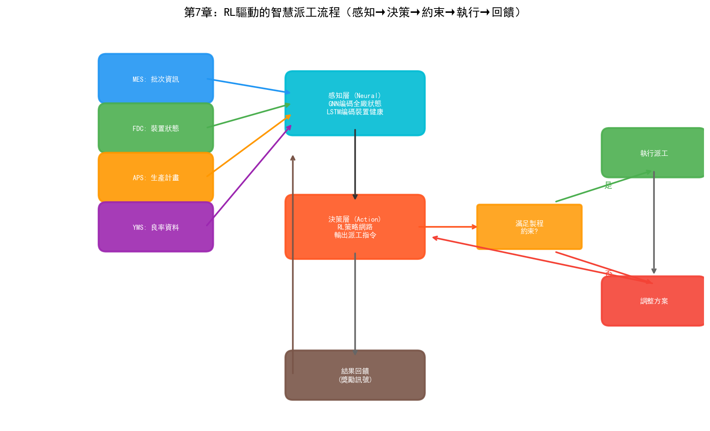
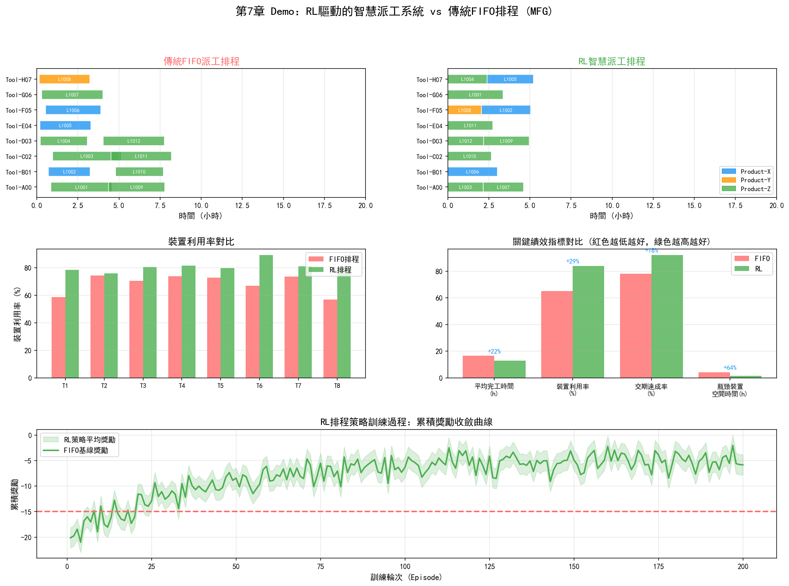

# 第7章 製造部（MFG）

## 7.1 部門定位與職責

製造部（Manufacturing, MFG）是晶圓廠中"讓一切發生"的部門。如果說PID定義了"怎麼製造"，PE/EE維護了"用什麼製造"，那麼MFG的職責就是"實際製造"——把晶圓從投入口送到產線上的每一臺設備，按序完成上千道工序，最終把加工完成的晶圓送出產線。

這個看似簡單的"搬運"工作，在半導體晶圓廠中卻是世界上最複雜的排程問題之一。

### 與普通工廠排程的根本差異

半導體晶圓廠的排程有一個獨特特徵：**重入式流程（Reentrant Flow）**。在普通工廠中，產品沿產線單向流動——原料→加工A→加工B→加工C→成品。但在晶圓廠中，同一片晶圓需要反覆經過同一組設備。一片3nm晶圓要經過80-120層微影，每層微影都需要微影機——同一臺EUV掃描器在一批晶圓的製造週期內可能被同一片晶圓訪問上百次。

重入式流程帶來了一個普通工廠不存在的排程難題：在時刻T，同一臺設備前可能同時有屬於不同產品、不同批次、不同優先順序、不同製程步驟的晶圓在排隊。設備應該先處理哪批？這個決策不僅影響當前批次的交期，還會透過連鎖反應影響後續所有排隊批次的等待時間。

### MFG的核心職責

- **生產排程與派工（Dispatching）**：決定每臺設備下一批處理哪片晶圓
- **產能管理（Capacity Management）**：預測和規劃設備產能，確保滿足客戶訂單需求
- **在製品管理（WIP Management）**：監控產線上的在製品分佈，避免區域性積壓或斷料
- **異常處理**：設備宕機、製程異常、緊急訂單等突發情況下的排程調整
- **交期管理**：確保每個批次在承諾的交期內完成

## 7.2 核心業務流程

### 生產計劃制定

生產計劃分三個層級：

**長期規劃（月-季度）：** 根據客戶訂單預測和產能評估，制定月度投片計劃。這個層級主要關注產能與需求的匹配——是否有足夠的設備滿足訂單？是否需要採購新設備或調整產品組合？長期規劃通常由APS（高階排程系統）輔助完成。

**中期排程（周-月）：** 將月度投片計劃分解為周計劃，考慮設備維護視窗、產品切換時間、工程批次插入等因素。中期排程需要平衡多個目標——最大化設備利用率、最小化產品切換次數、滿足不同客戶的不同交期要求。

**實時派工（分鐘-小時）：** 在產線執行過程中，實時決定每臺設備下一批處理什麼。這是MFG最核心的日常操作，由MES（製造執行系統）和派工規則引擎支援。

### 派工規則

派工規則決定了在有多批晶圓排隊時設備的選擇順序。常見的派工規則包括：

| 規則 | 描述 | 適用場景 |
| --- | --- | --- |
| FIFO（先到先服務） | 按到達順序處理 | 簡單場景，不考慮優先順序 |
| EDD（最早交期優先） | 優先處理交期最近的批次 | 交期敏感的代工廠 |
| SPT（最短加工時間優先） | 優先處理加工時間短的批次 | 減少平均等待時間 |
| CR（臨界比率） | 剩餘時間 / 剩餘工序時間 | 綜合考慮交期和進度 |
| LWN（最小WIP優先） | 優先處理WIP最少的工序段 | 平衡產線WIP分佈 |

實際晶圓廠通常組合使用多種規則——基本規則是FIFO，但對緊急批次（Hot Lot）或工程批次（Engineering Lot）賦予高優先順序插隊。某些設備可能有特殊約束——如需要相同配方（Recipe）的批次連續處理以減少切換時間。

### 異常處理

晶圓廠的日常執行中，異常是常態而非例外。常見的異常包括：

- **設備宕機：** 某臺關鍵設備突然故障。MFG需要立即調整派工，將受影響的批次路由到備用設備，同時重新計算對交期的影響
- **製程異常：** 某批次在量測時發現參數超標。MFG需要暫停該批次後續步驟，等待PID/YED分析後再決定放行還是返工
- **緊急訂單插入：** 客戶臨時插入高優先順序訂單。MFG需要在不打亂現有排程的前提下插入新批次
- **工程批次：** PID/PE需要執行實驗批次（如新製程驗證）。工程批次通常數量少但優先順序高，需要與正常生產批次協調

異常處理的效率直接決定了晶圓廠的響應能力——一個從設備宕機到恢復生產需要4小時的工廠，和一個只需要2小時的工廠，在年產能上的差異可能是數千片晶圓。

## 7.3 關鍵技術與方法

### MES（製造執行系統）

MES是晶圓廠運轉的中樞神經系統。它追蹤每一片晶圓在產線上的位置和狀態，記錄每批晶圓在每個工序的進出時間、使用的設備和參數、操作員資訊等。MES的核心功能包括：

- **批次追蹤（Lot Tracking）：** 實時記錄每批晶圓的位置、狀態、製程進度
- **製程路線管理（Route Management）：** 定義每批晶圓的製程步驟序列
- **設備管理：** 監控設備狀態（執行/空閒/維護/故障），管理設備配方（Recipe）
- **資料採集：** 自動採集設備執行參數和量測資料
- **派工指令：** 根據派工規則向操作員或自動化系統發出搬送和加工指令

MES的資料是晶圓廠最核心的資料資產之一——它記錄了從晶圓投入到產出的完整歷史。這些資料是後續良率分析、製程最佳化和AI模型訓練的基礎。

### APS（高階排程系統）

APS在MES之上提供更高階的排程能力。傳統的MES派工是"反應式"的——當設備空閒時根據當前排隊情況選擇下一批。APS是"預測式"的——它基於全產線的當前狀態和未來計劃，模擬未來數小時甚至數天的生產情況，提前識別瓶頸和衝突。

APS的核心是有限產能排程（Finite Capacity Scheduling）演算法。與無限產能排程（假設備產能無限，只按製程順序排產）不同，有限產能排程考慮每臺設備的實際產能限制——如果某臺設備24小時只能處理50批，APS不會安排超過50批的工件到該設備。

在先進晶圓廠中，APS通常需要處理：
- 數百臺設備
- 數千批次同時在產線上流動
- 每批次的上千道工序
- 設備維護視窗和配方切換約束
- 多產品混合生產

這個排程問題的搜尋空間是天文數字級的——即使是最強大的計算機也無法找到全域性最優解。實際系統通常使用啟發式方法（如遺傳演算法、模擬退火）或基於規則的方法來尋找"足夠好"的近似最優解。

### 瓶頸分析（TOC理論）

約束理論（Theory of Constraints, TOC）是MFG分析產能瓶頸的核心框架。TOC的基本觀點是：任何系統的產出都受限於其最薄弱的環節——瓶頸。最佳化非瓶頸環節不會提升系統總產出，只有最佳化瓶頸才能提升整體產能。

在晶圓廠中，瓶頸通常是某種關鍵設備——如EUV微影機。一座3nm晶圓廠可能配備15臺以上的EUV掃描器，每臺價值超過1.5億美元。EUV設備的處理速度（Throughput，通常以WPH—Wafer Per Hour計量）決定了整條產線的產出上限。如果EUV設備因維護或故障停機1小時，整條產線的產出損失可能無法透過其他設備的加速來彌補。

瓶頸分析的關鍵實踐包括：

- **識別瓶頸：** 透過設備利用率（OEE）資料找到利用率最高（瓶頸）的設備
- **最大化瓶頸利用率：** 確保瓶頸設備永遠不"等料"——在瓶頸設備前維持適當的WIP緩衝
- **服從瓶頸：** 非瓶頸設備的排程應配合瓶頸設備的節奏——即使非瓶頸設備可以更快，也不應超前生產導致WIP堆積

### OEE（設備綜合效率）

OEE是MFG衡量設備利用效率的核心指標：

$$OEE = 可用率 \times 性能率 \times 良率$$

- **可用率（Availability）：** 實際執行時間 / 計劃執行時間。扣除設備故障和調整時間
- **效能率（Performance）：** 實際產出 / 理論產出。衡量設備執行速度是否達到設計產能
- **良率（Quality）：** 合格品 / 總產出。衡量設備加工質量

一座先進晶圓廠的OEE目標通常在80%-85%以上。OEE每提升1個百分點，在不增加設備投資的情況下相當於增加了1%的產能——對於一座投資200億美元的工廠，這相當於每年數百萬美元的額外收入。

## 7.4 面臨的挑戰

### 重入式產線的排程複雜性

重入式流程使得傳統的排程演算法幾乎失效。在單向流程產線中，一個簡單的FIFO規則就能產生不錯的排程。但在重入式產線中，同一臺設備上排隊的晶圓可能處於完全不同的製程階段——有的剛完成第一層微影，有的在做第八十層。選擇先處理哪個不僅影響當前設備的利用率，還會透過後續工序的排隊效應傳播到整個產線。

這種複雜性使得晶圓廠排程被歸類為NP-Hard問題——隨著問題規模增長，精確求解的計算時間指數級增長。實際系統只能在"求解速度"和"解的質量"之間做妥協。

### 多品種混合生產

現代晶圓廠通常同時生產多種產品——不同的技術節點（28nm/14nm/7nm/3nm）、不同的產品型別（邏輯晶片/儲存器/模擬晶片/射頻晶片），甚至不同客戶的定製程。每種產品有不同的製程路線、不同的加工時間、不同的交期要求。

多品種混合帶來的挑戰包括：

- **配方切換：** 不同產品需要不同的設備配方（Recipe），切換配方需要時間（set-up time），頻繁切換降低設備利用率
- **製程路線差異：** 不同產品的製程步驟序列不同，在同一設備上需要協調多種製程路線的排程
- **優先順序衝突：** 高價值產品的緊急訂單與常規產品的穩定生產之間的優先順序衝突

### 產能利用率與交期的平衡

MFG需要在兩個目標之間持續平衡：最大化產能利用率（讓設備不停機）和滿足客戶交期（按時交付）。這兩個目標經常衝突——為了滿足某個緊急訂單的交期，可能需要中斷某臺設備的當前批次，切換配方來處理緊急批次，這降低了設備利用率。

在產能緊張時（如先進製程需求暴增），這個矛盾更加尖銳——所有客戶都希望自己的訂單優先，但物理產能有限。MFG需要在客戶滿意度、產能效率和利潤最大化之間找到平衡點。

### 事件驅動的動態調整

晶圓廠的執行環境是高度動態的——設備故障、製程異常、緊急訂單、工程批次插入等事件隨時發生。靜態排程（在一天開始時排好全天計劃）在實際執行中幾乎無法維持——一個設備故障就可能打亂整條產線的排程。

MFG需要的是能夠實時響應事件的動態排程能力。傳統的派工規則是"靜態"的——規則固定不變，不考慮當前產線的全域性狀態。更先進的方法需要考慮產線的實時狀態來動態調整派工策略——這正是AI技術（特別是強化學習）的用武之地。

## 7.5 實踐研究：AI在MFG中的真實落地案例

### 台積電：智慧運營系統

台積電在其官方製造頁面中明確描述了AI/ML在製造運營中的系統化應用。台積電的智慧運營系統覆蓋六個方向：

- **精益製造**：AI/ML最佳化生產流程，減少浪費
- **人員生產力**：AI輔助決策，降低人工分析負擔
- **設備生產力**：預測性維護和智慧派工提升設備利用率
- **製程與設備控制**：智慧先進製程控制（APC）和智慧先進設備控制（AEC）
- **質量防禦**：AI驅動的異常檢測和良率保護
- **機器人控制**：AMHS（自動物料搬運系統）的AI最佳化

台積電將AI整合到派工系統中，擴大了排程的計算範圍和效能——目標是最大化設備生產效率。同時，台積電將AMHS擴充套件到連接多座超級晶圓廠（Gigafab），提升跨廠區的生產流動效率和穩定性。在製程學習曲線方面，台積電使用先進AI演算法加速先進製程的製程控制創新——縮短從試產到量產的週期。

台積電還與NVIDIA深度合作：使用NVIDIA Metropolis和TAO Toolkit進行視覺AI缺陷檢測，使用NVIDIA cuLitho加速計算微影，使用NVIDIA Omniverse構建"FabTwin"數字孿生——後者用於整廠級的生產模擬和異常預測。

### 三星：AI Megafactory

2025年10月，三星與NVIDIA宣佈共建AI Megafactory——部署超過50,000塊NVIDIA GPU，投資25億美元構建AI製造基礎設施。

AI Megafactory的核心應用包括：

- **計算微影加速**：使用NVIDIA cuLitho和CUDA-X庫進行OPC（光學鄰近校正），計算微影效能提升20倍
- **數字孿生**：基於NVIDIA Omniverse構建整廠數字孿生——視覺化全部製造流程，識別異常、預測性維護、在物理變更前模擬最佳化效果
- **全流程AI網路**：從晶片設計、製程開發、設備操作到質量控制，AI貫穿製造全鏈條
- **HBM4製造**：6代10nm級DRAM + 4nm邏輯基礎晶片，處理速度達11 Gbps（超過JEDEC標準的8 Gbps）

據第三方行業報道，三星AI Megafactory實現了缺陷檢測改善30%、晶圓良率提升15%（三星官方未確認這些數字）。

### 格羅方德（GlobalFoundries）：AI驅動的AMHS健康管理

格羅方德德累斯頓晶圓廠部署了AI驅動的AMHS車輛健康監控系統，覆蓋23公里架空運輸系統和超過900臺自動運輸車輛。

該系統利用聲學和視覺AI對運輸車輛進行實時健康評分和預測性維護：

- 車輛間隔故障平均時間（MTBI）提升3倍
- 運輸相關的生產損失減少80%
- AI透過影片分析評估車輪磨損和間距——在機械退化早期就標記異常

這個案例展示了AI不僅在製程設備上有價值，在廠務物流系統上同樣能產生顯著ROI——運輸系統的停機直接導致晶圓在工序間滯留，影響Cycle Time和WIP週轉。

### 格創東智：馬來西亞12寸晶圓廠AI-CIM系統

格創東智（CircuitSoft）在2026年SEMICON SEA上展示了其在馬來西亞一座12寸晶圓廠的AI-CIM（計算機整合製造）部署：

- **AI CIM-MIS系統**：產品追溯能力提升超過90%，設備OEE提升20%
- **AI FDC系統**：在多供應商CMP設備上檢測到濾芯堵塞和晶圓破裂等問題
- **TPM/MVA多模型協作**：多模型聯合分析設備健康和製程質量

### 美光（Micron）：企業級AI製造

美光的AI製造系統覆蓋了從缺陷檢測到物流最佳化到業務流程的全鏈條。公佈的2016-2020年內部資料：

- 製造設備可用率提升4%
- 年勞動生產率增加100萬工時
- 新產品上市時間縮短50%
- 產品報廢率降低22%

美光還部署了聲學AI（聽設備運轉聲音檢測異常）、熱成像AI（檢測設備過熱）和Agentic AI（自主排程維修、訂購備件、調整生產路徑）。

### 強化學習在排程量產中的驗證

雖然RL在晶圓廠排程中的研究由來已久，但真正在產線上驗證的案例正在積累[88]：

**AISSI專案（2021-2024）**：由Bosch、Nexperia、Bosch Sensortec、D-SIMLAB、SYSTEMA和KIT聯合開展，使用深度RL代理進行工廠排程[87]。三個用例：外延工作中心排程（Nexperia）、全廠排程（Bosch）、全球Cycle Time預測（Bosch Sensortec）。結果：產出比文獻基準高9%，Cycle Time預測準確率80-90%。成果正在向Bosch和Nexperia的產線轉移。

**ICTC 2025論文**：在實際工業資料集上驗證RL排程——吞吐量提升5.3%，Cycle Time降低7.3%，延遲指標相對改善19.2%，設備利用率達87.9%。

**arXiv 2025論文**：在真實工業資料集上，RL方法將延遲指標改善4%，吞吐量提升1%——雖然幅度不大，但驗證了RL在真實產線環境中的可行性。

### 行業工具與實踐生態

| 廠商/專案 | 應用 | 量化結果 |
| --- | --- | --- |
| 台積電 | AI派工、AMHS、APC/AEC | 系統化部署，未公佈具體KPI |
| 三星 | AI Megafactory（50,000 GPU） | OPC 20倍加速、缺陷檢測+30%、良率+15% |
| 格羅方德 | AMHS車輛AI健康監控 | MTBI 3倍、運輸損失-80% |
| 格創東智 | AI CIM-MIS、AI FDC | OEE +20%、追溯>90% |
| 美光 | Smart Sight全鏈條AI | 設備可用率+4%、報廢-22% |
| AISSI/Bosch | 深度RL排程 | 產出+9%、預測準確率80-90% |
| 西門子Opcenter | MES+AI+SCADA | 良率+13%（2周內） |

---

MFG的挑戰——NP-Hard排程、重入式流程、動態事件響應、多目標最佳化——是AI技術最有潛力的應用場景之一。上述案例表明，台積電和三星已經將AI系統化嵌入製造運營的全流程，而RL排程正在從學術研究向產線驗證過渡。強化學習在序貫決策最佳化上的能力，深度學習在瓶頸預測上的能力，以及知識圖譜在跨系統資料整合上的能力，都將在第四部分的MFG應用章節中展開。

## 7.6 Demo視覺化：RL驅動的智慧派工系統

*Demo說明：上圖對比了傳統FIFO派工與RL智慧派工的甘特圖。下排展示了設備利用率對比、關鍵KPI對比和RL訓練的獎勵收斂曲線。模擬指令碼見 `demos/demo_ch7_smart_scheduling.py`。*

> **本章配套實驗**：第27章 27.6 節的 K8s 式宣告式排程實驗（`demos/experiments/C9S_agent`）把本章討論的智慧排程思想做成了可互動的系統——用「期望態-實際態」調諧迴圈取代人工排程腳本，並可在介面注入設備故障觀察系統自愈，零外部依賴、秒級啟動。
