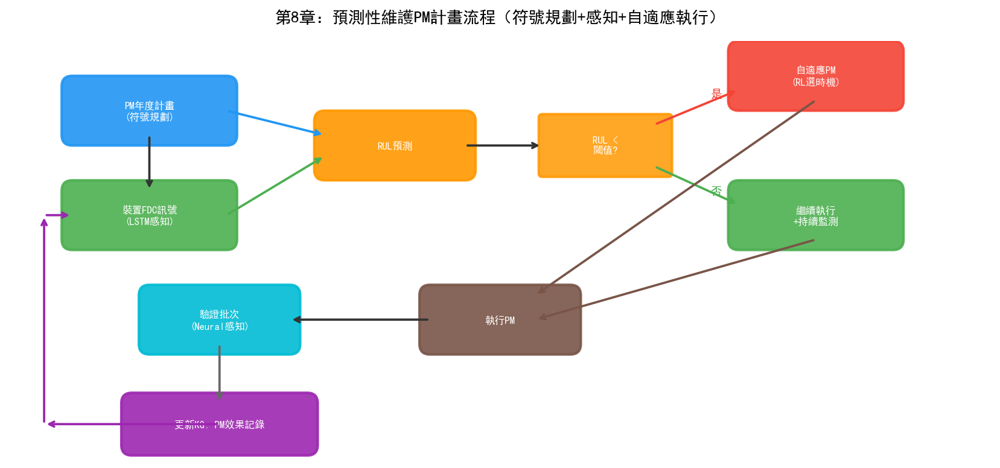
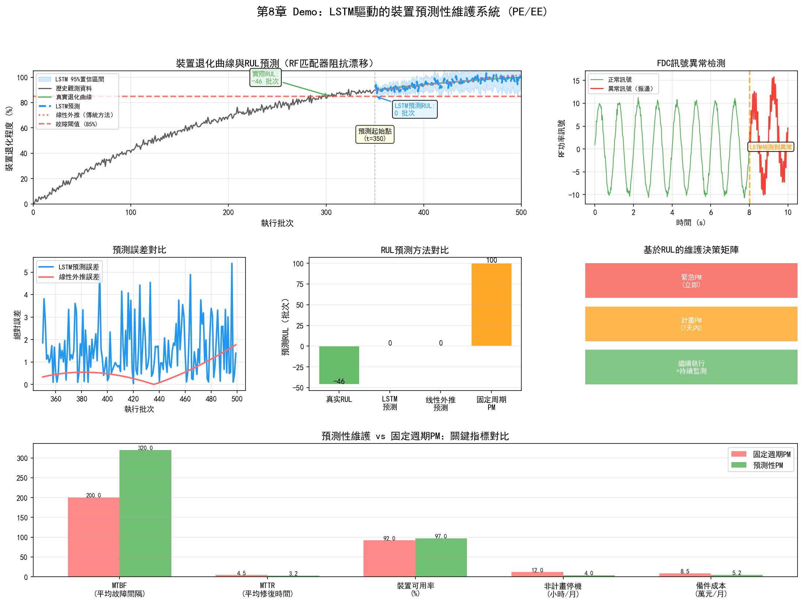

# 第8章 製程工程（PE）與設備工程（EE）

## 8.1 部門定位與職責

製程工程（Process Engineering, PE）和設備工程（Equipment Engineering, EE）是晶圓廠中"離設備最近"的兩個部門。如果說PID是設計師、YED是裁判、MFG是運行者，那麼PE和EE就是"調機臺的工匠"——他們的工作直接決定了每一臺設備在每一批次上加工出的物理結果。

### 製程工程（PE）

PE負責每個製程模組的參數開發與最佳化。一個製程模組（如蝕刻、微影、薄膜沉積）內部有數十個可調參數——RF功率、腔體壓力、氣體流量和比例、溫度、時間等。PE工程師的任務是找到這些參數的最優組合，使得製程結果（如蝕刻速率、蝕刻剖面角度、均勻性、選擇比）滿足規格要求。

PE的工作與PID的區別在於粒度：PID關注的是跨模組的整合和全流程一致性，PE關注的是單一模組內部的參數最佳化。PID問的是"這一層的蝕刻結果是否匹配下一層的沉積要求"，PE問的是"蝕刻機臺3號腔體的RF功率應該設多少瓦才能讓蝕刻速率達到目標值且均勻性在3%以內"。

### 設備工程（EE）

EE負責設備本身的健康度和可用性。如果說PE關心的是"設備產出什麼"，EE關心的是"設備狀態如何"。EE的職責包括：

- **設備監控：** 透過FDC系統即時監控設備感測器資料，判斷設備是否在正常狀態
- **預防性維護（PM）計畫：** 制定定期維護計畫——每運行N批次做一次腔體清洗、每M個月更換一次消耗件
- **故障診斷與修復：** 設備異常時快速定位故障部件並修復
- **機臺匹配（Tool Matching）：** 確保同類多臺設備加工出的結果一致——同一產品在不同設備上的結果差異在允差範圍內

## 8.2 核心業務流程

### Recipe 開發與驗證

Recipe（配方）是PE工程師最核心的工作產物。一個Recipe定義了設備運行的所有參數序列——如蝕刻的Recipe可能包含：預清洗步驟（30秒，50sccm Ar，10mTorr，100W RF）、主蝕刻步驟（60秒，100sccm SF6+20sccm O2，15mTorr，300W RF）、過蝕刻步驟（15秒，參數調整）。

Recipe開發是一個迭代過程：

1. **初始參數設定：** 基於經驗或相似製程的歷史資料設定初始參數
2. **試運行：** 用初始Recipe加工測試晶圓
3. **量測評估：** 測量加工結果（CD、剖面、均勻性等）
4. **參數調整：** 根據量測結果調整參數
5. **重複2-4直到滿足規格**

這個過程每輪迭代需要晶圓製造週期（數天到數週），且每輪迭代只能調整少量參數。一個新製程模組的Recipe開發可能需要數十輪迭代，耗時數月。

### 設備參數調優

即使Recipe確定後，設備參數在日常運行中也需要持續微調。原因有三個：

**設備老化：** 隨著使用次數增加，設備的部件效能會退化——腔體壁面的聚合物積累改變了蝕刻環境，電極的磨損改變了RF功率的耦合效率，泵的抽速隨使用時間下降。這些老化效應導致相同的Recipe在不同時間點產出的結果不同。

**批次間漂移：** 連續運行的設備在批次間存在參數漂移——前一批蝕刻在腔壁上沉積的聚合物會影響下一批的蝕刻速率。這種"記憶效應"使得設備的輸出與歷史運行狀態有關。

**消耗件更換影響：** 每次PM後更換消耗件（如電極、聚焦環、O型密封圈等），新部件與舊部件的微小差異會導致設備特性變化——同樣的Recipe在PM前後的輸出可能不同。

參數調優透過R2R（Run-to-Run）控制實現——根據前一批的量測結果調整下一批的Recipe參數，補償漂移和老化效應。

### 預防性維護（PM）計畫

PM是EE保障設備可用性的核心手段。傳統的PM採用固定週期：

- **批次週期：** 每運行N批次做一次腔體溼法清洗（Wet Clean）
- **時間週期：** 每M個月做一次大保養（PM），更換消耗件
- **條件觸發：** 當FDC資料或量測資料達到閾值時觸發臨時PM

固定週期PM的問題是"一刀切"——不管設備實際狀態如何，到了週期就維護。這導致兩種浪費：

- **維護過早：** 設備狀態還很好但週期到了，過早維護浪費產能和消耗件
- **維護過晚：** 設備已經出現退化跡象但週期未到，繼續運行導致製程結果偏差甚至報廢

預測性維護（Predictive Maintenance）透過分析設備的感測器資料趨勢，預測設備何時需要維護——在設備真正出問題之前提前安排PM，既避免過早維護的浪費，也避免過晚維護的風險。

### 機臺匹配（Tool Matching）

一座晶圓廠通常有多臺同類設備並行運行——如10臺蝕刻機、20臺微影機。理想的機臺匹配要求：同一產品在任意一臺同類設備上加工的結果差異在允差範圍內。

實現機臺匹配的挑戰在於：即使同型號設備，由於部件製造差異、安裝環境差異、使用歷史差異，每臺設備的"個性"不同。同一Recipe在不同設備上可能產出不同的結果——差異可能來自RF功率校準偏差、腔體幾何尺寸的微小差異、氣體分佈的不均勻性等。

傳統的機臺匹配方法是"基準-匹配"流程：

1. 選擇一臺"金標準"設備（Golden Tool），其輸出作為基準
2. 在其他設備上運行相同Recipe，比較輸出差異
3. 對存在差異的設備微調Recipe參數（如微調RF功率補償），使其輸出接近金標準

這個過程需要反覆迭代，且當設備狀態變化（PM後、老化後）時需要重新匹配。機臺匹配的品質直接影響晶圓良率——如果設備間差異過大，不同批次晶圓的製程結果波動增大，CP良率的方差上升。

## 8.3 關鍵技術與方法

### SPC（統計過程控制）

SPC是PE和EE最基礎的品質控制工具。SPC透過控制圖（Control Chart）監控製程參數是否處於統計受控狀態。

控制圖的基本原理：如果一個製程參數只受隨機變異（Common Cause Variation）影響，其值服從正態分佈，99.7%的值落在均值±3倍標準差（$\mu \pm 3\sigma$）範圍內。當參數值超出這個範圍（UCL/LCL），說明存在異常變異（Special Cause Variation）——不是隨機波動，而是有某個具體原因導致了偏差。

常用的控制圖包括：

| 控制圖 | 適用資料 | 特點 |
| --- | --- | --- |
| $\bar{X}$-R圖 | 連續型資料，分組 | 監控均值和極差 |
| I-MR圖 | 連續型資料，單值 | 監控個別值和移動極差 |
| p圖 | 離散型，不合格率 | 監控批次合格率 |
| CUSUM | 連續型 | 對小偏移敏感，累計偏差 |
| EWMA | 連續型 | 指數加權移動平均，對漂移敏感 |

SPC的侷限在於它是單變數方法——每個參數獨立監控，無法檢測多變數之間的聯合異常。例如，溫度和壓力各自在控制限內，但兩者的組合可能對應一種異常狀態。多變數SPC（如T2控制圖）和基於機器學習的異常偵測方法可以彌補這個侷限。

### FDC（故障檢測與分類）

FDC系統在第六章中已經從YED的視角介紹過，這裡從EE的視角補充。

對EE而言，FDC是設備健康監控的核心工具。FDC系統每秒採集設備的數百個感測器訊號，包括：

- 腔體溫度、壁面溫度、電極溫度
- 腔體壓力、各路氣體流量、氣體壓力
- RF功率、反射功率、阻抗匹配
- 真空泵抽速、節流閥位置
- 各階段的時間戳和狀態訊號

這些訊號形成了每批加工的"電子指紋"——如果這批的訊號模式與正常模式有偏差，FDC系統會報警並將異常分類為具體的故障型別。

FDC資料的特點是高維度（數百個訊號通道）、高頻（每秒數十到數百個取樣點）、長時段（單批加工可能持續數分鐘到數十分鐘）。這種高維時序資料的分析是深度學習（特別是LSTM和Transformer）的天然應用場景。

### R2R（Run-to-Run 控制）

R2R控制是PE在量產階段持續最佳化製程參數的核心機制。R2R的基本邏輯：

1. **量測：** 每批（或每隔N批）晶圓在關鍵工序後進行量測，獲取製程結果（如CD值）
2. **比較：** 將量測結果與目標值比較，計算偏差
3. **模型預測：** 用R2R控制模型（如EWMA控制器）根據歷史偏差趨勢預測下一批需要的參數調整量
4. **參數調整：** 將調整量應用到下一批的Recipe中

R2R控制器的數學基礎通常是EWMA（指數加權移動平均）模型：

$$\hat{y}_{t+1} = \alpha \cdot y_t + (1-\alpha) \cdot \hat{y}_t$$

其中 $\hat{y}_{t+1}$ 是下一批製程結果的預測值，$y_t$ 是當前批次的實測值，$\alpha$ 是平滑係數（0到1之間）。透過比較預測值與目標值的偏差，計算出需要的參數調整量。

EWMA控制器的侷限是它假設製程漂移是線性且緩慢的。實際的製程漂移可能是非線性的（如PM後的階躍變化）、多變數的（多個參數同時漂移且相互關聯）、甚至突變的（如某個部件突然失效）。基於深度學習的R2R控制器可以處理更復雜的非線性多變數漂移模式。

### 預測性維護

預測性維護是EE領域AI應用最成熟的方向之一。其核心是從"定期維護"轉向"按需維護"——根據設備的實際健康狀態決定何時維護。

預測性維護的技術路徑包括：

**基於閾值的方法：** 設定關鍵參數的預警閾值。當溫度振動等參數接近閾值時發出預警。簡單但無法預測剩餘使用壽命（RUL）。

**基於趨勢的方法：** 用時序模型（ARIMA、LSTM等）預測關鍵參數的未來趨勢，推算何時會超過閾值。可以預測RUL但假設參數變化可外推。

**基於健康度模型的方法：** 定義設備的"健康度"指標（綜合多個感測器訊號），用機器學習模型估計當前健康度和退化速率。Transformer等模型在處理長序列感測器資料方面表現出色。

**基於數字孿生的方法：** 構建設備的數字孿生模型，在虛擬空間中模擬設備的運行和老化過程。當數字孿生預測到設備即將出現效能退化時，提前安排維護。

## 8.4 面臨的挑戰

### 設備老化導致參數漂移

設備老化是PE和EE面臨的最持續的挑戰。老化的影響是多方面的：

- **蝕刻腔體壁面聚合物積累：** 改變蝕刻環境的化學特性，導致蝕刻速率和選擇比漂移
- **電極磨損：** 改變RF功率的耦合效率，導致等離子體密度變化
- **真空泵效能退化：** 抽速下降影響腔體壓力控制的精度
- **光學元件退化：** 微影機透鏡的透過率隨曝光量衰減，影響成像品質

每種老化效應的速率不同，且相互疊加——某個參數的漂移可能同時受到多種老化機制的影響。R2R控制器可以補償可預測的緩慢漂移，但對於突然的退化（如某個部件即將失效前的效能跳水），傳統方法往往來不及回應。

### 機臺間差異

同型號設備之間的差異來源於多個方面：

- **製造公差：** 即使同一型號，每臺設備的部件尺寸和材料特性都有微小差異
- **安裝環境：** 潔淨室的溫度、溼度、振動環境因位置而異
- **使用歷史：** 不同設備運行的批次數量、產品型別、維護歷史不同
- **消耗件批次差異：** 不同批次的消耗件（如電極、聚焦環）的材料特性可能存在批次間差異

機臺間差異使得"通用Recipe"在實際中不存在——每臺設備都需要自己的Recipe微調版本。隨著設備數量增加（一座先進晶圓廠有數百臺設備），Recipe維護的工作量線性成長。當設備狀態變化（PM後、老化後）時，Recipe需要重新匹配——這個過程可能需要數天。

### Recipe開發耗時

新製程的Recipe開發是NPI週期的主要瓶頸之一。一個複雜製程模組（如多層金屬蝕刻）的Recipe可能包含數十個步驟和上百個參數。傳統的Recipe開發方法是OFAT（每次只調一個參數）或簡單的DOE——需要大量實驗輪次，每輪需要晶圓製造週期。

在先進製程中，製程視窗極窄（如3nm的CD控制要求在1-2奈米），參數互動效應複雜（非線性、非單調），傳統實驗方法難以高效覆蓋參數空間。這是AI輔助實驗設計（如貝葉斯最佳化、強化學習）最有價值的應用場景之一——透過智慧取樣在更少的實驗次數中找到更優的參數組合。

## 8.5 實踐研究：AI在PE/EE中的真實落地案例

### 英特爾：IIoT預測性維護系統

英特爾在自己的晶圓廠中部署了基於IIoT感測器和邊緣AI的預測性維護系統，主要監控兩類設備：

**FFU（風機過濾單元）健康預測：** FFU是潔淨室的核心設備——保持晶圓廠內部空氣潔淨度。FFU故障會導致潔淨度下降，直接影響良率。英特爾在FFU上安裝振動感測器，透過Intel IoT Gateway將資料傳到分析應用。當振動資料出現異常模式時，系統在FFU實際故障前發出告警。

- FFU非計畫停機減少66%
- 相比人工巡檢，非計畫停機減少300%以上

**環氧鼓風機振動監控：** 環氧鼓風機是製程排氣系統的關鍵設備。英特爾在鼓風機上部署振動感測器，提前檢測到5起即將發生的鼓風機故障——避免了估計數百萬美元的損失。

英特爾的系統還具備Agentic AI能力——當檢測到異常時，系統可以自主排程維修、訂購備件、調整生產路徑。

### Applied Materials：AIx平台與GPU加速模擬

Applied Materials的AIx（Actionable Insight Accelerator）平台是設備級AI分析的代表性產品：

**AIx平台核心能力：**
- 即時製程可視性——跨晶圓和裸片測量數百萬資料點，最佳化數千個製程變數
- ChamberAI——感測器+ML演算法對製程變數進行即時分析，實現腔體級異常偵測
- AppliedPRO——數字製程地圖（Digital Process Map），支援虛擬實驗
- 載片量內聯量測——量測速度提升100倍，解析度提高50%

**GPU加速材料模擬：** Applied Materials與NVIDIA合作，用GPU加速材料科學模擬：
- Ginestra材料模擬：比CPU快10倍；在NVIDIA B200上，部分模擬從5天（64核CPU）縮短到2小時（單GPU），加速約55倍
- ACE+形貌模擬：GPU加速35倍

### ASML：生成式AI用於微影最佳化

ASML在2025-2026年推進了多項AI應用：

**OPC（光學鄰近校正）AI加速：** ASML使用AI加速OPC計算已超過十年。2025年與Mistral AI合作，用生成式AI提升OPC Recipe品質和求解速度。2026年1月在客戶處完成首次生成式AI驗證。

**EUV光源最佳化：** AI最佳化和校準EUV光源設定，減少人工試錯。早期測試在客戶EUV掃描器上實現了晶圓級功率提升。

**電子束檢測引導：** AI引導e束量測和檢測設備的影象品質最佳化和檢測路徑。

**診斷AI：** AI驅動的診斷系統在某些子系統的錯誤辨識上比人工快70%以上，且準確率匹配工程師水平。

**設計加速：** 超過12,000種設計透過AI輔助設計加速進行了探索。

### MST NeuroBox：AI驅動的R2R和腔體匹配

MST NeuroBox的AI R2R系統代表了從傳統EWMA控制器向AI控制器的進化：

**AI R2R控制：**
- 傳統EWMA控制器只能處理2-3個變數；AI R2R同時最佳化10-20個參數
- 在設備漂移和來料變異下，將製程參數維持在目標值±1%以內
- 基於虛擬量測（VM）預測自動更新Recipe——在批次間即時調整

**AI腔體匹配（Chamber Matching）：**
- 持續監控每臺腔體的溫度曲線、RF功率/阻抗、氣體流量、腔體壓力和終點訊號
- AI模型基於"良好匹配腔體"的歷史資料建立基準，即時檢測、量化和診斷匹配漂移
- 腔體間變異降低超過60%
- PM後 qualification 時間縮短70%
- 每年節省數千片測試晶圓

### 設備預測性維護的產業基準資料

根據產業部署的彙總資料，AI驅動的預測性維護在半導體設備上的典型效果：

| 指標 | 傳統（固定週期PM） | AI驅動PdM | 改善幅度 |
| --- | --- | --- | --- |
| 等離子蝕刻設備MTBF | 280-350小時 | 420-490小時 | +35-45% |
| 通用設備MTBF | 基準 | — | +25-40% |
| MTTR | 基準 | — | -50-65% |
| 設備OEE | 基準 | — | +8-15% |
| 故障預警時間 | 事後發現 | 故障前24-72小時 | 質變 |

NVIDIA的iFactory AI平台展示了GPU加速的預測性維護：LSTM和Transformer模型透過TensorRT最佳化，推理速度為CPU的5倍；從原始感測器輸入到分類告警的延遲低於15毫秒。

### KLA：AI驅動的缺陷檢測與製程控制

KLA的軟體解決方案套件將AI應用於檢測和製程控制的全鏈條：

- **Klarity Defect**：即時偏移辨識，自動缺陷簽名檢測和分類
- **Klarity SSA（空間簽名分析）**：自動檢測和分類指示製程問題的缺陷簽名
- **aiSIGHT**：基於SEM影象的AI驅動缺陷和圖形測量——辨識晶圓正面、背面和邊緣的顆粒和圖形缺陷
- **Klarity ACE XP**：跨晶圓廠級良率學習捕獲、保留和共享系統

KLA的Gen5產品線針對檢測複雜度的成長——先進製程的關鍵檢測層數增加了50%——透過AI模型增強檢測能力。

### 產業工具生態總覽

| 廠商 | AI產品 | 核心能力 | 量化結果 |
| --- | --- | --- | --- |
| 英特爾 | IIoT + 邊緣AI | FFU/鼓風機PdM | 停機-66%、5起故障預防 |
| Applied Materials | AIx / Ginestra | 即時製程分析、材料模擬 | 模擬10-55倍加速 |
| ASML | 生成式AI OPC | 微影最佳化、診斷 | 診斷+70%、12,000+設計探索 |
| MST NeuroBox | AI R2R / 腔體匹配 | 多變數R2R、匹配監控 | 變異-60%、qualification-70% |
| KLA | Klarity套件 | 缺陷檢測與分類 | 覆蓋Gen5 +50%檢測層 |
| NVIDIA/iFactory | GPU加速PdM | LSTM/Transformer推理 | 延遲<15ms、5倍推理加速 |

---

到本章為止，我們已經完成了對晶圓廠三大核心部門的業務概述和實踐案例。PID/YED關注製程整合和良率，MFG關注生產排程和產能，PE/EE關注設備參數和維護。這三個部門面臨的技術挑戰——跨步驟因果推理、NP-Hard排程、高維參數最佳化、設備健康預測——正是AI技術可以發揮價值的場景。上述案例表明，從英特爾的IIoT到ASML的生成式AI微影最佳化，從Applied Materials的GPU加速模擬到MST的AI R2R控制，設備級AI已經在量產中產生可量化的ROI。接下來的第四部分將逐一展開三大流派在這些場景中的具體應用。

## 8.6 Demo視覺化：LSTM驅動的設備預測性維護系統

*Demo說明：上圖展示了設備退化曲線與LSTM的RUL預測、FDC訊號異常偵測、預測誤差對比、維護決策矩陣和PM效果對比。模擬指令碼見 `demos/demo_ch8_predictive_maintenance.py`。*
