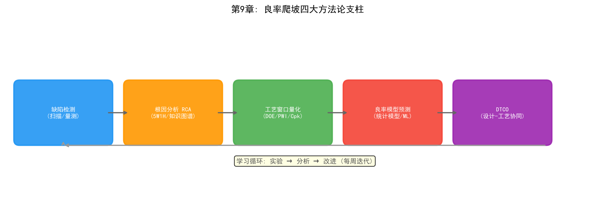

# 第9章 良率爬坡——半導體製造的「死亡之谷」

## 9.1 問題背景：良率爬坡為何如此艱難

在半導體產業的競爭格局中，良率（Yield）是決定晶片製造成本和盈利能力的最核心因素。一個先進製程節點從研發成功（元件功能驗證通過）到大規模量產（良率達到商業化可接受水準），通常需要經歷一個被稱為「良率爬坡」（Yield Ramp）的艱難過程。這個階段往往持續12-24個月，期間的良率曲線呈現經典的S形增長特徵——初期緩慢爬升，中期加速提升，後期趨於飽和。對於3nm及以下節點，良率爬坡的難度和週期均顯著增加，甚至成為決定製程節點能否商業化的關鍵瓶頸。


*圖9-1：典型先進製程良率爬坡曲線，呈現S形增長，12-18個月達到量產目標（85%）*

良率爬坡的挑戰源於多個維度：

**製程步驟數量激增。** 先進製程涉及的製程步驟數量從28nm的約300步增長到3nm的超過1500步，每一步的缺陷和偏差都會影響最終良率。綜合良率是各層良率的乘積——即便單步良率高達99.9%，經過1500步後，理論綜合良率也只有22%。這意味著良率爬坡實際上是「每一層都要做對」的極限工程。

**元件結構引入全新製程模組。** 從FinFET到GAA FET再到CFET，新的元件結構引入了全新的製程模組和製程窗口。每一次元件結構變革，都意味著此前積累的製程經驗和良率數據部分失效，良率爬坡不得不從較低起點重新開始。

**學習速率受經濟約束。** 良率學習速度（Learning Rate）受限於實驗晶圓的數量和量測資源——每片12吋晶圓的成本已超過4000美元，大幅實驗的成本極高。爬坡團隊必須在「多做實驗加速學習」和「控制成本」之間做出權衡，這正是良率爬坡被稱為「死亡之谷」的原因：投入巨大、產出不確定，許多新製程節點正是在這個階段被判定為「無法商業化」而終止。

因此，建立系統化的良率提升方法論，包括缺陷根因分析、製程窗口最佳化、良率模型預測和設計-製程協同最佳化（DTCO），成為每家晶片製造企業的核心競爭力。本章系統介紹良率爬坡的方法論框架，以及AI技術在其中扮演的角色。



*圖9-2：良率爬坡四大方法論支柱與學習循環*

## 9.2 缺陷根因分析（RCA）——爬坡的起點

缺陷根因分析（Root Cause Analysis, RCA）是良率爬坡的起點和核心。良率爬坡的第一性原理是：**任何良率損失都可以追溯到某個具體的缺陷來源，而消除缺陷來源的前提是找到它**。

### 檢測與分析的工具鏈

現代晶圓廠構建了一條從「掃描發現」到「物理確認」的完整分析鏈條：

- **KLA缺陷掃描 + SEM複查（ADC自動缺陷分類）**：光學掃描設備以高速全晶圓掃描發現缺陷，SEM（掃描式電子顯微鏡）對可疑缺陷進行高解析度複查，自動缺陷分類（ADC）系統利用影像辨識將缺陷歸類為顆粒、刮痕、圖案缺陷等類型
- **EDX成分分析**：能量色散X射線能譜分析，確定缺陷的化學成分——是金屬污染、有機物還是異物顆粒，成分資訊直接指向污染來源（如某個腔體材料、某種化學品）
- **TEM剖面分析**：穿透式電子顯微鏡對缺陷位置做奈米級剖面觀察，確認缺陷對元件結構的影響深度——是否穿透了閘極氧化層、是否破壞了互連層
- **電性失效分析（EFA）**：透過WAT、CP等電性測試數據定位失效的物理位置，將「良率數字下降」轉化為「哪顆元件、哪個參數、哪個位置失效」

### 5W1H 根因分析原則

根因分析遵循「5W1H」原則：

| 維度 | 問題 | 目的 |
| --- | --- | --- |
| What | 缺陷類型是什麼？ | 建立缺陷畫像（顆粒/刮痕/圖案缺陷/電性失效） |
| Where | 哪個製程步驟/位置？ | 透過晶圓圖空間分佈定位製程階段 |
| When | 何時首次出現？ | 確定缺陷的時間窗口與機台/批次關聯 |
| Why | 根本原因是什麼？ | 從機理上解釋缺陷成因 |
| How | 如何消除？ | 制定製程/設備/環境的矯正措施 |

### 系統性缺陷 vs 隨機缺陷

在先進製程中，約70%的良率損失由系統性缺陷（Systematic Defect）引起，僅30%是隨機缺陷（Random Defect）。這一代比例決定了良率爬坡的策略重心：**系統性缺陷是可以被識別、修正和消除的**，它們是爬坡早期的主要攻關對象；隨機缺陷則更多依賴製程能力和環境控制來降低密度。

系統性缺陷的根因通常與製程參數偏移有關：

- **微影焦點偏移**：焦距偏離最佳值導致圖案變形，產生橋接或斷線缺陷，往往表現為晶圓圖上的環形分佈
- **蝕刻負載效應（Loading Effect）**：圖案密度差異導致蝕刻速率不均，密集區域過度蝕刻、稀疏區域蝕刻不足，產生關鍵尺寸（CD）偏差
- **CMP碟形凹陷（Dishing）**：化學機械拋光在寬金屬區域過度研磨，形成凹陷，導致後續層金屬填充不良

### AI 增強：RCA 的知識圖譜化

傳統RCA依賴資深工程師的個人經驗，知識獲取和傳承效率低。AI的介入讓RCA從「個人經驗驅動」走向「知識圖譜驅動」：將缺陷類型、製程步驟、設備腔體、量測參數之間的關係建模為知識圖譜，系統能夠基於「缺陷特徵→可能根因→建議檢查項」的推理路徑給出候選根因排序，工程師只需在候選清單中確認。這一方向將在第11章（符號主義在晶圓廠的應用）中詳細展開。

## 9.3 製程窗口量化——把「碰運氣」變成「工程」

找到缺陷根因之後，下一步是系統性地擴大製程對參數偏移的容忍度。製程窗口（Process Window）是指使元件性能滿足規格要求的製程參數範圍。製程窗口越寬，量產中的良率波動越小；製程窗口越窄，參數稍有偏移就會產生缺陷。

### DOE 與製程窗口邊界

量化製程窗口的常用方法是使用DOE（實驗設計）手段畫出製程窗口邊界（Process Window Boundary）。DOE透過系統性地改變製程參數（如溫度、壓力、氣體流量、功率），量測元件性能隨參數的變化，勾畫出「合格區域」的邊界。

工作量考核指標為製程窗口指數PWI（Process Window Index）：

```
PWI = 實際製程參數偏移量 / 允許的製程窗口寬度

PWI > 1: 參數落在窗口之外，製程不可接受
PWI < 1: 參數在窗口內，值越小，製程對偏移的容忍度越高
```

業界通常要求關鍵製程步驟的PWI遠小於1，為量產中的參數漂移留出餘量。

### 微影 FEM 與蝕刻三維 DOE

不同製程模組的窗口量化方法不同：

- **微影製程**：透過聚焦-曝光矩陣（FEM, Focus-Exposure Matrix）實現。在晶圓上以網格形式系統變化聚焦和曝光劑量，量測各網格點的CD和圖案保真度，繪製「焦點-劑量窗口」（通常呈橢圓形）。FEM窗口的大小直接決定了微影機焦距和劑量控制的容差範圍
- **蝕刻製程**：透過CF₄/O₂氣體比例-偏壓功率-壓力三維DOE實現。三個維度交叉組合實驗，量測蝕刻速率、CD偏差、側壁角度和缺陷率，在三維參數空間中勾畫製程窗口

### 製程能力指數 Cpk

製程窗口量化的最終輸出是製程能力指數。通常要求製程窗口的Cpk≥1.67（對應5σ品質水準）——這意味著製程參數的平均值與規格邊界之間有充足的餘量，即使參數發生漂移，落在規格外的機率也極低。

### AI 增強：虛擬量測與貝氏最佳化

DOE實驗的成本極高（每片實驗晶圓超過4000美元），AI提供了兩個加速方向：

- **虛擬量測（Virtual Metrology, VM）**：利用FDC設備感測數據（溫度、壓力、RF功率等）訓練模型預測量測結果，減少實際量測次數——「每片晶圓都有量測數據」而無需真正量測每片
- **貝氏最佳化**：用高斯過程等代理模型擬合製程窗口邊界，在少量實驗後智慧推薦下一組實驗參數，將找到窗口邊界所需的實驗次數降低一個數量級

## 9.4 良率模型與預測——從缺陷到良率的數學

良率模型將缺陷密度對映到最終晶片良率，是良率爬坡的「儀表板」——沒有模型，團隊只能憑感覺判斷爬坡進度。

### 經典統計模型

最經典的模型是Murphy模型和Poisson模型：

**Poisson模型**假設缺陷在晶圓上隨機分佈，良率與缺陷密度和晶片面積的關係為：

```
Y = exp(-D₀·A)

其中 D₀ 是缺陷密度（缺陷數/單位面積）
     A  是晶片面積（die面積）
```

Poisson模型的含義直白而殘酷：晶片面積翻倍，同樣缺陷密度下的良率按指數下降——這正是「大晶片難做」的數學根源。

**Murphy模型**考慮了缺陷密度的不均勻性，對Poisson模型進行修正，適用於缺陷密度在晶圓間存在波動的情況。

**負二項式模型（Negative Binomial）**：實際缺陷分佈往往是聚集的（Clustered）——缺陷成群出現在晶圓的特定區域（邊緣、中心或某個腔體的對應位置）。負二項式模型透過聚類參數更準確地描述聚集缺陷場景，是先進製程良率建模的常用選擇。

### Critical Area 與電性數據修正

對於複雜產品，晶片良率還受到電路密度和關鍵面積（Critical Area）的影響——並非晶片上所有區域都對缺陷同樣敏感，只有落在關鍵區域（如金屬線間距最小處）的缺陷才會導致失效。關鍵面積越小，晶片對缺陷的容忍度越高。

現代良率分析透過VSB（電壓對比測試）和MCM（記憶體單元測試）數據進行修正：VSB利用電子束檢測發現電壓對比異常（如開路、短路）的缺陷，MCM利用記憶體陣列的規則結構統計缺陷對單元的影響，兩者為良率模型提供更精確的缺陷-失效對映。

### ML 良率預測：從統計模型到數據驅動

經典統計模型假設缺陷分佈服從特定數學形式，但真實產線的缺陷行為遠比模型複雜。現代良率分析平台（如yieldHub系統）利用機器學習預測良率熱點，將製程參數、FDC訊號、缺陷數據、量測數據等多源數據作為特徵，直接學習「數據→良率」的對映，準確率可達85%以上。這類數據驅動方法不依賴對缺陷物理機制的完整理解，在良率爬坡的早期（物理模型尚未建立時）尤其有價值。深度學習良率預測的詳細討論見第12章。

## 9.5 設計-製程協同最佳化（DTCO）

良率爬坡不只是「製造端的問題」——設計規則與製程能力之間的協同程度，在晶圓投產之前就已決定了良率的天花板。設計-製程協同最佳化（Design-Technology Co-Optimization, DTCO）正是為了打破「設計與製造各自為政」的壁壘。

### 設計規則與製程窗口的協同

設計規則（Design Rule）定義了電路佈局必須滿足的幾何約束（線寬、間距、面積）。製程窗口越窄，設計規則就越保守（更大的間距、更寬的線寬），晶片面積越大、成本越高。DTCO的核心目標是在製程窗口與設計密度之間找到最優平衡點——透過製程改進擴大窗口，或用設計技巧繞開製程的薄弱區域。

### 關鍵面積最小化

DTCO的一個具體抓手是降低晶片的關鍵面積：透過佈局最佳化（如金屬走線均勻化、冗餘通孔、關鍵層局部加寬）使缺陷更不容易落在敏感區域，從而在不改變製程的情況下提升良率。數據表明，關鍵面積最佳化可以在缺陷密度不變的情況下將良率提升數個百分點。

### DTCO 的 AI 化

傳統DTCO依賴設計工程師與製程工程師的反覆溝通和手工疊代，週期以月計。AI正在改變這一過程：機器學習模型可以快速評估佈局改動的良率影響（關鍵面積分析加速）、推薦最敏感區域的修正方案，甚至自動生成滿足製程窗口約束的佈局方案。這一方向與第19章（LLM在晶圓廠的應用）中的設計輔助場景相互呼應。

## 9.6 良率學習曲線管理——爬坡的節奏控制

方法論提供了工具，而爬坡能否按期完成，取決於團隊能否有效地管理學習節奏。

### 良率學習率

良率學習率（Yield Learning Rate）定義為「良率隨累計實驗晶圓數量提升的速率」。在雙對數座標系下，良率爬坡曲線近似為一條直線，其斜率就是學習率。學習率越高，達到目標良率所需的實驗晶圓越少，爬坡成本越低。

爬坡團隊每週設定良率提升目標（如「本週提升2個百分點」），透過「實驗→分析→改進」的循環推進。學習率低於預期時，通常意味著RCA沒有找到真正的根因，或實驗設計沒有涵蓋關鍵變數。

### 帕累托分析與優先級

良率損失往往由少數幾個大缺陷源主導。爬坡團隊用帕累托分析（缺陷類型/根因的良率損失貢獻排序）確定攻關優先級：**先解決貢獻最大的缺陷源，而不是數量最多的缺陷源**。一個貢獻30%良率損失的系統性缺陷源，其價值遠高於十個合計貢獻5%的隨機缺陷。

### 分階段策略

- **爬坡初期（良率 30%-60%）**：聚焦「殺大象」——解決導致良率斷崖式下跌的大缺陷源（如微影層偏移、重大製程窗口錯位）。此階段缺陷數量少但單點貢獻大
- **爬坡中期（良率 60%-85%）**：聚焦系統性缺陷——透過製程窗口量化、DOE最佳化和關鍵面積改進，系統性地收窄良率損失
- **爬坡後期（良率 85%以上）**：聚焦隨機缺陷與邊緣效應——降低缺陷密度、改善製程均勻性、處理晶圓邊緣區域，此階段每提升1%良率都需要極精細的工作

## 9.7 AI 在良率爬坡中的角色

良率爬坡是晶圓廠中AI價值密度最高的業務場景之一，三大流派在這裡各有用武之地：

| AI流派 | 在良率爬坡中的角色 | 典型應用 |
| --- | --- | --- |
| 符號主義 | 知識表示與推理 | RCA知識圖譜、專家規則庫、缺陷-根因關聯推理（見第11章） |
| 連接主義 | 感知與預測 | ADC缺陷分類、良率預測、虛擬量測、晶圓圖模式識別（見第12章） |
| 行為主義 | 序貫決策與最佳化 | DOE自適應實驗設計、良率提升策略的RL最佳化（見第13章） |

三大流派的融合在良率爬坡中尤其明顯：連接主義模型從數據中感知缺陷，符號主義系統基於領域知識推理根因，行為主義演算法決定下一步做哪個實驗。第15章（NB融合）、第16章（NA融合）和第18章（NSA全融合）將展示這種融合如何構成完整的良率智慧閉環。

## 9.8 實踐案例

良率爬坡方法論已經在頭部晶圓廠和AI公司中得到規模化驗證：

- **虛擬量測驅動的良率監控**：SK海力士與Gauss Labs合作的Panoptes系統在產線上部署虛擬量測，實現「每片晶圓都有量測數據」，將量測週期縮短80%以上，顯著加速了良率學習循環（詳見第12章）
- **RCA知識圖譜**：yieldWerx和IKAS等公司將知識圖譜應用於缺陷根因分析，將工程師的經驗固化為可檢索、可推理的結構化知識，把RCA週期從數天縮短到數小時（詳見第11章）
- **AI缺陷檢測與分類**：KLA等設備廠商將深度學習引入缺陷檢測與ADC，檢測靈敏度與分類準確率大幅提升，為RCA提供了更高品質的缺陷數據（詳見第12章）
- **虛擬量測+良率模型的工程實踐**：多家晶圓廠將ML良率預測嵌入日常良率會議，作為爬坡進度的即時儀表板，輔助管理層決策

## 9.9 本章小結

良率爬坡是半導體製造中「投入最大、不確定性最高」的階段，也是決定製程節點商業成敗的關鍵戰役。本章介紹了良率爬坡的四大方法論支柱：缺陷根因分析（RCA）解決「缺陷從哪裡來」，製程窗口量化解決「怎麼讓製程更穩」，良率模型與預測解決「爬坡進度怎麼衡量」，DTCO解決「設計端如何配合」。在此基礎上，AI技術正在從三個方向重塑良率爬坡的效率：讓RCA從個人經驗走向知識圖譜、讓DOE從大量實驗走向智慧最佳化、讓良率預測從統計假設走向數據驅動。對晶圓廠而言，良率爬坡方法論的成熟度與AI的滲透程度，正在成為衡量其製程競爭力的新標尺。
