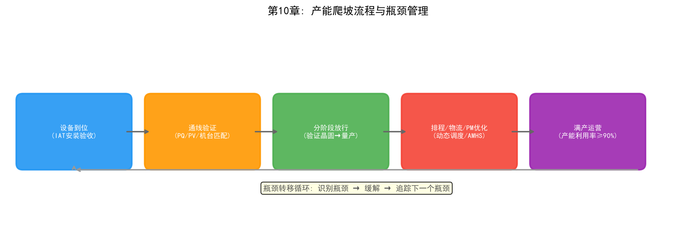

# 第10章 產能爬坡與產能規劃——從「做得對」到「做得多」

## 10.1 問題背景：產能爬坡是什麼

上一章討論了良率爬坡——解決「如何把晶片做得對」。本章討論另一個同樣關鍵的爬坡：產能爬坡（Capacity Ramp），解決「如何把晶片做得多」。一座先進製程晶圓廠造價超過150億美元，產能利用率每下降1%，意味著每年數千萬美元的折舊和固定成本被浪費。產能爬坡的目標，是在新產線投產後盡快將產出（Wafer Out）提升到設計產能，並維持穩定。

### 產能爬坡 vs 良率爬坡

兩者看似獨立，實則深度耦合：

| 維度 | 良率爬坡 | 產能爬坡 |
| --- | --- | --- |
| 核心指標 | 良率（%）：合格晶片比例 | 產出（片/月）、產能利用率 |
| 回答的問題 | 如何做得對？ | 如何做得多？ |
| 主要約束 | 缺陷、製程窗口、學習速率 | 設備、物流、瓶頸、循環時間 |
| 相互影響 | 良率低會浪費產能（產出大量不合格晶圓） | 產能爬坡過快會稀釋實驗資源、拖慢良率學習 |

在爬坡初期，良率爬坡與產能爬坡之間存在張力：大量實驗晶圓消耗產能，但牠們是良率學習所必需的。優秀的爬坡策略需要平衡兩者——在良率尚未穩定時控制產能擴張速度，在良率逼近目標時加速產能釋放。

### 產能的三個層面

- **設備產能（Tool Capacity）**：機台的額定產能，受設備可用率、製程時間、維護週期影響
- **產能利用率（Utilization）**：實際產出佔額定產能的比例，是設備層面的效率指標
- **產出（Wafer Out）**：工廠整體輸出，是產能的最終結果，受瓶頸設備、物流和排程制約

三者之間透過OEE（設備綜合效率）等指標銜接——OEE = 可用率 × 性能 × 良品率，是產能管理的核心儀表板。

*圖10-1：產能爬坡流程與瓶頸管理循環*

## 10.2 產能規劃的層次

產能爬坡不是「買更多設備」那麼簡單，而是一個從戰略到執行的多層次規劃問題。

### 戰略產能規劃與 CAPEX

戰略產能規劃回答「未來幾年建多少產能」的問題。晶圓廠的建設週期長達2-3年，產能決策必須提前做出。產能規劃模型通常考慮：市場需求預測、製程節點轉換時間、設備交期（先進微影機的交期以年計）、折舊與資金成本。3nm節點的一座新廠需要部署15台以上EUV微影機，每台售價超過1.5億美元——產能決策的容錯空間極小。

### 瓶頸分析與 TOC

限制理論（Theory of Constraints, TOC）指出：任何系統的產能都由其瓶頸環節決定。晶圓廠中，瓶頸通常是某類稀缺設備（如EUV微影、高精度量測）或某一層製程（如特定蝕刻步驟）。瓶頸設備的產能利用率為100%時，工廠產出達到上限；瓶頸轉移（瓶頸從一台設備轉移到另一台）是產能爬坡中的常見現象，需要持續監控。

### 產能平衡與瓶頸轉移

產能爬坡的本質是一個「瓶頸轉移」的過程：當瓶頸設備得到緩解（增加設備、最佳化製程時間），產能瓶頸會轉移到下一個環節。產能規劃必須動態追蹤瓶頸位置，防止「過度投資已不是瓶頸的環節」。

## 10.3 機台通線與產能釋放

新產線的產能釋放不是「設備到位即產出」，每台新設備都要經過嚴格的通線（Qualification）流程才能正式投產。

### 新設備驗收與 Qualification

設備安裝後需完成：安裝驗收（IAT）、製程驗收（PQ）和量產驗證（PV）。在PV階段，設備需要跑出與既有設備一致的製程結果——包括CD、膜厚、缺陷率等參數的一致性和穩定性。一台EUV微影機的通線週期可能長達數月，通線進度直接決定產能爬坡的節奏。

### 機台匹配（Tool Matching）

多台機台並行生產時，機台間的參數差異（機台漂移、部件老化差異）會導致產出品質不均。機台匹配（Tool Matching）透過統計方法量化機台差異，並調整各機台的Recipe參數使輸出一致。機台匹配度差時，同一批產品在不同機台上的良率差異可達數個百分點——在產能爬坡階段，新機台的大量加入使匹配問題更加突出。

### 爬坡階段的設備放行策略

產能爬坡階段，團隊面臨「放行更多設備加速爬坡」與「設備未經充分驗證影響品質」之間的權衡。成熟的策略是分階段放行：先以驗證晶圓（Qualification Wafers）跑通設備並匹配基準機台，再逐步增加量產晶圓比例，同時用SPC和FDC持續監控新機台的穩定性。

## 10.4 產能爬坡的最佳化方法

### 排程與派工最佳化

在產能爬坡期，WIP（在製品）分佈快速變化，傳統靜態排程規則（如FIFO、到期日優先）難以應對。動態排程策略根據當前設備狀態、WIP分佈和交期壓力即時調整派工決策——「這批晶圓派到哪台設備、先做哪個批次」。最佳化目標包括縮短循環時間（Cycle Time）、提高瓶頸設備利用率、平衡各機台負載。排程與派工的詳細討論見第7章。

### AMHS 物流與自動化

晶圓廠中的晶圓由天車系統（AMHS）自動搬運。在產能爬坡期，物流瓶頸（天車壅塞、軌道調度）可能成為隱藏的產能瓶頸——設備空閒等待搬運與搬運壅塞並存。AMHS的健康管理和智慧調度直接影響產線實際產出。

### 虛擬量測與免檢

量測設備是昂貴的產能消耗者：每片晶圓的關鍵步驟量測都會佔用量測機台產能。虛擬量測（Virtual Metrology, VM）用設備感測數據預測量測結果，對製程穩定的機台批次實施「免檢」或「抽檢」，釋放量測產能——在量測設備成為瓶頸的爬坡階段，這一手段效果顯著。

### PM 最佳化

預防性維護（PM）佔用設備時間：PM過於頻繁浪費產能，PM不足則增加設備故障風險。預測性維護根據設備狀態數據動態安排PM時機，在設備故障風險和產能損失之間取得平衡。預測性維護的詳細技術見第8章。

## 10.5 AI 在產能爬坡中的應用

產能爬坡的每一個環節都有AI的用武之地：

| 環節 | AI 應用 | 目標 |
| --- | --- | --- |
| 設備維護 | 預測性維護（故障預測、剩餘壽命RUL估計） | 減少非計畫停機，提高設備可用率 |
| 排程派工 | 強化學習動態調度（DQN/MARL） | 縮短循環時間、提高瓶頸利用率（見第13章） |
| 量測產能 | 虛擬量測、免檢決策 | 釋放量測設備產能 |
| 瓶頸管理 | 產能預測模型、WIP流動預測 | 提前識別瓶頸轉移，指導產能投資 |
| 整廠模擬 | 數位孿生（產線模擬） | 產能決策前先在虛擬工廠中驗證 |

### 從「經驗調度」到「數據驅動的產能管理」

傳統產能管理依賴資深生產工程師的經驗判斷——「瓶頸在哪裡、什麼時候會轉移、該放行多少設備」。AI正在將這一過程數據化：產能預測模型基於歷史產出和設備狀態預測未來數週的產出曲線；WIP流動預測模型提前識別即將形成的瓶頸；強化學習調度器在模擬環境中訓練後部署到產線，實現動態最佳化。這些技術共同構成了「數位化產能管理」的閉環——產能爬坡的決策從拍腦袋走向數據驅動。

## 10.6 實踐案例

- **AMHS健康管理**：格羅方德（GlobalFoundries）部署AI驅動的AMHS健康管理，透過分析天車系統的運行數據提前發現異常，減少物流壅塞對產出的影響
- **智慧調度驗證**：AISSI專案在真實工業數據集上驗證了深度強化學習調度（DQN、MARL）的效果——在模擬與產線驗證中實現了約9%的產出提升，證實了RL調度從研究走向產線的可行性（詳見第13章）
- **產能規劃數位化**：多家頭部晶圓廠用數位孿生平台（如NVIDIA Omniverse）對產線進行全流程模擬，在虛擬環境中驗證產能擴張方案後再在現實中執行，顯著降低了產能決策的風險（詳見第18章）
- **虛擬量測釋放產能**：SK海力士的Panoptes虛擬量測系統在縮短量測週期的同時，釋放了量測設備產能，間接支撐了產線產出提升（詳見第12章）

## 10.7 本章小結

產能爬坡與良率爬坡是晶圓廠爬坡階段的兩條主線：良率解決「做得對」，產能解決「做得多」，兩者互為約束、共同決定新產線的投資報酬。產能爬坡的本質是系統性的瓶頸管理——從設備通線、機台匹配到排程派工、物流最佳化，每個環節都可能成為產能的隱藏瓶頸。AI在產能爬坡中的應用，核心是將「經驗驅動的產能管理」升級為「數據驅動的產能管理」：預測性維護守住設備可用率、強化學習最佳化排程派工、虛擬量測釋放量測產能、數位孿生降低決策風險。對晶圓廠而言，產能爬坡的速度，正在從「設備的堆砌」轉向「智慧化的營運能力」。

> **本章配套實驗**：第27章 27.7 節的產能規劃 PTA Agent（`demos/experiments/FabCapacityAgent`）是本章方法論的可執行版本——OEE 即時監控、基於排隊論的瓶頸定位、蒙地卡羅 What-If 模擬一應俱全，建議在「先找瓶頸、再定投資」一節之後動手體驗。
