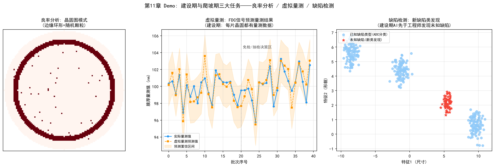

# 第11章 建設期與爬坡期——從「建廠」到「產能爬坡」

## 11.1 階段定位：建設期的業務特徵與核心矛盾

一座晶圓廠的生命週期可以劃分為三個階段：建設期與爬坡期、成熟量產期、代工服務轉型期。三個階段面臨截然不同的業務問題和任務組合，對AI的需求也各不相同：

| 階段 | 時間跨度（示意） | 核心業務問題 | 關鍵任務 |
| --- | --- | --- | --- |
| 建設期/爬坡期 | 建廠到良率/產能達標（1-3年） | 良率低、產出低、不確定性高 | 良率分析、虛擬量測、缺陷檢測 |
| 成熟量產期 | 穩定量產階段（數年） | 成本、效率、品質一致性 | 智慧排程、預測性維護、能源管理 |
| 代工服務轉型期 | 從製造到服務 | 多客戶協同、信任、交付承諾 | NPI協同、資料安全、供應鏈透明化 |

建設期與爬坡期的業務特徵可以概括為「三高」：**高投入**（一座先進製程晶圓廠造價超過150億美元）、**高不確定性**（良率曲線尚未爬升、設備尚未穩定）、**高時間壓力**（上市時間每延遲一個月都意味著巨額利潤損失）。這個階段的業務主線就是第9章和第10章討論的兩條爬坡——良率爬坡解決「做得對」，產能爬坡解決「做得多」。

本章從**業務階段**的視角，聚焦建設期中三個最核心的任務：良率分析、虛擬量測、缺陷檢測。它們共同回答了建設期最根本的問題：「新產線到底能不能穩定地、大規模地做出合格的晶片？」——以及AI如何加速這一過程。

*圖11-1：建設期業務主線——設備通線 → 良率分析 → 缺陷檢測 → 虛擬量測 → 爬坡循環*

## 11.2 任務一：良率分析（Yield Analysis）

### 建設期的良率問題

建設期的良率分析與成熟期有本質不同。成熟期的良率問題是在穩定產線上找「異常波動」，而建設期的問題是**良率本身很低（可能只有30%-60%）、波動劇烈、且根因不明**——你不知道是什麼在拖累良率，甚至不知道良率損失來自哪個製程模組。

具體挑戰：

- **樣本極少**：實驗晶圓數量有限（每片12吋晶圓成本超過4000美元），統計數據不足，傳統SPC管制圖無法發揮正常效力
- **物理機制未定型**：製程窗口尚未固化，元件性能與製程參數的關係還在摸索中
- **根因耦合**：多個缺陷源同時存在，且相互影響，難以分離

### 良率分析的任務分解

建設期的良率分析包含四個遞進的任務：

1. **晶圓圖分析（Wafer Map Analysis）**：從CP測試結果的空間分佈（邊緣缺陷、中心缺陷、簇狀缺陷、環形缺陷）快速推斷缺陷來源——邊緣環形缺陷通常指向微影或邊緣清洗問題，中心缺陷可能指向製程均勻性問題
2. **缺陷帕累托（Defect Pareto）**：對缺陷分類並按其良率損失貢獻排序，聚焦貢獻最大的缺陷源
3. **根因分析（RCA）**：沿「缺陷特徵→製程步驟→設備腔體」鏈路定位根因，方法論詳見第9章
4. **良率模型校正**：用有限的實驗數據校正Poisson/負二項式等良率模型，為爬坡進度提供量化儀表板

### AI 在建設期良率分析中的角色

建設期的數據稀缺恰恰是AI應用的難點：深度學習模型是「數據飢渴」的，而建設期沒有數據。實用的應對策略：

- **遷移學習**：從成熟節點/相似機台遷移預訓練模型，用少量新數據微調（例如晶圓圖缺陷分類模型）
- **物理+數據混合建模**：以良率模型的物理公式為骨架，用數據擬合參數，彌補純數據模型在樣本不足時的過擬合
- **知識圖譜輔助RCA**：將新製程的缺陷-根因關聯先以專家知識圖譜形式建立（詳見第14章符號主義），再逐步用數據修正

## 11.3 任務二：虛擬量測（Virtual Metrology）

### 為什麼建設期需要虛擬量測

建設期的量測資源極度緊張：量測設備數量有限（新廠尚未配齊）、每片實驗晶圓的關鍵步驟都要量測、量測週期長。而良率爬坡又恰恰需要「盡可能多的量測數據」來加速學習——虛擬量測（Virtual Metrology, VM）正是為解決這一矛盾而生：**用FDC設備感測數據（溫度、壓力、RF功率、氣體流量等）訓練模型，預測本應量測才能獲得的結果**，從而在不增加實際量測的情況下獲得「每片晶圓都有量測數據」。

### 虛擬量測的任務鏈條

1. **資料採集**：從設備FDC系統即時採集製程過程中的感測器數據
2. **特徵工程**：提取製程參數的統計特徵（平均值、變異數、極值、趨勢）並做時間對齊
3. **模型訓練**：以實際量測值為標籤訓練迴歸模型（從傳統多元迴歸到深度學習時序模型，詳見第15章連接主義）
4. **預測與決策**：對每個批次輸出量測值預測及其信賴區間，決定「實測量測/免檢/抽檢」

### 建設期虛擬量測的特殊挑戰

- **模型冷啟動**：設備剛通線、數據累積少，模型精度不足——需要結合機台匹配（同類機台的共享模型）和物理先驗
- **製程漂移**：建設期製程參數調整頻繁，模型需要持續線上更新
- **信任建立**：工程師對虛擬量測結果的信任需要逐步建立，通常先以「虛擬量測+抽檢複核」方式並行運行

產業界最成功的案例是SK海力士與Gauss Labs合作的Panoptes系統，在產線上實現「每片晶圓都有量測數據」，將量測週期縮短80%以上，顯著加速了良率學習循環（詳見第15章）。

## 11.4 任務三：缺陷檢測（Defect Inspection）

### 建設期的缺陷檢測問題

建設期的缺陷檢測面臨「未知的未知」：新製程會產生全新類型的缺陷，現有的缺陷分類庫（ADC的類別體系）根本不認識它們；同時檢測靈敏度要求極高（先進製程的關鍵缺陷尺寸小於10nm），檢測設備參數需要針對新製程重新調校。

### 缺陷檢測的任務鏈條

1. **缺陷掃描**：微影後（ADI）和蝕刻後（AEI）用光學/電子束檢測設備掃描，記錄缺陷座標與形貌
2. **自動缺陷分類（ADC）**：將掃描發現的缺陷自動歸類；建設期的ADC需要「開新類」能力——識別出訓練集中從未出現的缺陷類型
3. **人工複核閉環**：對ADC低信賴度的缺陷進行SEM複查和人工確認，確認結果回流改進分類模型
4. **缺陷-製程關聯**：將缺陷的空間分佈與製程步驟、設備腔體關聯，支撐RCA

### AI 在缺陷檢測中的角色

- **深度學習檢測**：CNN等模型從影像中檢測缺陷，靈敏度和速度優於傳統演算法（詳見第15章）
- **半監督/新類發現**：利用聚類和非監督式學習發現「未知缺陷類型」，這是建設期最有價值的AI能力——先於工程師發現新缺陷
- **設備廠商實踐**：KLA等廠商將深度學習引入檢測與ADC，檢測靈敏度與分類準確率大幅提升

## 11.5 建設期的 AI 落地要點

建設期是AI落地最困難、也最值得投入的階段。三個要點：

1. **正視數據冷啟動**：建設期沒有「乾淨的大數據集」，AI專案必須從遷移學習、物理混合建模、知識圖譜起步，而不是等待數據累積
2. **建立數據資產意識**：建設期的每一片實驗晶圓、每一次量測、每一個缺陷數據都是稀缺資產，需要從一開始就建立規範的採集、標註和儲存體系——這決定了後續所有AI應用的上限
3. **指標牽引**：建設期AI專案的考核指標應該與爬坡目標直接掛鉤——良率學習率是否提升、量測覆蓋率是否提高、缺陷根因定位週期是否縮短

*圖11-2：建設期三大任務——良率分析、虛擬量測與缺陷檢測*

> **本章配套實驗**：第27章 27.12 節的良率模型與爬坡模擬實驗（`demos/experiments/yield_modeling_ramp`）包含基於 FDC 訊號的虛擬量測入門預測，與本節的虛擬量測任務直接對應，可執行觀察「免檢/抽檢」決策。

## 11.6 本章小結

建設期與爬坡期是晶圓廠生命週期中不確定性最高的階段，核心任務是良率分析、虛擬量測和缺陷檢測。良率分析回答「良率為什麼低」，虛擬量測回答「如何用最少量測獲取最多資訊」，缺陷檢測回答「新缺陷在哪裡」。三者構成建設期數據閉環：缺陷檢測發現問題，良率分析定位根因，虛擬量測以低成本放大學習樣本。AI在這個階段的獨特價值不是替代專家，而是在數據稀缺條件下加速學習循環——這正是第9章良率爬坡方法論與AI結合的最前沿。

> **本章配套實驗**：第27章 27.9 節的 RTD 即時派工實驗（`demos/experiments/fab_ai_rtd_mvp`）演示了建設期最稀缺的能力——人機協同的信任機制：L1–L4 分級審批讓低風險動作自動放行、高風險動作必須人工確認，全部決策留痕可追溯。
