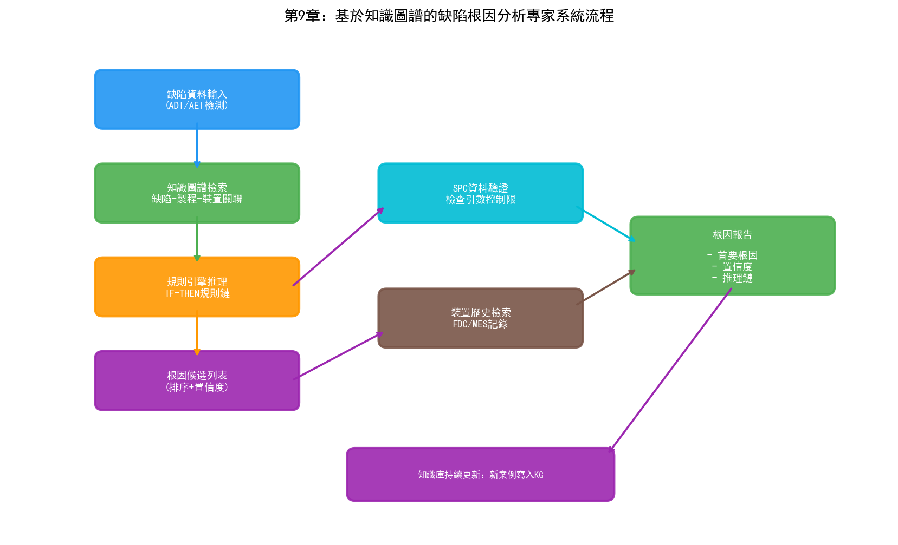
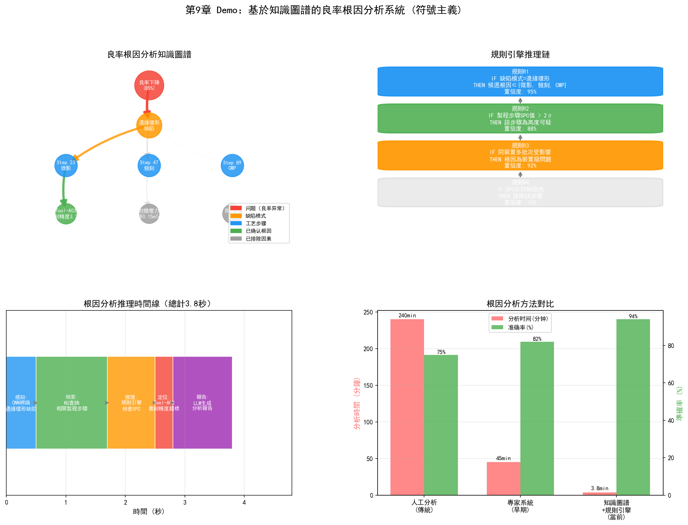

# 第14章 符號主義在晶圓廠的應用

## 14.1 專家系統在製程診斷中的應用

符號主義在半導體製造中的最早實踐可以追溯到1980年代的專家系統。當時，一些頭部晶圓廠嘗試用規則引擎來輔助製程診斷——將資深工程師的經驗編碼為"如果-那麼"規則，幫助年輕工程師快速定位問題。

### PID/YED：缺陷根因分析專家系統

在良率管理中，缺陷根因分析（RCA）是最依賴經驗的環節之一。一位資深的YED工程師看到某種晶圓圖模式時，能夠快速將缺陷空間分佈與特定的製程步驟和設備關聯起來。這種能力本質上是大量"如果...那麼..."規則的隱性運用。

一個早期的RCA專家系統可能包含如下規則：

```
规则 R001:
  如果  晶圆图显示边缘环形缺陷
  且    缺陷类型为颗粒
  那么  可能根因: 边缘清洁工艺不良 (置信度: 0.8)
        建议检查: 边缘清洗设备

规则 R002:
  如果  晶圆图显示中心圆形缺陷
  且    缺陷密度 > 阈值
  那么  可能根因: 光刻机镜头污染 (置信度: 0.7)
        建议检查: 光刻机3号镜头

规则 R003:
  如果  晶圆图显示簇状缺陷
  且    簇状中心对应某腔体位置
  那么  可能根因: 腔体微粒脱落 (置信度: 0.9)
        建议检查: 对应腔体的消耗件状态
```

這套方法的優點是可解釋——系統不僅給出根因判斷，還給出推理鏈路，工程師可以驗證每一步。缺點同樣明顯：規則需要人工維護，無法覆蓋所有情況，且當製程節點變化時規則需要重寫。

儘管專家系統作為獨立技術已經不再是主流，但它的核心思想——將製程知識顯式編碼為機器可處理的形式——在知識圖譜和本體論中得到了延續和升級。

### PE/EE：設備故障診斷專家系統

設備故障診斷是另一個適合符號推理的場景。一臺半導體設備的故障樹可以非常複雜——從"產品良率下降"這個頂層症狀，到"蝕刻速率偏差"，到"RF功率不穩定"，到"匹配器調諧異常"，到"匹配器電機老化"——形成了多層的因果鏈。

故障診斷專家系統透過反向推理定位故障：從觀測到的症狀出發，沿故障樹向下追溯，找到最可能的根因部件。這個過程的每一步推理都可以追溯到具體的因果規則——"如果RF反射功率突然升高，那麼匹配器可能未正確調諧"。

一些晶圓廠的EE部門至今仍在使用基於CLIPS或Jess構建的故障診斷系統，用於新員工的培訓輔助和故障快速定位。這些系統雖然不夠"智慧"，但在特定場景中的實用價值經過了時間驗證。

## 14.2 知識圖譜在良率管理中的應用

知識圖譜是符號主義在當代工業場景中最成熟的形態。與專家系統的規則相比，知識圖譜用圖結構表達實體之間的關係，天然支援多跳關聯查詢——這在跨步驟、跨系統的良率根因分析中極具價值。

### 晶圓廠製程知識圖譜構建

晶圓廠知識圖譜的核心實體型別包括：

```
产品实体: Wafer, Die, Device, Layer, Lot, Batch
工艺实体: Recipe, ProcessStep, Route, Module
设备实体: Tool, Chamber, Component, ConsumablePart
参数实体: Parameter, SetPoint, Measurement, CD, FilmThickness
缺陷实体: Defect, DefectType, DefectPattern, FailureMode
测试实体: WAT, CP, FT, TestItem, TestResult
时间实体: Timestamp, ProcessPeriod, PMCycle
```

實體之間的關係型別包括：

```
Wafer -[BELONGS_TO]-> Lot
Wafer -[PROCESSED_AT]-> ProcessStep
ProcessStep -[USES_TOOL]-> Tool
ProcessStep -[USES_RECIPE]-> Recipe
Tool -[HAS_CHAMBER]-> Chamber
Chamber -[HAS_COMPONENT]-> Component
Recipe -[HAS_PARAMETER]-> Parameter
Wafer -[HAS_DEFECT]-> Defect
Defect -[CLASSIFIED_AS]-> DefectType
Wafer -[TESTED_BY]-> CP
CP -[HAS_RESULT]-> TestResult
TestResult -[INDICATES]-> FailureMode
```

當這些實體和關係被組織為圖後，良率分析就從"逐個系統查詢"變成了"圖上推理"。例如，要回答"最近一週哪些設備的參數可能與3nm產品的CP良率下降相關"這個問題，傳統方式需要工程師分別在MES、FDC、SPC、YMS系統中查詢資料，然後人工關聯。在知識圖譜中，這是一個從"CP良率下降"節點出發，沿"INDICATES→FailureMode→CAUSED_BY→Defect→OCCURS_AT→ProcessStep→USES_TOOL→Tool→HAS_PARAMETER→Parameter"路徑的多跳查詢。

### 缺陷-製程-設備關聯推理

知識圖譜的真正價值在於發現隱含的關聯——那些存在於資料中但人類未曾注意到的關聯。

一個典型的場景是"跨步驟缺陷傳播"。某批晶圓在第45步微影後檢測到的缺陷密度正常，但在第67步CP測試時發現良率異常。傳統分析方法可能直接檢查第45到67步之間的製程參數，但真正的根因可能在第23步——某個參數的微小偏差在第23步時不可見，但透過後續步驟的疊加放大，在第67步表現為良率下降。

知識圖譜可以透過"關聯路徑搜尋"發現這種跨步驟的因果鏈路。從"第67步良率異常"節點出發，在圖譜上搜尋所有與之關聯的路徑，可能發現"第23步→設備A→參數X→輕微偏差→第45步→參數Y→微小影響→第67步→良率下降"這樣的多跳關聯路徑。這種路徑的發現不是透過預設的規則，而是透過圖上的演算法搜尋——圖遍歷、最短路徑、隨機遊走等。

### 良率問題的知識溯源

當良率問題被解決後，將整個分析過程——現象、假設、驗證路徑、根因、解決方案——記錄在知識圖譜中，形成可複用的知識資產。下一次出現類似問題時，系統可以從歷史案例中檢索相似的模式，為當前分析提供參考。

這種"經驗積累與複用"的能力是知識圖譜相對於專家系統的重大進步。專家系統的知識庫是靜態的——只有人工新增新規則才能更新。知識圖譜的知識庫是動態的——每次分析過程都可以自動記錄為新的實體和關係，持續豐富圖譜。



## 14.3 規則引擎在製造排程中的應用

MFG的派工規則本質上是符號主義的應用——將排程的業務邏輯編碼為規則，由規則引擎運行。現代晶圓廠的派工系統通常包含數百條規則，覆蓋各種業務約束：

```
派工规则示例:

规则 D001 (优先级: 紧急):
  如果  Batch.priority == 'HOT'
  那么  排队优先级 = 100

规则 D002 (优先级: 高):
  如果  Batch.remaining_time < 24h
  且    Batch.remaining_steps > 5
  那么  排队优先级 = 90

规则 D003 (配方切换优化):
  如果  Tool.current_recipe == Batch.needed_recipe
  那么  优先级加成 += 20  // 避免配方切换

规则 D004 (瓶颈保护):
  如果  Tool.is_bottleneck == true
  且    Tool.queue_length < 2
  那么  优先调度到该设备  // 避免瓶颈设备空闲

规则 D005 (工艺约束):
  如果  Batch.product == 'ProductA'
  且    Tool.last_product == 'ProductB'
  那么  需要 set_up_time = 30min  // 产品切换需要清洗
```

規則引擎的優勢在於可讀性和可維護性——製造工程師可以直接修改規則而不需要修改程式碼。當業務需求變化時（如新增產品線、調整優先順序規則），只需更新規則庫。

規則引擎的侷限在於無法處理規則之間的衝突和互動——當多條規則同時適用時，如何綜合多個規則的輸出做出最終決策？傳統方法使用固定優先順序或加權求和，但這種方式無法適應動態變化的產線狀態。這正是行為主義（強化學習）可以補充的地方——用RL學習最優的規則組合策略。

## 14.4 本體論在製程整合中的應用

### 製程流程的本體建模

PID管理的一個核心困難是製程知識分散在多個系統中——製程規格在SPEC文件中，設備參數在FDC系統中，量測資料在SPC系統中，缺陷資料在YMS系統中，批次追蹤在MES中。這些系統各自定義了自己的資料模型，術語和格式各不相同——MES中的"step"可能對應SPC系統中的"operation"，對應YMS中的"stage"。

本體論的作用是為這些異構資料建立一個統一的語義層。一個晶圓廠本體定義了核心概念的精確含義和它們之間的關係：

```
Class: ProcessStep
  SubClassOf: ManufacturingActivity
  Properties:
    - hasOrder (integer)          // 步骤序号
    - usesTool (Tool)             // 使用设备
    - usesRecipe (Recipe)         // 使用配方
    - hasParameter (Parameter)    // 包含参数
    - precedes (ProcessStep)      // 前序步骤
    - follows (ProcessStep)       // 后序步骤
    - producesResult (Measurement)// 产出结果

Class: Wafer
  Properties:
    - belongsTo (Lot)
    - hasProcessHistory (ProcessStep)  // 加工历史
    - hasDefect (Defect)               // 缺陷记录
    - testedBy (Test)                  // 测试记录
```

有了這個本體，MES中的"step 45"、SPC中的"operation 45"和YMS中的"stage 45"被統一映射為本體中的同一個`ProcessStep`例項——它們指的是同一個製程步驟，只是在不同的系統中用了不同的名字。這種語義對齊是跨系統資料融合的基礎。

### 跨部門知識共享

本體論帶來的另一個價值是跨部門知識共享。PID、YED、MFG、PE、EE各自的關注點不同，但他們面對的是同一個晶圓廠——同一個產品經過同樣的設備、同樣的製程。如果沒有統一的語義模型，每個部門各自維護自己的資料檢視，資料在部門間的傳遞必然產生誤解和資訊丟失。

本體作為"通用語言"，使得不同部門可以基於同一套概念體系進行溝通。PID定義的"製程視窗"概念、YED定義的"缺陷分類"體系、MFG定義的"派工規則"集合、PE定義的"Recipe參數"空間——這些都可以在同一個本體框架中表達，並透過本體中的關聯關係實現跨領域知識傳遞。

## 14.5 案例：基於知識圖譜的良率分析系統

某12寸先進製程晶圓廠部署了一套基於知識圖譜的良率根因分析系統。系統的核心架構如下：

**資料來源層：** MES（批次追蹤、工序時間）、FDC（設備感測器時序資料）、SPC（量測資料、控制圖狀態）、YMS（缺陷資料、CP/FT結果）、Recipe管理系統（製程參數配置）。

**知識圖譜層：** 將上述系統的資料統一映射為本體中的實體和關係。圖譜包含約500萬實體節點和約2000萬關係邊，涵蓋產品、製程、設備、參數、缺陷、測試六大領域。資料透過ETL管道每日批次更新，關鍵資料（如FDC告警、CP結果）透過訊息佇列即時更新。

**推理引擎層：** 基於圖演算法和規則推理的混合引擎。圖演算法用於關聯路徑搜尋（從良率異常節點出發搜尋可能的因果路徑），規則推理用於基於領域知識的邏輯推斷（如"如果缺陷型別為顆粒且分佈在腔體對應位置，則懷疑該腔體汙染"）。

**應用層：** 提供良率儀表盤、根因分析嚮導、知識檢索等應用。工程師輸入"批次B12345的CP良率從92%降到85%"，系統自動在圖譜中檢索該批次的全製程歷史，找出異常參數和可能的關聯設備，生成根因假設列表，並標註每個假設的置信度和推理路徑。

該系統的效果：根因分析的平均耗時從4-8小時縮短到30-60分鐘，根因定位準確率（與人工PFA結果對比）從65%提升到82%。最大的價值不在於速度——而在於系統能夠發現人類工程師難以注意到的跨步驟關聯，這些關聯通常涉及5步以上的因果鏈路，超出了人腦的工作記憶容量。

## 14.6 實踐研究：符號主義工具與部署案例

### 三星：知識圖譜+LLM的感測器異常偵測

三星在自主半導體製造系統中使用知識圖譜結合LLM實現了感測器命名對齊和異常偵測。

半導體設備的感測器命名問題是資料融合的典型障礙——不同供應商的設備用不同命名規則，且設備維護後感測器訊號可能發生變化。三星的方案是：

- 用知識圖譜自動對齊和協調感測器命名——將不同系統中的感測器名稱映射到統一語義層
- 用LLM進行語義推理——當設備訊號在維護後發生變化時，知識圖譜的社群檢測（community detection）幫助辨識感測器間網路關係的微妙變化
- 具體案例：維護後，知識圖譜分析發現某反應室外膜片的感測器值出現輕微變化——傳統分析未發現這一關聯，KG+LLM揭示了此前被忽略的感測器關係

三星還在2021-2025年間部署了一套自主故障維護系統，覆蓋762臺微影設備，處理超過85,000次真實故障。系統整合了基於圖的日誌分析、LLM語義推理和混合檢索機制——平均故障恢復時間（MTTR）減少7分鐘。這是符號主義（圖結構知識表示+規則推理）與連接主義（LLM）融合的典型實踐。

### yieldWerx：根因知識圖譜

yieldWerx的Root Cause Knowledge Graphs產品將知識圖譜直接應用於半導體良率分析：

- 視覺化引導使用者沿加權路徑辨識低良率批次、晶圓、客戶退貨等場景的根因
- AI和ML演算法將分析時間從人工的數小時/數天縮短到分鐘級
- MPS案例：產品工程團隊大幅縮短良率問題的分析時間

yieldWerx的實踐表明，知識圖譜在晶圓廠的價值不在於圖譜本身有多"大"，而在於它將原本散落在MES、YMS、FDC中的資料關聯為一條可追溯的因果鏈路——工程師可以沿這條鏈路從"良率下降"一步步追溯到"某臺設備的某個參數異常"。

### IKAS：Smart RCA平台

IKAS的Smart RCA（智慧根因分析）平台是知識推理在良率管理中的商業化部署：

- **多源資料融合**：打破FDC、SPC、MES、YMS之間的資料孤島，實現晶圓級資料連通
- **Golden Tool/Path對比**：將可疑批次與金標準設備和製程路徑進行對比，AI關聯分析辨識製程漂移和異常根因
- **效果**：根因辨識時間減少超過80%

Smart RCA代表了符號主義方法在晶圓廠的工程化——它不是純粹的圖資料庫查詢，而是將領域知識（Golden Tool概念、製程路徑規則）編碼為推理邏輯，用AI加速推理過程。

### 歷史視角：專家系統在半導體製造中的演進

半導體產業中專家系統的應用有悠久歷史：

**BIPS（1987年）**：加州大學伯克利分校與SRC（半導體研究公司）聯合開發的IC製造專家系統——使用產生式規則和後向連結推理，自動生成IC製程Recipe（如多晶矽製程Recipe）。BIPS是最早在半導體製造領域驗證專家系統可行性的學術專案之一。

**GID3（1993年）**：SRC成員企業聯合開展的專家系統規則機器學習專案——從RIE（反應離子蝕刻）製程資料中自動學習規則，應用於RIE製程異常偵測、參數最佳化和發射極試產諮詢。GID3在5個不同專案中驗證了辨識RIE異常與參數設定關係的能力。

**CLIPS（1985年至今）**：NASA約翰遜航天中心開發的C語言整合產生式系統——在PC和Unix工作站上運行產生式規則，無需專用Lisp機硬體。CLIPS至今仍在維護，在晶圓廠EE部門的設備故障診斷系統中仍有使用。

從BIPS到今天的KG+LLM系統，符號主義在晶圓廠的技術形態經歷了"規則→本體→知識圖譜→知識圖譜+LLM"的演化——核心思想始終是"將領域知識顯式表示為機器可推理的結構"。

### 神經符號AI（Neurosymbolic AI）的前沿

學術前沿正在探索將符號主義與連接主義深度融合的神經符號AI框架，應用於半導體零缺陷製造：

- 將FMEA（失效模式與效應分析）和專家知識整合到結構化的物理感知本體中
- 結合知識圖譜、本體和深度類神經網路——圖譜提供結構化的領域知識約束，類神經網路從資料中學習模式
- 實現即時缺陷預測、診斷和緩解

這種融合方向代表了符號主義的未來——不是單獨使用，而是與連接主義和行為主義組合，各取所長。

---

符號主義在晶圓廠的價值不是替代深度學習——它無法從影象中辨識缺陷，也無法從時序訊號中預測設備故障。它的價值在於組織和推理：將分散在幾十個系統中的異構資料組織為統一的語義網路，讓人類和機器都能在這個網路上進行關聯查詢和因果推理。上述案例——三星的KG+LLM感測器分析、yieldWerx的根因知識圖譜、IKAS的Smart RCA——證明這種能力正在從學術概念轉化為商業產品。接下來的兩章將轉向連接主義和行為主義——它們提供了從資料中學習和最佳化的能力，與符號主義形成互補。三者的融合將在第五部分（LLM/Agent）和第六部分（Ontology）中達到高潮。

> **本章配套實驗**：第27章 27.17 節的專家系統缺陷診斷實驗（`demos/experiments/expert_system_rca`）將缺陷-根因經驗編碼為 IF-THEN 規則並實作前向推理，對應本節的專家系統應用，可勾選事實互動診斷。

## 14.7 Demo視覺化：基於知識圖譜的良率根因分析



*Demo說明：左上為良率根因分析知識圖譜視覺化，右上為規則引擎推理鏈，左下為推理時間線，右下為傳統方法與KG方法的對比。模擬指令碼見 `demos/demo_ch14_kg_rca.py`。*

> **本章配套實驗**：兩個實驗與本章呼應——第27章 27.4 節的晶圓廠 Ontology MVP（`demos/experiments/wafer_ontology_mvp`）演示知識圖譜輔助根因分析的完整工程形態；27.5 節的 FabGraph（`demos/experiments/FabGraph_MVP`）則展示符號化中繼資料治理如何支撐語義檢索與 NL2SQL。
