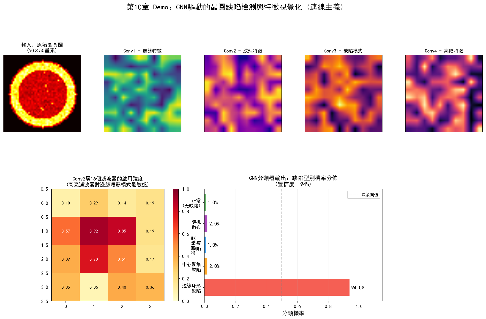
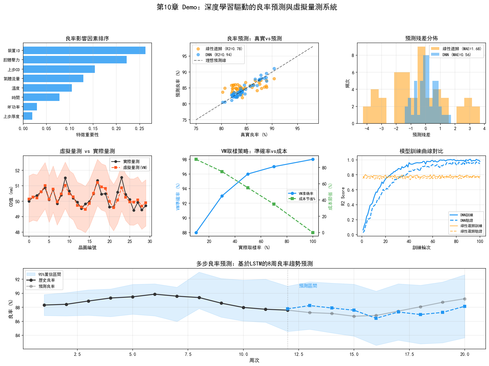
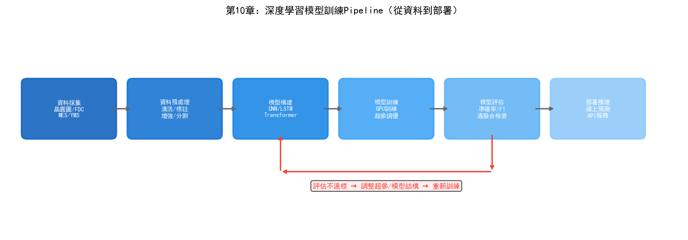

# 第15章 連接主義在晶圓廠的應用

## 15.1 深度學習在良率預測中的應用

連接主義——特別是深度學習——在半導體晶圓廠中的應用遠比符號主義廣泛。原因很簡單：晶圓廠每天都在產生海量的影象資料（缺陷檢測）、時序資料（FDC感測器）和表格資料（量測結果），而深度學習恰好擅長從這些高維資料中提取模式。

### PID/YED：基於 CNN 的晶圓圖缺陷分類

晶圓圖（Wafer Map）是YED最核心的分析物件。CP測試後，每片晶圓生成一張二維網格圖，每個格點代表一顆晶片，標記為"透過"或"失敗"。這些失敗晶片的空間分佈模式——邊緣環形、中心圓形、條帶狀、隨機散佈、簇狀聚集——直接暗示了不同的根因。

傳統的晶圓圖模式辨識依賴手工特徵——計算缺陷的徑向分佈、角度分佈、連通區域面積等統計量，然後用SVM或決策樹分類。這種方法需要特徵工程——人工設計特徵，且特徵設計的好壞直接決定了分類效果。

CNN徹底改變這一流程。將晶圓圖視為二維影象（失敗晶片=1，透過晶片=0），輸入CNN端到端訓練——網路自動從資料中學習區分不同缺陷模式的視覺特徵，無需人工設計。

一個典型的晶圓圖CNN分類器的架構：

```
输入: 64×64 二值晶圆图
  │
  ├─ Conv2D(32, 3×3) + ReLU + MaxPool(2×2)  → 32×32
  ├─ Conv2D(64, 3×3) + ReLU + MaxPool(2×2)  → 16×16
  ├─ Conv2D(128, 3×3) + ReLU + MaxPool(2×2) → 8×8
  ├─ Flatten + Dense(256) + ReLU + Dropout(0.5)
  └─ Dense(9) + Softmax  → 9种缺陷模式分类
```

常見的晶圓圖缺陷模式包括：Center（中心缺陷）、Donut（環形缺陷）、Edge-Loc（邊緣區域性）、Edge-Ring（邊緣環形）、Loc（區域性聚集）、Random（隨機散佈）、Scratch（劃痕）、Near-full（大面積缺陷）、None（無異常）。

NVIDIA在2025年發表的工作中，將視覺語言模型（如Cosmos Reason）應用於晶圓圖缺陷分類，實現了少樣本學習——僅用少量標註樣本就能訓練出可用的分類器，模型構建時間縮短可達2倍。這種方法的優勢在於視覺語言模型可以生成自然語言解釋——不僅分類缺陷型別，還能描述"這個缺陷集中在晶圓東北象限，呈現放射狀分佈，可能與第23步微影的照明不均勻有關"。

### 良率預測模型

晶圓圖分類解決的是"辨識缺陷模式"的問題。更進一步的挑戰是"預測良率"——在晶圓還在產線上流動時就預測它最終的良率。

良率預測的輸入是截至當前製程步驟的所有資料——FDC時序資料、SPC量測資料、設備狀態資料。輸出是預測的CP良率。

一個端到端的良率預測模型需要融合多模態資料：

- **時序資料**（FDC感測器訊號）→ LSTM/Transformer 編碼
- **表格資料**（SPC量測值、設備參數）→ MLP 編碼
- **影象資料**（缺陷檢測結果）→ CNN 編碼
- **多模態融合** → 拼接各模態的編碼向量 → 全連接層 → 良率預測值

這類模型的核心挑戰不在網路架構——而在資料。將MES、FDC、SPC、YMS中的資料按時間軸對齊、處理缺失值（某些步驟可能沒有量測資料）、處理不同取樣頻率（FDC每秒數百點，SPC每批一個值）——這些資料工程工作佔整個專案80%以上的工作量。

## 15.2 時序模型在設備監控中的應用

### PE/EE：LSTM 在設備參數預測中的應用

FDC系統每秒採集數百個設備感測器通道的資料，形成長時序訊號。這些訊號中蘊含著設備健康狀態的豐富資訊——但人類工程師只能透過檢視控制圖或趨勢圖來監控少數幾個關鍵參數。LSTM可以同時監控數百個參數，並捕捉它們之間的時序關聯。

一個典型的設備異常偵測流程：

1. **資料採集：** 從FDC系統獲取設備每批加工的感測器時序資料（溫度、壓力、RF功率等，每秒數十到數百個取樣點）
2. **預處理：** 對齊時間軸、歸一化、提取統計特徵（均值、方差、斜率等）
3. **模型訓練：** 用正常運行狀態的歷史資料訓練LSTM自編碼器——模型學習重建正常運行訊號的"正常模式"
4. **異常偵測：** 線上運行時，如果模型對當前訊號的重建誤差突然增大，說明訊號偏離了正常模式，觸發異常告警

LSTM自編碼器的優勢在於不需要標註異常資料——只用正常運行資料訓練，任何偏離"正常"的訊號都會產生高重建誤差。這在晶圓廠中特別實用，因為異常事件的樣本通常很少。

### 振動訊號的異常偵測

某些設備（如真空泵、機械手臂）的健康狀態與振動訊號密切相關。設備部件磨損或鬆動時，振動訊號的頻譜特徵會發生變化——出現新的頻率分量、某些頻率的振幅增大。

傳統的振動分析依賴FFT頻譜分析——人類專家觀察頻譜圖中的峰值位置和幅度來判斷故障型別。1D-CNN（一維卷積網路）可以直接從原始振動訊號中學習頻域和時域特徵，在故障分類準確率上顯著優於手工頻譜特徵+傳統分類器的方法。

### 預測性維護

時序模型的最終目標是預測性維護——預測設備的剩餘使用壽命（RUL），在設備真正失效前安排維護。

RUL預測模型的技術路徑：

```
设备历史传感器数据 → 特征提取 → 时序模型(LSTM/Transformer)
  → 健康度评分 (0-1, 1=完全健康)
  → RUL预测 (剩余批次/小时数)
  → 维护建议 (立即维护/可继续运行N批次)
```

這個鏈條中每一步都有技術挑戰。特徵提取需要選擇哪些感測器訊號最相關——數百個通道中可能只有十幾個與設備退化高度相關。時序模型需要處理變長序列——設備的運行歷史從幾個月到幾年不等。RUL預測需要標註資料——知道設備在什麼時候真的需要維護了，但這些標籤通常需要事後回顧才能確定。

台積電在其工程效能最佳化系統中部署了類似的"智慧診斷"能力，透過"自學習"實現設備健康狀態的持續監控和預測。英特爾在設備故障預測方面的實踐表明，基於ML的預測性維護可以在設備異常發生前數天發出預警，將非計畫停機時間顯著降低。

## 15.3 類神經網路在製造排程中的應用

### MFG：基於深度學習的智慧排程

MFG的排程問題是NP-Hard的——傳統最佳化方法（如遺傳演算法、模擬退火）可以在合理時間內找到"足夠好"的解，但無法保證全域最優。深度學習提供了另一種思路：用類神經網路學習"在什麼狀態下應該做什麼決策"的映射。

一種典型的方法是"指標網路"（Pointer Network）。將當前產線狀態（各設備的佇列長度、各批次的製程進度和交期、設備狀態等）編碼為序列輸入，網路輸出每個排隊批次在各設備上的分配機率。透過監督學習模仿人類排程專家的決策，或透過強化學習最佳化長期目標（如總完工時間最短）。

這種方法的侷限在於：晶圓廠排程的狀態空間巨大，訓練資料有限——即使有多年曆史資料，覆蓋的狀態組合也只是狀態空間的極小部分。深度學習模型在訓練資料覆蓋的範圍內表現良好，但遇到未見過的狀態可能給出不可靠的輸出。

### WIP 流動預測與瓶頸預測

更實用的應用是WIP流動預測——預測未來幾個小時各工序的WIP分佈，提前辨識瓶頸。

這個任務可以建模為時序預測問題：輸入過去N小時的WIP分佈資料，輸出未來M小時的WIP分佈。LSTM或Time-Series Transformer可以建模WIP在工序間流動的時序模式——如某工序的WIP通常在設備PM後堆積，然後逐步消化。

瓶頸預測使得MFG可以提前排程——如果預測3小時後微影區將出現WIP積壓，可以現在就調整上游工序的派工速度，避免積壓發生。這種"預測性排程"比傳統的"反應式排程"更高效。

## 15.4 電腦視覺在缺陷檢測中的應用

### ADI/AEI 的深度學習檢測

ADI（After Develop Inspection）和AEI（After Etch Inspection）是晶圓製造中兩個關鍵的品質檢測節點。ADI在微影顯影后檢測圖形是否正確——如果圖形有偏差，可以返工（ stripping光阻後重新曝光）；AEI在蝕刻後檢測最終圖形——此時已經無法返工，有缺陷的晶圓只能報廢或降級。

傳統的自動缺陷檢測設備（如KLA的Surfscan）透過比較相鄰裸片或與參考影象的差異來檢測缺陷。這種方法的侷限是隻能檢測"與正常不同的區域"，無法區分缺陷的型別和嚴重程度。

深度學習的引入使得"檢測"和"分類"可以一步完成：

1. 檢測設備掃描晶圓，輸出可疑區域的影象
2. CNN對每張影象進行分類——區分顆粒、劃痕、橋接、斷裂、腐蝕等數十種缺陷型別
3. 分類結果自動關聯到製程步驟和設備

這種"自動缺陷分類"（ADC）系統的準確率在引入深度學習後顯著提升——傳統手工特徵+SVM的準確率通常在70-80%，而端到端CNN訓練的準確率可以達到90%以上（取決於缺陷型別和資料量）。

### 電鏡影象分析

在先進製程中，部分關鍵缺陷需要用SEM（掃描電子顯微鏡）或TEM（透射電子顯微鏡）在高倍率下觀察。這些電鏡影象的解析度達到奈米級，可以顯示缺陷的三維形貌和材料成分。

電鏡影象的分析傳統上完全依賴人工——工程師需要逐張觀察影象並判斷缺陷型別和成因。這是一個極其耗時的工作——一位工程師分析一組電鏡影象可能需要數小時。深度學習模型（如U-Net用於影象分割、ResNet用於分類）可以自動從電鏡影象中辨識缺陷型別、測量缺陷尺寸、甚至推斷缺陷形成機制。

### 自動缺陷分類（ADC）的工程實踐

一個實際部署的ADC系統通常包含以下元件：

**模型訓練管道：**
- 資料收集：從檢測設備自動收集缺陷影象
- 資料標註：工程師對缺陷影象進行分類標註（半自動——模型先給出初步分類，工程師稽核修正）
- 模型訓練：在標註資料上訓練CNN分類器
- 模型驗證：在獨立測試集上驗證準確率、召回率
- 模型部署：將訓練好的模型部署到產線的推理伺服器

**線上推理管道：**
- 檢測設備輸出缺陷影象 → 影象預處理（裁剪、歸一化）→ CNN推理 → 分類結果
- 分類結果 → YMS系統 → 關聯到製程步驟和設備 → 生成良率分析報告

**持續學習管道：**
- 系統持續收集新的缺陷影象
- 當模型對某些影象的置信度低時，自動送入人工標註佇列
- 定期用新資料重新訓練模型
- 部署更新後的模型

這個"資料→模型→部署→回饋→資料"的閉環是連接主義在晶圓廠落地的典型模式。模型不是一次訓練就完成的——它需要在持續運行中不斷學習新的缺陷模式，適應新的製程節點。

## 15.5 案例：頭部晶圓廠基於深度學習的晶圓圖分析

某頭部晶圓代工廠部署了一套基於深度學習的晶圓圖自動分析系統，取代了傳統的人工晶圓圖判讀。

系統的輸入是CP測試後生成的晶圓圖——一片晶圓上數千顆晶片的透過/失敗分佈。系統需要在數百毫秒內完成分類，將晶圓圖歸入預定義的8種缺陷模式之一，並標註異常區域。

技術方案採用ResNet-18作為基礎分類器，在約50萬張歷史標註晶圓圖上訓練。為了處理類別不平衡問題（某些缺陷模式的樣本數量遠少於其他），系統使用了焦點損失（Focal Loss）和資料增強（旋轉、翻轉、隨機遮擋）。

部署後的效果：分類準確率達到93.5%，比之前的手工特徵+SVM方案（78.2%）提升了15個百分點。分類速度從人工的每片2-3分鐘縮短到自動的每片0.5秒。更重要的是，系統發現了一種之前未被辨識的缺陷模式——在某些批次中，晶圓圖呈現出一種微弱的螺旋狀分佈，人工判讀時被歸類為"隨機"模式。CNN模型辨識出這種模式後，YED工程師追查發現這是一種特定的CMP製程導致的系統性缺陷——這個發現此前被隱藏了數月。

這個案例說明深度學習在晶圓廠的價值不僅僅是"更快更準"——它可以發現人類視覺感知無法捕捉的微弱模式，這些模式可能是重要的製程問題的早期訊號。

## 15.6 實踐研究：連接主義的量產級部署

### SK海力士/Gauss Labs：Panoptes虛擬量測——深度學習替代物理量測

10.1節討論的"良率預測模型"在SK海力士已經落地為量產級系統。Gauss Labs的Panoptes VM於2022年12月在SK海力士產線部署，是連接主義在晶圓廠最成功的量產案例之一。

技術架構：使用設備感測器資料（溫度、壓力、氣體流量等時序訊號）作為輸入，透過深度學習模型預測晶圓的量測結果（膜厚、折射率等）。這本質上是一個多變數時序迴歸問題——LSTM/Transformer編碼FDC時序訊號，輸出連續的量測預測值。

部署結果：
- 製程變異降低21.5%（2022年12月初次部署），到2024年2月進一步改善至29%
- 累計對超過5000萬片晶圓進行虛擬量測——每秒超過一片
- 自適應線上模型（AOM）處理資料漂移——當設備老化或消耗件更換導致資料分佈變化時，模型自動適配

Panoptes VM的意義在於它驗證了10.1節描述的"良率預測"思路在量產中的可行性——不是預測最終良率，而是預測中間量測結果，從而實現"每片晶圓都有量測資料"而無需實際測量。

### Gauss Labs Universal Denoiser：AI增強電鏡影象

10.4節提到的"電鏡影象分析"在Gauss Labs也有了量產級方案。Universal Denoiser用AI去除CD-SEM（臨界尺寸掃描電子顯微鏡）影象中的噪聲：

- 影象採集時間縮短到傳統技術的1/4
- 預計量測設備生產率提升42%
- 噪聲去除後，下游的缺陷分類和尺寸測量精度也相應提升

這個案例展示了深度學習在電鏡影象分析中的實際價值——不是替代人類專家的判斷，而是透過降噪提升影象品質，使得自動分析更可靠、採集速度更快。

### NVIDIA：視覺基礎模型——從CNN到VLM的躍遷

10.4節描述的ADC系統在2025年迎來了一次技術躍遷——從CNN轉向視覺語言模型（VLM）：

**Cosmos Reason VLM**：
- 晶圓級缺陷分類準確率超過96%（微調後）
- 支援少樣本學習——僅用少量標註樣本即可適配新製程節點
- 生成自然語言解釋——"這個缺陷集中在晶圓東北象限，呈現放射狀分佈"
- 支援互動式問答和自動標註

**NV-DINOv2 VFM（視覺基礎模型）**：
- 裸片級缺陷檢測準確率達98.51%
- 大幅減少人工標註需求——模型預訓練已學習通用視覺特徵，微調只需少量標註

台積電已在產線上使用NVIDIA Metropolis和TAO Toolkit進行自動化缺陷檢測——這是VLM在晶圓廠量產中應用的首次大規模驗證。

### 英特爾：OpenVINO驅動的內聯檢測

英特爾使用自研的OpenVINO工具包部署AI驅動的內聯檢測（inline inspection）系統，用於晶圓減薄品質檢測：

- 可檢測的缺陷型別包括凹陷、劃痕、磨削痕跡、汙漬、裂紋、氣泡、晶圓偏移和貼片偏移
- 內聯檢測結合AI可比離線檢測提前發現50%的晶圓減薄問題
- 從"終檢發現問題"轉向"工序間檢測發現問題"——減少受影響批次數量

英特爾還提供了Manufacturing AI Suite參考應用，包含4個AI視覺檢測應用：托盤缺陷檢測、PCB異常偵測、焊縫氣孔檢測和人員安全裝備檢測——這些應用基於OpenVINO推理引擎運行多AI模型和多攝像頭流。

### Applied Materials：AIx——即時製程視覺化的連接主義實踐

Applied Materials的AIx平台將深度學習應用於設備級即時製程分析：

- **ChamberAI**：感測器+ML演算法對腔體級製程變數進行即時分析——這是10.2節描述的FDC異常偵測的商業化產品
- **載片量內聯量測**：量測速度提升100倍，解析度提高50%——深度學習模型從內聯量測資料中即時提取製程趨勢
- **數字製程地圖**：基於深度學習的虛擬實驗環境——在參數空間中搜尋最優製程視窗

### 產業基準：晶圓圖分類模型對比

根據學術和工業研究的彙總，晶圓圖缺陷分類模型的準確率已達到工業級可用水平：

| 模型 | 準確率 | 特點 |
| --- | --- | --- |
| 手工特徵+SVM | 78.2% | 傳統方法基線 |
| VGG-19 | 65% | 深度學習但架構較老 |
| ResNet-18（量產部署） | 93.5% | 10.5節案例 |
| DeiT（Transformer） | 90.83% | 注意力機制 |
| Tiny ViT | 98.4%驗證準確率 | 輕量級Transformer |
| NVIDIA Cosmos Reason VLM | >96% | 視覺語言模型 |
| NVIDIA NV-DINOv2 | 98.51% | 視覺基礎模型 |

趨勢清晰：從CNN到Transformer再到VLM，準確率持續提升，同時對標註資料量的需求持續下降——少樣本學習正在使新製程節點的缺陷分類部署時間大幅縮短。

---

連接主義在晶圓廠的應用已經相當成熟——特別是在缺陷檢測、良率預測和設備健康監控等資料密集的場景。上述案例表明，SK海力士的虛擬量測已覆蓋5000萬片晶圓，NVIDIA的VLM準確率超過96%，英特爾的內聯檢測已前移50%的問題發現時間。但它的侷限同樣明顯：黑箱決策、資料依賴、無法推理。下一章我們將看到行為主義——強化學習——如何在需要序貫決策最佳化的場景中補充連接主義的不足。

## 15.7 Demo視覺化：CNN驅動的晶圓缺陷檢測與特徵視覺化



*Demo說明：上排展示了CNN各卷積層的特徵圖提取過程，下左為16個濾波器的啟用強度熱力圖，下右為分類器輸出的缺陷型別機率分佈。模擬指令碼見 `demos/demo_ch15_cnn_detection.py`。*

> **本章配套實驗**：第27章 27.15 節的 CNN 晶圓缺陷分類實驗（`demos/experiments/wafer_defect_cnn`）生成模擬晶圓圖並用神經網路自動分類，直接對應本節的深度學習缺陷檢測，配套 Web 介面可互動預測。

## 15.8 Demo視覺化：深度學習良率預測與虛擬量測



*Demo說明：左上為DNN模型架構示意圖，右上為良率預測散點圖（DNN R2=0.94 vs 線性迴歸 R2=0.78），左下為虛擬量測時序對比，右下為特徵重要性排序。模擬指令碼見 `demos/demo_ch15_yield_prediction.py`。*



> **本章配套實驗**：第27章 27.8 節的 LoRA 微調實驗（`demos/experiments/fab_llm_fine_tuning`）完整走通「資料合成 → LoRA 訓練 → 推理 → 量化評估」鏈路，用 0.5B 小模型做領域預處理輔助大模型——是本章「資料稀缺場景下的 AI 加速」在 LLM 時代的延伸。
