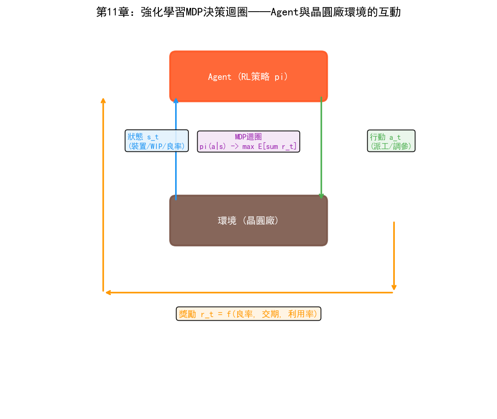
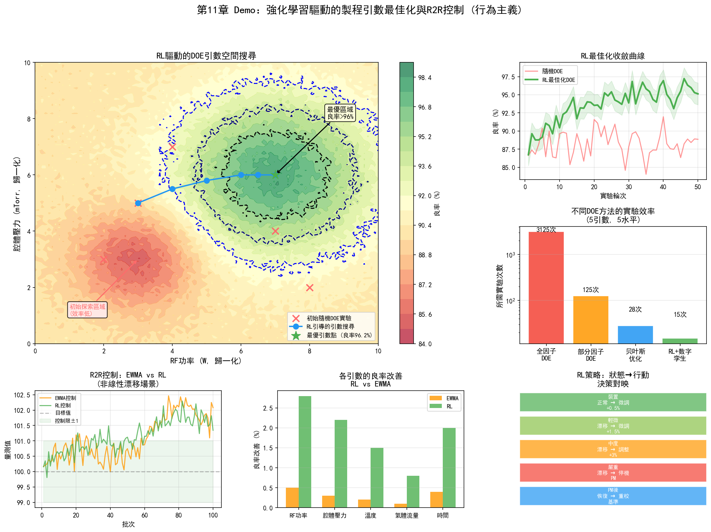
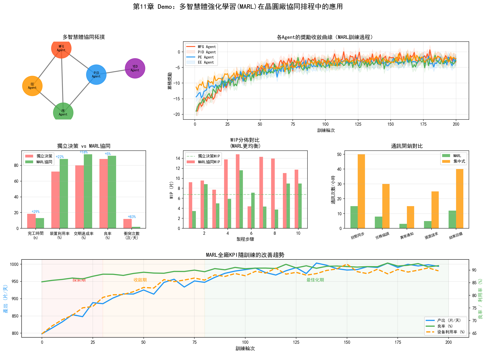

# 第16章 行為主義在晶圓廠的應用

## 16.1 強化學習在製程最佳化中的應用

行為主義在半導體晶圓廠的應用仍處於相對早期階段，但它的潛力在幾個特定場景中已經開始顯現。與連接主義"從資料中學習模式"不同，強化學習擅長"從互動中學習策略"——這使它特別適合需要序貫決策的製程最佳化和排程場景。

### PID/YED：基於 RL 的 DOE 參數空間搜尋

傳統的DOE（實驗設計）方法在面對高維參數空間時效率極低。一個蝕刻製程可能有20個關鍵參數，每個參數有5個水平——全因子設計需要 $5^{20}$ 次實驗，完全不可行。即使使用部分因子設計或回應面方法，實驗次數仍然隨參數維度快速成長。

強化學習將DOE重新定義為一個序貫決策問題：在每一輪實驗中，智慧體選擇一組參數組合（action），環境返回製程結果（observation和reward），智慧體根據結果調整下一輪的參數選擇策略。目標是在最少的實驗輪次內找到最優的製程參數組合。

這種方法的技術路徑通常基於貝葉斯最佳化與強化學習的結合：

1. **初始化：** 用少量隨機參數組合運行初始實驗
2. **建模：** 用高斯過程（Gaussian Process）或類神經網路擬合參數到結果的映射
3. **採集函數最佳化：** 用RL策略選擇下一組參數——平衡"在已知好區域精細搜尋"（利用）和"在未知區域探索"（探索）
4. **實驗運行：** 用選定的參數組合運行實際實驗
5. **更新：** 將新實驗結果加入資料集，更新模型
6. **重複3-5直到收斂**

與固定策略的DOE方法相比，RL的 advantage 在於"自適應"——它根據已有實驗結果動態調整下一組實驗的方向。如果前幾輪實驗發現某個參數的增大可以顯著改善結果，RL會將後續實驗集中在該參數的更大值附近做精細搜尋。

這種方法的挑戰是實驗成本——每次"環境互動"（運行實際實驗）需要晶圓製造週期（數天到數週）和實驗晶圓的成本。因此離線RL（從歷史DOE資料中學習）和數字孿生輔助的RL（在模擬環境中做大部分探索，只在現實中做驗證）是更實用的路徑。

### R2R 控制的強化學習方法

傳統的R2R控制使用EWMA等線性模型——簡單、可解釋，但只能處理線性且緩慢的漂移。實際的製程漂移往往是非線性的：PM後的階躍變化、不同老化階段的不同退化速率、多參數耦合的互動效應。

基於RL的R2R控制器將參數調整建模為馬爾可夫決策過程（MDP）：

- **狀態 $s_t$：** 當前批次及歷史批次的量測結果、設備運行參數、距上次PM的批次數
- **行動 $a_t$：** 下一批Recipe的參數調整量（如RF功率+5W，壓力-0.5mTorr）
- **獎勵 $r_t$：** 下一批的量測結果與目標值的偏差的負數（偏差越小獎勵越高）
- **策略 $\pi(a|s)$：** 在給定狀態下選擇參數調整的策略

一個基於PPO的R2R控制器的工作流程：

1. 從歷史R2R資料中離線預訓練初始策略
2. 在數字孿生模型上進行線上訓練——模擬大量批次的參數調整
3. 在實際產線上部署訓練好的策略，每批調整參數
4. 持續收集新資料，定期更新策略

這種方法相比EWMA的優勢在於：可以處理非線性漂移模式，可以同時調整多個相互關聯的參數，可以根據設備狀態（如距上次PM的批次數）自適應調整策略。劣勢在於需要大量歷史資料來訓練數字孿生模型，且策略的可解釋性不如EWMA。

## 16.2 強化學習在製造排程中的應用

### MFG：基於 RL 的智慧派工

MFG的即時派工是強化學習在晶圓廠最有潛力的應用場景之一。傳統派工規則（FIFO、EDD、CR等）是固定的——不管產線處於什麼狀態，都按同樣的規則排序。但最優的派工策略應該根據產線的即時狀態動態調整——當瓶頸設備空閒時優先給它供料，當某工序WIP過高時減速供料。

將派工建模為MDP：

- **狀態 $s_t$：** 當前產線全狀態——各設備的佇列長度、各批次的製程進度和交期、設備狀態（運行/空閒/PM）、當前瓶頸設備
- **行動 $a_t$：** 對每臺空閒設備，從其佇列中選擇下一批處理的晶圓
- **獎勵 $r_t$：** 綜合指標——完工批次數（正獎勵）、交期超期批次（負獎勵）、瓶頸設備空閒時間（負獎勵）
- **策略 $\pi(a|s)$：** 給定產線狀態時的派工策略

一個基於DQN的派工系統的工作方式：

1. **狀態編碼：** 將產線狀態編碼為向量——每臺設備的佇列長度、每批次的優先順序和剩餘時間、設備狀態等
2. **Q值估計：** DQN輸出每個可派遣批次的Q值（預期長期回報）
3. **派工決策：** 選擇Q值最高的批次分配給空閒設備
4. **回饋更新：** 觀察決策後的產線狀態變化和獎勵，更新DQN參數

訓練方式通常在產線模擬器（數字孿生）中進行——模擬器模擬晶圓在產線上的流動、設備處理時間、故障事件等。智慧體在模擬器中透過數百萬次試錯學習有效的派工策略，然後部署到實際產線。

### 多機臺協同排程與動態瓶頸緩解

當產線上有多臺同類設備可以處理同一工序時，派工不僅要決定"先做哪批"，還要決定"在哪臺設備上做"。這個決策需要考慮各臺設備的當前狀態、負載和健康度——將批次分配到狀態最佳、等待時間最短的設備。

多智慧體強化學習（MARL）可以處理這類多設備協同問題。每臺設備被視為一個智慧體，各智慧體的區域性目標是"最大化自己的處理效率"，全域目標是"最大化整線產出"。MAPPO等演算法透過集中式訓練（所有智慧體共享一個Critic網路）和分散式運行（每個智慧體獨立做決策）來實現全域協調。

動態瓶頸緩解是MARL的一個典型應用。瓶頸不是固定的——當某臺瓶頸設備故障時，瓶頸轉移到另一臺設備。RL策略可以學會"預判瓶頸轉移"——在某臺設備即將成為新瓶頸前，提前將更多批次路由到該設備，避免其空閒。

## 16.3 強化學習在設備控制中的應用

### PE/EE：基於 RL 的設備參數自適應調節

設備的製程參數在運行過程中需要持續微調以補償各種變化——設備老化、消耗件磨損、批次間漂移。傳統的R2R控制器每批調整一次參數，調整策略是預設的（如EWMA）。

RL可以做得更細粒度——在單批加工過程中即時調整參數。例如，蝕刻過程中隨著腔體壁面聚合物積累，蝕刻速率逐漸下降。傳統方法是在批次間補償（R2R），RL可以在批次內部根據即時FDC資料預測速率下降趨勢並提前調整RF功率。

這種"批次內即時控制"需要極低延遲的推理——FDC系統每秒採集數百個訊號，RL策略需要在毫秒級時間內處理訊號並輸出參數調整。這要求模型輕量化——小型MLP或淺層LSTM通常足夠，不需要大型Transformer。

### 預測性維護決策最佳化

預測性維護包含兩個層次：預測（"設備何時需要維護"）和決策（"何時安排維護最優"）。第一個層次是連接主義擅長的——LSTM預測RUL。第二個層次是行為主義擅長的——RL最佳化維護決策。

維護決策的最佳化目標是：在設備效能退化影響製程品質之前安排維護，同時最小化維護導致的產能損失。這個決策需要考慮多個因素：

- 設備的當前健康度和退化速率
- 維護視窗的可用性（維護需要人員和備件）
- 當前產線的WIP狀態（維護期間WIP是否會堆積）
- 後續訂單的交期壓力

將這個決策建模為MDP：

- **狀態：** 設備健康度、當前產能負載、維護視窗可用性
- **行動：** 繼續運行 / 立即維護 / 延遲N批次後維護
- **獎勵：** 產能收益 - 維護成本 - 品質風險

RL策略學會在設備健康度下降到某個閾值前提前安排維護——不是在健康度還很高時就維護（浪費產能），也不是等到設備真的出問題才維護（風險太高），而是在"維護成本"和"品質風險"的平衡點運行維護。

## 16.4 多智慧體系統在晶圓廠的應用

### 跨部門協同的 MARL

晶圓廠的三大部門——PID/YED、MFG、PE/EE——的最佳化目標有時衝突。MFG要產能最大化（減少設備空閒），PE要製程品質最最佳化（可能需要更多時間除錯參數），YED要良率最最佳化（可能需要更多檢測步驟）。這些相互競爭的目標需要在一個統一框架中協調。

MARL提供了一個自然的框架來建模這種多目標協調。每個部門可以建模為一個智慧體（或智慧體組），各自有不同的區域性獎勵函數：

- MFG智慧體的獎勵 = 產能 - 延遲懲罰
- PE智慧體的獎勵 = 製程品質 - 除錯時間
- YED智慧體的獎勵 = 良率 - 檢測成本

全域目標是這些區域性獎勵的加權和（或某種協調機制）。MARL演算法（如QMIX）學習如何在這些相互競爭的目標之間找到帕累托最優的平衡點。

### 整廠級最佳化

最終的目標是整廠級最佳化——一個AI系統同時管理製程參數、生產排程和設備維護，以最大化整體良率、產能和利潤。

這是一個極其複雜的MDP——狀態空間包含產線上所有晶圓的位置和狀態、所有設備的狀態和健康度、所有製程參數的當前值和趨勢。行動空間包含每臺設備的派工決策、每個製程的參數調整、每臺設備的維護決策。

整廠級最佳化目前仍處於理論探索階段，但一些方向性的實踐已經開始：

**數字孿生 + RL：** 構建整廠的數字孿生模型——模擬晶圓流動、設備處理、製程參數和良率。RL智慧體在數字孿生中訓練整廠最佳化策略，然後部署到現實。數字孿生的精度決定了策略的可遷移性。

**分層RL：** 將問題分解為多個層次——高層策略做長期規劃（如本週的產能分配），中層策略做中期排程（如今天的派工規則），低層策略做即時運行（如下一批處理哪個）。每個層次獨立訓練，高層為低層提供目標，低層為高層提供狀態回饋。

## 16.5 案例：基於強化學習的 R2R 控制系統

某先進製程晶圓廠在CMP（化學機械拋光）工序中部署了一套基於RL的R2R控制系統，取代了原有的EWMA控制器。

CMP的製程挑戰在於拋光速率隨磨墊（Pad）的使用而退化——新磨墊的拋光速率高，隨著使用次數增加而下降。傳統的EWMA控制器透過追蹤拋光速率的歷史趨勢來補償這種退化，但補償策略是線性的——假設退化速率恆定。實際上，磨墊退化是非線性的（新磨墊退化快，老磨墊退化慢），且PM後更換磨墊會導致階躍變化。

RL控制器的架構：

- **狀態：** 當前批次號、距上次PM的批次數、前5批的拋光速率測量值、磨墊使用歷史
- **行動：** 下一批的拋光壓力和時間參數調整量
- **獎勵：** $-|实际抛光量 - 目标抛光量|$（拋光量偏差越小越好）

訓練資料來自過去兩年的歷史R2R資料——約5萬批次的參數和量測記錄。系統使用Conservative Q-Learning（CQL）進行離線RL訓練——不需要在真實產線上試錯，只從歷史資料中學習最優策略。

部署效果：與EWMA控制器相比，RL控制器的拋光均勻性偏差降低了22%，PM後的恢復時間（從PM後到參數穩定所需的批次數）從8批減少到3批。PM後的快速恢復是最顯著的改進——EWMA控制器在PM後需要多批次才能"重新學習"到新的參數基線，而RL控制器直接根據"距上次PM的批次數"這個狀態變數辨識出PM後的狀態並應用相應的補償策略。

這個案例展示了RL在工業場景中的一個關鍵優勢：它可以從歷史資料中學習到人類工程師可能未顯式建模的規律——如PM後的非線性參數恢復模式——並將其編碼為自適應的控制策略。

## 16.6 實踐研究：強化學習從研究到產線的驗證

### Google DeepMind AlphaChip：RL在晶片設計中的生產級部署

雖然AlphaChip主要應用於晶片設計而非晶圓廠營運，但它是RL在半導體產業最成功的生產級部署，對晶圓廠的製程開發有間接價值。

AlphaChip將晶片佈局（floorplanning）建模為MDP——RL代理在網格上逐個放置宏元件，最佳化線長、擁塞和密度。成果：

- 從2020年開始用於每一代Google TPU的晶片佈局設計——包括TPU v5e、v5p和Trillium（v6），以及Axion資料中心CPU
- 生成佈局的時間從人工的數週/數月縮短到數小時
- DeepMind稱其生成的佈局達到"超人類"水平
- TPU v6（Trillium）比前代節能33%

AlphaChip的兩位核心作者（Anna Goldie和Azalia Mirhoseini）隨後創立了Ricursive Intelligence[85]，融資3億美元（估值40億），將RL晶片設計平台商業化——這表明RL在半導體領域的價值已被資本市場認可[86]。

雖然AlphaChip解決的是設計問題而非製造問題，但其技術路徑——RL在複雜離散最佳化問題上的序貫決策——與晶圓廠排程和R2R控制的技術路徑完全一致。AlphaChip的成功驗證了RL在半導體複雜最佳化問題上的可行性。

### AISSI專案：深度RL在工廠排程中的產線驗證

11.2節描述的"RL智慧派工"在AISSI專案中獲得了產線級驗證。

AISSI（2021-2024）由Bosch、Nexperia、Bosch Sensortec、D-SIMLAB、SYSTEMA和KIT聯合開展，是RL在半導體/電子製造業排程中最大規模的產線驗證之一：

**三個用例：**
- 小規模：外延工作中心排程（Nexperia）——單一工序的多設備排程
- 中規模：全廠排程（Bosch）——完整工廠的多工序、多設備排程
- 全球：Cycle Time預測（Bosch Sensortec）——供應鏈級別的交付時間預測

**技術方案：** 深度RL代理在數字孿生模擬環境中訓練排程策略，然後部署到真實工廠提供智慧派工和自動調參。AISSI還實現了AI與數字孿生模組間的標準化通訊。

**量化結果：**
- 產出比文獻基準高9%
- Cycle Time預測準確率80-90%
- 成果正在向Bosch和Nexperia產線轉移

**意義：** AISSI驗證了11.2節描述的DQN/MARL排程方法在真實工廠中的可行性。雖然9%的產出提升看似不大，但對於產能數十億美元的晶圓廠，1%的產出提升就意味著數百萬美元的年收益。

### RL排程在真實工業資料集上的基準

除了AISSI專案，多項2022-2025年的研究在真實工業資料集上驗證了RL排程：

| 研究 | 資料集 | 吞吐量提升 | Cycle Time | 延遲改善 | 設備利用率 |
| --- | --- | --- | --- | --- | --- |
| ICTC 2025 | 真實工業 | +5.3% | -7.3% | -19.2% | 87.9% |
| arXiv 2025 | 真實工業 | +1% | — | -4% | — |
| WSC 2022 | 模擬 | — | — | 優於7種基線 | — |

ICTC 2025的結果尤其值得關注——5.3%的吞吐量提升和7.3%的Cycle Time降低是在真實工業資料集上獲得的，不是模擬結果。這表明RL排程已經跨越了"模擬有效但產線無效"的鴻溝。

### 三星：自主故障維護系統——RL與圖分析的融合

三星在2021-2025年間部署了一套自主故障維護系統——雖然其核心技術更偏向圖分析+LLM而非經典RL，但它展示了行為主義"從互動中學習"的思想在大規模設備管理中的應用：

- 覆蓋762臺微影設備
- 處理超過85,000次真實故障
- 平均故障恢復時間（MTTR）減少7分鐘
- 系統從檢測異常→診斷根因→運行糾正措施的完整閉環自動化

技術架構融合了多種方法：基於圖的日誌分析（符號主義）、LLM語義推理（連接主義）、混合檢索機制。雖然不是經典RL的"試錯學習"，但系統的"自主決策-運行-回饋"閉環體現了行為主義的核心思想——從環境互動中學習並改進行為策略。

### Synopsys DSO.ai：RL在晶片設計最佳化中的商業驗證

Synopsys的DSO.ai使用強化學習進行晶片佈局最佳化——與AlphaChip類似但已商業化：

- **意法半導體（STMicroelectronics）**：PPA（功耗-效能-面積）最佳化效率提升3倍以上
- **SK海力士**：先進製程晶片裸片面積縮小5%，降低製造成本
- **三星**：使用Synopsys AI工具完成3nm手機SoC的tape-out
- 超過100次商業tape-out使用了DSO.ai[83][84]

### 產業實踐彙總：行為主義在半導體中的部署階段

| 應用領域 | 部署階段 | 代表案例 | 量化結果 |
| --- | --- | --- | --- |
| 晶片佈局最佳化 | 量產級 | AlphaChip / DSO.ai | 數週→數小時；PPA 3倍效率 |
| R2R控制 | 量產試點 | CMP CQL控制器 | 均勻性偏差-22%；PM恢復8→3批 |
| 工廠排程 | 產線驗證 | AISSI / ICTC論文 | 產出+9%；吞吐量+5.3% |
| 佇列時間管理 | 模擬驗證 | WSC 2022 | 優於7種基線方法 |
| 自主維護 | 量產級 | 三星微影設備 | MTTR-7分鐘；762臺設備 |
| 整廠最佳化 | 理論探索 | 數字孿生+RL | 尚無產線部署 |

行為主義在晶圓廠的現狀可以概括為：**在"窄而深"的單點最佳化上已經進入量產（R2R、晶片佈局），在"寬而淺"的全域最佳化上仍在從模擬向產線過渡（排程、維護決策），在"全廠級"最佳化上仍處於理論探索階段。** 這種漸進式落地路徑與AI技術的一般規律一致——從簡單到複雜，從單點到系統。

---

到本章為止，三大流派在晶圓廠的應用已經展開。總結一下三者在晶圓廠中的定位和實踐成熟度：

| 場景 | 符號主義 | 連接主義 | 行為主義 |
| --- | --- | --- | --- |
| 良率根因分析 | KG推理（量產） | CNN缺陷分類（量產） | — |
| 製程參數最佳化 | 製程視窗規則 | 良率預測（量產試點） | RL參數搜尋（產線驗證） |
| 設備健康監控 | 故障樹推理 | LSTM異常偵測（量產） | 預測性維護決策（量產試點） |
| 生產排程 | 派工規則引擎 | WIP流動預測 | RL智慧派工（產線驗證） |
| 資料融合 | Ontology（量產） | 多模態編碼 | — |
| Recipe開發 | 製程規範編碼 | — | 貝葉斯最佳化+RL（量產試點） |

三大流派各有其優勢領域，也各有侷限。真正的整廠智慧需要三者的融合——這正是接下來第五部分（LLM/Agent）和第六部分（Ontology）的主題。LLM作為"粘合劑"可以連接不同流派的模型和工具，Agent架構可以編排多步驟的分析流程，而Ontology則提供了跨系統資料融合的語義基礎。

## 16.7 Demo視覺化：強化學習驅動的製程參數最佳化

*Demo說明：左上為RL在參數空間中的搜尋軌跡與良率回應面，右上為RL最佳化收斂曲線，右中為不同DOE方法的實驗效率對比，下排展示了R2R控制效果、多參數改善對比和RL策略決策映射。模擬指令碼見 `demos/demo_ch16_rl_optimization.py`。*

> **本章配套實驗**：第27章 27.16 節的 Q-Learning 智慧派工實驗（`demos/experiments/rl_dispatch_basic`）用 Q-Learning 學習派工策略並與隨機派工對比，直接對應本節的強化學習排程，配套 Web 介面視覺化學習曲線與甘特圖。

## 16.8 Demo視覺化：多智慧體強化學習排程

*Demo說明：左上為晶圓廠多Agent拓撲結構，右上為協同vs獨立決策的關鍵指標對比，左中為WIP流動時序圖，右中為排程甘特圖，底部為多Agent通訊頻率與策略收斂分析。模擬指令碼見 `demos/demo_ch16_marl.py`。*
