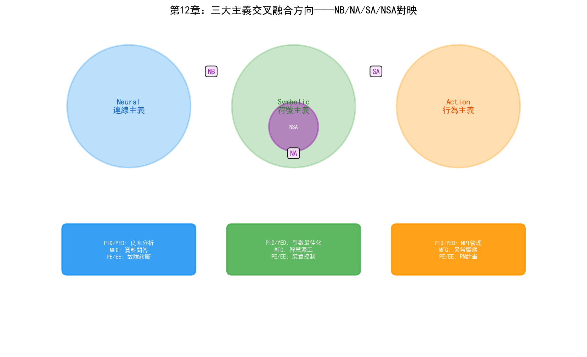

# 第17章 融合概論——三大主義的交叉與統一

## 17.1 為什麼融合是大勢所趨

前面三章分別討論了符號主義、連接主義和行為主義在晶圓廠中的應用。三者在各自的擅長領域各展所長：符號主義擅長知識表示和邏輯推理，連接主義擅長模式辨識和感知，行為主義擅長序貫決策和最佳化。

但任何一個流派單獨使用時，都有明顯的短板：

| 流派 | 擅長 | 短板 |
| --- | --- | --- |
| 符號主義 | 知識表示、邏輯推理、可解釋性 | 無法從資料中學習、知識獲取瓶頸 |
| 連接主義 | 模式辨識、感知、泛化能力 | 黑箱決策、無法推理、幻覺問題 |
| 行為主義 | 序貫決策最佳化、自適應 | 樣本效率低、需要精確的狀態表示 |

更關鍵的是，晶圓廠的實際問題往往不是單一型別——一個良率問題可能同時涉及影象辨識（連接主義）、知識推理（符號主義）和參數最佳化（行為主義）。當問題複雜到一定程度時，任何單一流派都無法獨立解決。

### 晶圓廠問題的複合性

以一個真實的良率下降場景為例：

某3nm產品在連續3個批次中CP良率從94%下降到87%。YED工程師需要找到根因。這個問題涉及的AI能力包括：

1. **感知**（連接主義）：從晶圓圖中辨識缺陷模式——是邊緣環形？中心聚集？還是隨機散佈？CNN可以在0.5秒內完成分類。
2. **推理**（符號主義）：從缺陷模式推斷根因——邊緣環形缺陷的根因是蝕刻邊緣效應還是微影邊緣效應？需要知識圖譜中的製程因果規則來縮小範圍。
3. **最佳化**（行為主義）：確定最優的參數調整方案——在多個可疑參數中，應該調哪些、調多少？RL策略可以基於歷史資料推薦最優調整量。
4. **決策**（行為主義）：決定是否停線——繼續生產的風險與停線損失的權衡。RL的MDP模型可以量化這個決策。

任何單一流派都只能解決其中一個環節。只有當四個環節打通時，良率問題才能被端到端地解決——從"發現問題"到"定位根因"到"運行修復"到"驗證效果"。

## 17.2 三大融合方向與全融合

近年來，AI領域出現了一個清晰的趨勢：**三大流派從各自為戰走向交叉融合**。這種融合催生了四個極具潛力的"混合智慧"方向：

### NB（Neural + Symbolic，神經符號融合）

用大模型（連接主義）做"直覺"和感知，用知識圖譜（符號主義）做"理性"和邏輯約束。

典型應用："思維鏈"（CoT）、"工具呼叫"（Function Calling）。讓大模型在推理時呼叫外部邏輯規則或知識庫，彌補幻覺問題，實現可驗證的邏輯推理。

類比：人類認知的"快思考"（系統1，直覺）與"慢思考"（系統2，理性）的結合。

### NA（Neural + Action，神經行為融合）

用深度學習（連接主義）做感知，用強化學習（行為主義）做決策最佳化。

典型應用：大模型+強化學習（如ChatGPT的RLHF），以及端到端自動駕駛、人形機器人控制。讓智慧體不僅"看得懂"，還能在真實世界"做得好"。

類比：人類的"感知-決策"閉環——眼睛看到障礙物（感知），大腦決定繞行路線（決策）。

### SA（Symbolic + Action，符號行為融合）

用符號規劃（邏輯）生成任務序列，用行為主義模型（如PID控制、進化策略）在底層運行並抵抗不確定性。

典型應用：多智慧體系統（Multi-Agent）、過載任務規劃。用於應對複雜環境中"計畫趕不上變化"的問題。

類比：人類的"規劃-運行"架構——制定旅行計畫（規劃），根據即時路況調整路線（運行）。

### NSA全融合——多模態具身智慧

將三者融為一體，構成"感知（視覺/聽覺）—認知（推理/知識）—行動（物理互動）"的閉環。這是當前科技巨頭競相投入的**具身智慧（Embodied AI）**和**世界模型（World Model）**的核心架構。

## 17.3 融合方向與晶圓廠三大部門的映射

三大融合方向並非抽象的學術概念——它們在晶圓廠的PID/YED、MFG、PE/EE三大核心部門中都有具體的應用場景：

| 融合方向 | PID/YED 應用 | MFG 應用 | PE/EE 應用 |
| --- | --- | --- | --- |
| **NB** | 可驗證的良率根因分析 | 跨系統資料問答與生產報表 | 設備故障的"感知+診斷" |
| **NA** | 良率預測+參數最佳化 | 端到端智慧派工 | 設備即時自適應控制 |
| **SA** | NPI專案管理與任務分解 | 異常回應流程自動化 | PM計畫+自適應運行 |
| **NSA** | 全棧良率智慧（感知→推理→最佳化→驗證） | 自主製造營運 | 自愈設備系統 |

接下來的四個章節將逐一展開每個融合方向在三大部門中的具體技術路徑和應用場景。

## 17.4 從AGI視角看融合的必然性

### AGI的"門檻"理論

對於AGI（通用人工智慧），你可以這樣理解：三大主義結合是跨過AGI"門檻"的最佳墊腳石。

單一流派的AI——無論多強大——都是"窄智慧"：連接主義的LLM再強，也無法做可靠的邏輯推理；符號主義的推理引擎再精確，也無法從資料中學習新模式；行為主義的RL再優，也無法理解自然語言和領域知識。

只有當三者融合——感知能力（Neural）+ 知識與推理（Symbolic）+ 決策與學習（Action）——才能形成完整的智慧閉環。這個閉環越緊密，AI就越接近"通用"——因為它不再依賴人類在某個環節做橋接。

### 跨過門檻之後的迷霧

但跨過門檻之後的風景，目前依然存在於科學探索的迷霧之中。

當前的NB、NA、SA和NSA融合都還處於早期——LLM+KG的推理能力遠不及人類專家，Deep RL的樣本效率仍然太低，符號規劃+RL運行在真實複雜環境中的魯棒性未經驗證。從"三大流派的工程融合"到"真正的AGI"之間，可能還隔著一個或多個基礎理論突破。

在半導體晶圓廠的語境下，這個判斷更加務實：晶圓廠不需要AGI——它需要的是在特定場景中可靠工作的混合智慧系統。NB融合的可驗證良率分析、NA融合的端到端排程、SA融合的自主維護回應——這些"窄域混合智慧"才是未來3-5年晶圓廠AI的落地重點。

### 當前的主旋律：技術路線的大一統

當前AI領域的主旋律是"技術路線的大一統"。

- OpenAI的GPT系列從純連接主義的LLM，到加入RLHF（NA融合），到引入Function Calling和工具呼叫（NB融合），到o1/o3系列的推理能力（NSA融合方向）
- Google的Gemini從多模態感知（Neural），到結合搜尋和知識圖譜（Symbolic），到Agent能力（Action）
- Palantir的AIP平台將LLM（Neural）與Ontology（Symbolic）和Actions（Action）統一在一個架構中

在半導體產業，這個融合趨勢同樣在發生：

- 三星的自主製造系統融合了KG（Symbolic）+ LLM（Neural）+ 自主運行（Action）
- Palantir的Foundry + AIP將資料融合（Neural）+ Ontology推理（Symbolic）+ Action運行（Action）統一在Ontology架構中
- NVIDIA的Omniverse + cuLitho + Metropolis將數字孿生（模擬）+ 深度學習（Neural）+ 製程最佳化（Action）融合在GPU加速平台上

當前的主旋律是"技術路線的大一統"。三大主義交叉結合所產生的混合智慧和具身智慧，是當下最清晰的科研方向。對於AGI，你可以理解為：三大主義結合是跨過AGI"門檻"的最佳墊腳石（大勢所趨），但跨過門檻之後的風景，目前依然存在於科學探索的迷霧之中。

---

本章為接下來四章的融合方向建立了理論框架。第13-16章將分別深入NB、NA、SA和NSA融合方向，每個方向都將在晶圓廠三大核心部門（PID/YED、MFG、PE/EE）中展開具體的技術路徑和應用場景。
