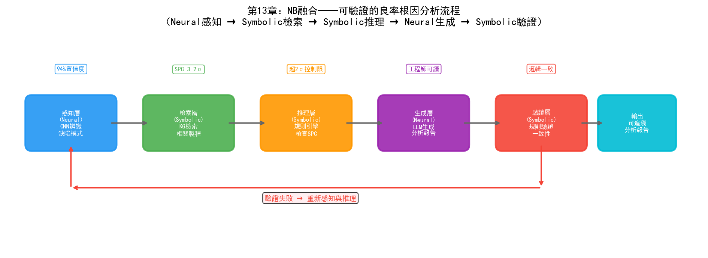
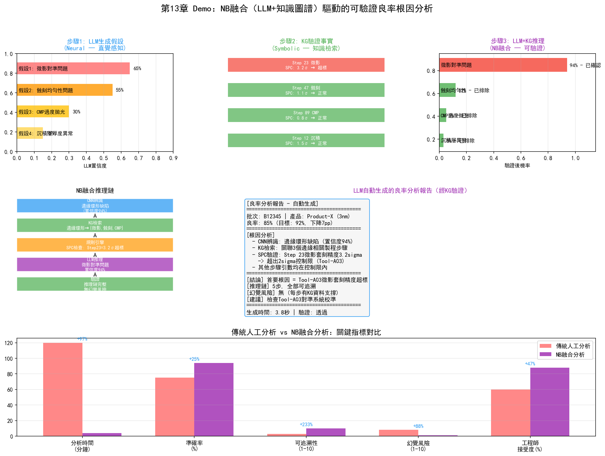

# 第18章 NB（Neural + Symbolic）——神經符號融合在晶圓廠的應用

## 18.1 核心思路：直覺與理性的結合

NB融合的核心思路是：用連接主義模型做"直覺"和感知，用符號主義模型做"理性"和邏輯約束。

這個思路源自對人類認知的雙系統理論的類比。心理學家丹尼爾·卡尼曼在《思考，快與慢》中提出了人類認知的雙系統模型：

- **系統1（快思考）**：直覺性、無意識、快速——對應連接主義的深度學習
- **系統2（慢思考）**：邏輯性、有意識、慢速——對應符號主義的推理引擎

深度學習（系統1）擅長從海量資料中快速提取模式——"看到這張晶圓圖，直覺告訴我這是邊緣環形缺陷"。但它不擅長邏輯推理——"為什麼是邊緣環形？因為邊緣環形缺陷的根因通常是蝕刻腔體邊緣效應，而當前這臺設備的邊緣效應參數在上週PM後偏移了0.3%"——這種因果推理需要符號主義的知識圖譜和推理規則。

NB融合的目標是讓AI同時具備"直覺感知"和"理性推理"的能力——讓"快思考"負責辨識模式、生成假設，讓"慢思考"負責驗證事實、約束推理。

## 18.2 技術路徑

### 路徑一：LLM + 知識圖譜（RAG與Tool Use）

這是當前最主流的NB融合路徑。大語言模型（連接主義）作為"直覺"引擎——理解自然語言、生成假設、辨識模式。知識圖譜（符號主義）作為"理性"引擎——提供事實約束、邏輯規則、可驗證的推理鏈。

```
工程师提问："批次B12345良率下降的可能原因是什么？"

步骤1（LLM直觉）：
  LLM理解问题，生成初步假设——
  "可能是光刻对准问题、刻蚀均匀性问题或CMP过度抛光"

步骤2（KG验证）：
  知识图谱检索该批次的工艺历史——
  B12345经过Step 23（光刻）时设备Tool-A03的套刻精度SPC值为3.2σ
  B12345经过Step 47（刻蚀）时腔体压力偏离基准0.15mTorr
  B12345经过Step 89（CMP）时抛光量在目标范围内

步骤3（LLM+KG推理）：
  LLM结合KG返回的事实进行推理——
  "套刻精度3.2σ超出2σ控制限，是首要怀疑对象。
   该设备上周PM后基准偏移0.05μm，可能导致套刻精度漂移。
   建议检查Tool-A03的对准系统校准状态。"

步骤4（验证）：
  推理链可追溯——每个结论都有KG中的数据支撑
  没有幻觉——LLM不能编造KG中不存在的事实
```

這種"LLM生成假設→KG驗證事實→LLM結合事實推理"的迴圈，是NB融合在晶圓廠中最自然的落地方式。

### 路徑二：思維鏈（Chain-of-Thought, CoT）

思維鏈是NB融合的一種更輕量級的實現。不依賴外部知識圖譜，而是在LLM的推理過程中顯式注入邏輯步驟——讓模型"一步一步思考"。

```
CoT输出：
  "让我一步步分析：
   1. 良率从92%降到85%，下降了7个百分点——非随机波动
   2. 晶圆图模式显示边缘环形缺陷——指向边缘相关工艺
   3. 涉及边缘的工艺步骤：Step 23（光刻）、Step 47（刻蚀边缘）、Step 89（CMP边缘）
   4. SPC数据显示Step 23的套刻精度为3.2σ——超出控制限
   5. 其他步骤参数在控制限内
   结论：首要根因是Step 23光刻的套刻精度超标"
```

CoT的本質是用自然語言模擬符號推理的過程——將隱含的推理步驟顯式化。

### 路徑三：神經符號約束學習

更深層的NB融合是在模型架構層面將符號約束嵌入類神經網路——在訓練過程中用符號規則約束類神經網路的輸出空間。

例如，在晶圓圖缺陷分類中，可以定義符號約束：

- "如果缺陷呈環形分佈且位於晶圓邊緣，則根因類別只能是{蝕刻邊緣效應, 微影邊緣效應, CMP邊緣效應}"
- "如果同一批次的多片晶圓都出現相同模式，則根因是設備級而非批次級"

這些約束在訓練時作為正則化項——懲罰違反約束的輸出。在推理時作為後處理——過濾掉不符合約束的預測。

## 18.3 在PID/YED中的應用



*圖：NB融合的可驗證良率根因分析流程——Neural感知→Symbolic檢索→Symbolic推理→Neural生成→Symbolic驗證*

### 可驗證的良率根因分析

傳統連接主義模型（如CNN晶圓圖分類）可以辨識缺陷模式，但無法給出根因——它只說"這是邊緣環形缺陷"，不說"為什麼"。NB融合方案構建了一條完整的可驗證推理鏈：

```
CNN识别模式 → 知识图谱检索相关工艺参数 → 规则引擎推理根因 → LLM生成自然语言报告
```

具體流程：

1. **感知層（Neural）**：CNN對晶圓圖進行分類，輸出"邊緣環形缺陷，置信度94%"
2. **檢索層（Symbolic）**：知識圖譜根據缺陷型別檢索所有可能導致邊緣環形的製程步驟和設備
3. **推理層（Symbolic）**：規則引擎檢查這些步驟的SPC資料——"Step 23的套刻精度為3.2σ，超出2σ控制限"
4. **生成層（Neural）**：LLM將推理結果轉化為工程師可讀的分析報告

整條推理鏈可追溯、可驗證、可解釋——每個結論都有KG中的資料支撐，不存在LLM幻覺風險。

### 缺陷分類與領域知識約束

傳統CNN分類器可能輸出違反製程常識的結果——例如將CMP導致的缺陷分類為微影缺陷。NB融合透過符號約束解決：

- 在訓練階段：將"缺陷位置→可能製程步驟"的映射規則編碼為損失函數的約束項
- 在推理階段：CNN輸出機率分佈後，用規則過濾不可能的組合
- 結果：分類準確率提升的同時，邏輯一致性也得到保證

### 良率報告的自動生成與驗證

YED工程師每週需要撰寫良率分析報告——這傳統上是一個耗時的人工任務。NB融合方案：

- LLM從MES、YMS、FDC中自動提取本週良率資料和異常事件，生成報告初稿
- 知識圖譜驗證報告中的每個資料點——"報告中說Tool-A03的OEE是85%，KG中該設備本週OEE確實為85.2%"
- 規則引擎檢查報告的邏輯一致性——"報告說良率下降由蝕刻導致，但SPC資料顯示蝕刻參數在控制限內，提示矛盾"
- LLM根據驗證回饋修正報告

## 18.4 在MFG中的應用

### 跨系統資料問答

MFG管理者經常需要跨系統查詢資訊："Tool-A03上週的產能利用率是多少？它處理了哪些產品？有沒有異常停機？"

這些資訊散落在MES（批次記錄）、FDC（設備狀態）、ERP（工單資訊）和維護系統（PM記錄）中。NB融合方案：

- LLM理解自然語言提問，分解為子查詢
- 知識圖譜將子查詢映射到對應系統並運行精確檢索
- LLM將多個系統的返回結果整合為連貫的回答

這種方案比傳統BI儀表盤更靈活——儀表盤只能展示預設的指標，而NB方案能回答任意問題。

### 生產報表自動化與合規驗證

MFG需要每日生成生產日報——包含產出、良率、設備利用率、異常事件等。傳統方式是工程師從多個系統匯出資料，手工填入報表。

NB融合方案：

- LLM自動從各系統提取資料並生成報表文字
- 知識圖譜驗證報表資料的完整性和一致性——"今天的產出比昨天少15%，是否因為Tool-B05的PM導致？"
- 規則引擎檢查報表是否遺漏必要資訊——"今天有3批次異常但報表中只提到2批"

### 派工規則與ML預測的融合

傳統派工系統使用固定規則（FIFO、EDD等），不考慮產線的即時狀態。NB融合方案：

- 連接主義模型（LSTM）預測未來2小時的WIP分佈和瓶頸位置
- 符號引擎（規則+約束）將預測結果轉化為派工建議——"預測Step 45將在2小時後出現WIP積壓，建議現在將批次B優先派遣到Step 45"
- 規則引擎確保派工建議滿足製程約束——"批次B必須先經過Step 30才能到Step 45"

## 18.5 在PE/EE中的應用

### 設備故障的"感知+診斷"

當設備出現異常時，傳統流程是：FDC系統發出告警→EE工程師檢視FDC資料→憑經驗判斷故障型別→查閱設備手冊確認→運行維修。

NB融合方案將這個流程自動化：

- **感知（Neural）**：LSTM從FDC時序訊號中檢測到異常模式——"RF功率在最後30秒出現振盪"
- **診斷（Symbolic）**：知識圖譜檢索該異常模式對應的可能故障——"RF功率振盪可能原因：匹配器老化、電纜接觸不良、腔體內等離子體不穩定"
- **驗證（Symbolic）**：規則引擎檢查相關感測器資料——"反射功率同步增大，指向匹配器老化"
- **建議（Neural）**：LLM生成維修建議——"建議檢查RF匹配器的阻抗特性，優先測量匹配器電容值"

### Recipe最佳化與知識約束

PE在最佳化Recipe參數時，需要確保調整不違反製程約束——某些參數組合雖然模型預測良率更高，但可能超出設備的安全操作範圍。

NB融合方案：

- 連接主義模型（類神經網路）預測不同參數組合下的製程結果
- 符號約束（製程規則）定義安全操作邊界——"RF功率不能超過500W，腔體壓力不能低於5mTorr"
- 模型在約束空間內搜尋最優參數——既最佳化效能又不違反安全約束

### SPEC文件的智慧檢索與合規檢查

晶圓廠的SPEC文件是符號化的——明確定義了每步製程的參數範圍和操作規則。但工程師在實際操作中可能遺漏或誤解SPEC。

NB融合方案：

- LLM理解工程師的自然語言操作意圖——"我想把蝕刻功率從300W調到350W"
- 知識圖譜中的SPEC規則驗證合規性——"Step 47的蝕刻功率SPEC上限為320W，350W超限"
- 如果違規，LLM生成解釋性告警——"該步驟的功率SPEC上限為320W，建議調整到310W並驗證蝕刻速率變化"

## 18.6 實踐案例

### 三星：知識圖譜+LLM的感測器異常偵測

三星在自主半導體製造系統中使用KG+LLM實現了感測器命名對齊和異常偵測。當設備維護後感測器訊號發生變化時，知識圖譜的社群檢測幫助辨識感測器間網路關係的微妙變化——發現了傳統分析未發現的反應室外膜片感測器異常。三星的自主故障維護系統覆蓋762臺微影設備、處理超過85,000次真實故障，MTTR減少7分鐘。

### yieldWerx：根因知識圖譜

yieldWerx的Root Cause Knowledge Graphs產品將KG直接應用於良率分析——視覺化引導使用者沿加權路徑辨識低良率批次的根因，AI和ML演算法將分析時間從數小時縮短到分鐘級。

### IKAS：Smart RCA平台

IKAS的Smart RCA平台融合多源資料（FDC、SPC、MES、YMS），使用Golden Tool/Path對比和AI關聯分析——根因辨識時間減少超過80%。

### Palantir AIP：NB融合的工業級架構

Palantir的AIP平台是NB融合在工業領域最系統化的實踐——LLM（Neural）與Ontology（Symbolic）在架構層面統一。AIP的雙支柱架構（知識樹+ML）使得LLM的每一步推理都基於Ontology中的結構化資料，實現了"可驗證的AI推理"。

## 18.7 Demo視覺化：NB融合（LLM+知識圖譜）驅動的可驗證良率分析



*Demo說明：上排展示了LLM假設生成→KG驗證→推理結果的三步流程，中排為推理鏈視覺化和LLM自動生成的分析報告，下排為傳統人工分析與NB融合分析的指標對比。模擬指令碼見 `demos/demo_ch18_nb_fusion.py`。*

---

NB融合在晶圓廠的價值核心是"可驗證性"——讓AI的分析結論不再是黑箱預測，而是每一步都有資料支撐和邏輯推理的可追溯鏈條。這對於良率分析、故障診斷等高可靠性場景至關重要——在這些場景中，一個錯誤的結論可能導致數百萬美元的損失。
