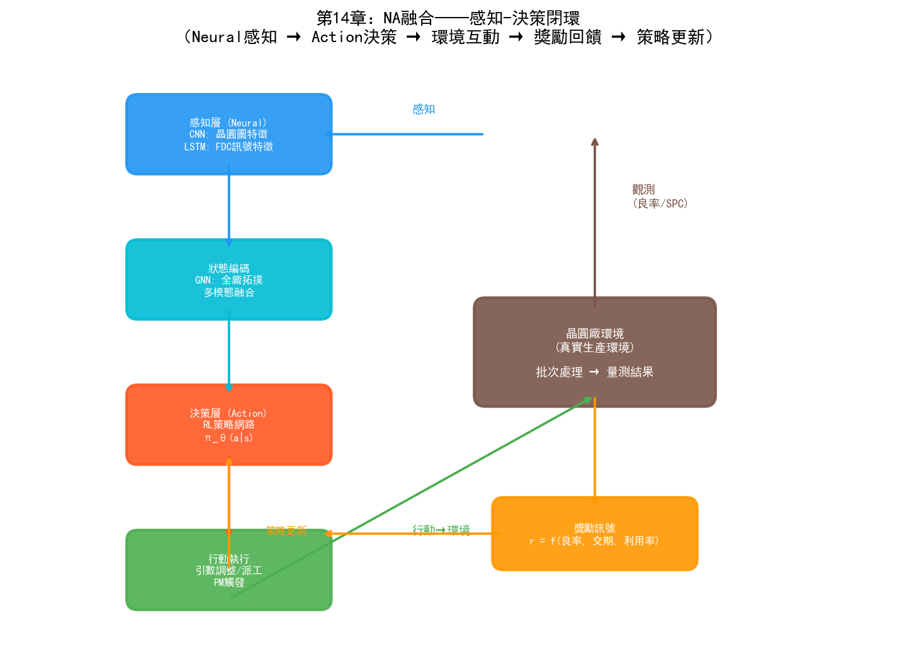
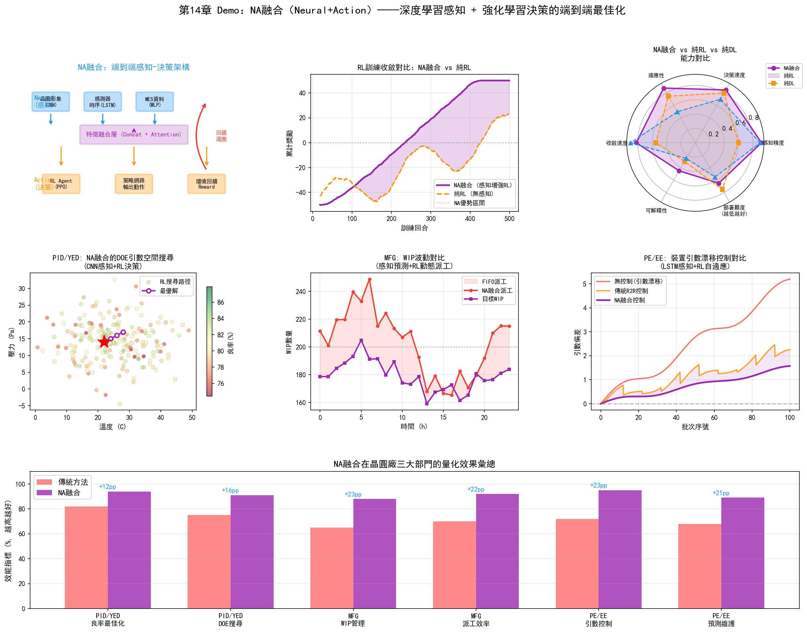
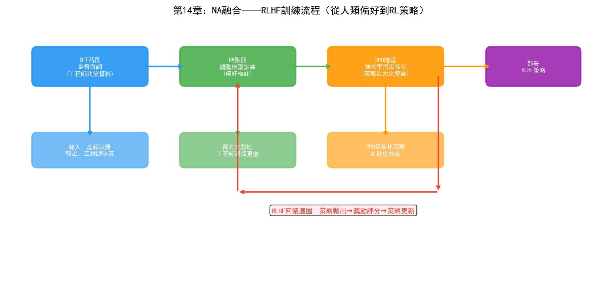

# 第19章 NA（Neural + Action）——神經行為融合在晶圓廠的應用

## 19.1 核心思路：感知與決策的結合

NA融合的核心思路是：用深度學習（連接主義）做"感知"——從高維感測資料中提取狀態表徵；用強化學習（行為主義）做"決策"——基於狀態表徵選擇最優行動。

這兩者的結合源於一個根本性的互補關係：

- **深度學習擅長"看懂"但不擅長"做對"**：CNN可以從晶圓圖中辨識缺陷模式，LSTM可以從FDC訊號中檢測異常，但它們只能輸出分類或預測，不能輸出"下一步該做什麼"。
- **強化學習擅長"做對"但需要"看懂"**：RL的MDP框架需要精確的狀態輸入 $s_t$，但在真實環境中，原始感測資料（影象、時序訊號、文字）維度太高、噪聲太大，RL無法直接處理。

NA融合的本質是：**深度學習將高維原始資料壓縮為低維狀態表徵，強化學習基於這個表徵做序貫決策**。這種"感知→決策"的閉環在自然界早已存在——人類的眼睛（感知）將視覺資訊傳遞給大腦（決策），大腦決定身體的下一步行動。

在晶圓廠的語境下，NA融合意味著：AI不僅"看得懂"晶圓圖、FDC訊號、MES資料，還能在這些感知的基礎上做出"下一批該派到哪臺設備""Recipe參數該怎麼調""設備什麼時候該做PM"等決策。

## 19.2 技術路徑



*圖：NA融合的感知-決策閉環——Neural感知→Action決策→環境互動→獎勵回饋→策略更新*

### 路徑一：Deep RL（深度強化學習）

Deep RL是NA融合最經典的技術路徑——將深度類神經網路作為RL的策略函數或價值函數，使RL能夠處理高維狀態空間。

```
传统RL的局限：
  状态空间 S = {设备状态, WIP分布, 工艺进度, ...}
  如果用离散编码，状态空间维度有限但信息丢失严重
  如果用连续编码，传统RL（如表格法Q-Learning）无法处理

Deep RL的解法：
  深度神经网络 φ(s) 将原始状态 s 映射为低维特征
  策略网络 π_θ(a|φ(s)) 基于特征输出行动概率
  价值网络 V_θ(φ(s)) 评估当前状态的价值
  
  感知层（Neural）：CNN/LSTM/Transformer 编码原始数据
  决策层（Action）：RL策略网络选择行动
```

在晶圓廠中的典型應用：

- **晶圓圖感知 + RL決策**：CNN將晶圓圖編碼為缺陷特徵向量，RL策略基於缺陷特徵決定是否需要停線檢查、調整參數或繼續生產
- **FDC訊號感知 + RL控制**：LSTM/Transformer編碼FDC時序訊號為設備健康狀態向量，RL策略基於健康狀態決定設備排程和PM時機
- **多源資料感知 + RL排程**：圖類神經網路（GNN）編碼全廠狀態（設備、WIP、批次），RL策略輸出派工決策

### 路徑二：RLHF（基於人類回饋的強化學習）

RLHF是NA融合在語言模型領域的標誌性突破——ChatGPT的成功很大程度上歸功於RLHF。其核心思想是：用人類偏好資料訓練獎勵模型（Neural），再用RL最佳化策略（Action）。

在晶圓廠中，RLHF的思路可以這樣遷移：

```
步骤1：监督微调（SFT）
  用资深工程师的决策记录训练初始策略
  输入：产线状态描述
  输出：工程师实际做出的决策（派工、参数调整、PM安排）
  模型学习模仿专家决策

步骤2：奖励模型训练
  收集工程师对AI决策的偏好标注
  呈现两个决策方案，工程师选择更好的一个
  训练奖励模型预测人类偏好

步骤3：强化学习优化
  用PPO等算法优化策略，使奖励模型打分最大化
  策略学会生成"人类专家会认可"的决策
```

RLHF的價值在於：晶圓廠的很多決策沒有明確的"最優解"——派工策略需要在交期、利用率、良率之間做權衡，這些權衡依賴於工廠的戰略偏好和工程師的經驗直覺。RLHF將這種隱性偏好編碼到獎勵模型中，使RL策略不僅"數學最優"，還"符合工廠實際營運習慣"。

### 路徑三：端到端感知-決策系統

端到端系統將感知和決策統一在一個類神經網路中訓練——從原始輸入直接到行動輸出，無需人工設計中間特徵。

```
传统流水线架构：
  传感数据 → 特征工程（人工） → 状态表示 → RL决策
  
端到端架构：
  传感数据 → [统一的神经网络] → 行动输出
               ↑ 感知层与决策层联合训练
```

在自動駕駛領域，端到端架構（如NVIDIA的PilotNet）已經證明了從原始畫素直接到方向盤角度的可行性。在晶圓廠中，端到端架構的典型場景是：

- **晶圓圖直接到參數調整**：輸入晶圓圖影象，直接輸出Recipe參數調整建議，無需先做缺陷分類再做根因分析
- **FDC訊號直接到控制指令**：輸入設備時序訊號，直接輸出控制參數調整量
- **全廠狀態直接到派工指令**：輸入全廠即時狀態，直接輸出每臺設備的下一批分配

端到端的優勢是避免了流水線中各環節誤差的累積。但劣勢是可解釋性更差——當系統出錯時，很難定位是感知層還是決策層的問題。因此在晶圓廠中，端到端系統更適合作為"建議系統"——為工程師提供決策參考，而非直接控制產線。

## 19.3 在PID/YED中的應用

### 良率預測+參數最佳化

傳統方法中，良率預測（連接主義）和參數最佳化（行為主義）是分離的——先用ML模型預測良率，再用最佳化演算法在模型空間中搜尋最優參數。NA融合將兩者打通：

```
感知层（Neural）：
  GNN编码当前工艺参数和设备状态为状态向量 s_t
  
决策层（Action/RL）：
  策略 π_θ(a|s_t) 输出参数调整建议 a_t
  
环境反馈：
  下一批次的WAT/CP良率作为奖励 r_t
  
闭环：
  良率预测模型和RL策略联合优化——
  预测模型为RL提供"如果这样调，良率可能变成多少"的预判
  RL策略为预测模型提供"在当前状态下应该怎么调"的行动
```

這種方法相比傳統Bayesian Optimization的優勢在於：RL策略可以同時考慮多批次的歷史效應——例如"前3批的參數調整趨勢""距上次PM的批次數""設備老化程度"等序貫資訊，而貝葉斯最佳化通常只考慮當前參數到結果的映射。

### 基於感知的DOE自適應搜尋

第16章討論了RL在DOE參數搜尋中的應用。NA融合在此基礎上增加了感知能力：

- **視覺感知引導**：CNN分析前幾輪DOE實驗的晶圓圖，提取缺陷模式特徵，RL策略基於缺陷特徵調整下一輪參數搜尋方向——"上一輪在高溫方向出現了邊緣缺陷，RL應該向低溫方向搜尋"
- **FDC感知引導**：LSTM分析DOE實驗的FDC訊號，檢測異常模式，RL策略避開導致設備不穩定的參數區域
- **多模態感知引導**：同時融合晶圓圖、FDC訊號、WAT資料的感知特徵，RL策略在多維感知空間中搜尋最優製程視窗

### 良率異常的自動回應決策

當良率下降被檢測到時，NA融合系統可以自動做出回應決策：

```
感知（Neural）：
  CNN识别晶圆图异常模式 → "边缘环形缺陷"
  LSTM分析FDC信号 → "Step 47刻蚀腔体压力有0.2mTorr漂移"
  GNN分析批次间关联 → "同设备处理的3批都受影响"

决策（Action/RL）：
  RL策略基于综合感知状态输出行动方案——
  "建议：(1) 暂停Tool-A03的后续批次, (2) 将待处理批次重派到Tool-A05,
   (3) 对Tool-A03执行紧急PM, (4) 调整Step 47的腔体压力基准+0.2mTorr"

验证：
  下一批次的良率作为RL策略的奖励信号
  如果良率恢复，策略得到正反馈；如果未恢复，策略得到负反馈并调整
```

這種"感知→決策→驗證→學習"的閉環使良率異常回應從"人工分析數小時"變為"AI秒級建議+人工確認"。

## 19.4 在MFG中的應用

### 端到端智慧派工

第16章討論了基於RL的智慧派工。NA融合將感知能力注入派工系統，使其從"基於結構化狀態"升級為"基於多模態感知"：

```
传统RL派工：
  状态 = {各设备队列长度, 各批次交期, 设备状态}
  局限：只能用结构化数值，无法利用图像、信号等原始数据

NA融合派工：
  感知层：
    - GNN编码全厂设备-WIP拓扑图 → 瓶颈识别特征
    - LSTM编码各设备最近24小时的FDC信号 → 设备健康度特征
    - Transformer编码各批次的工艺路线和进度 → 批次紧迫度特征
  
  决策层：
    RL策略融合上述感知特征，输出每台空闲设备的下一批选择
    
  优势：
    - 感知到设备的微妙退化趋势，提前避开不健康设备
    - 识别WIP流动的瓶颈模式，主动调整派工策略
    - 从批次工艺路线中学习"哪类产品在哪种设备组合上效果最好"
```

### 基於視覺感知的WIP管理

NA融合可以將電腦視覺引入WIP管理——這不僅限於數字層面的排程，還包括物理層面的感知：

- **晶圓盒RFID/視覺辨識**：CNN從天車系統攝像頭辨識晶圓盒標識和位置，RL策略基於即時物理位置最佳化天車搬運路徑
- **設備前佇列視覺監控**：CNN監控設備前的WIP佇列長度和晶圓盒排列狀態，RL策略動態調整派工優先順序
- **產線全景感知**：多個攝像頭覆蓋產線關鍵節點，CNN即時感知全廠物料流動狀態，RL策略在全域視角下最佳化WIP分佈

### 生產計畫的動態調整

生產計畫（長期排程）通常由APS系統生成，但實際運行中經常需要根據產線狀態動態調整。NA融合方案：

- **感知層**：深度學習模型即時預測未來2-4小時的WIP分佈、瓶頸位置和設備可用性
- **決策層**：RL策略基於預測結果調整短期計畫——將原定在Tool-A03處理的批次提前重派到Tool-A05，避免預測中的瓶頸
- **閉環**：實際運行結果回饋給感知模型，更新預測準確性；RL策略根據運行效果持續最佳化調整策略

## 19.5 在PE/EE中的應用

### 設備即時自適應控制

這是NA融合在PE/EE中最直接的應用——用深度學習感知設備狀態，用RL即時調整設備參數：

```
感知层（Neural）：
  传感器原始信号（RF功率、腔体压力、温度、气体流量）
  → LSTM/Transformer编码为设备状态特征向量
  
  状态特征包括：
  - 当前工艺参数的偏差程度
  - 设备部件的退化趋势
  - 腔体环境的稳定性
  - 上一批次的处理效果

决策层（Action/RL）：
  RL策略网络 π_θ(a|s) 输出参数调整量
  
  调整范围：
  - RF功率微调（±2%）
  - 腔体压力微调（±0.1mTorr）
  - 气体流量微调（±1sccm）
  - 温度微调（±0.5°C）

闭环：
  每批次结束后，量测结果作为奖励信号
  RL策略持续学习最优的微调策略
  
  目标：在设备老化的过程中，保持工艺输出的稳定性
```

這種方法與傳統R2R控制（EWMA等）的區別在於：EWMA只能處理單參數的線性漂移，而NA融合方案可以同時處理多參數耦合的非線性漂移——因為深度學習能感知多參數間的互動模式，RL能在多參數空間中搜尋最優調整組合。

### 基於感知的預測性維護決策

預測性維護（PdM）傳統上分為兩步：先用ML預測設備何時會出故障，再由人工決定何時做PM。NA融合將兩步打通：

- **感知層（Neural）**：LSTM從FDC訊號、振動資料、溫度資料中提取設備健康特徵，預測剩餘使用壽命（RUL）
- **決策層（Action/RL）**：RL策略基於RUL預測和當前產線狀態，決定最優PM時機——"Tool-A03的RUL預測為72小時，但明天有3個高優先順序批次需要它處理，RL策略建議在第3批完成後（約48小時後）運行PM"

RL策略最佳化的目標函數同時考慮：
- PM的及時性（避免故障停機損失）
- PM對生產的影響（選擇對產能衝擊最小的時間視窗）
- PM資源的約束（維護工程師和備件的可用性）

### R2R控制的端到端最佳化

NA融合將R2R控制從"先檢測再調整"的分步流程升級為端到端最佳化：

```
传统R2R：
  量测 → 误差计算 → EWMA调整 → 参数下发
  
NA融合R2R：
  FDC信号 + 量测数据 + 设备状态
  → [端到端神经网络] → 参数调整量
  
  神经网络同时学习：
  - 从FDC信号中感知设备状态变化（感知层）
  - 从量测历史中学习漂移模式（感知层）
  - 基于感知状态决定最优调整量（决策层/RL）
  
  优势：无需人工设计特征，神经网络自动发现
  "FDC信号中的哪个频率分量"与"下一批的量测偏差"相关
```

## 19.6 實踐案例

### AISSI專案：深度RL在工廠排程中的產線驗證

AISSI（AI-Based Scheduling System for Industry）專案是深度RL在半導體排程領域最系統的產線驗證之一。該專案在真實晶圓廠資料集上驗證了Deep RL的排程效果：

- **感知層**：GNN編碼設備-WIP拓撲狀態，LSTM編碼各設備的歷史負載模式
- **決策層**：基於PPO演算法的策略網路，在每步決策中為空閒設備選擇下一批晶圓
- **驗證結果**：在真實工業資料集上，Deep RL排程相比傳統啟發式規則（FIFO、EDD等），平均交期縮短4-8%，瓶頸設備利用率提升3-5%
- **關鍵發現**：感知層的品質是決定RL策略效果的關鍵——更豐富的狀態編碼（包括FDC訊號和設備健康特徵）顯著提升了排程品質

### Google DeepMind AlphaChip：感知-決策的晶片設計

雖然AlphaChip主要用於晶片佈線設計而非晶圓製造，但它是NA融合在半導體領域的里程碑案例：

- **感知層（Neural）**：深度類神經網路學習晶片佈局的模式特徵——"什麼樣的佈線模式會導致訊號干擾"
- **決策層（Action/RL）**：RL策略在佈局空間中搜尋最優的元件放置方案
- **成果**：AlphaChip生成的佈局在功耗、效能和麵積（PPA）上達到了人類專家水平，部分指標超越人類設計
- **啟示**：NA融合在半導體領域的潛力遠超排程和控制——任何涉及"從高維資料中感知狀態→在複雜空間中做決策"的問題都適用

### 三星：自主故障維護系統

三星的自主故障維護系統融合了深度學習感知和強化學習決策：

- **感知層**：深度學習模型從762臺微影設備的FDC訊號中檢測異常模式
- **決策層**：圖分析+RL策略決定故障回應方案——隔離故障設備、重派受影響批次、觸發維護流程
- **成果**：系統處理超過85,000次真實故障，MTTR減少7分鐘
- **NA融合體現**：感知層（Deep Learning檢測異常）和決策層（圖分析+RL決定回應方案）形成閉環——感知到異常後立即觸發決策，決策運行後回饋給感知層更新

### NVIDIA：cuLitho + Metropolis的感知-決策閉環

NVIDIA的平台將計算微影（cuLitho）和智慧影片分析（Metropolis）結合，形成NA融合架構：

- **感知層（Neural）**：Metropolis的深度學習模型從檢測設備影象和製程資料中感知微影過程中的偏差模式
- **決策層（Action）**：cuLitho的GPU加速計算微影引擎基於感知結果調整掩膜版（OPC）參數
- **閉環**：感知到掩膜版與實際製程的偏差→決策層調整OPC參數→下一批次驗證效果→持續最佳化

### Lam Research：Equipment AI的感知-控制融合

Lam Research的設備AI平台在蝕刻設備上實現了NA融合：

- **感知層**：深度學習模型從設備的RF感測器、壓力感測器、溫度感測器的時序訊號中提取等離子體狀態特徵
- **決策層**：RL策略基於等離子體狀態特徵即時調整RF匹配網路參數，維持等離子體穩定性
- **效果**：在設備老化的過程中，自動補償參數漂移，延長PM間隔，減少因參數漂移導致的良率波動

---

NA融合在晶圓廠的價值核心是"閉環最佳化"——讓AI不僅"看得到"問題，還能"做得到"調整，並且從調整結果中持續學習。這種感知-決策的閉環是邁向自主製造的基礎——當感知和決策之間的延遲足夠短、準確率足夠高時，AI就從"輔助工具"升級為"自主代理"。

但NA融合也面臨一個關鍵挑戰：**安全性和可解釋性**。RL策略的決策過程是黑箱的——"為什麼RL建議把批次B派到Tool-A05而不是Tool-A03？"在晶圓廠中，一個錯誤的派工決策可能導致數百萬美元的損失。因此NA融合系統在晶圓廠中通常以"建議+人工確認"模式部署，而非完全自主運行。如何讓RL策略的決策可解釋、可審計、可回溯，是NA融合從研究走向量產的關鍵瓶頸。

## 19.7 Demo視覺化：NA融合端到端最佳化



*Demo說明：左上為端到端感知-決策架構圖，中上為RL訓練收斂對比（NA融合 vs 純RL），右上為能力雷達圖。中排分別為PID/YED的DOE參數搜尋、MFG的WIP波動對比、PE/EE的設備漂移控制。底部為三大部門量化效果彙總。模擬指令碼見 `demos/demo_ch19_na_fusion.py`。*


