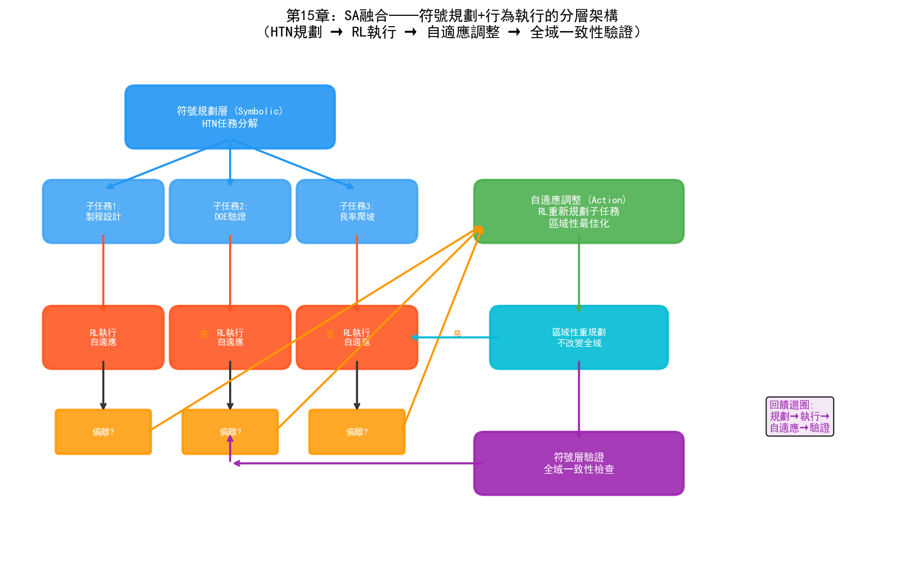
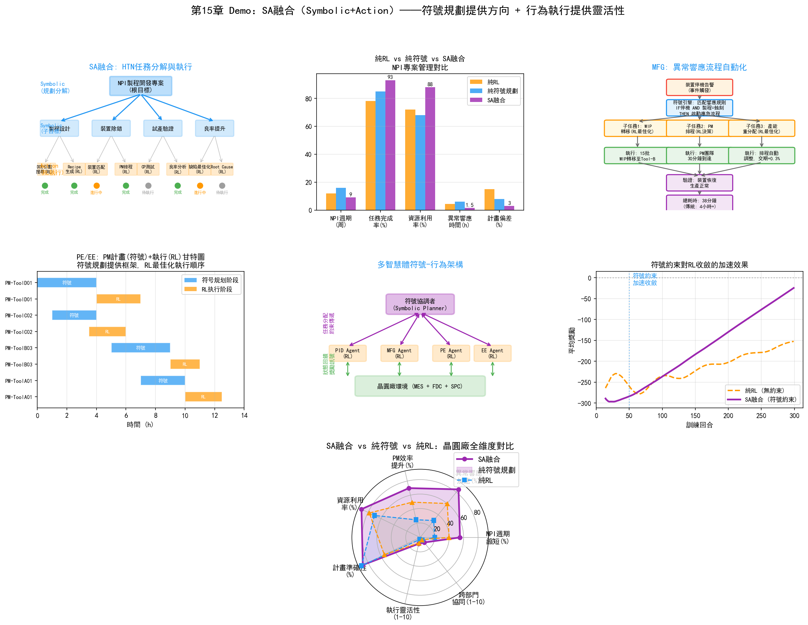
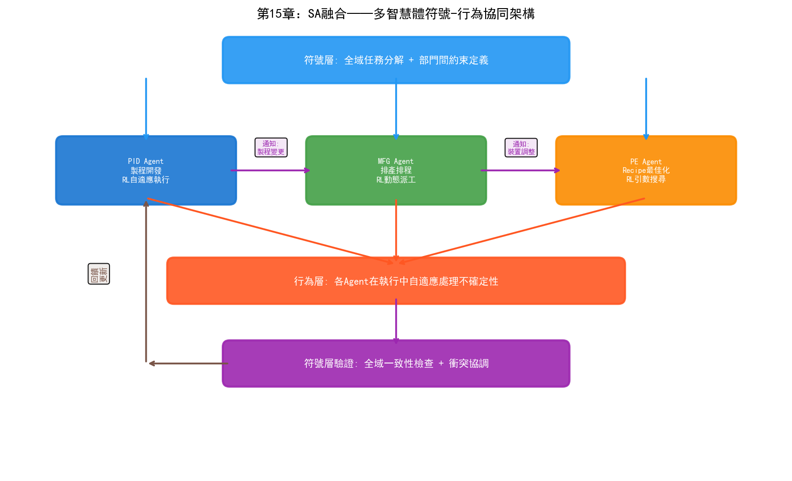

# 第20章 SA（Symbolic + Action）——符號行為融合在晶圓廠的應用

## 20.1 核心思路：規劃與執行的結合

SA融合的核心思路是：用符號主義做"規劃"——將複雜目標分解為有序的任務序列；用行為主義做"執行"——在不確定性環境中自適應地完成每個任務。

這個思路源於人類處理複雜任務的自然模式。以"做一頓晚餐"為例：先規劃選單（符號規劃——確定要做哪幾道菜、按什麼順序做），再在執行中根據實際情況調整（行為執行——發現鹽不夠了就減量，發現火大了就調小）。規劃提供"方向感"，執行提供"靈活性"。

在AI中，這兩種能力長期分離：

- **符號規劃系統**（如HTN、STRIPS規劃器）擅長將"造一個新產品"分解為"設計製程流程→定義DOE→執行實驗→分析結果→調整製程"的有序任務序列。但它們假設環境是確定性的——一旦執行中出現意外（設備故障、參數偏移），規劃器無法自適應。
- **強化學習系統**擅長在不確定性中做序貫決策，但缺乏"全域規劃"能力——RL策略通常是反應式的，"看到當前狀態就做決策"，不擅長處理需要多步驟協調的複雜目標。

SA融合的本質是：**符號規劃提供全域結構和任務分解，行為執行在每個子任務中自適應處理不確定性**。這種"規劃-執行"分層架構在軟體工程中早已司空見慣（高層設計與底層實現的分離），在AI中則是走向自主系統的關鍵。

## 20.2 技術路徑



*圖：SA融合的符號規劃+行為執行分層架構——HTN規劃→RL執行→自適應調整→全域一致性驗證*

### 路徑一：符號規劃+RL執行

這是SA融合最直接的技術路徑——符號規劃器生成任務序列，RL策略執行每個子任務：

```
输入目标："在4周内完成新工艺的DOE验证"

符号规划层（Symbolic）：
  HTN（层次任务网络）将目标分解为：
  
  1. 工艺窗口定义
     1.1 收集参考工艺参数
     1.2 定义关键参数范围
     1.3 生成初始DOE方案
  2. 实验执行
     2.1 分配实验晶圆
     2.2 调度设备时间
     2.3 执行DOE批次
  3. 结果分析
     3.1 量测WAT/CP
     3.2 分析参数-良率关系
     3.3 识别最优参数窗口
  4. 验证与固化
     4.1 用最优参数运行验证批次
     4.2 确认良率达标
     4.3 更新SPEC

执行层（Action/RL）：
  每个子任务由RL策略执行——
  子任务2.3"执行DOE批次"中：
    RL策略基于当前产线状态选择最优执行顺序
    如果Tool-A03突然故障，RL自适应调整到Tool-A05
    如果某批次结果异常，RL决定是否需要追加实验
```

符號規劃和RL執行的分工邊界是：**規劃器決定"做什麼"和"按什麼順序做"，RL策略決定"怎麼做"並在執行中處理不確定性**。

### 路徑二：HTN+自適應執行

HTN（Hierarchical Task Network，層次任務網路）是符號規劃的經典方法，它透過遞迴分解將複雜目標分解為可執行的原子任務。SA融合在HTN的執行層引入自適應能力：

```
HTN规划：
  根目标：提升某产品良率从90%到95%
  
  分解层次1（战略级）：
    → 工艺参数优化
    → 缺陷模式改善
    → 设备稳定性提升
  
  分解层次2（战术级）：
    工艺参数优化 → 刻蚀参数调优 + 光刻参数调优 + CMP参数调优
    缺陷模式改善 → 颗粒缺陷控制 + 刻面缺陷控制
    设备稳定性提升 → PM频率优化 + Tool Matching
  
  分解层次3（执行级）：
    刻蚀参数调优 → DOE设计 + 实验执行 + 结果分析 + 参数固化
    
自适应执行：
  每个执行级任务由行为主义模型执行——
  
  "实验执行"任务中：
    预设：在Tool-A03上运行5组参数
    执行中：Tool-A03突发PM需求
    自适应：RL策略决定——
      方案A：等待Tool-A03 PM完成后继续（时间成本高）
      方案B：转移到Tool-A05执行（需要Tool Matching验证）
      方案C：调整实验顺序先做不依赖Tool-A03的部分
    选择：基于对产线状态和DOE进度综合评估，选择方案B
```

HTN+自適應執行的關鍵優勢是：**當執行偏離計畫時，不需要重新規劃整個任務序列，只需要在受影響的子任務中做自適應調整**。這大大降低了系統的響應延遲。

### 路徑三：多智慧體符號-行為架構

在晶圓廠中，很多工涉及多個部門協同——NPI流程需要PID、MFG、PE/EE同時參與。多智慧體架構將SA融合擴充套件到多智慧體場景：

```
符号层：全局任务分解与分配
  目标："新产品NPI按期量产"
  
  分解为部门级任务：
    PID Agent：工艺开发与验证
    MFG Agent：产能规划与排产
    PE Agent：Recipe开发与固化
    EE Agent：设备准备与PM计划
  
  符号约束定义部门间依赖关系：
    MFG的排产必须在PID确认工艺流程之后
    PE的Recipe固化必须在PID的DOE验证通过之后
    EE的PM计划必须围绕MFG的排产安排

行为层：各Agent在执行中自适应
  PID Agent执行工艺开发时：
    发现某工艺步骤的窗口比预期窄
    → 自适应：扩大DOE范围，重新评估
    → 通知PE Agent：需要额外的Recipe优化
  
  MFG Agent执行排产时：
    发现某关键设备的OEE低于预期
    → 自适应：调整排产策略，增加备用设备
    → 通知EE Agent：设备需要PM
  
  EE Agent执行PM计划时：
    发现PM所需备件延迟到货
    → 自适应：调整PM顺序，先做不需要该备件的设备
    → 通知MFG Agent：设备可用时间延后
```

多智慧體符號-行為架構的關鍵是：**符號層定義"誰做什麼、什麼時候做"的全域結構，行為層允許每個Agent在執行中靈活調整，透過Agent間的通訊協調偏離**。

## 20.3 在PID/YED中的應用

### NPI專案管理與任務分解

NPI（新產品匯入）是晶圓廠最複雜的專案型別之一——涉及製程開發、設備驗證、良率爬坡、量產移交等多個階段，通常跨越6-18個月。SA融合將NPI管理從"人工甘特圖"升級為"自主規劃+自適應執行"：

```
符号规划（NPI主计划）：
  HTN将NPI分解为阶段-里程碑-任务三级结构：
  
  阶段1：工艺设计（0-3月）
    里程碑：工艺流程定义完成
    任务：工艺步骤设计、参数范围初定、设备能力评估
  
  阶段2：DOE验证（3-6月）
    里程碑：最优参数窗口确认
    任务：DOE设计、实验执行、结果分析、参数固化
  
  阶段3：良率爬坡（6-12月）
    里程碑：良率达到量产门槛（通常>90%）
    任务：缺陷改善、参数微调、设备匹配、批量验证
  
  阶段4：量产移交（12-15月）
    里程碑：量产Release
    任务：SPEC固化、操作SOP更新、人员培训

自适应执行：
  各阶段中的任务由RL/行为模型执行——
  
  阶段2"DOE验证"中的自适应：
    预设：5组DOE实验，每组3片晶圆
    执行中：第3组结果显示某参数方向偏差过大
    自适应：RL策略调整后续实验方案，在该参数方向增加更细粒度的实验点
    符号层验证：调整后的方案仍满足DOE的统计设计原则（正交性、旋转性）
```

### 製程開發流程的符號化編排

製程開發涉及大量需要按順序執行的步驟，且步驟間存在複雜的依賴關係。SA融合用符號規劃編排流程，用行為模型處理執行中的不確定性：

- **符號層定義製程開發的任務依賴圖**：例如"蝕刻參數最佳化"必須在"蝕刻Recipe初版"完成後才能開始，但可以與"微影參數最佳化"並行
- **行為層在每步執行中做自適應決策**：例如"蝕刻參數最佳化"中，RL策略基於實驗結果自適應調整參數搜尋方向
- **符號層監控全域一致性**：當某步的執行結果影響後續步驟的前提條件時，符號規劃器重新評估並調整後續計畫

### 良率提升專案的自動規劃與執行

良率提升（Yield Improvement, YI）專案通常是一個多目標最佳化問題——需要同時改善多個缺陷型別、協調多個部門的行動。SA融合方案：

- **符號規劃**：將YI目標分解為針對各缺陷型別的改善子專案，定義子專案間的優先順序和依賴關係
- **行為執行**：每個改善子專案由RL策略執行——在製程參數空間中搜尋改善方案，在設備排程中尋找最優方案
- **符號層協調**：當兩個子專案的方案衝突時（例如"減少蝕刻缺陷需要降低功率"但"提高蝕刻速率需要增加功率"），符號規劃器介入協調，基於全域良率目標決定折中方案

## 20.4 在MFG中的應用

### 異常響應流程自動化

晶圓廠每天發生大量異常事件——設備故障、參數超標、批次異常等。傳統流程是：操作員發現異常→通知工程師→工程師判斷影響→決定響應措施→執行。SA融合將這個流程自動化：

```
符号规划（异常响应SOP）：
  定义各类异常的标准响应流程：
  
  "设备突发故障"响应流程：
    1. 故障确认与隔离（自动）
    2. 影响评估：受影响批次、产能损失（自动）
    3. 批次重派决策（半自动）
    4. 维修调度（自动）
    5. 恢复验证（自动）
    6. 事件报告生成（自动）

自适应执行（行为层）：
  步骤3"批次重派决策"中：
    预设规则：受影响批次重派到同型号设备
    执行中：同型号设备Tool-A05的队列已满
    自适应：RL策略评估——
      等待Tool-A05（交期风险）vs 重派到Tool-A07（需要Tool Matching）
      基于各批次交期紧迫度和Tool Matching历史数据选择最优方案
    
  步骤4"维修调度"中：
    预设规则：通知EE工程师
    执行中：当前所有EE工程师都在处理其他故障
    自适应：RL策略基于故障严重度和工程师工作量做优先级排序
```

### 生產計畫的層級化分解與執行

生產計畫從月度到周度到日度再到即時派工，是一個多層級的分解過程。SA融合在這個層級化過程中發揮作用：

- **符號層（月度/周度計畫）**：HTN將月度生產目標分解為產品線-工序-設備級的生產任務，定義優先順序和交期約束
- **符號層（日度計畫）**：規則引擎將周度計畫細化為每日的具體批次安排，考慮設備PM計畫和工程實驗時間
- **行為層（即時派工）**：RL策略在每日計畫的框架內做即時派工決策，處理設備故障、緊急批次等動態事件

這種分層架構的優勢是：高層規劃提供全域最優的方向（符號層），底層執行提供區域性最優的靈活性（行為層），兩者透過約束傳遞和回饋修正實現協同。

### 跨部門協同的符號-行為排程

當生產活動需要跨部門協同時（例如工程實驗需要佔用生產設備時間），SA融合方案：

- **符號規劃**：定義跨部門協同的流程模板——"工程實驗申請→產能評估→時間視窗分配→實驗執行→產能恢復"
- **符號約束**：工程實驗時間不能影響高優先順序生產批次的交期
- **行為執行**：RL策略在約束空間中尋找最優的實驗時間視窗——既滿足工程需求，又最小化對生產的影響
- **回饋迴圈**：實驗執行後，實際產能影響回饋給符號層，用於最佳化未來的協同排程

## 20.5 在PE/EE中的應用

### PM計畫+自適應執行

預防性維護（PM）計畫是PE/EE的核心工作之一。傳統PM計畫基於固定週期（每N批次或每M小時），但實際設備的退化速度受使用強度、製程條件、批次型別等多種因素影響。SA融合方案：

```
符号规划（PM年度计划）：
  定义各设备的PM类型和年度计划：
  
  设备Tool-A03：
    季度PM（Q-PM）：每3个月一次，包含腔体清洁和消耗品更换
    半年PM（H-PM）：每6个月一次，包含Q-PM内容+匹配器校准
    年度PM（Y-PM）：每年一次，包含H-PM内容+传感器全面校验
    
  符号约束：
    Q-PM必须在距上次Q-PM不超过1000批次时完成
    H-PM和Y-PM必须在距上次不超过6/12个月时完成
    PM时间窗口必须避开高优先级生产批次

自适应执行（行为层）：
  基于设备实际状态的动态调整——
  
  距上次Q-PM已900批次，FDC信号显示腔体压力漂移加速
  → RL策略评估：继续生产的风险 vs 提前PM的产能影响
  → 决策：在下个生产窗口提前执行Q-PM
  
  距上次H-PM已5个月，但匹配器阻抗在控制限内
  → RL策略评估：延期H-PM到6.5个月的风险 vs 按计划执行
  → 决策：延后H-PM，但增加匹配器监测频率
```

### 設備維修流程的符號化規劃

當設備發生故障時，維修流程需要遵循標準化的步驟——但步驟的順序和內容可能因故障型別而異。SA融合：

- **符號層**：設備故障的知識圖譜定義不同故障型別的標準維修流程——"RF功率異常"的維修步驟是"檢查匹配器→檢查電纜→檢查腔體"，"溫度異常"的步驟是"檢查加熱器→檢查熱電偶→檢查冷卻系統"
- **行為層**：在每步維修中，RL策略基於檢測結果決定下一步——"檢查匹配器發現電容值正常，跳過更換步驟，直接檢查電纜"
- **符號層驗證**：維修完成後，規則引擎驗證所有必要步驟是否完成，確保維修品質

### 機臺匹配的任務分解與最佳化

機臺匹配（Tool Matching）是確保同型號設備產出一致性的關鍵工作。SA融合將Tool Matching分解為規劃-執行結構：

- **符號規劃**：定義Tool Matching的標準流程——"選擇參考設備→定義匹配參數→運行匹配批次→分析差異→調整參數→驗證一致性"
- **行為執行**：在"分析差異"和"調整參數"步驟中，RL策略基於差異模式搜尋最優的參數補償方案
- **符號層約束**：調整後的參數必須在SPEC範圍內，且不能影響已驗證的其他參數組合

## 20.6 實踐案例

### 三星：自主製造系統的規劃-執行架構

三星的自主製造系統體現了SA融合的核心理念：

- **符號規劃層**：製程知識圖譜定義了從"良率下降"到"根因定位"到"參數調整"的標準任務序列
- **行為執行層**：圖分析+RL策略在每步執行中自適應——例如在"根因定位"步驟中，基於感測器網路關係圖動態調整搜尋路徑
- **SA融合體現**：系統覆蓋762臺設備的自主故障維護，處理超過85,000次真實故障——每次故障響應都遵循符號規劃的標準流程，但在每個步驟中由行為模型做自適應決策
- **成果**：MTTR減少7分鐘，驗證了"符號規劃+行為執行"在真實晶圓廠中的可行性

### Palantir AIP：Ontology驅動的任務編排

Palantir的AIP平台將Ontology（符號層）與Action（行為層）統一在架構中：

- **符號層**：Ontology定義了晶圓廠的實體關係和業務規則——"設備→製程步驟→批次→良率"的因果鏈，"故障→影響→響應→恢復"的流程鏈
- **行為層**：AIP的Action模組基於Ontology中的規則觸發自動化執行——當Ontology檢測到某設備的狀態變化時，自動觸發預定義的響應流程
- **SA融合體現**：AIP不僅做資料融合和推理（NB融合），還能基於推理結果觸發行動——"Ontology推理出Tool-A03需要緊急PM→Action模組自動通知EE團隊、重派受影響批次、調整生產計畫"
- **工業級驗證**：三星、美光、歐洲IDM等半導體企業部署了AIP，驗證了Ontology驅動的規劃-執行架構在複雜製造環境中的魯棒性

### L3Harris（Palantir Warp Speed案例）：複雜製造的符號-行為架構

L3Harris作為複雜製造商，使用Palantir Warp Speed實現了SA融合的製造系統：

- **符號層**：Warp Speed的Ontology定義了從訂單到生產的完整任務分解結構——訂單→產品BOM→製程路線→工序任務→設備分配
- **行為層**：在執行中，系統自適應處理物料短缺、設備故障、優先順序變更等不確定性
- **成果**：訂單到生產週期的可見性顯著提升，異常響應從"人工協調數小時"縮短到"系統自動調整+人工確認"
- **對晶圓廠的啟示**：Warp Speed的架構證明了"Ontology驅動的規劃+自適應執行"在複雜製造中的可行性，這種架構可以直接遷移到晶圓廠的NPI管理和異常響應場景

### Flexciton：混合整數規劃+RL的排程系統

Flexciton的晶圓廠排程系統體現了SA融合在MFG中的實踐[89][90]：

- **符號層**：混合整數規劃（MIP）定義排程的全域最優結構——滿足製程約束、設備約束和交期約束的任務分配
- **行為層**：RL策略在MIP框架內做即時微調——處理設備故障、緊急插單等動態事件
- **SA融合**：MIP提供全域最優的"骨架"計畫，RL在骨架上做即時"微調"——既保證了全域最優性，又具備即時響應能力
- **驗證**：在多個晶圓廠部署，相比傳統啟發式排程，縮短平均交期5-10%，減少設備閒置時間

### 多智慧體系統在NPI協同中的探索

雖然多智慧體SA架構在晶圓廠中尚處於研究階段，但已有探索性案例：

- **學術原型**：多個研究團隊探索了基於HTN+多智慧體的NPI協同——PID Agent負責製程開發任務，MFG Agent負責產能規劃，PE Agent負責Recipe最佳化，透過符號約束定義Agent間的依賴關係
- **工業探索**：部分頭部晶圓廠在內部實驗中使用多智慧體架構模擬NPI流程——驗證了"符號規劃+行為執行"在跨部門協同中的可行性
- **挑戰**：多智慧體系統的魯棒性和安全性驗證是主要瓶頸——當多個Agent的決策相互影響時，如何確保全域一致性仍在研究中

---

SA融合在晶圓廠的價值核心是"結構化自主"——讓AI不僅能在區域性做最佳化決策，還能理解全域任務結構，在規劃框架下自適應執行。這種"規劃+執行"的分層架構是連接"單點AI最佳化"和"整廠自主營運"的橋樑。

SA融合面臨的挑戰與NA融合不同——它的瓶頸不在演算法能力，而在**知識獲取和一致性驗證**。符號規劃需要準確的領域知識（製程流程、設備約束、部門依賴），這些知識的獲取和維護是主要瓶頸。同時，當行為層執行偏離規劃時，如何確保偏離不會破壞全域一致性——這需要符號層和行為層之間的緊密回饋機制。在晶圓廠中，這意味著SA融合系統的部署需要與工廠現有的SOP（標準操作流程）深度整合，而非簡單地疊加AI能力。

## 20.7 Demo視覺化：SA融合任務編排與協同



*Demo說明：左上為HTN任務分解樹，中上為純RL vs 純符號 vs SA融合對比，右上為異常響應流程自動化。中排分別為PM甘特圖、多智慧體符號-行為架構、符號約束加速RL收斂。底部為SA融合全維度雷達圖對比。模擬指令碼見 `demos/demo_ch20_sa_fusion.py`。*



> **本章配套實驗**：第27章 27.6 節的 K8s 式宣告式排程（`demos/experiments/C9S_agent`）是本章 SA 融合的生動案例——符號系統定義目標與約束（宣告式目標），行為系統負責持續逼近（調諧迴圈），還內建了與傳統命令式管道的對比實驗。
