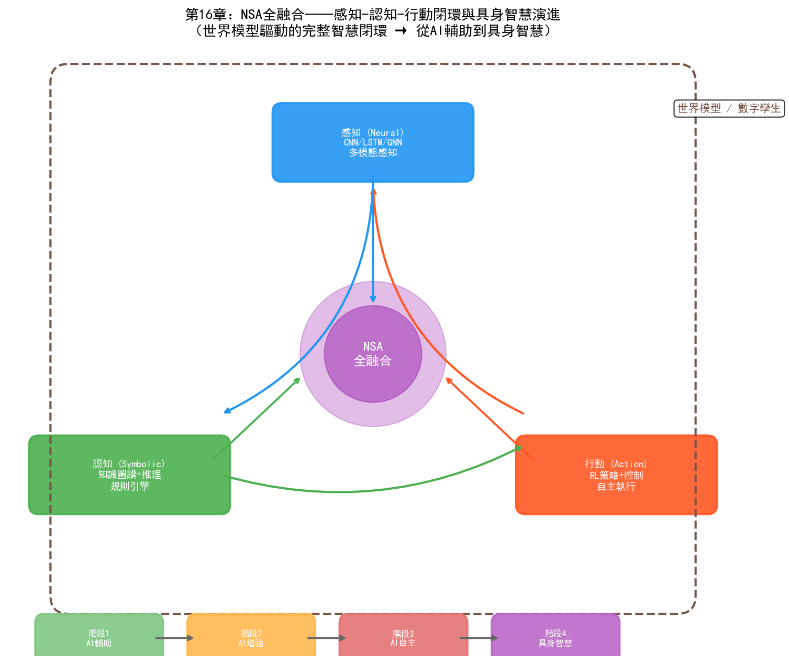
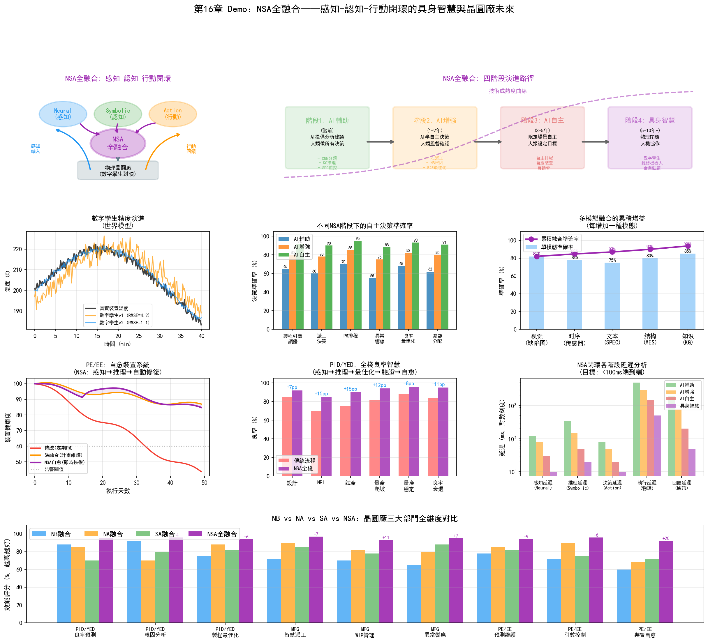
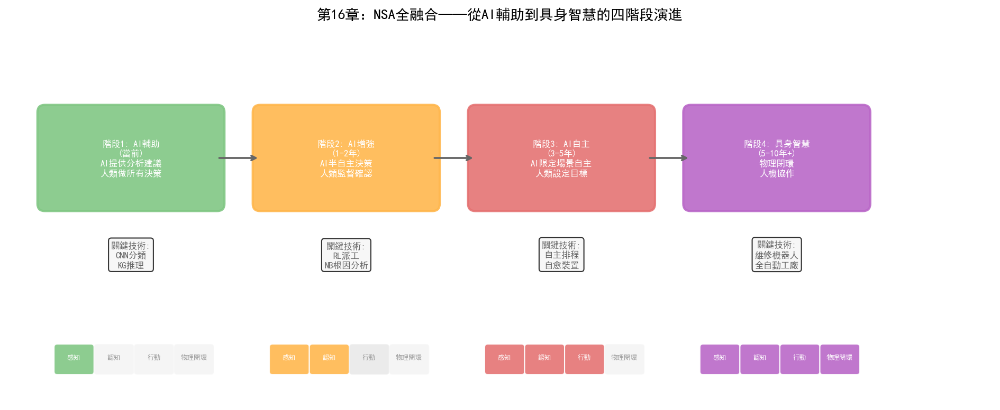

# 第21章 NSA全融合——具身智慧與晶圓廠未來

## 21.1 核心思路：感知-認知-行動的閉環

NSA全融合將三大主義融為一體，構成"感知（視覺/聽覺/訊號）—認知（推理/知識/規劃）—行動（控制/最佳化/執行）"的完整智慧閉環。

如果說NB融合讓AI"想得對"、NA融合讓AI"做得到"、SA融合讓AI"有章法"，那麼NSA全融合的目標是讓AI同時具備這三種能力——不僅看得懂、想得對，還能有章法地做得到。這在自然界就是生物智慧的基本模式：人類透過感官感知環境（Neural），透過知識和推理理解環境（Symbolic），透過行動改變環境（Action），三者持續閉環。

NSA全融合的終極形態是**具身智慧（Embodied AI）**——AI不僅存在於數字世界中處理資料，還能透過物理介面（機器人、自動化設備）與真實環境互動。在晶圓廠的語境下，具身智慧意味著：AI系統能感知產線狀態（透過感測器和檢測資料），理解問題根因（透過知識推理），並自主執行修復動作（透過控制設備和排程產線），形成完全閉環的自主營運。

### 從分立到全融合的遞進關係

NB、NA、SA三種融合不是NSA全融合的簡單疊加——它們構成了遞進的融合層次：

```
NB融合（Neural + Symbolic）：
  感知 → 认知
  "看到缺陷 → 理解根因"
  缺失：无法自主行动

NA融合（Neural + Action）：
  感知 → 行动
  "看到异常 → 调整参数"
  缺失：无法推理和规划

SA融合（Symbolic + Action）：
  认知 → 行动
  "规划任务序列 → 执行任务"
  缺失：无法从原始数据中感知

NSA全融合：
  感知 → 认知 → 行动 → 感知 → ...
  "看到缺陷 → 推理根因 → 执行修复 → 验证效果 → 持续学习"
  完整闭环
```

每一步融合解決前一步的"缺失"，最終NSA全融合形成完整的智慧閉環。這種遞進關係不是理論構想——當前AI技術的發展正在沿這條路演進。

## 21.2 技術路徑



*圖：NSA全融合——感知-認知-行動閉環與具身智慧四階段演進*

### 路徑一：世界模型與數字孿生

世界模型（World Model）是NSA全融合的核心基礎設施——一個能夠模擬環境動態變化的內部模型，使AI能夠"在腦中預演"行動的後果。

```
世界模型 = 感知编码器 + 动力学模型 + 行动解码器

感知编码器（Neural）：
  将高维传感数据（晶圆图、FDC信号、MES数据）编码为低维隐状态
  z_t = Encoder(observations_t)

动力学模型（Symbolic + Neural）：
  预测在行动 a_t 下，下一时刻的状态 z_{t+1}
  z_{t+1} = DynamicsModel(z_t, a_t)
  
  混合架构：
  - 神经网络部分：学习数据驱动的状态转移模式
  - 符号约束部分：确保预测满足物理定律和工艺规则
  
行动解码器（Action）：
  基于预测的状态选择最优行动
  a_t* = Policy(z_t, z_{t+1}^{predicted})
```

在晶圓廠中，世界模型的體現就是**數字孿生（Digital Twin）**——一個與真實晶圓廠同步的虛擬模型，能夠模擬製程過程、設備行為和生產動態。

數字孿生在NSA全融合中的角色：

- **感知層**：數字孿生從真實晶圓廠同步資料（MES、FDC、YMS），形成即時狀態映象
- **認知層**：知識圖譜和推理引擎在數字孿生上做"what-if"分析——"如果調整Step 47的功率+5W，在數字孿生中預測對後續步驟的影響"
- **行動層**：RL策略在數字孿生中預演多種行動方案，選擇效果最優的方案在真實產線上執行
- **閉環驗證**：執行後，真實結果回饋到數字孿生，校準和更新世界模型

### 路徑二：多模態具身智慧

多模態具身智慧將NSA全融合擴充套件到多種感知模態——不僅處理結構化資料，還能理解影象、時序訊號、自然語言等多種輸入：

```
多模态感知层（Neural）：
  - 视觉模态：晶圆图、缺陷照片、设备状态图像
  - 时序模态：FDC信号、SPC数据、温度/压力趋势
  - 文本模态：SPEC文档、操作SOP、工程师备注
  - 结构模态：MES批次记录、设备拓扑图、工艺流程图
  
  统一编码为多模态嵌入向量

认知层（Symbolic）：
  知识图谱将多模态嵌入映射到语义空间——
  "这个视觉缺陷模式" + "这段FDC信号异常" + "这条SPEC规则"
  → 综合推理出根因和影响范围

行动层（Action）：
  RL策略基于多模态感知和认知推理，输出多模态行动——
  - 数字行动：调整参数、重派批次、触发PM
  - 物理行动（未来）：控制自动化设备、引导维修机器人
```

在當前的晶圓廠中，物理行動主要由人類執行（工程師按AI建議操作設備）。但隨著工廠自動化的深化——AMHS（自動物料搬運系統）、自動化檢測設備、遠端控制設備——NSA全融合的"物理行動"能力將逐步落地。

### 路徑三：端到端智慧體架構

端到端智慧體架構是NSA全融合的前沿方向——將感知、認知和行動統一在一個可端到端訓練的系統中：

```
输入：多模态原始数据（图像 + 信号 + 文本 + 结构）
  ↓
统一主干网络（Transformer/Mamba）：
  同时编码所有模态，输出统一状态表征
  ↓
认知-行动联合模块：
  知识推理 + 策略优化 联合训练
  ↓
输出：行动序列（参数调整 + 派工指令 + PM安排）

端到端训练：
  从"感知"到"行动"的梯度直接传递
  系统学会"看什么"取决于"要做什么"
  系统学会"推理什么"取决于"行动需要"
```

這種架構在研究中已有探索（如Google的RT-2用於機器人控制），但在晶圓廠中尚處於概念階段——主要瓶頸是訓練資料：端到端系統需要大量"感知-認知-行動"三元組資料，而晶圓廠的每次"環境互動"（實際生產批次）成本極高。

## 21.3 在PID/YED中的應用

### 全棧良率智慧（感知→推理→最佳化→驗證）

NSA全融合在PID/YED中的終極應用是"全棧良率智慧"——將良率管理的全流程打通為自主閉環：

```
感知（Neural）：
  CNN分析晶圆图 → "边缘环形缺陷，置信度94%"
  LSTM分析FDC信号 → "Step 47刻蚀腔体压力有0.2mTorr漂移"
  GNN分析批次间关联 → "同设备的3批受影响"

认知（Symbolic）：
  知识图谱检索 → "边缘环形缺陷的可能根因：刻蚀边缘效应、光刻边缘效应"
  规则引擎推理 → "FDC压力漂移+边缘环形缺陷 → 首要根因：刻蚀边缘效应"
  LLM生成分析 → "Tool-A03刻蚀腔体压力漂移导致边缘刻蚀速率不均，
                  建议检查腔体边缘气体分布装置"

优化（Action）：
  RL策略搜索最优修复方案 →
  "方案A：调整刻蚀功率分布补偿+0.3%（预计良率恢复92%）
   方案B：执行腔体边缘清洁PM（预计良率恢复94%，但需要4小时停机）
   方案C：方案A+B组合（预计良率恢复95%，需要4小时停机）"

验证（Neural + Symbolic）：
  数字孪生预演 → 在虚拟环境中模拟方案C的效果
  实际执行 → 在Tool-A03上执行方案C
  结果验证 → 下一批次良率恢复到93.5%
  知识更新 → 将"压力漂移0.2mTorr→边缘缺陷→方案C有效"写入知识图谱

闭环：
  感知 → 认知 → 优化 → 验证 → 知识更新 → 增强的感知（下一轮）
```

### 自主製程開發系統

NPI中的製程開發是最能體現NSA全融合價值的場景——它需要感知（理解實驗結果）、認知（推理製程機理）和行動（決定下一步實驗）的完整閉環：

- **感知層**：深度學習模型分析每輪DOE的晶圓圖、WAT/CP資料、FDC訊號，提取製程結果特徵
- **認知層**：知識圖譜結合製程物理模型，從實驗結果中推理"哪個參數方向有效""哪個互動效應顯著""製程視窗的邊界在哪裡"
- **行動層**：RL策略基於認知推理決定下一輪DOE的參數方案——在有效方向加密搜尋，在無效方向停止探索
- **閉環**：每輪實驗結果更新知識圖譜和RL策略，形成"實驗→學習→最佳化→再實驗"的自適應迴圈

這種自主製程開發系統的願景是：工程師設定目標（"找到使良率>92%的參數組合"），系統自主規劃和執行DOE實驗，最終輸出最優製程參數和完整的推理鏈——大幅縮短NPI週期。

## 21.4 在MFG中的應用

### 自主製造營運

NSA全融合在MFG中的終極形態是"自主製造營運"——AI系統在最小人類干預下管理工廠的日常營運：

```
感知层（Neural）：
  全厂数据实时同步——
  - MES：批次位置、工艺进度、WIP分布
  - FDC：设备状态、工艺参数、异常告警
  - YMS：良率数据、缺陷分布
  - AMHS：物料位置、天车状态

认知层（Symbolic）：
  Ontology统一全厂数据语义——
  - 推理：当前瓶颈在哪？未来2小时会转移到哪？
  - 规划：今天的生产目标分解为各设备的具体任务
  - 约束检查：所有计划是否满足工艺约束和交期约束

行动层（Action）：
  多智能体协同执行——
  - 调度Agent：实时派工，优化WIP流动
  - 设备Agent：监控设备健康，自主触发PM
  - 良率Agent：监控良率趋势，自主调整参数
  - 异常Agent：响应突发事件，自主调整计划

闭环：
  行动结果反馈到感知层 → 更新全厂状态 → 重新推理和规划 → 新的行动
```

這種自主營運的願景在當前階段還遠未實現——但它的元件正在逐步落地：

- **已落地的元件**：智慧派工（NA融合）、異常響應自動化（SA融合）、跨系統資料問答（NB融合）
- **正在驗證的元件**：多智慧體協同排程、自主PM決策、數字孿生預演
- **尚在研究的元件**：完全自主的製程開發、端到端整廠最佳化、人機協作的自主營運

### 整廠級自主決策

整廠級最佳化是NSA全融合最具挑戰性也最具價值的應用——在全域視角下同時最佳化良率、產能、成本和交期：

- **感知層**：GNN編碼全廠狀態為圖結構——設備節點、批次節點、製程步驟節點及其關係邊
- **認知層**：知識圖譜定義最佳化目標間的約束關係——"提高良率可能需要降低產能（更嚴格的參數控制導致更慢的製程速度）""提高產能可能影響良率（更快的節拍導致參數控制視窗縮小）"
- **行動層**：多智慧體RL在約束空間中搜尋Pareto最優策略——在良率、產能、成本和交期之間找到最佳平衡點
- **閉環**：策略執行後的全廠KPI回饋到感知層，持續最佳化多目標平衡策略

## 21.5 在PE/EE中的應用

### 自愈設備系統

NSA全融合在PE/EE中的終極應用是"自愈設備系統"——設備能自主感知故障、診斷根因、執行修復並驗證恢復：

```
感知（Neural）：
  FDC信号异常检测 → "RF功率振荡频率从稳定变为12Hz振荡"
  振动传感器 → "匹配器位置振动幅度增加30%"
  温度传感器 → "匹配器外壳温度上升5°C"

认知（Symbolic）：
  知识图谱推理 → 
  "RF功率振荡 + 匹配器振动增大 + 匹配器温度升高
   → 根因：匹配器内部电容老化导致阻抗失配
   → 影响范围：当前设备 + 同型号使用相同批次匹配器的设备
   → 修复方案：更换匹配器电容（标准维修流程MP-047）"

行动（Action）：
  RL策略规划维修执行——
  1. 安全隔离：自动切换设备到维修模式，隔离RF电源
  2. 维修调度：通知EE工程师，准备备件（电容型号C-2304）
  3. 维修指导：AR设备为工程师显示维修步骤和注意事项
  4. 维修执行：工程师按指导更换电容（未来可由维修机器人执行）
  5. 恢复验证：维修后自动执行验证批次，检查RF稳定性

验证（Neural + Symbolic）：
  感知：FDC信号恢复正常，振荡消失
  认知：知识图谱记录"匹配器电容老化→更换→修复"案例
  学习：RL策略更新——"同批次匹配器的其他设备可能也面临电容老化风险"
  预防：自动为同批次匹配器设备生成预防性更换建议
```

### 自主設備調優與維護

NSA全融合將設備調優從"定期人工調整"升級為"持續自主最佳化"：

- **感知層**：深度學習持續監測設備的製程輸出品質（CD、深度、均勻性等）
- **認知層**：知識圖譜理解設備參數與製程結果之間的因果關係——"RF功率↑→蝕刻速率↑但均勻性↓"
- **行動層**：RL策略在製程約束範圍內自主微調參數，維持最優製程輸出
- **閉環**：調優效果回饋到感知層和認知層，持續更新設備的行為模型和參數-結果因果關係

## 21.6 從單點AI到具身智慧的演進路徑

晶圓廠的NSA全融合不是一步到位的——它需要一個漸進式的四階段演進路徑：

### 階段一：AI輔助（AI-Assisted）

**當前階段，已廣泛落地**

- AI為工程師提供分析和建議
- 人類做所有決策，AI輔助分析
- 典型應用：缺陷分類（Neural）、根因推理（NB融合）、參數推薦（NA融合）
- 特徵：AI是"工具"，人類是"操作者"

### 階段二：AI增強（AI-Augmented）

**當前到近期（1-2年）**

- AI在特定場景中做自主決策，但需人類確認
- 人類監督AI的決策，在異常時介入
- 典型應用：半自主派工、自動異常響應、PM自主排程
- 特徵：AI是"助手"，人類是"監督者"

### 階段三：AI自主（AI-Autonomous）

**中期（3-5年）**

- AI在限定場景中完全自主營運
- 人類設定目標和約束，AI自主規劃和執行
- 典型應用：自主製程開發、整廠級自主排程、自愈設備
- 特徵：AI是"代理"，人類是"管理者"

### 階段四：具身智慧（Embodied AI）

**遠期（5-10年+）**

- AI透過物理介面（機器人、自動化設備）與真實環境互動
- 形成"感知→認知→行動"的完整物理閉環
- 典型應用：自主維修機器人、全自動晶圓廠、人機協作的製造系統
- 特徵：AI是"自主體"，人類是"協作者"

```
                     感知    认知    行动    物理闭环
阶段一：AI辅助        ✓       -      -       -
阶段二：AI增强        ✓       ✓      △       -
阶段三：AI自主        ✓       ✓      ✓       -
阶段四：具身智能      ✓       ✓      ✓       ✓

✓ = 完全实现  △ = 部分实现  - = 未实现
```

## 21.7 實踐案例

### 三星：自主製造系統的NSA雛形

三星的自主製造系統是當前最接近NSA全融合的工業實踐：

- **感知層（Neural）**：深度學習模型從762臺微影設備的感測器訊號中即時檢測異常
- **認知層（Symbolic）**：知識圖譜+圖分析推理故障根因和影響範圍
- **行動層（Action）**：自主觸發故障維護流程——隔離設備、重派批次、排程維修
- **NSA閉環**：感知→認知→行動→驗證→知識更新
- **成果**：處理超過85,000次真實故障，MTTR減少7分鐘
- **NSA特徵**：系統不僅檢測和診斷（NB），還自主決策和執行（Action），並從每次故障中學習更新知識（閉環學習）

### Palantir + NVIDIA：AIOS-RA的NSA架構

Palantir與NVIDIA聯合釋出的AIOS-RA（AI Operating System Reference Architecture）定義了NSA全融合的工業級架構：

- **感知層（Neural）**：NVIDIA的GPU加速深度學習處理多模態感測資料（影象、訊號、時序）
- **認知層（Symbolic）**：Palantir的Ontology提供統一的資料語義模型和推理引擎
- **行動層（Action）**：AIP的Action模組基於推理結果觸發自動化流程
- **世界模型**：NVIDIA Omniverse提供數字孿生，作為NSA閉環的"預演"環境
- **NSA特徵**：三層架構（NVIDIA感知層→Palantir認知層→Rubix行動層）在架構層面實現了NSA全融合
- **對晶圓廠的意義**：AIOS-RA為晶圓廠提供了一個可參考的NSA全融合架構藍圖——不需要從零構建，而是在現有IT/OT基礎設施上分層部署

### NVIDIA Omniverse：晶圓廠數字孿生平台

NVIDIA Omniverse是NSA全融合中"世界模型"層的基礎設施：

- **數字孿生**：Omniverse建立晶圓廠的3D數字孿生——包括設備模型、製程模型和生產模型
- **感知同步**：真實晶圓廠的即時資料同步到數字孿生，形成即時映象
- **認知預演**：在數字孿生上做"what-if"分析——"如果調整某設備參數，對全廠良率和產能的影響是什麼"
- **行動驗證**：RL策略在數字孿生中預演行動方案，驗證效果後再在真實產線執行
- **NSA特徵**：Omniverse+cuLitho+Metropolis的組合覆蓋了感知（Metropolis視覺分析）、認知（Omniverse模擬推理）和行動（cuLitho參數最佳化）

### 美光：預測性製造的NSA探索

美光的預測性製造系統正在向NSA全融合方向演進：

- **感知層**：深度學習模型從FDC、MES、YMS資料中即時感知全廠狀態
- **認知層**：與Athinia（Palantir合資公司）合作構建的資料平台提供跨系統語義統一和推理能力
- **行動層**：基於感知和認知結果自主觸發設備排程、參數調整和PM安排
- **NSA特徵**：美光的願景是"預測→決策→執行→驗證"的完全閉環——從預測性問題到自主行動
- **當前階段**：處於階段二（AI增強）向階段三（AI自主）的過渡期

## 21.8 展望與挑戰

### 技術挑戰

NSA全融合面臨的技術挑戰是多層次的：

1. **世界模型的精度**：數字孿生能否準確模擬真實晶圓廠的所有關鍵動態？當前數字孿生主要覆蓋設備級和製程級的模擬，整廠級的動態模擬（包括WIP流動、瓶頸轉移、人員行為）仍不成熟。

2. **閉環延遲**：NSA閉環的"感知→認知→行動→驗證"週期在晶圓廠中可能跨越數天（一個批次的製造週期）——這種長延遲使得RL的信用分配（credit assignment）極其困難。

3. **安全性與可解釋性**：當AI系統同時控制感知、推理和行動時，錯誤的傳播路徑更復雜——一個感知錯誤可能導致錯誤的推理，進而導致錯誤的行動。如何在這種閉環中保證安全性是核心挑戰。

4. **多模態融合的語義對齊**：將影象、訊號、文字、結構資料融合到一個統一的語義空間，需要解決不同模態之間的語義對齊問題——"CNN看到的缺陷模式"與"KG中的製程規則"如何精確對應。

### 組織挑戰

NSA全融合不僅是技術挑戰，更是組織變革挑戰：

1. **信任建立**：工程師是否信任AI系統的自主決策？在晶圓廠中，一個錯誤決策的代價可能是數百萬美元。信任需要透過大量"AI建議→人工確認→驗證效果"的迭代來逐步建立。

2. **人機協作模式**：NSA全融合不會完全取代人類——它改變的是人機協作模式。工程師從"執行者"轉變為"監督者"和"策略制定者"，需要新的技能和角色定義。

3. **組織架構適配**：當AI系統能夠跨部門自主協調時，傳統的部門壁壘是否還適用？NSA全融合可能需要更扁平、更靈活的組織架構來匹配AI的自主協調能力。

### 倫理與治理

當AI系統獲得感知-認知-行動的全閉環能力時，治理問題變得緊迫：

- **責任歸屬**：當NSA系統的自主決策導致產線問題時，責任歸屬AI系統、AI供應商還是使用方？
- **透明度要求**：NSA系統的決策鏈涉及感知、推理和行動多個環節——如何確保整條鏈路可審計、可追溯？
- **人類介入權**：在NSA系統的自主營運中，人類應保留什麼級別的介入權——是否應該有"一鍵停止"的能力？

### 從願景到現實

NSA全融合在晶圓廠中不會以"大爆炸"的方式實現——它將以"區域性閉環→跨環節打通→整廠整合"的漸進方式演進：

```
近期（1-2年）：
  - NB融合的良率分析系统规模化部署
  - NA融合的智能调度进入"建议+确认"模式
  - SA融合的异常响应流程在试点产线验证

中期（3-5年）：
  - NSA全融合的"全栈良率智能"在头部晶圆厂试点
  - 数字孪生从设备级扩展到产线级
  - 多智能体系统在NPI管理中验证

远期（5-10年）：
  - 整厂级数字孪生平台成熟
  - 自主制造运营在新建晶圆厂中验证
  - 具身智能（维修机器人）在受控场景中试点
```

---

本章完成了三大主義融合的完整圖景。從NB的"可驗證推理"到NA的"閉環最佳化"，從SA的"結構化自主"到NSA的"全棧智慧"——融合的每一步都讓AI更接近"通用智慧"的形態。但正如第17章所述，晶圓廠不需要AGI——它需要的是在特定場景中可靠工作的混合智慧系統。這些"窄域混合智慧"才是未來3-5年晶圓廠AI的落地重點。

三大主義的交叉融合是AI發展的大勢所趨。在晶圓廠這個極端複雜的工業場景中，融合不是錦上添花，而是必需——因為晶圓廠的任何真實問題都是感知、推理和行動的複合體。誰能率先打通這三者的閉環，誰就能在半導體製造的下一個十年中佔據制高點。

## 21.9 Demo視覺化：NSA全融合感知-認知-行動閉環



*Demo說明：左上為NSA閉環架構圖，上方為四階段演進路徑。中排分別為數字孿生精度、自主決策準確率、多模態融合增益。下排分別為自愈設備系統、全棧良率智慧、閉環延遲分析。底部為NB/NA/SA/NSA全維度對比矩陣。模擬指令碼見 `demos/demo_ch21_nsa_fusion.py`。*


