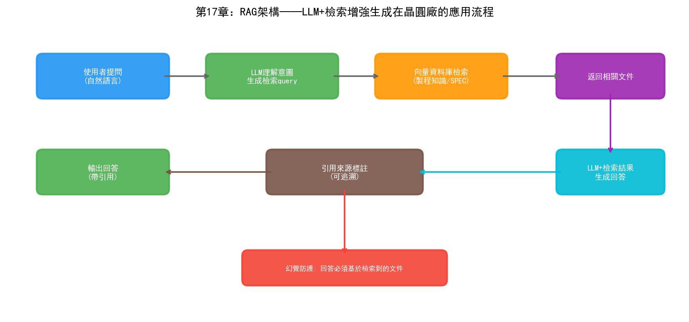
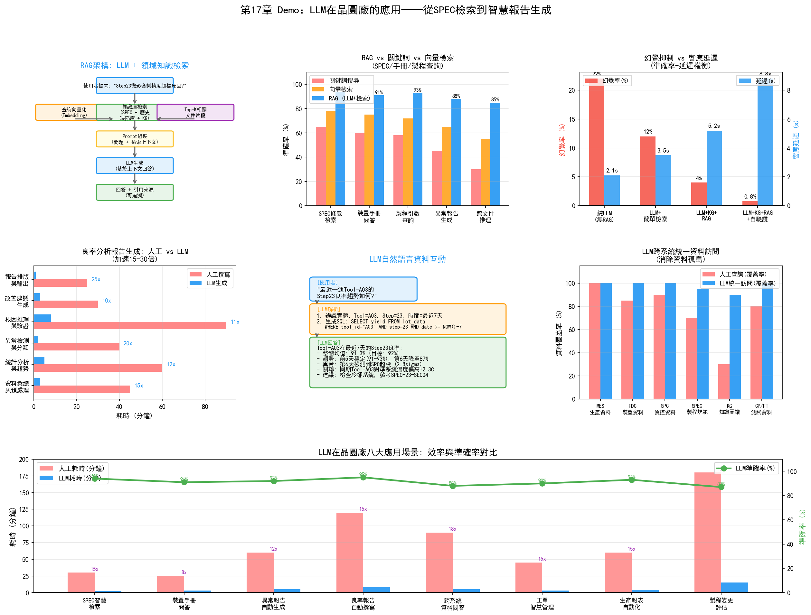

# 第22章 大語言模型（LLM）在晶圓廠的應用

## 22.1 LLM 技術概述

大語言模型的"大"體現在三個維度：模型參數量（數十億到數千億）、訓練資料量（數萬億token）、訓練算力（數千GPU月）。三者共同構成了規模定律（Scaling Law）的基礎——當這三個維度同步成長時，模型的效能以可預測的方式提升，並在某個臨界點出現前文所述的"湧現能力"。

### Transformer 架構回顧

LLM的技術基礎是Transformer架構。第二章和第四章已經討論了Transformer的核心——自注意力機制。這裡從工程角度補充幾個關鍵概念。

**Token化：** LLM不直接處理文字，而是先將文字切分為token——可以是詞、子詞或字元。GPT系列使用BPE（Byte Pair Encoding）演算法將文字切分為子詞token。一個英文單詞通常對應1-2個token，一箇中文字元通常對應2-3個token。token化方式直接影響模型對領域術語的處理——"蝕刻"可能被切分為兩個不相關的token，模型在理解時需要從上下文推斷其含義。

**上下文視窗：** LLM一次能處理的最大token數。早期GPT-3的上下文視窗是2048個token，GPT-4提升到128K，Claude 3達到200K。在晶圓廠場景中，一份完整的製程規範（SPEC）可能長達數十頁——需要至少32K的上下文視窗才能完整容納。

**對齊（Alignment）：** 預訓練後的基礎模型能生成流暢的文字，但不一定遵循人類意圖。RLHF（Reinforcement Learning from Human Feedback）透過對模型輸出進行人類偏好排序，訓練一個獎勵模型，再用強化學習最佳化LLM的生成策略，使其輸出更符合人類期望。對齊是讓LLM從"能說話"變成"會說話"的關鍵步驟。

### 主流 LLM 概覽

| 模型 | 開發商 | 參數規模 | 特點 |
| --- | --- | --- | --- |
| GPT-4 / GPT-4o | OpenAI | 未公開（推測1.7T+） | 綜合能力最強，多模態 |
| Claude 3.5 / Claude 4 | Anthropic | 未公開 | 長文字處理，安全性強 |
| Llama 3 / Llama 4 | Meta | 8B-405B | 開源權重，可本地部署 |
| Gemini 1.5 / 2.0 | Google | 未公開 | 原生多模態，超長上下文 |
| 文心一言 4.0 | 百度 | 未公開 | 中文最佳化，國內合規 |
| DeepSeek-V3 / R1 | DeepSeek | 671B (MoE) | 開源，推理能力突出 |

在晶圓廠場景中，LLM的選擇需要考慮三個因素：資料安全（是否可以本地部署）、領域適應能力（是否容易注入半導體專業知識）、推理成本（每token的處理費用）。開源模型（如Llama系列、DeepSeek）在資料安全方面有天然優勢——可以完全在晶圓廠內網部署，不將任何製程資料傳出廠區。

## 22.2 LLM 在製程文件管理中的應用

### 製程規範（SPEC）的智慧檢索與問答

一座先進晶圓廠通常積累了數千份製程規範文件——每個製程模組的操作流程、參數規格、異常處理步驟、安全注意事項都記錄在SPEC中。這些文件的總量可能達到數十萬頁，且持續更新。

傳統的SPEC管理依賴文件管理系統——工程師透過關鍵詞搜尋或目錄瀏覽來查詢需要的文件。這種方法的問題在於：工程師的查詢通常是自然語言問題（"3號蝕刻機的腔體清洗流程是什麼"），而不是精確的關鍵詞匹配。如果文件中寫的是"溼法清洗程式"而非"清洗流程"，關鍵詞搜尋就會遺漏。

基於RAG（檢索增強生成）技術的SPEC智慧問答系統解決了這個問題。系統架構如下：

```
工程师提问: "3号刻蚀机腔体清洗后需要做什么验证？"
  │
  ├─ 1. 查询编码: 将自然语言问题编码为向量
  │
  ├─ 2. 向量检索: 在SPEC文档库中检索最相关的段落
  │    → 返回: "刻蚀机腔体清洗后验证流程.docx" 第3.2节
  │    → 返回: "腔体PM后验收标准.docx" 第2.1节
  │
  ├─ 3. 上下文构建: 将检索到的文档段落 + 原始问题组合为提示词
  │
  └─ 4. LLM生成: 基于检索到的文档内容生成自然语言回答
       → "3号刻蚀机腔体清洗后，需执行以下验证：
          1. 空白运行2批次确认腔体清洁度
          2. 测试晶圆刻蚀速率验证（目标: 320±10 nm/min）
          3. 粒子检测确认（< 10颗/@0.12μm）
          验证通过后可恢复量产。"
```

RAG的核心價值是"有據可查"——LLM的回答基於檢索到的文件內容，而非憑空生成。這大幅降低了"幻覺"風險——當LLM在文件中找不到答案時，它可以回答"未找到相關資訊"，而不是編造一個看似合理的錯誤答案。

### 設備手冊的自動解讀

每臺半導體設備都附帶數千頁的操作手冊和維護手冊。當設備出現異常時，EE工程師需要在短時間內從手冊中找到相關的故障排查指引。這個過程通常非常耗時——手冊是按功能模組組織的，而故障現象和排查步驟可能分散在不同的章節。

LLM可以將手冊內容"結構化"——自動提取手冊中的故障程式碼、排查步驟、維修流程，構建為可問答的知識庫。工程師提問"設備報錯程式碼E-3071是什麼意思、怎麼處理"，LLM從手冊中檢索相關內容並給出結構化的回答。

### 異常報告的自動生成

晶圓廠每天產生大量異常報告——設備異常報告、製程偏差報告、良率下降報告。這些報告的格式通常固定但內容需要工程師手動撰寫——描述異常現象、列出受影響的批次、分析可能原因、給出處置建議。

LLM可以根據結構化資料自動生成報告草稿。系統從MES、FDC、SPC等系統中提取相關資料（異常時間、設備參數、受影響批次、量測結果），LLM將這些資料組織為結構化的報告文字：

```
【异常报告】
时间: 2026-08-29 14:32
设备: 刻蚀机ETC-03, 腔体Chamber-2
异常描述: 第45批加工过程中，RF反射功率从3%突升至12%，
         超过控制限(8%)。FDC系统自动触发暂停。
受影响批次: LOT-A12345 (WIP状态: 已暂停)
可能原因: 匹配器调谐异常或电极老化
历史关联: 该设备上次PM时间为2026-08-15，已运行82批次
建议处置:
  1. 检查匹配器调谐状态和连接器
  2. 如匹配器正常，检查电极磨损状态
  3. 修复后运行3批测试晶圆验证参数稳定性
```

工程師只需審閱和修正這個草稿，大幅縮短報告撰寫時間。

## 22.3 LLM 在良率分析中的應用

### 良率報告的自動生成

每日良率報告是YED部門的日常產出物。報告通常包含：當日各產品的CP/FT良率、與前日/目標的對比、異常批次的根因分析、良率趨勢圖。

傳統方式下，這份報告需要工程師從多個系統中手動提取資料、製作表格和圖表、撰寫分析文字——耗時可能1-2小時。LLM可以在幾秒內完成這個流程：從資料庫中查詢良率資料、生成分析文字、甚至描述趨勢的異常模式。

關鍵在於LLM不只是"填模板"——它可以根據資料的具體情況調整報告的側重點。如果當日良率正常，報告簡潔明瞭；如果當日有異常，報告會詳細展開異常批次的分析。

### 製程資料的自然語言互動

傳統上，查詢製程資料需要工程師知道資料在哪個系統、用SQL還是API查詢、表結構是什麼樣的。這形成了一個使用門檻——只有熟悉IT系統的工程師才能自助查詢資料。

LLM可以作為"資料查詢的自然語言介面"。工程師用自然語言提問：

"上週3號機臺的蝕刻均勻性有沒有異常？"

LLM在後臺執行：
1. 解析問題意圖——查詢蝕刻均勻性資料、範圍是上週、設備是ETC-03
2. 生成SQL查詢語句或呼叫相應API
3. 獲取資料並進行分析（如計算統計量、繪製趨勢圖描述）
4. 用自然語言回答："上週ETC-03的蝕刻均勻性在3.2%-3.8%範圍內波動，
   控制限為4.0%，未超標。但8月27日的均勻性從3.3%升至3.7%，
   呈上升趨勢，建議關注。"

這種"Text-to-Data"的能力依賴於LLM對資料庫schema的理解和SQL生成能力。Text-to-SQL是LLM在企業資料分析中的成熟應用方向，但在晶圓廠中的挑戰是資料庫schema極其複雜——一座晶圓廠有數十個系統，每個系統有數百張表，表之間的關聯關係複雜。

### 多源資料的 LLM 輔助分析

當一個良率問題涉及多個資料源時，LLM可以作為"分析助手"——幫助工程師整合來自不同系統的資料並做關聯分析。

例如，工程師提問"LOT-B67890的CP良率為什麼比同產品其他批次低8個百分點？"LLM可以：
1. 從MES查詢該批次的製程路徑和使用的設備
2. 從FDC查詢對應設備的感測器資料，檢查是否有異常
3. 從SPC查詢關鍵量測參數是否偏離
4. 從YMS查詢缺陷型別和分佈
5. 綜合以上資訊，生成分析報告

這個過程中LLM的價值不在於單個步驟的查詢——每個查詢都可以人工完成。LLM的價值在於"編排"——自動決定需要查哪些系統、按什麼順序查詢、如何關聯分析結果。這實際上已經觸及了Agent的範疇，我們在下一章詳細展開。

## 22.4 LLM 在製造營運中的應用

### 智慧工單管理

晶圓廠的工單管理涉及從客戶訂單到產線排程的轉換——客戶需要什麼產品、多少數量、何時交付，轉化為多少批次、在什麼時間投片、經過什麼製程路線。

LLM可以輔助工單管理：
- 自然語言工單查詢："客戶A的下個月訂單交付進度如何？"
- 異常預警："如果ETC-03明天還不能恢復，哪些客戶訂單會受影響？"
- 工單調整建議："緊急插入客戶C的500片訂單，最優的排產方案是什麼？"

### 生產報表自動化

MFG的日常報表——設備利用率、產出統計、WIP分佈、異常事件彙總——是高度模板化但又需要資料整合的工作。LLM可以將報表生成完全自動化——從MES和FDC中提取資料，按照預設模板生成報表，並根據資料中的異常情況新增分析說明。

### 跨系統資料問答

晶圓廠的IT系統通常有數十個，工程師在分析問題時需要跨系統查詢資料。LLM可以作為"統一查詢入口"——工程師不需要知道資料在哪個系統中，只需用自然語言提問，LLM自動路由到正確的系統並查詢資料。

這要求LLM理解每個系統的資料schema和查詢介面——通常透過"工具描述"（Tool Description）的方式實現。每個系統的查詢能力被描述為一個"工具"（tool），LLM根據問題意圖選擇合適的工具呼叫：

```json
{
  "tools": [
    {
      "name": "query_mes_lot_history",
      "description": "查询MES系统中的批次工艺历史",
      "parameters": {
        "lot_id": "批次ID",
        "start_time": "查询起始时间",
        "end_time": "查询结束时间"
      }
    },
    {
      "name": "query_fdc_sensor_data",
      "description": "查询FDC系统中的设备传感器数据",
      "parameters": {
        "tool_id": "设备ID",
        "lot_id": "批次ID"
      }
    }
  ]
}
```

LLM根據工程師的問題，選擇合適的工具、生成參數、呼叫API、獲取結果並綜合回答。這個模式是Agent架構的雛形。

## 22.5 挑戰與展望

### 資料安全與隱私

晶圓廠的製程資料是比晶片設計圖紙更敏感的商業機密。將製程資料傳送到外部LLM API（如OpenAI）意味著將核心IP暴露給第三方——三星接入Palantir時已經被視為"破例"，更不用說將資料傳送給雲端的LLM服務。

解決方案是本地部署開源LLM——如Llama系列或DeepSeek模型可以在晶圓廠內網的GPU服務器上部署，所有資料處理都在廠區內完成。但本地部署的挑戰是算力需求——一個70B參數的模型需要至少2張A100 80GB GPU才能以可接受的速度推理。對於需要同時服務數十個使用者的場景，算力投入不可忽視。

### 幻覺問題的應對

LLM的"幻覺"（Hallucination）——生成看似合理但實際錯誤的內容——在晶圓廠場景中代價極高。如果LLM在製程規範問答中給出了錯誤的參數值（如將蝕刻功率的規格從300W說成350W），工程師若據此操作可能導致整批晶圓報廢。

緩解幻覺的技術手段：

- **RAG（檢索增強生成）：** 讓LLM基於檢索到的文件內容回答，而非憑記憶生成。回答中標註資訊來源（引用哪份文件的哪一節），方便工程師核實
- **約束生成：** 對LLM的輸出新增格式約束和數值範圍約束——如要求回答中的參數值必須在SPEC規定的範圍內
- **多模型交叉驗證：** 用多個模型生成回答，比較一致性。不一致的回答標記為"低置信度"
- **人工稽核閉環：** LLM生成的報告和建議在執行前必須經過工程師稽核。LLM的角色是"起草"而非"決策"

### 領域知識注入與 RAG 技術

通用LLM在預訓練時見過的半導體領域文字極其有限——GPT-4可能知道"蝕刻"是什麼，但不會知道"ETC-03的Chamber-2在PM後第3批需要將RF功率補償+3W"。注入領域知識的主要技術是RAG和微調。

**RAG的優勢**在於不需要修改模型參數——新文件加入知識庫後立即可用，無需重新訓練。適合頻繁更新的製程規範和設備手冊。

**微調的優勢**在於可以將領域知識"內化"到模型參數中——模型對半導體術語和概念的理解更深。但微調需要標註資料和訓練算力，且每次更新都需要重新訓練。適合將半導體領域的基礎知識（術語、製程流程、設備原理）注入模型。

實踐中兩者通常結合使用：先在半導體文字上做領域微調（如繼續預訓練），然後在實際使用中配合RAG檢索最新的製程文件。這種"微調+RAG"的組合在醫療、法律等專業領域已經被證明是最有效的領域適配策略。

---

LLM在晶圓廠的應用仍處於早期階段，但它的發展速度遠超此前任何AI技術。從ChatGPT釋出到現在不過幾年，工業領域的LLM應用已經從概念驗證走向了實際部署。下一章我們將討論LLM的"升級形態"——Agent——如何在晶圓廠中實現更復雜的多步驟自動化任務。



## 22.6 Demo視覺化：LLM在晶圓廠的應用



*Demo說明：左上為RAG架構流程，中上為檢索準確率對比（RAG vs 關鍵詞 vs 向量），右上為幻覺率與延遲權衡。中排分別為良率報告自動生成加速比、LLM自然語言互動示例、跨系統資料訪問覆蓋率。底部為LLM八大應用場景效率與準確率對比。模擬指令碼見 `demos/demo_ch22_llm_fab.py`。*
