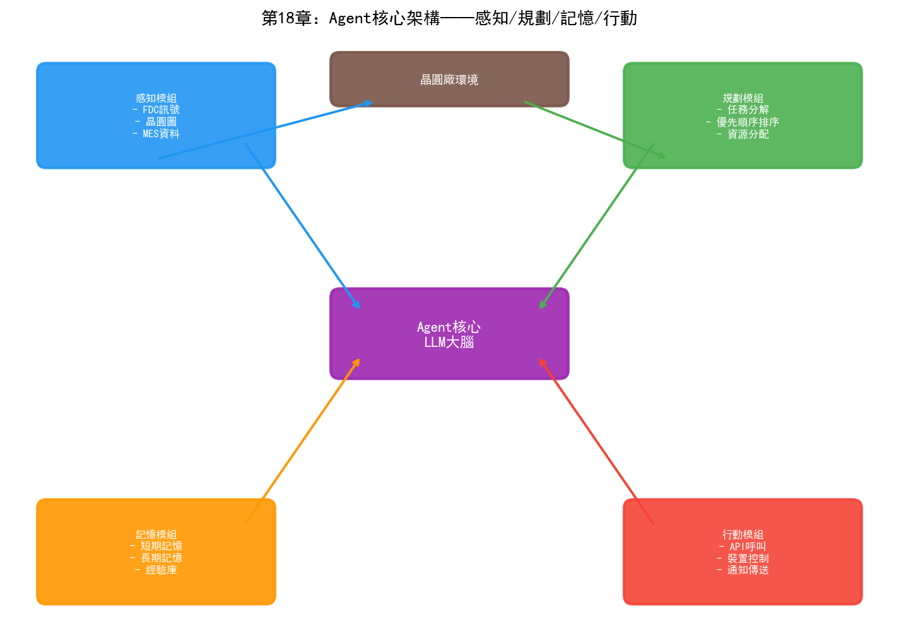
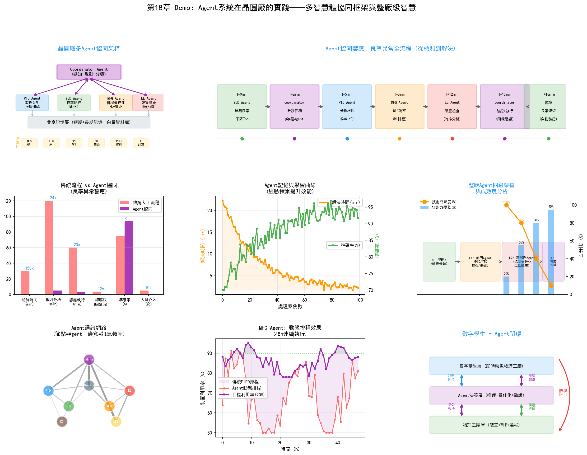

# 第23章 Agent 系統在晶圓廠的實踐

## 23.1 Agent 技術概述

如果LLM是"大腦"，那麼Agent就是"大腦+手腳"。LLM本身只能接收文字輸入、生成文字輸出——它不能查詢資料庫、不能呼叫API、不能控制設備。Agent在LLM的基礎上增加了"行動能力"——透過呼叫外部工具來感知環境並執行操作。

### 從 LLM 到 Agent 的演進

2023年，OpenAI推出了"Function Calling"功能——LLM可以根據使用者的請求，決定呼叫哪個外部函式並生成呼叫參數。這個看似簡單的功能是Agent技術的起點——LLM從"只會說話"變成了"會用工具"。

隨後，開源社群湧現了大量Agent框架——LangChain、AutoGPT、CrewAI、AutoGen等。這些框架提供了Agent的基礎設施：工具註冊、記憶管理、多步推理、錯誤恢復。ReAct（Reasoning + Acting）正規化成為主流——Agent在每一步交替進行推理（"我需要先查什麼"）和行動（呼叫工具獲取結果），根據結果決定下一步。

### Agent 核心元件

一個完整的Agent系統包含四個核心元件：

**感知（Perception）：** Agent如何"看"到環境狀態。在晶圓廠中，感知透過呼叫工具實現——查詢MES獲取產線狀態、查詢FDC獲取設備資料、查詢YMS獲取良率資料。每個查詢工具的返回結果就是Agent對環境的"觀察"。

**規劃（Planning）：** Agent如何將複雜目標分解為可執行的步驟。當工程師問"分析LOT-B67890的良率異常原因"時，Agent需要規劃：先查CP結果→分析缺陷模式→定位異常製程步驟→查詢對應設備FDC資料→關聯分析→生成報告。規劃可以是預先定義的工作流（確定性規劃），也可以由LLM動態生成（自適應規劃）。

**記憶（Memory）：**
- 短期記憶：當前任務的上下文——已執行的步驟、已獲取的資料、中間分析結果。短期記憶儲存在LLM的上下文視窗中。
- 長期記憶：跨任務的歷史經驗——過去處理過的類似問題的解決方案、工程師的偏好、已知的因果模式。長期記憶通常儲存在向量資料庫中，透過相似度檢索呼叫。

**行動（Action）：** Agent透過呼叫工具執行操作。工具型別包括：
- 資訊查詢工具：query_mes、query_fdc、query_spc、query_yms
- 分析工具：statistical_analysis、defect_pattern_recognition、root_cause_search
- 生成工具：generate_report、create_ticket、send_notification
- 執行工具（需要人類審批）：adjust_recipe、schedule_pm、dispatch_lot

工具的選擇和呼叫由LLM根據當前狀態和目標決定——這就是Agent與傳統指令碼的根本區別。指令碼的執行路徑是預定義的，Agent的執行路徑是根據情況動態決定的。

### 多 Agent 系統架構

複雜的任務可能超出單個Agent的能力範圍——需要不同專業知識的Agent協同工作。多Agent系統將任務分配給多個專業化的Agent，各自處理擅長的部分。

幾種典型的多Agent架構：

**層級架構（Hierarchical）：** 一個"主管Agent"負責任務分解和協調，將子任務分派給專業Agent。主管Agent彙總各專業Agent的結果，形成最終輸出。

```
主管Agent (Orchestrator)
  ├─ 工艺分析Agent → 分析工艺参数异常
  ├─ 设备诊断Agent → 分析设备健康状态
  ├─ 缺陷分析Agent → 分析缺陷模式
  └─ 报告生成Agent → 汇总生成分析报告
```

**協作架構（Collaborative）：** 多個Agent以平等角色協作，透過訊息傳遞交換資訊。每個Agent可以"看到"其他Agent的分析結果並據此調整自己的工作。

**流水線架構（Pipeline）：** 多個Agent按順序處理任務，每個Agent的輸出是下一個Agent的輸入。適用於流程化的分析任務。

## 23.2 製程整合 Agent

### 自動製程分析 Agent

PID工程師在面對良率問題時，需要進行一套系統性的分析流程：收集批次資料→檢視製程路徑→檢查關鍵參數→對比正常批次→定位偏差→推斷根因。這個過程高度依賴經驗，且涉及多系統資料查詢。

製程分析Agent將這個流程自動化：

```
输入: "LOT-B67890 CP良率85%，比同产品均值低7%"

Agent执行轨迹:
  [思考] 需要先确认该批次的工艺路径和关键工序
  [行动] 调用 query_mes(lot_id="B67890") 获取工艺路径
  
  [观察] 工艺路径: 1200步，使用设备23台
  
  [思考] 比较该批次与正常批次的关键量测参数
  [行动] 调用 query_spc(lot_id="B67890", 
                       comparison_lots=["normal_b67800", "normal_b67850"])
  
  [观察] 第623步刻蚀的CD值偏差+4%（正常批次±1%），
        第624步薄膜厚度偏差-3%（正常批次±1.5%）
  
  [思考] CD偏差可能来自刻蚀设备或光刻设备，需要进一步追查
  [行动] 调用 query_fdc(tool_id="ETC-03", 
                        lot_id="B67890", step=623)
  
  [观察] ETC-03在B67890批次加工时RF功率波动2.8%（正常<1%）
  
  [思考] RF功率波动可能导致CD偏差。检查该设备的历史趋势
  [行动] 调用 query_fdc_history(tool_id="ETC-03", 
                                 last_days=7)
  
  [观察] ETC-03的RF功率波动在过去3天逐步增大，可能匹配器老化
  
  [结论] 根因: ETC-03匹配器调谐异常导致RF功率波动，
        进而影响CD均匀性，导致良率下降。
  [建议] 检查ETC-03匹配器，安排维护。
  [行动] 生成分析报告并提交PID工程师审核。
```

這個過程中Agent展現了三個關鍵能力：自適應規劃（根據每一步的結果調整下一步行動）、多工具協同（呼叫MES、SPC、FDC三個系統的資料）、因果推理（從RF功率波動→CD偏差→良率下降的因果鏈）。

### 跨部門協同 Agent

當良率問題涉及多個部門時——如PID需要MFG確認排程影響、需要EE檢查設備狀態——跨部門協同Agent可以自動協調資訊收集和分析。

```
主管Agent接收: "3nm产品A的CP良率连续3天下降2%"
  │
  ├─ 分派给 工艺分析Agent
  │    → 发现第45步参数偏差
  │    → 需要确认设备状态
  │
  ├─ 分派给 设备诊断Agent  
  │    → 查询FDC: 第45步使用的ETC-05设备RF功率异常
  │    → 查询维护记录: ETC-05距上次PM已运行95批次
  │    → 判断: 需要安排PM
  │
  ├─ 分派给 调度分析Agent
  │    → 查询MES: ETC-05当前有12批在排队
  │    → 模拟: 如果ETC-05停机PM，影响3个客户订单交期
  │    → 建议: 将排队批次路由到ETC-03（有备用产能）
  │
  └─ 主管Agent汇总:
       根因: ETC-05匹配器老化导致RF功率异常
       影响: 3天良率下降2%，约15批次受影响
       建议措施:
         1. 立即将ETC-05排队批次路由到ETC-03
         2. 安排ETC-05匹配器维护
         3. 维护后运行3批验证晶圆
       交期影响: 客户C的订单延迟1天（可接受）
```

## 23.3 良率分析 Agent

### 自動根因分析 Agent

根因分析是YED最核心也最耗時的任務。一個自動化的RCA Agent可以將第六章描述的RCA流程自動化——從良率異常告警觸發，到生成根因分析報告。

RCA Agent的架構：

**觸發：** SPC系統檢測到CP良率超出控制限，自動觸發RCA Agent。

**資料收集階段：** Agent自動收集所有相關資料——批次的完整製程歷史（MES）、所有設備的FDC資料、關鍵步驟的SPC量測資料、缺陷檢測結果（YMS）。這個階段Agent需要決定"哪些資料是相關的"——不是所有1200步的參數都需要檢查，Agent應該根據經驗先聚焦最可能出問題的步驟。

**模式辨識階段：** Agent使用預訓練的CNN模型對晶圓圖進行缺陷模式分類，使用統計方法比較異常批次與正常批次的參數差異，使用知識圖譜搜尋已知的缺陷-參數-設備關聯路徑。

**根因推斷階段：** Agent綜合以上分析結果，推斷最可能的根因。這個推斷過程需要結合：資料驅動的關聯分析（連接主義）、領域知識的因果推理（符號主義）、歷史案例的類比參考（長期記憶）。

**報告生成階段：** Agent生成結構化的RCA報告，包含：異常描述、資料分析過程、根因假設（及置信度）、建議措施。報告提交YED工程師稽核。

### 良率異常響應 Agent

RCA Agent聚焦於"找到原因"，響應Agent聚焦於"採取行動"。當根因確定後，響應Agent需要協調多個系統執行處置措施：

- 如果根因是設備問題：自動建立維護工單、調整MES排程將受影響批次路由到備用設備、通知EE工程師
- 如果根因是製程參數問題：生成參數調整建議（由PE工程師稽核後執行）、標記受影響批次為"Hold"狀態待復判
- 如果根因是原材料問題：追溯受影響的原材料批次、辨識所有使用了該批次的在製品和成品

響應Agent的關鍵設計原則是"人在環中"（Human-in-the-Loop）——所有影響生產或設備的操作都需要工程師審批後才能執行。Agent的角色是"建議和準備"，不是"決策和執行"。

## 23.4 製造排程 Agent

### 動態排程 Agent

傳統的派工系統是規則驅動的——預先定義規則，系統按規則執行。動態排程Agent是策略驅動的——Agent根據產線的即時狀態動態決定派工策略。

動態排程Agent的工作模式：

**感知：** 即時從MES獲取產線狀態——各設備的佇列長度、各批次的優先順序和交期、設備狀態。每分鐘更新一次狀態。

**決策：** 對每臺空閒設備，Agent評估佇列中所有可派遣批次的"優先順序得分"。得分計算不僅考慮批次自身屬性（交期、優先順序），還考慮全域影響——派遣這個批次對瓶頸設備的WIP有何影響？對其他批次的交期有何連鎖效應？

**行動：** 將得分最高的批次分配給空閒設備。如果得分差距小（多個批次差不多優先），Agent可以選擇對全域最優的方案——這需要模擬"如果選擇A vs 選擇B"對後續N小時產線狀態的影響。

**回饋：** 觀察派工決策後的產線狀態變化，作為學習訊號更新決策策略。

### 異常處理 Agent

當設備故障等異常發生時，異常處理Agent需要快速做出一系列決策：

1. 辨識受影響的在製品批次
2. 評估備選設備（同類設備的當前負載和狀態）
3. 計算重新路由對交期的影響
4. 生成最優的批次重新分配方案
5. 自動調整MES中的派工指令（或建議排程員調整）
6. 通知相關人員和系統

這個過程的時效性極強——設備故障後的每一分鐘都在損失產能。Agent可以在幾秒內完成人類排程員需要十幾分鍾才能完成的評估和決策。

## 23.5 設備維護 Agent

### 預測性維護決策 Agent

第十一章討論了預測性維護中的RUL預測（連接主義）和維護決策最佳化（行為主義）。Agent將這兩個層次整合為一個端到端的系統：

**監控階段：** Agent持續監控所有設備的FDC資料，使用LSTM模型評估每臺設備的健康度評分。當某臺設備的評分降至預警閾值時，Agent啟用。

**分析階段：** Agent深入分析該設備的具體退化模式——哪些感測器通道在退化？退化速率如何？與歷史故障案例的相似度如何？預測RUL（剩餘可用批次數）。

**決策階段：** Agent評估維護選項的代價和風險：
- 立即維護：代價=停機4小時+產能損失，風險=低
- 延遲50批次後維護：代價=可能影響製程品質，風險=中
- 延遲100批次後維護：代價=高良率風險，風險=高

Agent結合當前產線的WIP狀態和維護視窗可用性，給出最優的維護時機建議。

**執行階段：** 自動建立維護工單、預訂備件、通知EE工程師。維護完成後自動啟動驗證流程——運行測試晶圓、檢查參數恢復情況。

### 設備健康監控 Agent

設備健康監控Agent是預測性維護的"日常模式"——不是在設備即將出問題時才啟用，而是持續監控所有設備的健康狀態，提供全景檢視。

Agent的輸出是一個"設備健康儀表盤"，顯示：
- 每臺設備的當前健康度評分（0-100）
- 退化趨勢（過去7天的評分變化）
- 預警設備列表（評分低於閾值的設備）
- 建議的維護優先順序排序

EE工程師透過這個儀表盤可以一目瞭然地看到哪些設備需要關注，而不需要逐一檢視每臺設備的FDC資料。

## 23.6 整廠級 Agent 架構

### 多 Agent 協同框架

整廠級智慧不是一個大而全的Agent——而是多個專業Agent的協同網路。每個Agent負責自己的領域，透過訊息傳遞和共享狀態進行協調：

```
                    ┌─────────────────┐
                    │  整厂协调Agent    │
                    │ (Orchestrator)  │
                    └────┬───┬───┬────┘
                         │   │   │
          ┌──────────────┤   │   ├──────────────┐
          │              │   │   │              │
    ┌─────┴─────┐  ┌─────┴──┐ │ ┌──┴─────┐  ┌───┴─────┐
    │ 工艺分析   │  │调度Agent│ │ │设备维护  │  │良率分析  │
    │  Agent    │  │        │ │ │ Agent  │  │ Agent  │
    └─────┬─────┘  └────┬───┘ │ └───┬────┘  └───┬────┘
          │              │   │     │           │
          └──────────────┴───┴─────┴───────────┘
                    共享知识图谱 + 记忆
```

整廠協調Agent（Orchestrator）負責接收工程師的請求或系統的事件觸發，將任務分解並分派給專業Agent。專業Agent在執行過程中可以互相通訊——如設備維護Agent發現某設備需要停機時，通知排程Agent調整排程。

### 數字孿生與 Agent 的結合

數字孿生（Digital Twin）是整廠級Agent的關鍵基礎設施。數字孿生是晶圓廠的虛擬映象——模擬產線上的晶圓流動、設備處理時間、製程參數和良率關係。

Agent與數字孿生的結合在三個層面發揮作用：

**預測：** Agent在數字孿生中模擬不同決策的後果——"如果ETC-05明天停機維護，未來72小時的產能影響是什麼？"數字孿生提供預測環境，Agent做出基於預測的決策。

**訓練：** 強化學習Agent在數字孿生中進行訓練——在虛擬環境中進行數百萬次試錯，學習有效的排程和維護策略，然後將策略部署到真實產線。

**驗證：** 當Agent準備做出重要決策（如調整製程參數）時，先在數字孿生中驗證決策的效果——如果模擬結果顯示良率會下降，Agent會修改或放棄該決策。

數字孿生的精度是整個系統有效性的前提——如果數字孿生不能準確模擬真實產線的行為，在數字孿生中訓練的策略可能在現實中失效。構建高精度數字孿生本身就是一個重大工程，需要整合設備物理模型、製程化學模型、產線排程模型等多學科知識。

### 從單點 AI 到整廠智慧

半導體晶圓廠的AI發展正在經歷從"單點最佳化"到"整廠智慧"的演進。當前的AI應用大多是孤立的——缺陷檢測系統、預測性維護系統、良率分析系統各自獨立運行，資料和模型不共享。

整廠級Agent架構的目標是打破這些孤島，讓不同領域的AI能力協同工作。一個良率問題不再需要工程師在多個系統之間手動切換——Agent自動協調製程分析、設備診斷、排程調整和維護安排，將工程師的注意力從"收集和關聯資料"解放到"稽核和決策"。

這個願景的實現需要解決三大技術挑戰：

**資料融合：** 不同系統的資料格式、語義、時間粒度各不相同。Ontology（第六部分的主題）提供了跨系統資料融合的語義基礎。

**模型協同：** 不同領域的AI模型（缺陷分類CNN、設備預測LSTM、排程RL策略）需要在一個統一框架中協同。Agent架構提供了模型編排的機制。

**安全與可控：** 當AI系統的決策影響生產時，必須保證安全可控。Human-in-the-Loop設計和約束生成確保AI在安全邊界內運作。

第六部分將深入討論Ontology——這不僅是資料融合的技術方案，更是整廠級智慧的語義基礎設施。Palantir在三星晶圓廠的成功案例證明了這一點。



## 23.7 Demo視覺化：多Agent協同框架



*Demo說明：左上為多Agent協同架構，上方為Agent響應良率異常全流程時間線。中排分別為Agent vs 傳統流程對比、Agent記憶與學習曲線、整廠Agent四級架構。下排分別為Agent通訊網路、動態排程效果、數字孿生+Agent閉環。模擬指令碼見 `demos/demo_ch23_agent_system.py`。*
