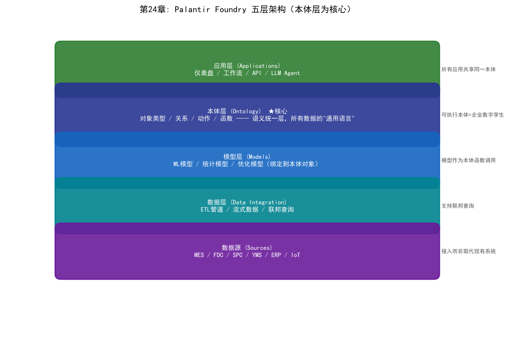
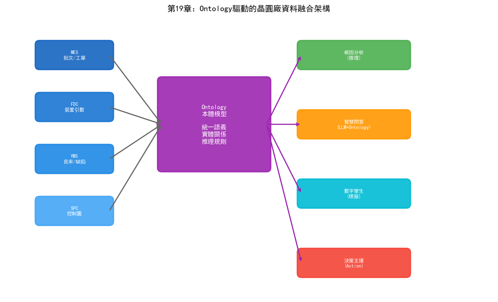

# 第24章 Palantir 與本體論——從擊斃本拉登到三星良率飛躍

## 24.1 什麼是 Ontology（本體論）

### 從哲學到電腦科學

"Ontology"這個詞源於哲學。在古希臘哲學中，ontology研究的是"存在的本質"——什麼東西存在、存在的範疇有哪些、不同範疇的存在者之間是什麼關係。亞里士多德的《範疇篇》是最早的本體論探索之一——他定義了實體、數量、性質、關係、地點、時間等十個範疇。

當電腦科學家借用這個詞時，他們問的是一個更具體的問題：如何讓電腦"理解"世界中的實體和它們之間的關係？

1993年，托馬斯·格魯伯（Thomas Gruber）給出了電腦科學中本體論的經典定義：

> "Ontology是對共享概念化的明確、形式化的規範。"

這句話拆解開來：

- **概念化（Conceptualization）：** 辨識領域中存在的實體型別和它們之間的關係——晶圓廠中有Wafer、Tool、Recipe、Defect等實體，它們之間有uses、produces、causes等關係
- **明確（Explicit）：** 概念和關係被顯式定義，而非隱含在程式碼中——任何人都可以檢視本體定義並理解其含義
- **形式化（Formal）：** 用機器可處理的形式語言描述——OWL、RDF等，使得電腦可以對本體的邏輯進行自動推理
- **共享（Shared）：** 本體是多人/多系統共同認可的——不是某個工程師的私有資料模型，而是整個組織同意遵循的語義標準

### 本體論在 AI 中的地位

在AI的三大學派中，本體論屬於符號主義的技術分支。它繼承了符號主義的核心信念——智慧的基礎是知識表示和推理——但在知識表示的形式上遠比專家系統的"如果-那麼"規則豐富。

專家系統的規則是"扁平"的——一條條獨立的規則，彼此之間缺乏結構化的關聯。本體論引入了層次化、結構化的知識表示：類與子類的繼承關係、屬性的定義域和值域約束、實體之間的多種關係型別、以及自動推理規則。

當本體論與知識圖譜結合時，前者提供"概念模型"（schema——什麼是Wafer、什麼是Tool），後者提供"例項資料"（data——W001是一片具體的Wafer、ETC-03是一臺具體的Tool）。兩者合在一起，構成了一個可以被電腦自動推理的知識系統。

### 與知識圖譜的關係與區別

本體論和知識圖譜經常被混淆，因為它們在技術上有大量重疊。簡化的區分：

| 維度 | 本體論（Ontology） | 知識圖譜（Knowledge Graph） |
| --- | --- | --- |
| 側重 | 概念模型——定義"什麼是Wafer" | 例項資料——儲存"W001是一片Wafer" |
| 形式化程度 | 高（OWL等描述邏輯，支援自動推理） | 中（RDF三元組或Property Graph） |
| 推理能力 | 支援類層次推理、一致性檢查、隱含知識推導 | 依賴圖演算法（路徑搜尋、社群檢測等） |
| 變化頻率 | 相對穩定（概念模型不常變） | 頻繁更新（每批晶圓產生新例項） |

在實際工程中，兩者通常是配合使用的——本體定義概念模型和推理規則，知識圖譜儲存例項資料並接受本體的推理。Palantir的Foundry平台就是這種"本體+例項資料"的統一體。

## 24.2 Palantir 的故事

### 創始：Peter Thiel 與 Alex Karp

2003年，矽谷。Peter Thiel剛剛以15億美元將PayPal賣給了eBay，正在尋找下一個大機會。9·11事件後的美國情報體系暴露了一個令人尷尬的事實：CIA、FBI、NSA各自擁有海量情報資料，但這些資料分散在不同的系統中，格式不相容，安全級別不互通，分析人員只能手工在多個系統之間切換和關聯——效率極低。9·11委員會在事後調查中指出：情報機構"擁有"拼出襲擊圖景所需的全部資訊碎片，但缺乏將它們拼起來的能力。

Thiel看到了這個機會。他與Alex Karp、Joe Lonsdale、Stephen Cohen和Nathan Gettings共同創立了Palantir Technologies。公司名稱來自托爾金《指環王》中的"真知晶石"（Palantír）——一種可以讓人看到遠方事物的水晶球。這個名字暗含了Thiel和Karp的理念：技術可以揭示真相，但也需要防止濫用。

傳統的風險投資機構對一家主要面向美國情報機構銷售的初創公司興趣寥寥。Thiel自己的Founders Fund基金承擔了大部分早期約3000萬美元的啟動資金。

2004年，Palantir獲得了In-Q-Tel——CIA旗下的風險投資機構——約200萬美元的投資。金額不大，但戰略意義極高。In-Q-Tel不僅帶來了資金，更重要的是帶來了CIA分析師的直接參與——這些分析師幫助Palantir的工程師理解情報分析的真實工作流程和資料形態，將軟體設計為真正滿足情報人員需求的產品。2005年，CIA成為Palantir的第一個大客戶。

### 擊斃本拉登：Palantir 如何幫助 CIA 定位目標

2011年5月1日，美國海軍海豹突擊隊在巴基斯坦阿伯塔巴德（Abbottabad）的一棟建築中擊斃了奧薩馬·本·拉登。這次行動的成功建立在長達十年的情報蒐集和分析之上，而Palantir的Gotham平台在其中扮演了關鍵角色。

尋找本拉登的核心挑戰不是缺少情報——美國情報機構擁有海量資料。問題是資料太多了，而且散落在無數系統中：衛星影象、無人機監控畫面、通訊截獲記錄、線人報告、新聞報道、金融交易記錄、旅行記錄……情報分析人員需要從這些海量、異構、碎片化的資料中找到關聯——某個可疑電話號碼與某次資金轉賬之間的聯絡，某個信使的行蹤與某棟建築之間的關聯。

Palantir的Gotham平台做的事情是：將所有這些異構資料源整合到一個統一的語義模型中。每一條情報——無論來自SIGINT（訊號情報）、HUMINT（人力情報）還是OSINT（開源情報）——被對映為本體中的物件，物件之間的關係在圖上顯式表達。分析人員可以在圖上進行鏈式探索：從一個電話號碼出發，找到與之通訊的其他號碼，追蹤這些號碼的地理位置和通話模式，關聯到人員身份，最終定位到阿伯塔巴德的那棟建築。

Gotham的技術核心就是本體論——它定義了情報領域本體：Person、Organization、Location、Communication、Transaction、Event等物件型別，以及它們之間的關聯關係。當分散在不同系統中的資料被對映到這個統一本體後，原本隱藏在海量資料中的關聯模式變得可被發現。

需要指出的是，Palantir並非"找到本拉登"的唯一功臣。整個搜尋行動涉及多個機構、多種技術手段和大量人力。Palantir的角色是提供了資料整合和分析的基礎設施——使得分析人員能夠更快地發現和驗證關聯線索。

### 追蹤哈梅內伊：Palantir 在伊朗核設施監控中的角色

2025-2026年間，Palantir在對伊朗的軍事和情報行動中扮演了更加前沿的角色——這次不再是輔助分析工具，而是首次實現了"AI主導的殺傷鏈"。

Palantir與伊朗核問題的關聯可以追溯到2015年。那一年，Palantir的MOSAIC系統被整合進國際原子能機構（IAEA）的核查工作中，作為2015年伊核協議（JCPOA）的技術支援工具。MOSAIC是一個價值約5000萬美元的AI系統，它處理了約4億個資料物件——衛星影象、設施檔案、感測器測量資料、伊朗境內人員的社交媒體資訊——生成關於核擴散風險的預測性評估。

MOSAIC的核心能力是從看似不相關的資料碎片中發現模式。一座工廠的電力消耗異常增加、某條道路上的車輛通行模式變化、某位核科學家與特定設施之間的人員流動模式——這些碎片化的訊號在MOSAIC的本體模型中被關聯起來，形成對伊朗核活動的全景檢視。

2025-2026年的軍事行動中，Palantir的AI平台（AIP）及其軍用版本Gotham5被用作"作戰神經中樞"。據媒體報道，Palantir整合了來自多個美國機構的碎片化資料——衛星影象、無人機畫面、雷達訊號、截獲的通訊——對映伊朗全境的軍事活動。Anthropic的Claude模型分析這些資料，確定最優目標、方法和打擊序列，向人類指揮官提供可行動的建議。

清華大學社會學系教授孫立平將此描述為"AI主導的演算法戰爭"——AI第一次在實戰中定義了殺傷鏈的"目標、時機和方式"，人類指揮官只做最終批准，而非設計打擊方案。

這一事件的意義遠超軍事範疇。它證明了一件事：當Ontology技術被用於整合海量異構資料時，AI可以做到傳統分析方法無法做到的事情——從碎片化資料中自動發現關聯、預測模式、生成行動方案。這個能力從軍事場景遷移到工業場景，就是Palantir在三星晶圓廠中做的事。

### 從軍工到工業的轉型

Palantir從軍工向商業領域的轉型始於2010年左右。Gotham平台在情報領域的成功證明了一個技術事實：本體論驅動的資料整合框架可以應用於任何需要跨系統資料融合的場景。商業企業同樣面臨"資料散落在多個系統中、無法被有效整合和分析"的問題。

2016年，Palantir推出了Foundry平台——面向商業和工業客戶的資料整合與分析平台。Foundry繼承了Gotham的核心技術理念（本體論驅動的資料融合），但在互動設計上從情報分析者的"圖探索"轉向了企業使用者的"工作流和儀表盤"。

Foundry的客戶涵蓋金融（摩根士丹利、西方石油）、航空（空中客車）、醫療（美國國立衛生研究院）、製造（默克、聖戈班）等產業。而半導體產業最具標誌性的客戶，就是三星。

## 24.3 Palantir 的技術架構

### Gotham 平台（國防與情報）

Gotham是Palantir面向國防和情報領域的產品。它的核心功能是多源情報融合——將SIGINT（訊號情報）、HUMINT（人力情報）、OSINT（開源情報）、GEOINT（地理空間情報）等不同型別的資料整合到一個統一的分析環境中。

Gotham的技術特點：

**多層安全架構（MLS/Cross-Domain）：** Gotham最深層的技術壁壘是多層安全架構——在一個介面中同時顯示不同密級的資料（TS/SCI、SECRET、UNCLASSIFIED），同時確保高密級資訊不會"洩露"到低密級層。這種跨域資訊處理能力是傳統國防承包商未能解決的難題。

**圖探索分析：** 分析人員可以在知識圖上進行自由探索——從一個實體出發，沿關係鏈路擴充套件，發現隱含的關聯網路。這種"假設驅動的探索"模式適合情報分析——分析人員不需要預先知道要找什麼，而是在探索中發現線索。

**動態本體：** 情報領域的本體不是固定的——新的威脅行為體、新的通訊技術、新的地理熱點隨時可能出現。Gotham允許分析人員在運行時修改本體——新增新的實體型別和關係型別，而不需要重新部署系統。

### Foundry 平台（商業與工業）

Foundry是Palantir面向商業客戶的產品，也是三星晶圓廠使用的平台。它的核心是"Ontology"——一個企業級的語義層，將所有資料源、分析模型和業務邏輯統一在一個本體模型下。

Foundry的架構可以概括為五層：

```
┌─────────────────────────────────────────────┐
│  应用层 (Applications)                       │
│  仪表盘 / 工作流 / API / LLM Agent           │
├─────────────────────────────────────────────┤
│  本体层 (Ontology)                           │
│  对象类型 / 关系 / 动作 / 函数               │
│  ← 语义统一层，所有数据的"通用语言"          │
├─────────────────────────────────────────────┤
│  模型层 (Models)                              │
│  ML模型 / 统计模型 / 优化模型                 │
├─────────────────────────────────────────────┤
│  数据层 (Data Integration)                    │
│  ETL管道 / 流式数据 / 联邦查询                │
├─────────────────────────────────────────────┤
│  数据源 (Sources)                             │
│  MES / FDC / SPC / YMS / ERP / IoT           │
└─────────────────────────────────────────────┘
```

**資料源層：** Foundry透過ETL管道和流式資料介面連接企業的各種資料源。在晶圓廠場景中，這包括MES、FDC、SPC、YMS、設備IoT資料等。資料從源系統被"接入"Foundry，但不被"複製"——Foundry支援聯邦查詢，可以直接查詢源系統中的資料而不需要物理複製。



*圖24-1：Palantir Foundry 五層架構——以本體層為核心*

**本體層（核心）：** 這是Foundry與普通資料平台最根本的區別。大多數資料平台的做法是"建一個資料湖，把所有資料倒進去，然後用SQL查詢"。Foundry的做法是先構建一個本體——定義企業中的核心實體型別（如Wafer、Tool、Recipe、Defect）、它們之間的關係（如Wafer usesTool Tool）、以及可以在實體上執行的動作（Action，如schedulePM）和函式（Function，如calculateYield）。

一旦本體定義完成，所有資料源的資料都被對映到本體中的物件例項。MES中的批次資料變成`Lot`物件，FDC中的感測器資料變成`Tool`物件的屬性，SPC中的量測結果變成`Measurement`物件。不同系統中的資料在語義上被統一——不再有"MES中的step和SPC中的operation是不是同一個東西"的困惑。

**模型層：** ML模型可以被"繫結"到本體物件上。一個預測設備RUL的LSTM模型可以繫結到`Tool`物件上——每當查詢某個`Tool`物件時，模型自動運行並返回預測結果。模型不是獨立的"AI應用"，而是本體中的一個函式——可以被任何引用該物件的應用呼叫。

**應用層：** 基於本體構建的應用——儀表盤、分析工作流、API介面、甚至LLM Agent。因為所有應用都基於同一個本體，它們之間的資料一致性天然得到保證——不可能出現"儀表盤A顯示良率92%，儀表盤B顯示89%"的矛盾。

### Ontology 作為核心引擎

Palantir的Ontology與學術界的本體論有一個關鍵區別：它不僅包含靜態的概念和關係，還包含動態的行為——動作和函式。

**動作：** 定義在物件上可以執行的操作。例如，`Tool`物件可以有一個`schedulePM`動作——當使用者或AI系統呼叫這個動作時，Foundry自動執行PM排程的完整流程：檢查維護視窗、建立維護工單、通知相關人員、更新設備狀態。動作的定義包含了前置條件檢查（如"設備必須不在運行中"）和後置效應（如"設備狀態變為'維護中'"）。

**函式：** 定義在物件上的計算邏輯。例如，`Lot`物件可以有一個`calculateYield`函式——根據該Lot所有晶圓的CP測試結果計算良率。函式的定義是宣告式的——使用者不需要知道資料在哪個系統中、用SQL怎麼查，只需要呼叫`lot.calculateYield()`。

這種"物件+動作+函式"的本體模型使得Foundry不僅僅是一個資料分析平台，而是一個"可執行的企業數字孿生"[93]——本體不僅是資料的語義對映，還是企業營運邏輯的形式化表達。當AI Agent在Foundry上運行時，它可以透過呼叫本體上的動作和函式來感知狀態和執行操作——這正是第23章描述的Agent架構的理想運行環境。

## 24.4 Palantir 進入半導體

### 三星半導體引入 Palantir Foundry 的背景

2024年底，三星電子DS（半導體）部門做出了一個被業內視為"近乎瘋狂"的決定——將晶圓廠核心製造資料接入美國Palantir公司的Foundry平台。

半導體製程資料是比晶片設計圖紙更敏感的商業機密。一片晶圓的完整製程資料——設備參數、量測結果、缺陷資訊、良率資料——如果洩露給競爭對手，等於暴露了自己最核心的製程秘密。台積電和英特爾從未讓任何第三方觸碰產線資料。

三星之所以破例，原因只有一個：2nm GAA製程的良率已經跌到了30%左右。

2nm是三星從FinFET轉向GAA（Gate-All-Around，全環繞柵極）電晶體架構的第一代製程。GAA架構相比FinFET在效能和功耗上有顯著優勢，但製程複雜性急劇增加——奈米片的厚度控制要求在亞奈米量級，內隔離層的尺寸精度要求在4-6奈米。這種極端的製程精度要求使得良率爬坡變得異常困難。

30%的良率意味著每生產10片晶圓，只有3片是"好的"——這個數字遠低於60%的量產門檻。三星在2nm上的良率困境直接影響了其代工競爭力——高通據報道因此選擇了台積電的2nm製程而非三星。

傳統的良率提升方法——DOE實驗、工程師經驗、FDC監控——在2nm的複雜性面前顯得力不從心。問題的根因往往涉及數百個製程步驟和數十臺設備之間的複雜互動，而這些資料散落在幾十個異構系統中。一個簡單的根因分析問題——"第67步的良率下降是否與第23步的參數偏差有關"——可能需要工程師在MES、FDC、SPC、YMS四個系統中分別查詢資料，然後人工關聯。

### 良率提升的具體故事

三星引入Palantir Foundry後，第一件事不是訓練AI模型——而是構建晶圓廠的Ontology。

Foundry的工程團隊與三星的PID和YED工程師合作，定義了晶圓廠核心本體：

- **產品本體：** Wafer（晶圓）、Die（裸片）、Device（器件）、Layer（製程層）、Lot（批次）
- **製程本體：** Recipe（配方）、ProcessStep（製程步驟）、Route（製程路線）、Module（製程模組）
- **設備本體：** Tool（設備）、Chamber（腔體）、Component（部件）、ConsumablePart（消耗件）
- **參數本體：** Parameter（參數）、SetPoint（設定值）、Measurement（量測值）、SensorData（感測器資料）
- **缺陷本體：** Defect（缺陷）、DefectType（缺陷型別）、DefectPattern（缺陷模式）、RootCause（根因）
- **測試本體：** WAT、CP、FT、TestItem（測試項）、TestResult（測試結果）

定義本體之後，將MES、FDC、SPC、YMS等系統中的資料對映到本體中的物件例項。這個過程是工程量最大的環節——需要理解每個系統的資料schema，建立從源資料到本體物件的對映規則。

當資料被統一到本體後，Foundry實現了三星此前無法做到的事情：跨系統的關聯查詢和推理。以一個典型的良率問題為例——"某批次CP良率為什麼低於正常水平"：

傳統方式下，YED工程師需要：
1. 在YMS中檢視晶圓圖模式→判斷缺陷型別
2. 在MES中檢視該批次的製程路徑→定位可能的異常步驟
3. 在FDC中檢視對應設備的感測器資料→檢查參數異常
4. 在SPC中檢視量測資料→確認參數偏差
5. 人工關聯以上資訊→推斷根因

這個過程需要4-8小時，且高度依賴工程師的經驗和直覺——有經驗的工程師能更快地找到正確的查詢路徑，但新手往往需要反覆嘗試。

在Foundry上，這個過程變成了：
1. 在本體檢索中輸入批次號
2. 系統自動展示該批次的完整製程歷史——所有步驟、設備、參數、量測結果、缺陷資訊
3. 系統自動標註異常項——與正常批次相比偏差超過閾值的參數
4. 系統沿本體中的關係鏈路搜尋關聯路徑——從異常參數出發，找到對應的設備和步驟
5. 系統生成根因假設列表——每個假設附帶推理路徑和置信度

這個過程縮短到30-60分鐘，且不受工程師經驗水平的限制——本體中的知識是全廠共享的，任何工程師都可以藉助本體的推理能力進行分析。


*圖24-2：晶圓良率根因分析（RCA）——傳統跨系統人工查詢與本體驅動自動推理對比*

根據公開報道，三星2nm良率從2024年底的約30%提升到2026年中期的約55%-60%。三星同時在其AI Megafactory中部署了大規模AI算力，將AI最佳化貫穿全流程——缺陷檢測改善30%、晶圓良率提升15%。雖然良率提升不能完全歸功於Palantir（三星同時投入了大量內部工程力量和其他AI技術），但Foundry提供的資料融合基礎設施被認為是加速良率爬坡的關鍵因素。

### 為什麼傳統資料平台做不到

三星此前並非沒有嘗試過自建資料平台。傳統的資料湖（Data Lake）方案——將所有系統資料匯出到一個Hadoop/Spark叢集中——在半導體場景中遇到了根本性困難：

**語義不統一。** 不同系統對同一概念有不同的命名和定義——MES中的"step"對應FDC中的"operation"對應YMS中的"stage"。資料湖把資料堆在一起，但不解決"這些資料是什麼意思"的問題。工程師在資料湖中做關聯查詢時，仍然需要人工判斷"step 45是不是operation 45"。

**缺乏關係建模。** 資料湖基於關係型模型（表），適合儲存結構化資料但不擅長表達實體之間的複雜關係。"Wafer→Lot→Tool→Chamber→Component→ConsumablePart"這樣的多層關聯在關係型資料庫中需要多表JOIN，查詢效率低且可讀性差。本體天然用圖結構表達這種關聯。

**靜態而非動態。** 資料湖中的資料是"快照"——每天或每小時從源系統匯出一次。但晶圓廠的運行是即時的——FDC資料每秒更新，CP測試結果每批次更新。當工程師分析問題時，他需要看到最新資料，而不是昨天的快照。Foundry透過流式資料管道實現近即時的本體更新。

**不可執行。** 資料湖只能查詢和分析——如果分析發現問題，工程師需要切換到MES或其他系統去執行操作（如暫停批次、安排維護）。Foundry的本體包含動作——分析發現問題後可以直接在本體上執行操作，資料從分析到行動的鏈路被打通。

**無法支撐AI。** 資料湖中的資料沒有語義標註——AI模型無法理解"表A的列X和表B的列Y是什麼關係"。LLM Agent在資料湖上運行時，需要人工告訴它每個表的結構和表之間的關聯。Foundry的本體天然提供了這些語義資訊——LLM Agent可以直接在本體上操作，不需要人工解釋資料結構。

## 24.5 Athinia——Palantir與默克的半導體資料合資公司

### 合資公司的誕生

如果說三星案例展示了Palantir Foundry在單一晶圓廠內部的價值，那麼Athinia則展示了Ontology技術跨越企業邊界的更大野心。

2021年12月，Palantir與德國默克集團（Merck KGaA，注意與美國默克Merck & Co.區分）宣佈成立合資公司Athinia。默克是全球領先的半導體材料供應商——其電子科技業務提供光阻、特種氣體、CMP漿料等半導體製造關鍵材料。Athinia的目標是構建一個半導體產業的資料共享平台，讓材料供應商和晶片製造商之間能夠安全地共享和分析資料。

這個想法直擊半導體產業的一個長期痛點：材料供應商和晶圓廠之間的資料壁壘。材料供應商知道自家材料的批次間變異特性，晶圓廠知道製程結果和良率——但雙方的資料幾乎不互通。當晶圓廠遇到良率問題時，很難追溯是否與某批材料的變異有關；材料供應商也缺乏回饋來改進產品品質。

Athinia的平台基於Palantir Foundry構建，核心思路是用Ontology建立材料-製程-良率之間的語義關聯。材料批次資料（供應商側）和製程結果資料（晶圓廠側）被對映到統一的本體中，雙方可以在保護各自資料隱私的前提下進行關聯分析。

### 與美光的CMP預測性製造合作

Athinia最具代表性的案例是與美光科技（Micron Technology）在CMP（化學機械拋光）領域的合作。

CMP是半導體製造中製程視窗最窄的步驟之一——拋光速率的微小波動都會影響晶圓的平坦度，進而影響後續微影的套刻精度。CMP的製程結果受多種因素影響：拋光漿料的批次差異、磨墊的退化狀態、設備參數的漂移——這些因素分屬不同實體（材料供應商、設備廠商、晶圓廠）的管控範圍。

美光與Athinia合作構建了一個CMP預測性製造平台。平台整合了三個維度的資料：

- **材料側：** 默克提供的CMP漿料批次資料——粒徑分佈、pH值、固體含量、粘度等
- **設備側：** 美光CMP設備的運行資料——拋光壓力、轉速、漿料流量、磨墊狀態
- **結果側：** 拋光後的量測資料——去除量、均勻性、缺陷密度

在Foundry的本體模型中，這三類資料被關聯為一條完整的因果鏈路：`Material → affects → ProcessParameter → affects → MeasurementResult`。當某批晶圓的CMP均勻性異常時，系統可以沿這條鏈路追溯到漿料的某個批次特性是否發生了變化。

美光全球品質副總裁Raj Narasimhan在新聞稿中表示："與默克和Palantir的合作使我們能夠在CMP製程中實現預測性製造——在問題影響生產之前就發現並解決它。"

### Athinia生態系統

Athinia不僅服務於美光和默克的雙邊關係，更在構建一個多邊資料共享生態：

**ASNA（2024年7月合作）：** ASNA是半導體子元件追溯領域的參與者。Athinia與ASNA合作，將子元件的追溯資料納入本體——從材料批次到子元件再到最終產品，實現全鏈路的追溯和品質關聯。當某個子元件在最終測試中失效時，可以沿本體追溯其使用的材料批次、經過的製程步驟和設備。

**東京電子（TEL）：** 作為全球四大半導體設備廠商之一，TEL透過Athinia平台共享設備效能資料。設備供應商瞭解設備的退化曲線和故障模式，晶圓廠瞭解設備在自己製程環境中的實際表現——兩者資料的融合使得預測性維護模型的精度大幅提升。

Athinia的模式代表了一種新的產業協作正規化：競爭對手或上下游企業在Ontology的語義框架下共享資料，在不暴露商業機密的前提下實現協同最佳化。這解決了一個長期以來半導體產業"資料孤島不只在企業內部、更在企業之間"的問題。

## 24.6 歐洲IDM案例——供應鏈視覺化與產能規劃

### 背景與部署

據市場研究機構Emergen Research的報告，Palantir披露了與一家"大型歐洲整合器件製造商（IDM）"的合作。該IDM部署了Foundry平台，用於其橫跨歐洲和亞洲製造網路的供應鏈視覺化和生產規劃最佳化。

IDM（Integrated Device Manufacturer，整合器件製造商）與純代工廠（如台積電）不同——IDM同時進行晶片設計、製造和銷售，其供應鏈更加複雜。一家大型歐洲IDM（如英飛凌、恩智浦或STMicroelectronics——報告未披露具體名稱）通常有多個晶圓廠、封裝測試廠和設計中心分佈在不同地區，產品線涵蓋汽車電子、工業控制、消費電子等多個領域。

這家IDM面臨的挑戰是：不同工廠和不同產品線各自維護自己的資料系統，總部無法獲得統一的產能和供應鏈檢視。當某個工廠遇到產能瓶頸時，無法快速評估是否可以將訂單轉移到其他工廠——因為各工廠的製程能力、設備配置和產能資料不在同一平台上。

### Foundry部署的價值

Foundry在該IDM的部署聚焦三個方向：

**多工廠產能視覺化：** 將所有工廠的設備清單、製程能力、當前產能利用率和WIP狀態整合到一個統一的本體中。總部可以在一個儀表盤上看到所有工廠的即時產能狀態——哪臺設備在哪裡利用率最高，哪個工廠有空閒產能可以接收轉單。

**供應鏈端到端可視：** 從原材料採購到晶圓製造再到封裝測試和最終交付，整條供應鏈被對映到本體中。當某個環節出現中斷（如某原材料供應商交付延遲），系統可以立即評估影響範圍——哪些產品、哪些客戶、哪些工廠會受到影響，以及可以採取什麼緩解措施。

**Clear-to-Build（可構建性檢查）：** 這是一個 Foundry 特有的功能——在投入生產前檢查是否有所有必需的資源（設備產能、材料庫存、製程規格、人員可用性）。如果任何一項不滿足，系統標註"不可構建"並說明缺失的資源。這避免了"投產後才發現缺料"的浪費。

## 24.7 Palantir官方定義的半導體三大工作流

Palantir在其官方半導體產業資料中定義了Foundry在晶圓廠中的三大核心工作流。這些工作流不是概念性的"願景"，而是已經產品化的功能模組。

### 工作流一：生產最佳化（Production Optimization）

**目標：** 透過即時監控設備感測器、MES和量測資料，在生產受到干擾之前快速辨識設備問題。

**技術路徑：** Foundry透過流式資料管道即時接入FDC感測器資料，在本體中為每臺設備建立即時的"健康畫像"。當感測器資料偏離正常模式時，系統觸發告警並將異常關聯到可能影響的製程步驟和產品批次。

與傳統FDC系統的區別在於"關聯"——傳統FDC只告訴你"ETC-03的RF功率異常"，Foundry告訴你"ETC-03的RF功率異常影響了第623步的CD，進而可能影響正在該設備上加工的LOT-B67890的CP良率"。這種關聯推理依賴於本體中定義的`Tool → ProcessStep → Parameter → Measurement → Yield`因果鏈路。

### 工作流二：中斷管理與良率（Disruptions and Yield）

**目標：** 當生產中斷髮生時（設備故障、材料短缺、製程異常），快速評估中斷的規模和影響範圍，並優先排序恢復方案。

**技術路徑：** 中斷管理工具從原材料到成品全鏈路追蹤中斷的影響——某個設備停機不僅影響當前在其上加工的批次，還透過WIP流動影響後續工序的排隊和上游工序的產出。系統將所有受影響的產品和訂單按KPI（如交期緊迫度、客戶優先順序、財務影響）排序，幫助管理者做出最優的恢復決策。

**Clear-to-Build模組：** 即時檢查每個計畫投產批次是否有全部必需資源。這個模組直接解決了一個晶圓廠常見的浪費——投產後才發現缺料或設備不可用，導致批次在產線上"卡住"。

### 工作流三：戰略CAPEX模擬（Strategic CAPEX Simulation）

**目標：** 在投資數十億美元建設新產線或購買新設備之前，用數字孿生模擬整個價值鏈，評估產能提升效果、瓶頸轉移和投資回報。

**技術路徑：** Foundry構建晶圓廠全價值鏈的數字孿生——包括設備產能、製程路線、產品組合和供應鏈約束。在數字孿生上模擬不同投資方案的效果——"如果投資2億美元增加3臺EUV設備，整線產能提升多少？瓶頸轉移到哪裡？投資回收期多長？"

這個工作流的價值在先進製程投資決策中尤為突出。一座3nm晶圓廠的造價超過200億美元，設備投資佔其中大部分。在沒有數字孿生的情況下，投資決策依賴於工程師的經驗估算和電子表格模型——精度有限且無法模擬動態效應（如瓶頸轉移）。Foundry的數字孿生可以在投資前模擬"如果"場景，顯著降低投資風險。

## 24.8 AIP在半導體研發中的應用

2023年7月，Palantir釋出了《加速半導體產業研究與開發》白皮書，詳細闡述了AIP（Artificial Intelligence Platform）在半導體R&D中的應用。這份白皮書揭示了Ontology與LLM結合在半導體領域的具體方式。

### 雙支柱架構

AIP在半導體R&D中採用"雙支柱"架構：

**支柱一：知識樹設計（Knowledge Tree）。** 將半導體製程知識組織為層次化的知識樹——從產品規格到製程路線，從製程模組到關鍵參數，從參數到量測結果。知識樹的本體結構支援快速假設檢驗——工程師提出一個假設（"第23步的溫度偏差是否導致第67步的良率下降"），系統沿知識樹的關聯路徑快速驗證或否定這個假設，而不需要反覆運行實驗。

**支柱二：資料分析與ML應用。** 在知識樹提供語義框架的基礎上，ML模型被繫結到本體物件上進行預測和分析。一個預測良率的類神經網路模型不需要獨立運行——它作為`Lot`物件上的一個函式被呼叫，自動獲取該Lot的所有製程歷史資料作為輸入，輸出良率預測。LLM則作為自然語言介面，讓工程師用自然語言與本體互動——提問、查詢、假設檢驗。

### LLM與Ontology的融合

AIP白皮書特別強調了LLM與Ontology融合的架構設計：

**資料訪問控制：** LLM不是直接訪問所有資料——它透過本體定義的權限控制來訪問資料。不同角色的工程師看到不同的資料檢視。一個PE工程師可以檢視自己負責的製程模組資料，但不能檢視其他模組的資料；PID工程師可以看到全流程資料但不能修改PE的Recipe參數。Ontology的安全模型確保LLM的"好奇心"不會越過權限邊界。

**防幻覺機制：** LLM的回答基於本體中的結構化資料——而非自由生成。當LLM被問"第45步的目標CD是多少"，它不是"回憶"一個數字，而是呼叫本體中的`ProcessStep(stepOrder=45).targetCD`函式獲取準確值。如果本體中沒有這個資料，LLM回答"未找到相關資訊"，而非編造一個看似合理的數字。

**可溯源推理：** LLM的每一步推理都可以追溯到底層的資料和本體關係。當LLM給出"建議檢查ETC-03的匹配器"的建議時，它同時給出推理鏈路：RF功率波動（FDC資料）→ CD偏差（SPC資料）→ 良率下降（CP資料）→ 匹配器老化歷史（維護記錄）。工程師可以驗證每一步的資料來源和推理邏輯。

## 24.9 產業生態與競爭格局

### Palantir在半導體產業的影響力版圖

截至2026年，Palantir在半導體產業的影響力版圖可以概括為：

| 客戶/合作伙伴 | 合作內容 | 階段 |
| --- | --- | --- |
| 三星半導體 | 全廠Foundry部署，2nm良率提升 | 已部署 |
| 美光（Micron） | CMP預測性製造（透過Athinia） | 已部署 |
| 默克（Merck KGaA） | 材料資料共享平台（Athinia合資） | 營運中 |
| 東京電子（TEL） | 設備效能資料整合（透過Athinia） | 合作中 |
| ASNA | 子元件追溯與品質關聯（透過Athinia） | 合作中 |
| 未披露的歐洲IDM | 供應鏈視覺化與產能規劃 | 已部署 |
| AIPCon半導體客戶 | 具體未披露 | 推進中 |

值得注意的是Palantir在Semicon Korea 2025上的亮相——這是Palantir首次在主要半導體產業會議上正式亮相。Palantir的Cheolwoo Park在會議上做了專題演講，標誌著Palantir從"軍工公司做半導體"的定位轉向"半導體產業的AI基礎設施提供商"。

### 競爭對手對比

Palantir在半導體資料平台領域並非沒有競爭者。理解競爭格局有助於定位Palantir的獨特價值。

**傳統資料平台（Snowflake、Databricks）：** 這些通用資料平台在資料處理能力和ML工具鏈上已經非常成熟，Databricks的估值達到1340億美元。但它們解決的是"資料儲存和計算"問題，不解決"資料語義統一"問題。在晶圓廠中，資料湖可以儲存所有資料，但無法回答"MES的step 45和FDC的operation 45是不是同一個東西"。Ontology是Palantir相對於通用資料平台的核心差異化。

**EDA巨頭（Synopsys、Cadence）：** 這些公司在半導體領域深耕數十年，對製程和設備的理解遠超Palantir。韓國一位EDA資深從業者指出了Palantir在半導體領域的五項結構性侷限——包括對半導體物理的深度理解不足、對EDA工具鏈的整合不夠、以及工程師社群的認知壁壘。但EDA工具聚焦於設計和驗證，在跨系統資料融合和AI應用編排方面不如Foundry。

**設備廠商的AI方案（Applied Materials、Lam Research、KLA）：** 設備廠商各自提供針對自家設備的AI分析工具——如Lam的Fabtex Yield Optimizer、Applied Materials的Equipment Intelligence。這些方案在單臺設備的最佳化上很深入，但跨設備、跨廠商的資料整合能力有限——它們天然傾向於"鎖定"客戶使用自家設備的AI方案。Palantir作為獨立第三方平台，可以整合不同廠商設備的資料，這是設備廠商AI方案做不到的。

**NVIDIA Omniverse：** 三星的AI Megafactory使用的是NVIDIA的Omniverse平台和約5萬塊GPU，而非Palantir。Omniverse在數字孿生的3D視覺化和物理模擬方面很強，但在跨系統資料融合和語義建模方面不如Foundry。三星同時使用Palantir Foundry（資料融合）和NVIDIA Omniverse（數字孿生模擬）的做法表明：兩者是互補而非競爭關係——Foundry提供語義資料層，Omniverse提供物理模擬層。

### Palantir的護城河

在半導體場景中，Palantir的真正護城河不是技術——Ontology的概念和實現並不複雜，任何有足夠工程能力的團隊都可以構建。真正的護城河是三個層面：

**本體建模經驗：** Palantir從軍事情報到金融到醫療到半導體，積累了跨領域的本體建模經驗。知道"應該定義哪些實體型別和關係型別"是一種經驗性知識——不是讀了OWL規範就能做對的。Palantir的工程師知道在半導體場景中`Tool → Chamber → Component`的層級關係比一個扁平的`Equipment`表更有價值，這種判斷力來自大量實踐。

**資料安全架構：** 半導體資料是比軍工資料更敏感的商業機密。Palantir在Gotham中為CIA構建的多層安全架構——確保高密級資料不會"洩露"到低密級層——在半導體場景中同樣關鍵。三星願意將製程資料交給Palantir而非Snowflake或Databricks，很大程度上是因為Palantir的資料安全架構經過了軍工級別的驗證。

**可執行本體：** 大多數知識圖譜平台只支援查詢和推理。Palantir的Ontology包含動作和函式——使得本體不僅是"知識庫"，還是"操作系統"。分析發現問題後可以直接在本體上執行操作（排程維護、調整參數、暫停批次），資料從分析到行動的鏈路在一個平台內打通。這是Snowflake和Databricks不提供的。

---

## 24.10 三星的ChatGPT資料洩露事件與Palantir的"資料主權"優勢

### ChatGPT洩露事件

三星選擇Palantir並非一時衝動——而是被一起資料洩露事件"逼"出來的。

2023年3月，ChatGPT釋出後不久，三星半導體部門的工程師開始使用ChatGPT來輔助工作——讓AI幫忙最佳化程式碼、檢查設備參數、解決製程問題。在短短20天內，至少發生了三起嚴重的資料洩露事件：

工程師將下一代晶片設計的原始碼貼上到ChatGPT中請求最佳化。另一名工程師將晶圓廠設備測量的機密測試資料上傳到ChatGPT請求分析。還有工程師將公司內部會議的保密記錄輸入ChatGPT請求整理。

這些操作等於將三星最核心的晶片設計圖紙和製程機密直接傳送到了OpenAI的服務器——根據ChatGPT的使用條款，使用者輸入的資料可能被用於模型訓練。三星在事件發現後緊急禁止全公司使用ChatGPT等生成式AI工具。

### 放棄微軟和谷歌

據產業報道，三星DS部門在2024年初重新評估生成式AI方案時，首先考慮了微軟和谷歌的雲端AI服務。微軟向三星提供了Azure OpenAI Service的方案，谷歌提供了Gemini for Enterprise的方案——兩者都聲稱可以提供企業級的資料隔離和隱私保護。

但三星最終放棄了這兩個方案。核心顧慮有三：

**資料駐留。** 微軟和谷歌的雲AI服務雖然承諾資料隔離，但資料仍然儲存在它們的雲服務器上。三星的製程參數、設備配置和良率資料是比晶片設計圖紙更敏感的機密——一旦雲服務商的基礎設施被入侵或資料被意外洩露，損失不可挽回。

**訓練資料混用風險。** 即使企業版承諾不使用客戶資料訓練模型，三星的工程師對"承諾"的信任度很低——ChatGPT洩露事件已經證明，工程師的操作行為難以完全管控。只要資料離開了三星的內網，就存在被不當使用的風險。

**合規與審計。** 韓國對半導體技術出口管制嚴格，將製程資料傳送到美國雲服務商可能涉及跨境資料傳輸的合規問題。

### Palantir的"資料主權"承諾

Palantir最終被選中，關鍵在於它提供了微軟和谷歌無法提供的"資料主權"保障：

**資料不留存：** Palantir承諾不儲存、不復制、不訪問客戶的原始資料。Foundry平台部署在客戶自己的基礎設施上，Palantir的工程師（FDE）在部署期間可以接觸資料，但部署完成後資料完全由客戶掌控。

**本地化部署：** Foundry可以完全部署在三星電子內部的資料中心——資料不離開三星的內網。這對於三星這樣對資料安全極度敏感的企業來說是不可妥協的底線。

**Apollo跨環境交付：** Palantir的Apollo產品確保Foundry可以在公有云、私有云、本地資料中心甚至離線環境中一致運行——這給了三星靈活性，可以在不同安全級別的場景中選擇不同的部署模式。

這個選型過程揭示了一個被很多AI供應商忽視的現實：在半導體產業，資料安全不是"加分項"，而是"一票否決項"。再先進的AI模型，如果無法滿足資料主權要求，就無法進入晶圓廠。Palantir從軍工領域繼承的安全架構——在CIA環境中驗證過的多層安全模型——恰好滿足了半導體產業的這一核心需求。

## 24.11 從Syntropy到Athinia——跨界演化的故事

### Syntropy：癌症研究的起點

Palantir與默克KGaA的合作並非從半導體開始——它的起點是癌症研究。

2018年11月，Palantir與默克KGaA宣佈成立合資公司"Syntropy"，目標是構建一個癌症研究資料協作平台。癌症研究面臨著與半導體晶圓廠類似的資料困境：全球各地的研究機構各自產生了海量實驗資料——基因組測序、蛋白質分析、臨床試驗記錄、影像資料——但這些資料散落在不同的機構中，格式不統一，無法被有效整合和關聯分析。

Syntropy基於Palantir Foundry構建，用Ontology定義癌症研究領域的資料模型——Gene、Protein、Cell、Tumor、Treatment、Outcome等實體及其關係。研究人員可以在Syntropy上整合多源資料，進行跨機構的關聯分析——尋找某個基因變異與某種治療方案的關聯性。

### 從癌症到半導體的技術遷移

2021年12月，Syntropy被重組為Athinia，合作方向從癌症研究轉向半導體製造。這個轉型看似跨度巨大——從生物醫藥到電子製造——但底層的技術邏輯是完全相同的：

| 維度 | 癌症研究（Syntropy） | 半導體製造（Athinia） |
| --- | --- | --- |
| 核心挑戰 | 跨機構資料孤島 | 跨企業資料孤島 |
| 資料異構性 | 基因組、蛋白質、影像、臨床 | 材料批次、設備感測器、量測、良率 |
| 關聯分析目標 | 基因變異 → 治療效果 | 材料特性 → 製程結果 |
| 本體核心 | Gene → Protein → Cell → Tumor → Outcome | Material → ProcessParameter → Measurement → Yield |
| 資料隱私 | 患者隱私保護 | 製程機密保護 |

這個跨界遷移的故事印證了Ontology技術的一個核心特性：它解決的是"資料語義統一"問題——這個問題在任何資料密集型產業都存在。Palantir的Ontology框架不依賴於特定領域的知識——它提供的是一套"如何組織任何領域知識"的元方法論。一旦本體被定義，資料融合和推理的機制就是通用的。

## 24.12 Qualcomm與Palantir——Ontology向邊緣延伸

### 合作內容

2025年3月，在Palantir AIPCon大會上，高通（Qualcomm）和Palantir宣佈了一項合作：將Palantir的Ontology和AI能力運行在高通的邊緣計算硬體平台上。

這項合作的技術目標是讓Ontology不再侷限於雲端或資料中心——而是下沉到工廠車間的邊緣設備上。在晶圓廠場景中，這意味著設備級別的即時推理和決策不再需要將資料傳送到中央服務器——Ontology直接在設備旁邊的邊緣節點上運行。

### 邊緣Ontology的半導體應用價值

邊緣Ontology對半導體晶圓廠有獨特的價值：

**超低延遲即時控制。** 蝕刻過程中的RF功率調整需要毫秒級響應——將感測器資料傳送到雲端、在雲端推理、再將控制指令發回設備的延遲太高。邊緣Ontology可以在設備旁邊完成"感知→推理→行動"的閉環，延遲控制在毫秒級。

**離線運行能力。** 半導體晶圓廠的內網與外部網路通常是物理隔離的——這是安全要求。邊緣Ontology可以在完全離線的環境中運行，不依賴任何雲連接。這對於資料安全要求極高的先進製程晶圓廠尤為重要。

**設備級數字孿生。** 邊緣Ontology可以在每臺設備上運行一個輕量級的數字孿生——只包含該設備相關的本體子集。這個設備級數字孿生可以即時模擬設備的運行狀態，在參數偏離正常範圍時立即觸發調整——不需要等待全廠資料的彙總和分析。

### 從工廠級到設備級的本體下沉

Palantir的Ben Harvatine在2025年9月的演示中展示了更進一步的願景——將Ontology下沉到工廠車間的物理設備中，包括機器人手臂。

演示中，一個連接到邊緣計算節點的機器人手臂運行著"嵌入式本體"（Embedded Ontology）——本體不僅描述了機器人的狀態和動作，還定義了機器人與周圍環境（傳送帶、物料、其他設備）的語義關係。當本體推理出某個物料需要被移動時，它不是"在螢幕上彈出一個告警讓人去做"，而是直接告訴機器人去執行——"分析到行動"的閉環在物理層面完成。

Harvatine的演示揭示了一個趨勢：Ontology正在從"企業資料語義層"演化為"物理世界的操作系統"——不僅理解資料，還直接控制物理設備。在半導體晶圓廠中，這意味著未來的物料搬運系統（OHT）、自動缺陷檢測設備、甚至蝕刻機臺的參數調整，都可能被Ontology直接驅動。

## 24.13 FDE模式——Palantir部署在晶圓廠的"特種部隊"

### 什麼是FDE

Palantir的客戶部署方式與傳統的軟體公司截然不同。大多數SaaS公司透過API文件和培訓影片讓客戶自行使用產品；Palantir則派出FDE（Forward Deployed Engineer，前沿部署工程師）團隊直接進駐客戶現場。

FDE這個詞本身來自軍事——"Forward Deployed"指部署在前線執行任務的特種部隊。Palantir的FDE不是銷售或技術支援，而是"帶著產品上戰場的工程師"。前Palantir高管、前OpenAI首席研究官Bob McGrew給出了更精確的定義：FDE是一位技術人員，駐紮在客戶現場，帶著現有的產品，在產品團隊的幫助下，想辦法交付一個有價值的成果。

### Echo-Delta雙角色協作

在半導體客戶現場，FDE團隊通常採用雙角色協作模式：

**Echo（回聲）角色：** 辨識客戶的 key problem——與晶圓廠的PID、YED、PE工程師深入交流，理解他們的工作流程、痛點和資料形態。Echo不需要寫程式碼，但需要對半導體業務有深刻理解。類似於產品經理加業務顧問。

**Delta（三角洲）角色：** 將Echo辨識的需求轉化為可運行的軟體原型並直接部署。Delta是全棧工程師兼解決方案架構師——從前端介面到後端資料管道到本體模型，獨立完成端到端的交付。

在晶圓廠中，典型的FDE工作流如下：

```
晶圆厂工艺工程师 ──┐
                    ├──→ 联合工作坊 ──→ 工艺知识提取 ──→ 本体对象定义
Palantir FDE团队 ──┘         │
                              ↓
                        数据映射与清洗
                              ↓
                        Action原型开发
                              ↓
                        现场验证与迭代
                              ↓
                    反哺产品平台（通用化）
```

FDE團隊與晶圓廠的製程工程師共同工作，將複雜的領域知識轉化為可計算的業務物件。例如，定義"蝕刻製程"為一個業務物件——包含參數範圍、設備關聯、品質指標和可能的缺陷型別等屬性。這種協同使Palantir能夠快速響應晶圓廠的特定需求，同時將通用化的解決方案反哺到Foundry產品中——讓下一個客戶的部署更快速。

### AI FDE：最新的演化

2025年底至2026年，Palantir將FDE模式擴充套件到了AI本身——"AI FDE"。AI FDE是一個運行在Foundry上的Agent，透過自然語言操作Foundry：構建資料管道、管理倉庫、建立本體物件、運行資料轉換。據Palantir稱，AI FDE可以將傳統需要兩週完成的Foundry配置工作壓縮到更短時間。

在半導體場景中，AI FDE的潛力在於：當晶圓廠工程師用自然語言描述他們的需求時（"我需要追蹤某批晶圓在所有蝕刻步驟中的溫度變化趨勢"），AI FDE自動在Foundry上建立相應的本體物件、資料管道和視覺化介面——不需要人類FDE手動編碼。這將本體構建的成本和週期大幅降低。

## 24.14 Ursa Major案例——Ontology驅動的製造系統

### 背景

Ursa Major是一家美國航空航天推進系統製造商——生產火箭發動機和超高音速推進系統。雖然Ursa Major不是半導體公司，但它在AIPCon上演示的Ontology驅動製造系統對半導體晶圓廠有直接借鑑價值。

Ursa Major的製造挑戰與晶圓廠有相似性：產品複雜、製程步驟多、品質要求極高、資料散落在多個系統中。Ursa Major與Palantir合作構建了一套基於Ontology和AIP的製造系統，其技術負責人Cable在AIPCon上演示了這套系統。

### "數字神經系統"而非"靜態資料平台"

Cable將Ursa Major的Ontology驅動製造系統描述為"更像一個數字神經系統，而非靜態資料平台"。這個比喻精確地捕捉了Ontology驅動系統的核心特徵——資料不僅是被儲存和查詢的，還是在持續流動和回饋的：

**工程決策到車間執行：** 當工程師修改某個設計參數時，變更透過Ontology中的關係鏈路自動傳播到所有受影響的製程步驟、設備配置和質檢標準。

**車間執行到供應鏈：** 當某臺設備狀態變化時，Ontology自動評估對物料需求的影響——如果設備停機導致某批次延遲，系統自動計算對原材料採購和客戶交付的影響。

**供應鏈到工程決策：** 當某批原材料到貨延遲時，Ontology自動評估是否需要調整製程排程，以及這種調整對產品規格的影響。

這種端到端的即時聯動正是半導體晶圓廠夢寐以求的能力。Ursa Major的案例證明——Ontology驅動製造系統不是理論概念，而是已經在運行的工程實踐。

## 24.15 Athinia與SEMI戰略合作——產業級供應鏈數字孿生

### 從企業級到產業級

2024年7月，Athinia被選為SEMI（全球半導體產業協會）供應鏈管理（Supply Chain Management, SCM）倡議的戰略顧問。這不是一個普通的產業合作——它標誌著Palantir的Ontology技術從"企業內部資料平台"正式升級為"產業級資料基礎設施"。

SEMI的SCM倡議是半導體產業應對供應鏈危機的系統性努力。2020-2023年的全球晶片短缺暴露了一個深層問題：半導體供應鏈的透明度極低。晶圓廠知道自己工廠內的產能和庫存，但對上游材料供應商（往往隔著2-3層）的狀況幾乎一無所知。當某個環節出現中斷時，影響往往要到數週後才被感知——因為供應鏈資料在每一家企業之間都是"黑盒"。

Athinia被選為戰略顧問後，支撐了兩個核心工作組：

**彈性工作組（Resiliency Working Group）：** 聚焦供應鏈層級對映（tier mapping）、風險管理和彈性指標。目標是讓半導體企業瞭解自己供應鏈中第2層、第3層供應商的狀況——某個關鍵光阻供應商的上游單體供應商如果出現產能瓶頸，這種風險能在數天內而非數週後被發現。

**敏捷工作組（Agility Working Group）：** 聚焦供應鏈敏捷度指標和儀表盤。目標是建立即時的供應鏈健康度視覺化——從原材料到成品的全鏈路透明度，讓企業在需求變化或供應中斷時能快速調整。

### 產業級數字孿生

Athinia在SEMI合作中提出的一個核心建議是：半導體企業應構建**生態系統級數字孿生**（ecosystem-level digital twins）。這與單一晶圓廠的數字孿生有本質區別——它模擬的不是一座工廠，而是整條供應鏈的動態行為。

生態系統級數字孿生的具體價值：

**需求變化模擬。** 當某個大客戶（如蘋果）突然增加訂單時，數字孿生可以模擬這個需求變化如何沿供應鏈逐級傳導——哪些材料供應商需要增產、哪些物流節點會出現瓶頸、哪些替代材料可以快速切換。這種模擬在傳統ERP系統中根本不可能做到——ERP只能看到一級供應商，而半導體供應鏈通常有4-5層。

**供應中斷評估。** 當某個地區發生自然災害或地緣衝突時，數字孿生可以即時評估影響——哪些材料來源受影響、哪些工廠可能停線、有哪些替代供應路徑。2024年臺灣地震後，全球半導體供應鏈的脆弱性再次被暴露——如果有生態系統級數字孿生，影響評估可以從"數天的人工調查"縮短到"數分鐘的自動推理"。

**可追溯性。** 從最終晶片產品逆向追溯到原材料批次——當某個終端產品出現品質問題，可以沿本體關係鏈路追溯到使用了哪個供應商的哪批材料、經過了哪些工廠的哪些製程步驟。這種全鏈路追溯在當前是極其困難的——因為每家企業的資料系統互不連通。

### SEMICON West 2024上的亮相

2024年7月的SEMICON West展會上，Athinia在多個session中展示了其平台能力：

Athinia CEO Laura Matz做了"用AI解鎖半導體產業新可能"的主題演講，並參與了"AI/ML在電子材料製造中的潛力"的專題討論。Laura Matz此前是默克KGaA的首席科技官——她從材料供應商視角轉向資料平台視角的轉變，本身就是半導體產業資料協作趨勢的縮影。

Athinia的供應商專案負責人Chris Taylor與東京電子（TEL）的高階軟體經理John Solis共同參與了"半導體設備數字孿生的擴充套件"專題討論——這標誌著設備廠商開始正式參與Athinia的資料協作生態。

Athinia的Chris Han-Adebekun與TECHCET CEO Lita Shon-Roy聯合做了"面向端到端透明度的半導體供應鏈數字孿生"演講——TECHCET是半導體材料市場研究機構，它的參與意味著Athinia的平台正在將市場資料也納入本體。

### 對晶圓廠的意義

Athinia-SEMI合作對單個晶圓廠的意義在於：即使你的工廠內部資料已經做得很好，你的供應鏈風險仍然無法消除——因為你看不到供應商的資料。Athinia的Ontology平台試圖解決的就是這個"供應鏈盲區"問題。當產業級的資料共享生態建立起來後，晶圓廠將首次能夠：

- 即時瞭解上游材料供應商的產能和品質狀況
- 在材料出現批次異常時，快速評估是否影響自己的產線
- 在產能規劃時，考慮整個供應鏈的約束而非僅自己工廠的約束
- 在品質問題時，快速追溯材料來源並通知同產業其他受影響方

這標誌著Ontology技術從"晶圓廠內部的資料操作系統"向"半導體產業的資料操作系統"演進——Palantir在軍工領域從單兵情報分析到全源情報融合的路徑，正在半導體產業重演。

## 24.16 Palantir與NVIDIA主權AI操作系統——半導體資料主權的終極架構

### 從"資料主權"到"AI主權"

2026年3月12日，Palantir與NVIDIA在AIPCon 9大會上聯合釋出了**主權AI操作系統參考架構**（Sovereign AI Operating System Reference Architecture, AIOS-RA）[94]。這是一個里程碑式的事件——它將三星案例中Palantir提供的"資料主權"承諾，升級為完整的"AI主權"架構。

三星選擇Palantir而非微軟/谷歌的核心原因是資料主權——製程資料不能離開內網。但僅有資料主權是不夠的——如果AI模型（LLM）仍然運行在雲端，那麼工程師與AI的互動過程仍然可能洩露製程資訊。AI主權要求的是：資料不出內網，模型也不出內網，推理過程完全在本地完成。

AIOS-RA架構解決了這個問題。它是一個交鑰匙式的AI資料中心藍圖——從硬體採購到應用部署的完整方案：

**NVIDIA層（硬體與AI基礎設施）：** 運行在NVIDIA Blackwell Ultra系統上，配備8塊NVIDIA Blackwell Ultra GPU和NVIDIA Spectrum-X乙太網網路，用於AI訓練和推理。配備完整的NVIDIA AI Enterprise軟體棧和CUDA-X GPU加速庫。

**Palantir層（平台與Ontology）：** 在加固的Kubernetes基板上運行Foundry全套服務（Catalog、Alta、Multipass等），Apollo提供自主部署和生命週期管理，AIP平台將LLM連接到組織資料和營運系統，Ontology提供業務語義層。

**Rubix層（零信任安全）：** Rubix是Palantir的零信任Kubernetes方案，確保在本地部署環境中也能實現軍工級的安全隔離。

### 對半導體晶圓廠的價值

AIOS-RA對半導體晶圓廠的價值是直接且深遠的：

**完全離線的LLM推理。** 晶圓廠工程師可以用自然語言與AI互動——提問、查詢、假設檢驗——而所有推理都在本地GPU上完成。NVIDIA的Nemotron開源模型被部署在氣密隔離的硬體中，內建資料授權檢查。工程師的提問不會傳送到任何外部服務器——既不經過OpenAI，也不經過微軟Azure。

**模型自主微調。** 晶圓廠可以使用自己的製程資料在本地GPU上微調LLM——讓模型理解本廠的設備命名規則、製程步驟編號、缺陷分類標準。微調後的模型完全屬於晶圓廠，不存在"模型被其他人使用"的風險。

**雙FDE協作模式。** AIOS-RA引入了一種新的部署模式——NVIDIA的FDE負責GPU叢集配置、CUDA-X庫整合和模型微調；Palantir的FDE負責工作流開發、治理框架和平台營運。兩組FDE在客戶現場協同工作，各自發揮專長。這種雙FDE模式在半導體場景中意味著：硬體最佳化和業務邏輯開發並行推進，縮短部署週期。

### 從三星案例的視角看

回顧14.10節中三星放棄微軟和谷歌的原因——資料駐留、訓練資料混用風險、合規與審計。AIOS-RA架構完美回應了這三個顧慮：

- **資料駐留** → 所有資料、模型和推理都在本地資料中心完成，資料不離開內網
- **訓練資料混用** → 使用Nemotron開源模型，模型權重在本地微調，不存在"模型被用於訓練其他客戶資料"的場景
- **合規與審計** → Apollo和Rubix提供完整的部署審計鏈——誰在什麼時間部署了什麼模型、呼叫了什麼資料，全程可追溯

AIOS-RA的釋出標誌著Palantir在半導體產業的技術定位從"資料平台供應商"升級為"AI基礎設施供應商"——不僅提供資料融合的Ontology層，還提供運行AI模型的完整算力棧。對於像三星這樣既有極端資料安全需求、又需要大規模AI算力（2nm良率最佳化、HBM4研發）的半導體企業，這是一個理想的架構。

## 24.17 三星HBM4良率突破——從2nm到先進封裝的延伸

### HBM4：比2nm更難的良率挑戰

2026年2月，三星開始量產業界首款HBM4（第六代高頻寬儲存器）。HBM4的製造難度遠超2nm邏輯晶片——它需要將12層DRAM晶片透過TSV（矽穿孔）和混合鍵合（hybrid bonding）垂直堆疊，每層厚度僅約30微米，層間互連間距小於10微米。任何一層的微小偏差都會導致整個堆疊失效——12層全好的機率是單層良率的12次方。

量產後不久，三星HBM4良率低於60%——遠低於盈利所需的80%門檻。SK海力士在同期的HBM4良率已接近70%，三星的競爭壓力巨大。

### 良率突破的資料故事

據首爾經濟日報報道，到2026年8月，三星HBM4良率已提升至80%——被業界稱為"黃金良率"（golden yield），即製造利潤率足以支援大規模量產的良率水平。從2月的低於60%到8月的80%，僅用了6個月。

這個良率爬坡速度在HBM歷史上是前所未有的。HBM3E的良率從60%爬到80%花了一年多——HBM4的複雜性遠高於HBM3E，但良率爬坡反而更快。背後的關鍵因素之一是：三星此前在2nm製程上與Palantir合作建立的資料基礎設施——Ontology、資料管道、關聯分析能力——被直接複用到了HBM4的良率最佳化中。

具體來說，Foundry平台在HBM4場景中的價值體現在：

**多工序關聯分析。** HBM4的良率問題涉及前道DRAM製造、TSV形成、混合鍵合、後道封裝測試——四個完全不同的製程領域，資料散落在不同的子系統中。Foundry的Ontology將這四個領域的資料統一為一條完整的因果鏈路：`DRAM Wafer → TSV Process → Hybrid Bonding → Stack Test → HBM Yield`。當堆疊測試發現某層良率異常時，系統可以沿這條鏈路追溯到是哪片DRAM晶圓、哪個TSV工序、哪次鍵合參數出現了偏差。

**材料-製程-良率三方關聯。** HBM4的混合鍵合對材料極度敏感——鍵合膠的批次差異、TSV填充銅的純度、晶圓表面的奈米級清潔度都會影響鍵合品質。透過Athinia平台，三星可以將材料供應商的資料（默克KGaA提供的鍵合材料批次特性）與自己的製程結果資料關聯——當某批鍵合材料的特性發生漂移時，系統提前預警，而不是等到測試才發現良率下降。

**跨產品線資料複用。** 三星同時在2nm邏輯晶片、HBM4儲存器和先進封裝三條線上推進。Foundry的Ontology使得這三條產品線的資料可以交叉參考——2nm製程中積累的缺陷模式知識可以遷移到HBM4的前道DRAM製造中；先進封裝中的鍵合製程經驗可以反哺邏輯晶片的3D堆疊。

### 4nm良率的突破

值得注意的是，三星在2026年5月還宣佈其4nm製程良率突破了80%——這是一個標誌著代工競爭力恢復的里程碑。4nm是三星此前良率最掙扎的節點（一度低於60%），導致高通等大客戶轉向台積電。4nm良率的恢復加上HBM4的"黃金良率"，使得三星在2026年中期的代工業務出現明顯回暖。

Foundry平台在4nm良率恢復中的角色與2nm類似——跨系統資料融合加速了根因分析，ML模型預測了設備退化對良率的影響，Ontology中的關聯推理幫助工程師找到了此前被忽略的參數互動效應。三星的案例正在證明一個規律：一旦Ontology基礎設施建立起來，它在新製程節點和新產品線上的複用價值會指數級成長——第一次部署最貴，之後的邊際成本越來越低。

## 24.18 Palantir Warp Speed——從晶圓廠到全製造業的操作系統演化

### Warp Speed：Ontology驅動的製造執行系統

2025年，Palantir推出了**Warp Speed**——一個基於Ontology的製造操作系統（Manufacturing OS）。Warp Speed的本質是將Foundry中的Ontology能力產品化為一個通用的製造執行系統（MES），覆蓋從物料計畫到車間執行到供應鏈聯動的全流程。

Warp Speed的定位是"適應你的業務的製造OS，而非讓你適應軟體"——這與傳統MES（如Siemens Opcenter、Applied Materials MES）的哲學截然不同。傳統MES要求企業按照軟體預設的流程來組織生產；Warp Speed的Ontology架構允許企業定義自己的業務物件和流程——軟體適應業務，而非業務適應軟體。

雖然Warp Speed目前的客戶主要集中在航空航天和國防製造領域（Boeing、L3Harris、Anduril、SNC、Saronic、Epirus、Hyundai等），但其技術架構對半導體晶圓廠有直接的借鑑價值：

**物料資源計畫（MRP）重構。** Warp Speed中的MRPSpeed模組用Ontology替代了傳統MRP的靜態BOM（物料清單）展開。在半導體場景中，BOM的複雜度遠超一般製造業——一片晶圓的製程路線涉及數百個步驟，每步可能消耗不同的材料、使用不同的設備。傳統MRP難以處理這種動態的、多路徑的製程流程。Ontology將Wafer、Recipe、Material、Tool之間的關係建模為圖結構——當某個材料短缺時，系統可以自動推理替代路徑而非簡單報錯。

**Clear-to-Build的通用化。** 14.7節介紹的"Clear-to-Build"功能在Warp Speed中被產品化為通用模組——不僅檢查設備產能和材料庫存，還檢查製程規格（是否已定義Recipe）、人員可用性（是否有持證操作員）、品質前置條件（前置工序是否已放行）。這種多維度檢查對半導體晶圓廠尤為關鍵——晶圓廠的投產決策涉及設備、材料、製程、人員、品質五個維度的約束。

### L3Harris案例——複雜製造的參考

L3Harris是美國國防電子製造商，其製造複雜度與半導體晶圓廠有相似性——產品種類多、製程步驟複雜、品質要求極高、供應鏈涉及大量受控元器件。L3Harris使用Warp Speed構建了統一的製造管理平台：

L3Harris的案例展示了Warp Speed在"專案型製造"中的價值——將庫存、計畫、工程圖紙、財務指標整合到統一的執行儀表盤。Palantir工業部門負責人Emily Nguyen指出，Warp Speed的技術框架利用LLM作為"通用翻譯層"——對非結構化的製造資料（工程文件、品質報告、供應商郵件）進行語義解釋，同時保持與傳統系統API的相容。這種架構消除了傳統製造業中"必須先完成大規模資料標準化專案才能用AI"的障礙。

### Boeing案例——數字執行緒的閉環

2025年9月，Boeing國防空間安全部門與Palantir宣佈合作——在其分佈全球的防務工廠中部署AI。Boeing的挑戰是：生產戰鬥機、直升機、導彈和衛星的不同工廠各自維護自己的資料系統，總部無法獲得統一的生產檢視——這與14.6節中歐洲IDM面臨的困境完全一致。

Boeing部署Warp Speed後，將分散在不同工廠的工程資料、生產資料和品質資料統一到Ontology中——形成了所謂的"數字執行緒"（digital thread）。SNC（Sierra Nevada Corporation）的Jon Piatt描述了這個價值："我們在分析整個數字執行緒，每次發現一個斷裂點，都能高效地修正它。"這種"數字執行緒"的概念對半導體晶圓廠同樣適用——從產品設計（GDS）、製程開發（Recipe）、生產執行（MES）、品質監控（FDC/SPC）到良率分析（YMS），整條鏈路的資料應該在一個本體中流轉。

### 對半導體晶圓廠的啟示

Warp Speed的案例群對半導體晶圓廠有兩個層面的啟示：

**產品層面。** 如果Palantir將Warp Speed的產品化能力——開箱即用的MRP、Clear-to-Build、數字執行緒——與Foundry在半導體產業的領域本體（Wafer、Tool、Recipe、Defect等）結合，理論上可以形成一個"半導體製造操作系統"——比傳統MES（如IBM SiView、Applied Materials MES）更具語義統一能力和AI原生能力。

**架構層面。** Warp Speed驗證了"Ontology驅動的MES"在複雜製造業中的可行性。半導體晶圓廠在考慮下一代MES時，應該將"Ontology原生"作為核心評估維度——而非僅僅比較功能清單和價格。

---

## 24.19 從個案到正規化

回顧Palantir在半導體產業的全部案例，可以發現一條清晰的演進路徑——從企業內部到企業之間，從單點最佳化到全域最佳化。

**第一階段：企業內資料融合（三星案例）。** 一個晶圓廠內部，將MES、FDC、SPC、YMS等幾十個系統的資料融合到統一本體中。解決了"資料散落、語義不統一、無法關聯分析"的問題。價值體現在良率根因分析時間從數小時縮短到數十分鐘。三星的案例進一步延伸到HBM4先進封裝——同一套Ontology基礎設施被複用到12層DRAM堆疊的良率最佳化中，6個月內將HBM4良率從60%以下提升到80%的"黃金良率"。

**第二階段：供應鏈資料共享（Athinia案例）。** 跨越企業邊界，將材料供應商、設備廠商和晶圓廠的資料在Athinia平台上融合。解決了"上下游資料不互通、無法追溯材料-製程-良率的關聯"的問題。價值體現在CMP等製程的預測性製造——在問題影響生產之前就發現並解決。Athinia與SEMI的戰略合作將這一模式推向產業級——供應鏈彈性與敏捷工作組正在建立半導體產業的資料共享標準，生態系統級數字孿生的概念開始在產業層面落地。

**第三階段：產業級AI基礎設施。** Palantir正在構建的願景是一個半導體產業的AI操作系統——所有參與者（晶圓廠、材料供應商、設備廠商、設計公司）在同一個Ontology框架下共享資料和AI模型，實現全產業的協同最佳化。Athinia是這個願景的第一個實踐，而Palantir與NVIDIA聯合釋出的主權AI操作系統參考架構（AIOS-RA）則補全了這一願景的底層算力棧——讓半導體企業不僅共享資料語義，還能在完全本地化的環境中運行AI訓練和推理。Warp Speed製造操作系統則展示了Ontology從"資料平台"向"製造執行系統"演化的產品化路徑。

這三個階段的演進對應著Ontology技術的三個價值層次：

- **第一層：資料融合**——讓分散的資料變得可關聯查詢
- **第二層：知識推理**——讓AI基於關聯關係做因果推理和根因分析
- **第三層：行動執行**——讓分析結果直接轉化為可執行的操作

在晶圓廠內部，第一層已經實現（三星），第二層正在推進（AIP的R2R和RCA），第三層還在早期階段（Agent驅動的自動化操作）。在產業層面，第一層剛剛起步（Athinia），第二層和第三層還有很長的路。

但方向是清晰的。半導體製造的複雜性只會增加不會減少——3nm之後還有2nm、1.4nm、1nm，每一代製程的步驟數、參數維度和互動複雜性都在成長。當複雜性超過人類工程師的認知頻寬時，Ontology提供的語義基礎設施不再是"可選最佳化"，而是"必需基建"。

Palantir在半導體產業的故事還在早期——但它的軍工遺產（從擊斃本拉登到追蹤伊朗核設施）已經證明：當資料複雜性達到某個臨界點時，Ontology是唯一能讓AI有效工作的技術路徑。從三星2nm到HBM4、從Athinia-SEMI到NVIDIA主權AI OS、從Foundry到Warp Speed——半導體晶圓廠正在逼近這個臨界點。

下一章將從工程實踐角度展開——不依賴Palantir的專有平台，如何在晶圓廠中從零構建和應用Ontology。


*圖24-3：從個案到範式——Palantir 在半導體行業的三階段演進與三層價值*



> **本章配套實驗**：兩個實驗把本章的本體思想變成可執行的程式碼——第27章 27.3 節的 Ontology Text2SQL（`demos/experiments/fab_ontology_text2sql`）用三段式架構演示「本體作為受控語義層」；27.4 節的晶圓廠 Ontology MVP（`demos/experiments/wafer_ontology_mvp`）則完整實現「物件-連結-動作」三層映射驅動的根因分析 Agent。
