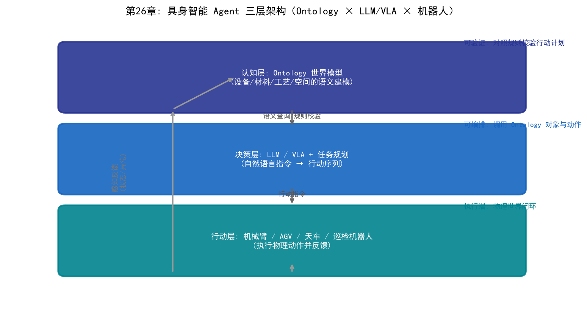

# 第26章 具身智慧的應用——當AI走進晶圓廠的物理世界

## 26.1 從「會思考」到「會動手」

前25章討論的AI應用，絕大多數發生在數位世界：良率預測處理的是數據，智慧排程輸出的是決策，LLM回答的是問題。牠們「會思考」，但不會「動手」——最終執行動作的，仍然是工程師和自動化設備。

具身智慧（Embodied AI）要解決的是最後一個環節：**讓AI透過物理實體感知真實環境、理解場景語義、並執行物理動作**。第21章討論的NSA全融合描述了感知-認知-行動的智慧閉環，而具身智慧正是這一閉環在物理世界的落地形態——「會思考」加上「會動手」。

在晶圓廠語境下，具身智慧意味著：AI系統不僅能看懂晶圓圖、讀懂設備狀態，還能透過機械臂、天車、移動機器人等實體，在潔淨室中完成搬運、上下料、巡檢、維護等物理操作。晶圓廠對具身智慧有天然的強需求：

- **潔淨室人力昂貴**：無塵衣、輪班、嚴格的培訓，人力成本高且易錯
- **24/7 連續生產**：深夜班次的人力品質波動直接影響產線穩定
- **精度要求極端**：奈米級製程對操作穩定性的要求遠超人類生理極限
- **自動化基礎紮實**：晶圓廠已大量使用 EFEM、AMHS 等自動化設備，是具身智慧的天然載體

## 26.2 具身智慧的技術棧

具身智慧不是單一技術，而是一套「感知-理解-規劃-行動」的技術棧：

| 層 | 技術 | 作用 |
| --- | --- | --- |
| 多模態感知 | 視覺（相機/3D）、力覺、觸覺、雷射雷達 | 感知物理環境 |
| 世界模型 | 語義地圖、數位孿生、Ontology | 理解「我在哪、周圍是什麼」 |
| 認知規劃 | 大語言模型、任務規劃器 | 把意圖分解為行動序列 |
| 行動執行 | VLA模型、運動控制、機械臂/移動底盤 | 執行物理動作 |
| 學習與回饋 | 模仿學習、強化學習、遙操作數據 | 從經驗中改進 |

其中最具代表性的技術是 **VLA（視覺-語言-行動）模型**：將視覺感知、語言理解和行動決策統一到同一個大模型中——輸入「把第3號晶圓盒搬到蝕刻機EFEM的載台上」，模型直接輸出機械臂的動作序列。VLA 讓機器人的操作從「為每個任務編寫程式」走向「用自然語言指揮通用操作」。

## 26.3 晶圓廠中的具身智慧場景

### 場景一：AMHS 天車與 AGV 智慧搬運

晶圓廠的天車系統（AMHS）和自動導引車（AGV）負責晶圓在設備間的運輸。傳統 AMHS 依賴固定軌道和預設路徑，遇到壅塞只能排隊。具身智慧增強的搬運系統具備：

- **動態路徑規劃**：根據即時交通狀況避開壅塞區域
- **避障與互動**：與設備裝載口（Load Port）、檢修區域的安全互動
- **異常處理**：遇到障礙物或異常時自主判斷並上報

### 場景二：潔淨室機械臂與 EFEM 自動上下料

晶圓加工設備前端的 EFEM（設備前端模組）是機械臂上下料的標準場景。具身智慧的介入讓上下料從「固定動作」走向「自適應」：

- **視覺引導抓取**：辨識晶圓盒（FOUP）姿態，自適應調整抓取角度
- **與MES/APC聯動**：根據生產指令自動切換製程配方
- **異常辨識**：發現晶圓破損、位置偏移時立即停止並報警

### 場景三：移動操作機器人巡檢與維護

巡檢機器人搭載相機和感測器，在潔淨室/設備區域移動，執行：

- **設備狀態巡檢**：讀取儀表、辨識指示燈狀態、偵測異常噪音
- **樣本送檢**：將量測樣本自動送到量測設備
- **維護輔助**：在工程師指導下執行簡單的清潔、更換消耗件操作

### 場景四：人形機器人（探索階段）

人形機器人具備在人類工作環境中操作的潛力，是具身智慧的前沿探索方向。目前在晶圓廠仍處於概念驗證階段，面臨潔淨室相容性（顆粒控制）、運動穩定性、成本等挑戰。



*圖26-1：具身智慧 Agent 三層架構——Ontology 認知層 × LLM/VLA 決策層 × 機器人行動層*

## 26.4 具身智慧與 Ontology 的融合

具身智慧要「理解」晶圓廠，需要一個關於工廠的世界模型——這正是第24、25章 Ontology 的用武之地。Ontology 為晶圓廠建立了「物件-關係-規則」的語義模型：設備是什麼、材料在哪裡、製程流程如何流轉、什麼操作是允許的。

```
具身智慧 Agent 的三層架構:
┌─────────────────────────────────────────────┐
│ 認知層: Ontology 世界模型                    │  ← 理解工廠語義（第24/25章）
│  · 設備/材料/製程/空間關係的語義建模          │
│  · "蝕刻機E03在哪? 它的EFEM空閒嗎?"          │
├─────────────────────────────────────────────┤
│ 決策層: LLM/VLA + 任務規劃                   │  ← 把意圖分解為行動序列
│  · 從自然語言指令生成操作計畫                 │
├─────────────────────────────────────────────┤
│ 行動層: 機械臂/AGV/天車等物理實體             │  ← 執行物理動作並回饋
└─────────────────────────────────────────────┘
```

Ontology 與具身智慧的結合帶來兩個關鍵價值：

1. **可驗證性**：具身智慧的行動計畫可以對照 Ontology 規則校驗——「這個操作是否符合製程規程？」——避免大模型幻覺導致的危險動作
2. **可編排性**：Ontology 描述的物件和動作可以被具身智慧 Agent 呼叫，正如第23章 Agent 架構與第24章 Palantir AIP 的「物件+動作+函式」模型——具身智慧是這些智慧體在物理世界的執行端


*圖26-2：晶圓廠具身智慧應用場景——智慧搬運、自動上下料與移動巡檢*

## 26.5 實踐現狀與案例

- **產業現狀**：晶圓廠的具身智慧應用整體處於「自動化成熟、智慧化起步」階段——機械臂/天車/AGV 已經普及，但「自主感知-決策-執行」的完整閉環仍以試點為主
- **AMHS 智慧化**：頭部晶圓廠與 AMHS 廠商合作，在搬運調度中加入智慧路徑規劃與預測性維護（呼應第12章成熟期的 AMHS 健康管理）
- **設備廠商探索**：半導體設備廠商在 EFEM、量測設備中加入視覺引導與自動化操作
- **數位孿生+具身智慧**：在數位孿生環境中訓練和驗證機器人操作策略，再部署到物理設備（呼應第21章世界模型與數位孿生）

按第21章的「四階段演進」看，當前大多數晶圓廠處於 **AI 輔助（AI-Assisted）到 AI 增強（AI-Augmented）** 階段，具身智慧（AI自主的物理執行形態）是演進方向的終點。

## 26.6 挑戰與展望

- **技術挑戰**：物理操作的精度與可靠性（晶圓極其脆弱）、潔淨室相容（顆粒與靜電控制）、人機安全互動
- **成本挑戰**：機器人系統的投資報酬率（ROI）——目前多數場景下機器人成本仍高於人工，規模化應用需要成本下降
- **組織挑戰**：工程師與機器人協作的新工作模式、對自主系統的信任建立
- **展望**：從「單點自動化」走向「具身智慧營運」——當 Ontology、LLM/Agent、具身智慧三者融合，晶圓廠有望實現從「設備自動化」到「工廠自主營運」的跨越

## 26.7 本章小結

具身智慧是本書邏輯的自然延伸：三大流派教會AI思考，融合（NSA）打通感知-認知-行動閉環，LLM與Agent賦予AI語言與協作能力，Ontology 為AI建立工廠的世界模型——而具身智慧，讓這一切最終落到物理世界的「動手」上。對晶圓廠而言，具身智慧不是遙遠的科幻，而是自動化體系向「自主感知、自主決策、自主執行」演進的方向。牠的落地速度取決於三個因素：技術可靠性、成本曲線和組織變革的接受度。
